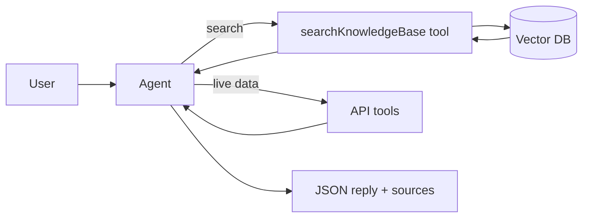
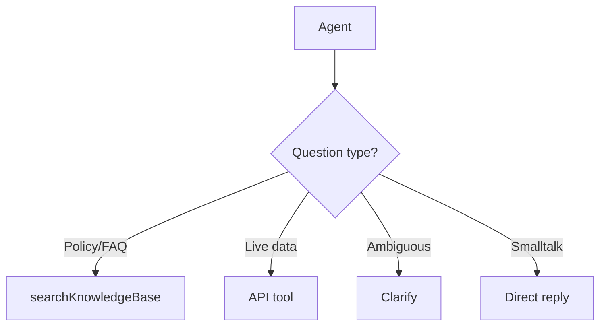
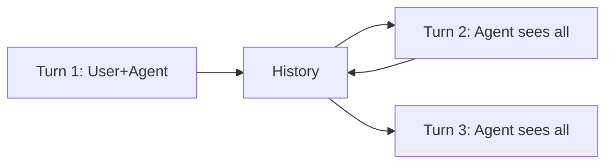

# 📅 Day 7 — Combine Agent + RAG

Hello students 👋

Welcome to **Day 7**! Today is where **everything comes together**. We take our RAG knowledge base from Day 3-4 and our Agent from Day 5-6 and fuse them into one powerful assistant. This is the **actual architecture** used by enterprise AI assistants (Glean, private ChatGPTs, internal copilots). 🧠📚⚙️

---

## 1. Introduction

### 🎯 What we learn today?
- Agent that retrieves from a **knowledge base**
- Agent that combines **tools + documents**
- **Decision routing** — when to search docs vs call API vs ask human
- **Clarifying questions** — agent asks back when unsure
- **Conversation memory** across multiple turns
- Mid-level production architecture
- 💻 Mini project: **Company Internal Assistant**

### 🌍 Why it matters
A real assistant needs to:
- Answer policy questions (→ RAG over docs)
- Check live order status (→ API tool)
- Look up employees (→ DB tool)
- Remember earlier messages (→ memory)
- Ask for clarification (→ conversation)

No single technique is enough — you need them **all together**. Today you learn the glue.

---

## 2. Concept Explanation

### 🧩 Architecture: Agent + RAG

Instead of **retrieving before** calling the LLM (pure RAG), we expose the retrieval as a **tool** called `searchKnowledgeBase`. The agent decides when to call it.

Advantages:
- The agent can **search multiple times** with different queries.
- The agent can **combine** doc snippets with live data from other tools.
- The agent can **skip** retrieval when irrelevant (e.g., "what's the weather?").

### 🔀 Decision routing
The instructions tell the agent:
- "For policy / HR / product questions → `searchKnowledgeBase`"
- "For order status → `getOrderStatus`"
- "For anything ambiguous → ask a clarifying question"

The **LLM itself** does the routing. Your job is good instructions + good tool names.

### 🙋 Clarifying questions
If the user asks something vague, the agent **asks back** instead of guessing.
Example:
> User: "What is my leave balance?"
> Agent: "Sure — please share your employee ID."

### 🧠 Conversation memory
For multi-turn chats we keep the full message history and pass it to every `run()`. Each turn's output (including tool calls) is stored and sent back next time.

### 🏛️ Mid-level architecture

```
        ┌──────────── User ────────────┐
        │                              │
        ▼                              │
┌─────────────────┐                    │
│   Agent (LLM)   │                    │
└───┬──────┬──────┘                    │
    │      │                           │
    ▼      ▼                           │
 Tools   searchKnowledgeBase           │
  │        │                           │
  ▼        ▼                           │
 APIs   RAG Pipeline ← Vector DB ←────┘
```

---

## 3. 💡 Visual Learning

### Agent + RAG flow



### Decision routing



### Conversation memory



---

## 4. 🛠️ Setup

Reuse Day 4 indexing. We add a retrieval **tool** plus session memory.

```bash id="day7install"
npm install @openai/agents openai zod dotenv @supabase/supabase-js
npm install -D typescript ts-node @types/node
```

Folder structure:

```text id="day7folder"
ai-day7/
├── src/
│   ├── tools/
│   │   ├── ragTool.ts
│   │   ├── orderTool.ts
│   │   └── employeeTool.ts
│   ├── session.ts
│   └── assistant.ts
└── .env
```

---

## 5. Code Examples

### ✅ RAG as a tool

```ts id="day7ragtool"
// src/tools/ragTool.ts
import { tool } from "@openai/agents";
import { z } from "zod";
import OpenAI from "openai";
import { createClient } from "@supabase/supabase-js";

const openai = new OpenAI({ apiKey: process.env.OPENAI_API_KEY });
const supabase = createClient(process.env.SUPABASE_URL!, process.env.SUPABASE_KEY!);

export const searchKnowledgeBase = tool({
  name: "searchKnowledgeBase",
  description:
    "Search the company's internal knowledge base for policies, HR rules, " +
    "product info. Returns the top-k text snippets with sources.",
  parameters: z.object({
    query: z.string(),
    k: z.number().int().min(1).max(8).default(4)
  }),
  execute: async ({ query, k }) => {
    const emb = await openai.embeddings.create({
      model: "text-embedding-3-small",
      input: query
    });
    const { data } = await supabase.rpc("match_documents", {
      query_embedding: emb.data[0].embedding,
      match_count: k
    });

    const hits = (data ?? []).filter((r: any) => r.similarity > 0.4);
    return {
      query,
      results: hits.map((h: any, i: number) => ({
        ref: `[${i + 1}]`,
        source: h.source,
        snippet: h.content.slice(0, 400),
        similarity: Number(h.similarity.toFixed(3))
      }))
    };
  }
});
```

### ✅ Order + employee tools

```ts id="day7ordertool"
// src/tools/orderTool.ts
import { tool } from "@openai/agents";
import { z } from "zod";

export const getOrderStatus = tool({
  name: "getOrderStatus",
  description: "Fetch live status of a customer order.",
  parameters: z.object({ orderId: z.string() }),
  execute: async ({ orderId }) => ({
    orderId,
    status: "IN_TRANSIT",
    eta: "2026-04-22",
    carrier: "BlueDart"
  })
});
```

```ts id="day7emptool"
// src/tools/employeeTool.ts
import { tool } from "@openai/agents";
import { z } from "zod";

const employees: Record<string, { name: string; leaves: number }> = {
  E001: { name: "Ayesha", leaves: 12 },
  E002: { name: "Ravi", leaves: 5 }
};

export const getEmployee = tool({
  name: "getEmployee",
  description: "Look up an employee's name and leave balance by ID.",
  parameters: z.object({ id: z.string() }),
  execute: async ({ id }) => employees[id] ?? { error: "Not found" }
});
```

### ✅ Session memory

```ts id="day7session"
// src/session.ts
type Msg = { role: "user" | "assistant"; content: string };
const sessions = new Map<string, Msg[]>();

export function history(sessionId: string): Msg[] {
  if (!sessions.has(sessionId)) sessions.set(sessionId, []);
  return sessions.get(sessionId)!;
}

export function push(sessionId: string, msg: Msg) {
  history(sessionId).push(msg);
}
```

### ✅ The Company Internal Assistant

```ts id="day7assistant"
// src/assistant.ts
import "dotenv/config";
import { Agent, run } from "@openai/agents";
import { z } from "zod";
import { searchKnowledgeBase } from "./tools/ragTool";
import { getOrderStatus } from "./tools/orderTool";
import { getEmployee } from "./tools/employeeTool";
import { history, push } from "./session";

const Output = z.object({
  intent: z.enum(["policy", "order", "employee", "clarify", "general"]),
  reply: z.string(),
  needsClarification: z.boolean(),
  sources: z.array(z.object({
    ref: z.string(),
    source: z.string(),
    similarity: z.number()
  })).default([])
});

const assistant = new Agent({
  name: "Company Assistant",
  instructions: `
You are a company internal assistant for employees and customers.

Rules:
1. For policy / HR / product questions → use searchKnowledgeBase.
2. For order status → use getOrderStatus (ask for order ID if missing).
3. For employee info → use getEmployee (ask for employee ID if missing).
4. If the user request is ambiguous → set needsClarification=true and ask ONE short question.
5. Always cite sources as [1], [2] when you used the knowledge base.
6. Never invent facts. If not in the KB and no tool fits, say you don't know.
7. Respond in a concise, professional tone.

Always return JSON: intent, reply, needsClarification, sources.
`,
  model: "gpt-4o-mini",
  tools: [searchKnowledgeBase, getOrderStatus, getEmployee],
  outputType: Output
});

export async function ask(sessionId: string, input: string) {
  push(sessionId, { role: "user", content: input });

  const messages = history(sessionId).map((m) => ({
    role: m.role,
    content: m.content
  }));

  const result = await run(assistant, messages);
  const out = result.finalOutput!;
  push(sessionId, { role: "assistant", content: out.reply });

  return {
    success: true,
    data: out,
    meta: {
      sessionId,
      steps: result.history?.length ?? 0
    }
  };
}

// demo
(async () => {
  const S = "session-1";
  console.log(await ask(S, "What is our parental leave policy?"));
  console.log(await ask(S, "And how many days for fathers specifically?"));
  console.log(await ask(S, "Where is my order?"));
  console.log(await ask(S, "Order ID is A123"));
})();
```

---

## 6. 🧾 JSON Response Design

```json id="day7jsonpolicy"
{
  "success": true,
  "data": {
    "intent": "policy",
    "reply": "Parental leave is 26 weeks [1], extendable up to 8 more weeks via HR approval [2].",
    "needsClarification": false,
    "sources": [
      { "ref": "[1]", "source": "hr_policy.pdf", "similarity": 0.891 },
      { "ref": "[2]", "source": "hr_policy.pdf", "similarity": 0.702 }
    ]
  },
  "meta": { "sessionId": "session-1", "steps": 4 }
}
```

Clarification example:

```json id="day7jsonclarify"
{
  "success": true,
  "data": {
    "intent": "clarify",
    "reply": "Sure — could you share your order ID so I can look it up?",
    "needsClarification": true,
    "sources": []
  },
  "meta": { "sessionId": "session-1", "steps": 1 }
}
```

---

## 7. 💻 Hands-on Practice

1. Add a `createSupportTicket(subject, description)` tool and route angry messages there.
2. Teach the agent to **always search KB first** for product questions.
3. Add a `language` field to the output and make the agent reply in the user's language.
4. Implement a `/reset <sessionId>` command to clear memory.
5. Save each (question, answer, sources, toolsUsed) to a JSON log file.
6. Limit the agent to **max 6 steps** per run.
7. Add a tool `escalateToHuman` and make the agent call it when confidence is low.

---

## 8. ⚠️ Common Mistakes

- ❌ Injecting retrieved chunks directly into `instructions` → works for pure RAG, wrong for agents. Use a **tool** instead.
- ❌ Returning **huge KB snippets** (full pages) → costly. Trim to ~400 chars.
- ❌ **Forgetting sources** → user can't verify; trust drops.
- ❌ No **memory per session** → agent forgets user within the same conversation.
- ❌ Mixing memory across users → privacy leak.
- ❌ Letting the agent **call the KB 10 times** in one turn — add a step cap or a "max 2 searches" rule.
- ❌ Using **generic instructions** → the agent doesn't know which tool to prefer.

---

## 9. 📝 Mini Assignment — Company Internal Assistant

Build a full **multi-turn** assistant with:

**Knowledge base:** index 2 PDFs — `hr_policy.pdf`, `product_faq.pdf`.

**Tools:**
- `searchKnowledgeBase(query, k)`
- `getOrderStatus(orderId)`
- `getEmployee(id)`
- `createSupportTicket(subject, description, priority)`

**Rules in instructions:**
- Prefer KB search for HR/product questions.
- Ask for missing IDs before calling API tools.
- Always cite sources.
- If user is angry or issue is complex → `createSupportTicket`.
- Return structured JSON output per turn.

**Test conversation (same `sessionId`):**

1. *"Hi, what's your return policy?"* → uses KB
2. *"What about international orders?"* → uses KB (memory carries context)
3. *"My order hasn't arrived. ID is A123."* → uses getOrderStatus
4. *"This is ridiculous, I want to complain!"* → creates ticket

---

## 10. 🔁 Recap

- Expose RAG as a **tool** (`searchKnowledgeBase`) so the agent decides when to use it.
- Use **conversation memory** keyed by `sessionId` for multi-turn chats.
- Instructions do **decision routing**: KB vs API vs clarify vs escalate.
- Always return **sources + confidence** when the KB is used.
- **Clarifying questions** beat guessing.
- This is the **mid-level production pattern** for AI assistants.

Tomorrow on **Day 8** — the grand finale. We add **production hardening**: logging, retries, caching, streaming, security, and build the **final project**. See you! 🏁
