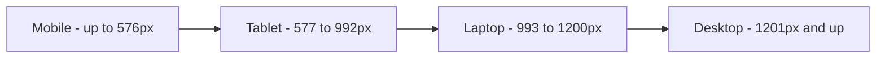
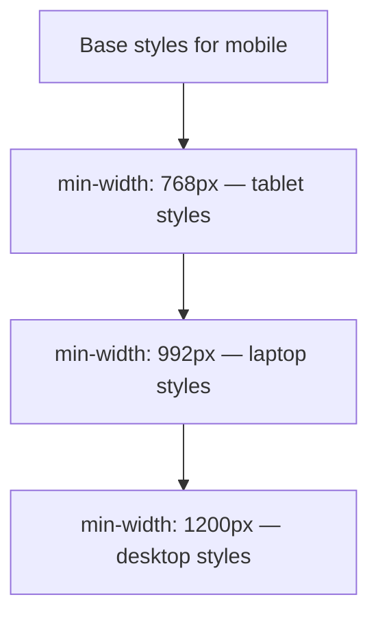
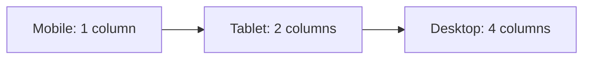

# 📘 Day 7: Responsive Design + Media Queries

Hello students 👋

Welcome to **Day 7**! Today we'll learn how to make our websites look great on **every device** — phones 📱, tablets, laptops 💻, and huge monitors 🖥️.

This is called **Responsive Design**, and it's one of the most important skills for a modern frontend developer.

Did you know? Over **60% of internet users** browse from mobile phones. If your website doesn't work on mobile, you're losing more than half your visitors. 😱

---

## 1. Introduction

### What will we learn today?

- What is responsive design?
- **Mobile-first** approach (industry standard)
- **Media queries** (`@media`)
- Common breakpoints
- **Responsive images** (`max-width: 100%`)
- Responsive Flexbox & Grid behavior
- The `<meta viewport>` tag

### Why responsive design?

A website should **automatically adjust** based on the screen size:
- On **mobile** → one column, stacked layout.
- On **tablet** → two columns.
- On **desktop** → full multi-column layout.

One codebase, works everywhere.

---

## 2. Concept Explanation

### What is a media query?

A **media query** is a CSS rule that says: *"Apply these styles ONLY if the screen matches this condition."*

```css
@media (max-width: 768px) {
  /* Styles here apply when screen is 768px or smaller */
}
```

### Mobile-first vs Desktop-first

**Mobile-first** (recommended):
- Write styles for **mobile** by default.
- Add larger screen styles using `min-width` media queries.

**Desktop-first**:
- Write styles for **desktop** by default.
- Add smaller screen styles using `max-width` media queries.

Industry has shifted to **mobile-first** because most users are on mobile.

---

## 3. 💡 Visual Learning

### Responsive Breakpoints



### Mobile-First Approach



### Responsive Layout Shift



---

## 4. Syntax + Code Examples

### Viewport Meta Tag (ALWAYS include!)

Add this to every HTML file's `<head>`:

```html
<meta name="viewport" content="width=device-width, initial-scale=1.0" />
```

Without this, mobile browsers will zoom out to show the full desktop version. 😬

---

### Basic Media Query

```css
/* Mobile first - default styles */
body {
  font-size: 14px;
  background: lightyellow;
}

/* Tablet and up */
@media (min-width: 768px) {
  body {
    font-size: 16px;
    background: lightblue;
  }
}

/* Desktop and up */
@media (min-width: 1200px) {
  body {
    font-size: 18px;
    background: lightgreen;
  }
}
```

---

### Common Breakpoints (Industry Standard)

```css
/* Small phones */
@media (min-width: 576px) { ... }

/* Tablets */
@media (min-width: 768px) { ... }

/* Laptops */
@media (min-width: 992px) { ... }

/* Desktops */
@media (min-width: 1200px) { ... }

/* Large screens */
@media (min-width: 1400px) { ... }
```

---

### Responsive Images

```css
img {
  max-width: 100%;
  height: auto;
  display: block;
}
```

This makes images shrink if the container is smaller, but never stretch beyond their original size.

---

### Responsive Flexbox

```css
.cards {
  display: flex;
  flex-wrap: wrap;
  gap: 20px;
}

.card {
  flex: 1 1 300px;      /* grow, shrink, basis 300px */
}
```

This automatically wraps cards into fewer columns on smaller screens.

---

### Responsive Grid (No Media Query Needed! ✨)

```css
.gallery {
  display: grid;
  grid-template-columns: repeat(auto-fit, minmax(250px, 1fr));
  gap: 20px;
}
```

This adjusts automatically without any media queries. 🪄

---

### Full Working Example (Responsive Landing Page)

**File: `index.html`**
```html
<!DOCTYPE html>
<html>
  <head>
    <title>Day 7 - Responsive</title>
    <meta name="viewport" content="width=device-width, initial-scale=1.0" />
    <link rel="stylesheet" href="style.css" />
  </head>
  <body>
    <nav class="navbar">
      <div class="logo">🌐 MySite</div>
      <ul class="menu">
        <li><a href="#">Home</a></li>
        <li><a href="#">Services</a></li>
        <li><a href="#">Contact</a></li>
      </ul>
    </nav>

    <section class="hero">
      <h1>Build Responsive Websites</h1>
      <p>Beautiful on every device.</p>
    </section>

    <section class="features">
      <div class="feature">🚀 Fast</div>
      <div class="feature">📱 Mobile-Friendly</div>
      <div class="feature">🎨 Beautiful</div>
      <div class="feature">⚡ Easy</div>
    </section>
  </body>
</html>
```

**File: `style.css`**
```css
* {
  box-sizing: border-box;
  margin: 0;
  padding: 0;
}

body {
  font-family: Arial, sans-serif;
}

/* NAVBAR */
.navbar {
  display: flex;
  flex-direction: column;   /* stack on mobile */
  padding: 15px 20px;
  background: #222;
  color: white;
}

.menu {
  display: flex;
  flex-direction: column;
  list-style: none;
  gap: 10px;
  margin-top: 10px;
}

.menu a {
  color: white;
  text-decoration: none;
}

/* HERO */
.hero {
  padding: 40px 20px;
  text-align: center;
  background: #007bff;
  color: white;
}

.hero h1 { font-size: 1.8rem; margin-bottom: 10px; }
.hero p  { font-size: 1rem; }

/* FEATURES */
.features {
  display: grid;
  grid-template-columns: 1fr;     /* 1 column on mobile */
  gap: 15px;
  padding: 30px 20px;
}

.feature {
  background: #f5f5f5;
  padding: 30px;
  text-align: center;
  border-radius: 10px;
  font-size: 1.2rem;
}

/* TABLET — 2 columns */
@media (min-width: 768px) {
  .navbar {
    flex-direction: row;
    justify-content: space-between;
    align-items: center;
  }
  .menu {
    flex-direction: row;
    gap: 20px;
    margin-top: 0;
  }
  .hero h1 { font-size: 2.5rem; }
  .features { grid-template-columns: 1fr 1fr; }
}

/* DESKTOP — 4 columns */
@media (min-width: 1024px) {
  .hero {
    padding: 80px 20px;
  }
  .hero h1 { font-size: 3.5rem; }
  .features {
    grid-template-columns: repeat(4, 1fr);
  }
}
```

---

### Wrong vs Correct

❌ **Wrong:** (No viewport tag)
```html
<head>
  <title>My Site</title>
</head>
<!-- Mobile browsers will zoom out to desktop width! -->
```

✅ **Correct:**
```html
<head>
  <meta name="viewport" content="width=device-width, initial-scale=1.0" />
  <title>My Site</title>
</head>
```

❌ **Wrong:** (Fixed widths)
```css
.card { width: 1200px; }
```

✅ **Correct:**
```css
.card {
  max-width: 1200px;
  width: 100%;
}
```

---

## 5. Live Output Explanation

Open the example in a browser:

- On **mobile (< 768px)**: Navbar is stacked vertically, features are in 1 column.
- On **tablet (768px+)**: Navbar is horizontal, features are in 2 columns.
- On **desktop (1024px+)**: Bigger hero text, features are in 4 columns.

💡 **DevTools Tip:**
- Press `F12` → click the **device toolbar icon** (top-left of DevTools).
- Choose "iPhone", "iPad", or custom dimensions.
- Or drag to resize the window and see live changes.

---

## 6. 🧪 Hands-on Practice

1. **Task 1:** Create a page that shows **red background** on mobile, **blue** on tablet, **green** on desktop.
2. **Task 2:** Make a navbar that stacks vertically on mobile and horizontally on desktop.
3. **Task 3:** Create a grid that has 1 column on mobile, 2 on tablet, 3 on desktop.
4. **Task 4:** Add a responsive image that scales with `max-width: 100%`.
5. **Task 5:** Hide a sidebar on mobile using `display: none`, show on desktop.

---

## 7. ⚠️ Common Mistakes

| Mistake | Fix |
|---------|-----|
| Forgetting `<meta viewport>` tag | Always include it in `<head>` |
| Using `width` instead of `max-width` | Prevents overflow |
| Too many breakpoints | Stick to 3–4 standard ones |
| Writing desktop-first when newer team writes mobile-first | Stay consistent across codebase |
| Fixed `px` widths everywhere | Use `%`, `fr`, `rem` for flexibility |
| Using `@media (max-width)` on top of `min-width` rules | Pick one approach — mix carefully |
| Not testing on actual devices | Use DevTools responsive mode at minimum |

---

## 8. 📝 Mini Assignment

**Build a Responsive Landing Page** 🌐

Create a landing page with:

- A **navbar** (stacks on mobile, horizontal on desktop).
- A **hero** section with heading + subtitle.
- A **features** section with 4 cards:
  - 1 column on mobile
  - 2 columns on tablet
  - 4 columns on desktop
- A **footer** with copyright text.

✅ Requirements:
- Use `<meta viewport>` tag.
- Use **mobile-first** approach.
- Use at least 2 media queries.
- Make images responsive with `max-width: 100%`.
- Test by resizing the browser.

---

## 9. 🔁 Recap

Today we learned:

- ✅ Responsive design = website works on all screen sizes.
- ✅ Always add `<meta name="viewport" ...>`.
- ✅ **Mobile-first** is the industry standard.
- ✅ Media queries: `@media (min-width: 768px) { ... }`.
- ✅ Common breakpoints: **576**, **768**, **992**, **1200**.
- ✅ Responsive images: `max-width: 100%; height: auto`.
- ✅ `repeat(auto-fit, minmax(..., 1fr))` = responsive grid without media queries.

💡 **DevTools Tip:** Practice resizing the browser and using the device toolbar daily. Responsive thinking is a **muscle** — train it.

See you on **Day 8 — Transitions, Animations, Best Practices + Final Project**! 🎉

You're one day away from being a CSS pro! 🚀
