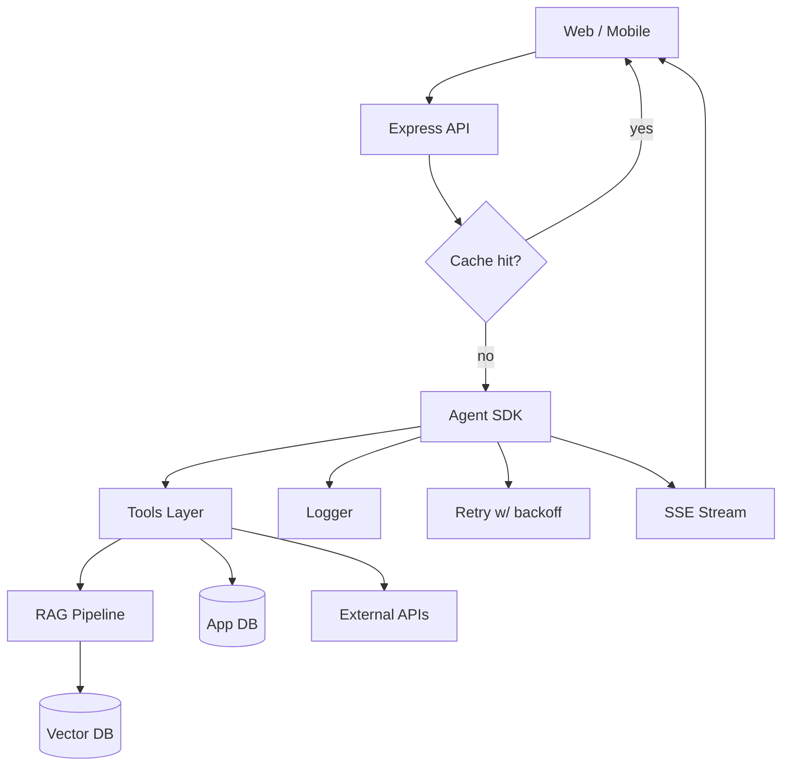
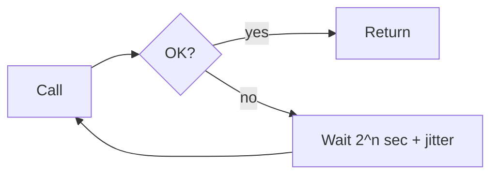

# 📅 Day 8 — Production Patterns + Final Project

Hello students 👋

Welcome to the **Grand Finale**! 🎉 In 7 days you went from *"What is an LLM?"* to *"I can build a multi-tool agent with RAG."* Today we harden everything for **production**: folder structure, rate limits, retries, logging, token optimization, security, caching, and streaming. Then we **ship the final project**: a full **AI Support System**. 🚀

---

## 1. Introduction

### 🎯 What we learn today?
- Clean **folder structure** for AI apps
- **Rate limits** & **retry with backoff**
- Proper **logging & observability**
- **Token optimization** tricks
- **Security basics** (secrets, PII, prompt injection)
- **Response caching**
- **Streaming** responses
- 💻 **Final Project**: Full AI Support System (Agent + RAG + JSON + Tools + Node/TS)

### 🌍 Why it matters
A "working demo" is easy. A **system that survives real users, real traffic, and real money** is hard. Today we cover the boring-but-critical patterns that separate a prototype from a product.

---

## 2. Concept Explanation

### 🗂️ Folder structure (reference)

```text id="day8folder"
ai-support/
├── src/
│   ├── agents/
│   │   └── supportAgent.ts
│   ├── tools/
│   │   ├── rag.ts
│   │   ├── orders.ts
│   │   └── tickets.ts
│   ├── rag/
│   │   ├── loader.ts
│   │   ├── chunker.ts
│   │   ├── embedder.ts
│   │   └── store.ts
│   ├── core/
│   │   ├── openai.ts
│   │   ├── logger.ts
│   │   ├── cache.ts
│   │   ├── retry.ts
│   │   └── config.ts
│   ├── api/
│   │   └── server.ts          # Express endpoint
│   └── types.ts
├── data/                       # raw PDFs
├── .env
├── package.json
└── tsconfig.json
```

### 🚦 Rate limits & retries
OpenAI returns `429` on rate limit and `5xx` on transient errors. **Don't crash**. **Retry with exponential backoff + jitter**.

### 🪵 Logging & observability
Log:
- `requestId`, `sessionId`, `userId`
- Model, tokensUsed, latency
- Tools called, tool arguments, tool results
- Errors with stack trace

Never log: API keys, PII, full user documents (unless encrypted).

### 🪙 Token optimization
- Prefer `gpt-4o-mini` for routing; `gpt-4o` for final reasoning when needed.
- Trim retrieved chunks (first 400 chars).
- Cap chat history (e.g., last 10 turns).
- Summarize old turns into a single "summary" message.
- Use `max_tokens` on outputs.
- Avoid redundant system prompts.

### 🛡️ Security basics
- **Secrets:** `.env` + never commit. Rotate keys regularly.
- **Prompt injection:** treat user text as **untrusted**. Never allow it to override system rules.
- **PII:** mask emails, phone numbers, card numbers before logging.
- **Output sanitization:** strip scripts before sending to a browser.
- **Tool auth:** pass user identity as a trusted parameter the agent **cannot** modify.

### 🧊 Response caching
- Cache **embedding results** (hash of text → vector).
- Cache **question → answer** for identical questions within a TTL.
- Cache **tool outputs** for idempotent tools (e.g., weather for 5 min).

### 🌊 Streaming responses
For chat UIs, use **streaming** so users see tokens as they arrive (no 8-second wait).

---

## 3. 💡 Visual Learning

### Production architecture



### Retry with exponential backoff



---

## 4. 🛠️ Setup

```bash id="day8install"
npm install @openai/agents openai zod dotenv express pdf-parse @supabase/supabase-js
npm install -D typescript ts-node @types/node @types/express
```

`.env`:

```env id="day8env"
OPENAI_API_KEY=sk-your-key
SUPABASE_URL=https://xxxx.supabase.co
SUPABASE_KEY=your-service-key
PORT=3000
```

---

## 5. Production Utilities

### ✅ Typed config loader

```ts id="day8config"
// src/core/config.ts
import "dotenv/config";

function need(k: string): string {
  const v = process.env[k];
  if (!v) throw new Error(`Missing env var: ${k}`);
  return v;
}

export const config = {
  openaiKey: need("OPENAI_API_KEY"),
  supabaseUrl: need("SUPABASE_URL"),
  supabaseKey: need("SUPABASE_KEY"),
  port: Number(process.env.PORT ?? 3000)
};
```

### ✅ Logger with redaction

```ts id="day8logger"
// src/core/logger.ts
function redact(s: string) {
  return s
    .replace(/[\w.+-]+@[\w.-]+/g, "[email]")
    .replace(/\b\d{10,16}\b/g, "[number]");
}

export const log = {
  info: (msg: string, meta: Record<string, unknown> = {}) =>
    console.log(JSON.stringify({ lvl: "info", msg: redact(msg), ...meta, t: Date.now() })),
  error: (msg: string, meta: Record<string, unknown> = {}) =>
    console.error(JSON.stringify({ lvl: "error", msg: redact(msg), ...meta, t: Date.now() }))
};
```

### ✅ Retry with exponential backoff + jitter

```ts id="day8retryfn"
// src/core/retry.ts
export async function retry<T>(
  fn: () => Promise<T>,
  { attempts = 4, baseMs = 500 } = {}
): Promise<T> {
  let last: unknown;
  for (let i = 0; i < attempts; i++) {
    try {
      return await fn();
    } catch (e) {
      last = e;
      const wait = baseMs * 2 ** i + Math.random() * 200;
      await new Promise((r) => setTimeout(r, wait));
    }
  }
  throw last;
}
```

### ✅ Simple in-memory cache (TTL)

```ts id="day8cache"
// src/core/cache.ts
const store = new Map<string, { value: unknown; expires: number }>();

export function cacheGet<T>(key: string): T | undefined {
  const hit = store.get(key);
  if (!hit) return;
  if (hit.expires < Date.now()) { store.delete(key); return; }
  return hit.value as T;
}

export function cacheSet(key: string, value: unknown, ttlMs = 60_000) {
  store.set(key, { value, expires: Date.now() + ttlMs });
}
```

### ✅ OpenAI client (shared)

```ts id="day8openaiclient"
// src/core/openai.ts
import OpenAI from "openai";
import { config } from "./config";
export const openai = new OpenAI({ apiKey: config.openaiKey });
```

---

## 6. 🏗️ Final Project — AI Support System

### Scenario
You are building the **AI Customer Support System** for a small e-commerce store.

Features:
1. Answers policy questions from PDFs (**RAG tool**).
2. Checks live order status (**API tool**).
3. Creates support tickets for complex issues (**DB tool**).
4. Remembers the conversation (**session memory**).
5. Returns **structured JSON** every time.
6. Streams responses to the frontend.
7. Uses **retry + cache + logging**.
8. Exposes an **Express HTTP endpoint**.

### ✅ The agent

```ts id="day8agent"
// src/agents/supportAgent.ts
import { Agent } from "@openai/agents";
import { z } from "zod";
import { searchKnowledgeBase } from "../tools/rag";
import { getOrderStatus } from "../tools/orders";
import { createTicket } from "../tools/tickets";

export const SupportOutput = z.object({
  intent: z.enum(["policy", "order", "ticket", "clarify", "general"]),
  reply: z.string(),
  needsClarification: z.boolean().default(false),
  sources: z.array(z.object({
    ref: z.string(), source: z.string(), similarity: z.number()
  })).default([]),
  ticketId: z.string().nullable().default(null)
});

export const supportAgent = new Agent({
  name: "Support Agent",
  instructions: `
You are a polite e-commerce support agent.

- Policy / return / shipping questions → searchKnowledgeBase, cite sources.
- Order status → getOrderStatus (ask for order ID if missing).
- Angry customer OR issue not solvable with docs → createTicket.
- Ambiguous query → ask ONE short clarifying question, needsClarification=true.
- NEVER invent facts. If unsure, say so.
- Keep replies under 120 words.

Return JSON: intent, reply, needsClarification, sources, ticketId.
`,
  model: "gpt-4o-mini",
  tools: [searchKnowledgeBase, getOrderStatus, createTicket],
  outputType: SupportOutput
});
```

### ✅ The tools

```ts id="day8ragtool"
// src/tools/rag.ts
import { tool } from "@openai/agents";
import { z } from "zod";
import { openai } from "../core/openai";
import { cacheGet, cacheSet } from "../core/cache";
import { createClient } from "@supabase/supabase-js";
import { config } from "../core/config";

const supabase = createClient(config.supabaseUrl, config.supabaseKey);

export const searchKnowledgeBase = tool({
  name: "searchKnowledgeBase",
  description: "Search company policies, shipping & return info. Returns top-k snippets.",
  parameters: z.object({
    query: z.string(),
    k: z.number().int().min(1).max(6).default(4)
  }),
  execute: async ({ query, k }) => {
    const key = `kb:${query}:${k}`;
    const hit = cacheGet<unknown>(key);
    if (hit) return hit;

    const emb = await openai.embeddings.create({
      model: "text-embedding-3-small",
      input: query
    });
    const { data } = await supabase.rpc("match_documents", {
      query_embedding: emb.data[0].embedding,
      match_count: k
    });

    const out = {
      query,
      results: (data ?? [])
        .filter((r: any) => r.similarity > 0.4)
        .map((h: any, i: number) => ({
          ref: `[${i + 1}]`,
          source: h.source,
          snippet: h.content.slice(0, 400),
          similarity: Number(h.similarity.toFixed(3))
        }))
    };
    cacheSet(key, out, 5 * 60_000);
    return out;
  }
});
```

```ts id="day8orderstool"
// src/tools/orders.ts
import { tool } from "@openai/agents";
import { z } from "zod";

export const getOrderStatus = tool({
  name: "getOrderStatus",
  description: "Live order status by ID.",
  parameters: z.object({ orderId: z.string() }),
  execute: async ({ orderId }) => ({
    orderId,
    status: "IN_TRANSIT",
    eta: "2026-04-22",
    carrier: "BlueDart"
  })
});
```

```ts id="day8ticketstool"
// src/tools/tickets.ts
import { tool } from "@openai/agents";
import { z } from "zod";

export const createTicket = tool({
  name: "createTicket",
  description: "Create a support ticket for human follow-up.",
  parameters: z.object({
    subject: z.string(),
    description: z.string(),
    priority: z.enum(["low", "medium", "high"])
  }),
  execute: async ({ subject, description, priority }) => ({
    ticketId: `TKT-${Date.now()}`,
    subject, priority, createdAt: new Date().toISOString()
  })
});
```

### ✅ Express API with retry, logging, streaming

```ts id="day8server"
// src/api/server.ts
import express from "express";
import { run } from "@openai/agents";
import { supportAgent } from "../agents/supportAgent";
import { retry } from "../core/retry";
import { log } from "../core/logger";
import { config } from "../core/config";
import { randomUUID } from "crypto";

type Msg = { role: "user" | "assistant"; content: string };
const sessions = new Map<string, Msg[]>();

const app = express();
app.use(express.json());

app.post("/chat", async (req, res) => {
  const start = Date.now();
  const reqId = randomUUID();
  const { sessionId, message } = req.body as { sessionId: string; message: string };

  if (!sessionId || !message) {
    return res.status(400).json({
      success: false,
      error: { code: "BAD_REQUEST", message: "sessionId and message required" }
    });
  }

  const hist = sessions.get(sessionId) ?? [];
  hist.push({ role: "user", content: message });

  try {
    const result = await retry(() => run(supportAgent, hist));
    const out = result.finalOutput!;
    hist.push({ role: "assistant", content: out.reply });
    sessions.set(sessionId, hist.slice(-20));

    log.info("chat_ok", {
      reqId, sessionId,
      intent: out.intent,
      steps: result.history?.length ?? 0,
      latencyMs: Date.now() - start
    });

    return res.json({
      success: true,
      data: out,
      error: null,
      meta: { reqId, latencyMs: Date.now() - start }
    });
  } catch (e) {
    log.error("chat_fail", { reqId, err: (e as Error).message });
    return res.status(500).json({
      success: false,
      error: { code: "AGENT_ERROR", message: (e as Error).message },
      meta: { reqId, latencyMs: Date.now() - start }
    });
  }
});

// Simple streaming endpoint using OpenAI directly (for UI)
app.post("/stream", async (req, res) => {
  const { message } = req.body as { message: string };
  res.setHeader("Content-Type", "text/event-stream");
  res.setHeader("Cache-Control", "no-cache");

  const { openai } = await import("../core/openai");
  const stream = await openai.chat.completions.create({
    model: "gpt-4o-mini",
    stream: true,
    messages: [
      { role: "system", content: "Friendly support assistant." },
      { role: "user", content: message }
    ]
  });

  for await (const chunk of stream) {
    const token = chunk.choices[0]?.delta?.content ?? "";
    if (token) res.write(`data: ${JSON.stringify({ token })}\n\n`);
  }
  res.write("data: [DONE]\n\n");
  res.end();
});

app.listen(config.port, () =>
  log.info("listening", { port: config.port })
);
```

---

## 7. 🧾 JSON Response Design

Every `/chat` reply:

```json id="day8jsonchat"
{
  "success": true,
  "data": {
    "intent": "policy",
    "reply": "Our return window is 7 days [1].",
    "needsClarification": false,
    "sources": [
      { "ref": "[1]", "source": "policy.pdf", "similarity": 0.89 }
    ],
    "ticketId": null
  },
  "error": null,
  "meta": { "reqId": "0f2c...", "latencyMs": 1820 }
}
```

Error:

```json id="day8jsonerr"
{
  "success": false,
  "data": null,
  "error": { "code": "AGENT_ERROR", "message": "Rate limit exceeded" },
  "meta": { "reqId": "0f2c...", "latencyMs": 4100 }
}
```

---

## 8. 💻 Hands-on Practice

1. Replace the in-memory session store with **Redis** for multi-instance support.
2. Add **per-user rate limiting** (e.g., 20 requests/min) using `express-rate-limit`.
3. Add **unit tests** for each tool (mock the external calls).
4. Add a health check endpoint: `GET /health` → `{ status: "ok" }`.
5. Wrap all OpenAI calls with the `retry` helper.
6. Add a `summary` message to memory every 10 turns to save tokens.
7. Add a **frontend** (plain HTML + fetch + SSE) that streams responses.

---

## 9. ⚠️ Common Mistakes

- ❌ **No retries** → one 429 crashes the app.
- ❌ **Unbounded memory** → context window explodes, cost skyrockets.
- ❌ **Logging secrets / PII** → compliance nightmare.
- ❌ **Blindly trusting user text** → prompt injection. Keep system rules strict and non-overridable.
- ❌ **No timeouts** → a hanging tool takes the whole request down.
- ❌ **Using `gpt-4o` everywhere** → cost blowout. Route simple tasks to `gpt-4o-mini`.
- ❌ **No streaming** → users think the app is frozen.
- ❌ **Shipping to prod without a kill switch** (env flag to disable AI features).

---

## 10. 📝 Final Assignment — AI Support System (Deliverable)

Build and demo a complete **AI Support System** with:

✅ Agent SDK + tools (rag, orders, tickets)
✅ RAG over at least **2 PDFs** with a real vector DB
✅ Structured JSON output (envelope + data + meta)
✅ Express `/chat` endpoint with sessions
✅ Express `/stream` endpoint with SSE
✅ Retry + cache + logging utilities
✅ `.env` for secrets
✅ Written README explaining architecture

**Bonus points:**
- Dockerfile
- Basic unit tests for tools
- Simple HTML frontend
- Rate limiting per session

---

## 11. 🔁 Recap — Your 8-Day Journey

| Day | You Built |
|-----|-----------|
| 1 | First OpenAI calls + CLI chatbot |
| 2 | Validated JSON with Zod + Structured Outputs |
| 3 | RAG fundamentals + FAQ bot |
| 4 | Production RAG pipeline with pgvector |
| 5 | First agents with OpenAI Agents SDK |
| 6 | Multi-tool agents with DB, weather, email |
| 7 | Agent + RAG fusion with memory |
| 8 | Production-grade AI support system |

---

## 🎓 Final Words

Congratulations, students! 👏 You now possess the **same core skill set** that powers most modern AI products. Go build, experiment, break things, and keep learning. The AI world moves fast — stay curious. ✨

> **Your homework forever:** keep shipping small AI projects. Nothing beats practice.

Thank you, see you in the next advanced batch! 🚀
