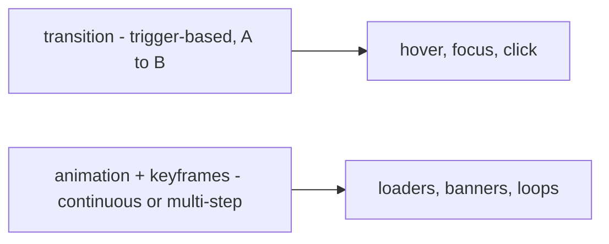
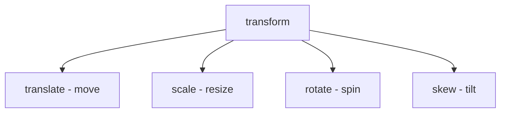
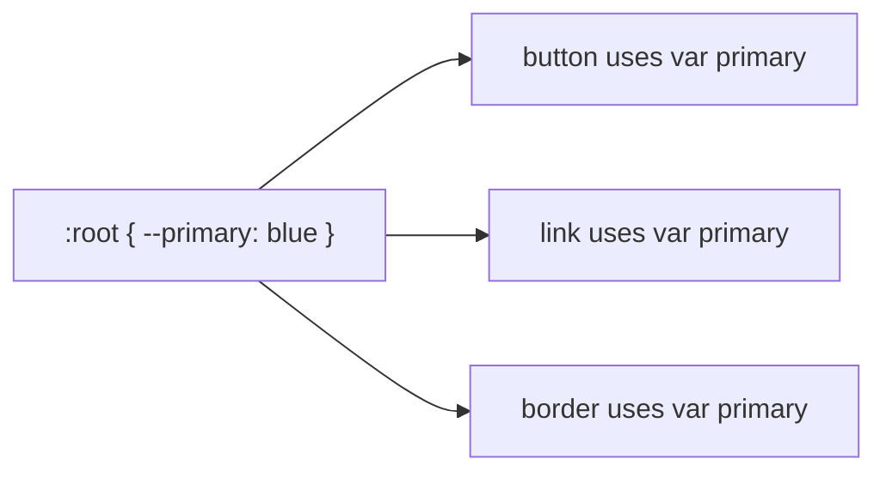

# 📘 Day 8: Transitions, Animations, Best Practices + Final Project 🎉

Hello students 👋

Welcome to the **FINAL DAY** of our CSS journey! 🎊

You've come a long way — from writing your very first CSS rule on Day 1 to building responsive grid layouts on Day 7. Today, we'll add the **cherry on top**: smooth **transitions**, eye-catching **animations**, **CSS variables**, and the **best practices** every professional developer follows.

Then, we'll build a **final project** that ties everything together. 🏆

---

## 1. Introduction

### What will we learn today?

- `transition`
- `transform` (scale, rotate, translate)
- `hover` effects
- `@keyframes` + `animation`
- CSS variables (`--primary-color`)
- Reusable utility classes
- Clean folder structure
- Final project!

### Why animations & variables?

- **Animations** make your site feel **alive** and **premium**.
- **CSS Variables** make your code **reusable** and **easy to maintain**.
- **Best practices** separate junior devs from professionals.

---

## 2. Concept Explanation

### Transitions

A **transition** smoothly animates a property change — like a color changing on hover.

### Transforms

`transform` moves, scales, rotates, or skews an element — without affecting the layout.

### Keyframe Animations

Transitions work for A → B changes. **Keyframes** let you define **multi-step** animations (0% → 50% → 100%).

### CSS Variables

Reusable values stored in `--name` format. Change one value, update the whole project.

---

## 3. 💡 Visual Learning

### Transition vs Animation



### Transform Operations



### CSS Variables Flow



---

## 4. Syntax + Code Examples

### Transitions

```css
.btn {
  background: #007bff;
  color: white;
  padding: 10px 20px;
  border: none;
  border-radius: 6px;
  transition: background 0.3s ease, transform 0.3s ease;
}

.btn:hover {
  background: #0056b3;
  transform: scale(1.05);
}
```

Shorthand: `transition: property duration timing-function delay;`

---

### Transforms

```css
.box:hover {
  transform: translateY(-10px);      /* move up */
  transform: scale(1.2);             /* enlarge */
  transform: rotate(15deg);          /* rotate */
  transform: translateX(20px) rotate(10deg);  /* combine */
}
```

---

### Hover Effects (Real-world)

```css
.card {
  background: white;
  padding: 20px;
  border-radius: 10px;
  box-shadow: 0 2px 5px rgba(0,0,0,0.1);
  transition: transform 0.3s ease, box-shadow 0.3s ease;
}

.card:hover {
  transform: translateY(-5px);
  box-shadow: 0 8px 20px rgba(0,0,0,0.15);
}
```

---

### @keyframes Animation

```css
@keyframes bounce {
  0%   { transform: translateY(0); }
  50%  { transform: translateY(-20px); }
  100% { transform: translateY(0); }
}

.ball {
  animation: bounce 1s infinite;
}
```

Animation properties:
```css
animation-name: bounce;
animation-duration: 1s;
animation-timing-function: ease-in-out;
animation-delay: 0.5s;
animation-iteration-count: infinite;   /* or a number */
animation-direction: alternate;
```

Shorthand:
```css
animation: bounce 1s ease-in-out infinite;
```

---

### Loader Example

```css
@keyframes spin {
  from { transform: rotate(0deg); }
  to   { transform: rotate(360deg); }
}

.loader {
  width: 40px;
  height: 40px;
  border: 4px solid #eee;
  border-top-color: #007bff;
  border-radius: 50%;
  animation: spin 1s linear infinite;
}
```

---

### CSS Variables

```css
:root {
  --primary-color: #007bff;
  --secondary-color: #ff5722;
  --text-color: #333;
  --bg-color: #f5f5f5;
  --radius: 8px;
  --spacing: 16px;
}

body {
  background: var(--bg-color);
  color: var(--text-color);
}

.btn {
  background: var(--primary-color);
  border-radius: var(--radius);
  padding: var(--spacing);
}
```

Change `--primary-color` once → everything updates. Beautiful. ✨

---

### Clean Folder Structure

```
project/
├── index.html
├── about.html
├── css/
│   ├── reset.css
│   ├── variables.css
│   ├── base.css
│   ├── components.css
│   └── layout.css
├── images/
└── js/
```

### Reusable Utility Classes

```css
.text-center { text-align: center; }
.mt-20 { margin-top: 20px; }
.p-10 { padding: 10px; }
.rounded { border-radius: 8px; }
.shadow { box-shadow: 0 2px 5px rgba(0,0,0,0.1); }
```

---

## 🏆 FINAL PROJECT: Personal Portfolio Page

Let's combine **everything** we learned into a single beautiful project!

### File: `index.html`

```html
<!DOCTYPE html>
<html>
  <head>
    <title>My Portfolio | Jane Doe</title>
    <meta name="viewport" content="width=device-width, initial-scale=1.0" />
    <link rel="stylesheet" href="style.css" />
  </head>
  <body>
    <!-- Navbar -->
    <nav class="navbar">
      <div class="logo">✨ Jane.dev</div>
      <ul class="menu">
        <li><a href="#about">About</a></li>
        <li><a href="#projects">Projects</a></li>
        <li><a href="#contact">Contact</a></li>
      </ul>
    </nav>

    <!-- Hero -->
    <section class="hero">
      <h1>Hi, I'm Jane 👋</h1>
      <p>Frontend Developer | UI Designer</p>
      <button class="btn">View My Work</button>
    </section>

    <!-- About -->
    <section id="about" class="section">
      <h2>About Me</h2>
      <p>I design and build beautiful websites using HTML, CSS and JavaScript.</p>
    </section>

    <!-- Projects -->
    <section id="projects" class="section">
      <h2>My Projects</h2>
      <div class="projects">
        <div class="card">
          <h3>Blog Website</h3>
          <p>A responsive blog built with HTML & CSS.</p>
        </div>
        <div class="card">
          <h3>Restaurant Page</h3>
          <p>A modern restaurant landing page.</p>
        </div>
        <div class="card">
          <h3>E-Commerce Home</h3>
          <p>A product showcase with beautiful cards.</p>
        </div>
      </div>
    </section>

    <!-- Contact -->
    <section id="contact" class="section">
      <h2>Contact Me</h2>
      <p>Email: jane@example.com</p>
    </section>

    <footer class="footer">© 2026 Jane Doe. All rights reserved.</footer>
  </body>
</html>
```

### File: `style.css`

```css
/* ======= RESET ======= */
* {
  box-sizing: border-box;
  margin: 0;
  padding: 0;
}

/* ======= VARIABLES ======= */
:root {
  --primary: #6c63ff;
  --primary-dark: #5146e0;
  --text: #222;
  --muted: #666;
  --bg: #f9f9f9;
  --card-bg: #fff;
  --radius: 12px;
}

/* ======= BASE ======= */
body {
  font-family: 'Segoe UI', sans-serif;
  color: var(--text);
  background: var(--bg);
  line-height: 1.6;
}

img { max-width: 100%; display: block; }

/* ======= NAVBAR ======= */
.navbar {
  display: flex;
  justify-content: space-between;
  align-items: center;
  padding: 15px 30px;
  background: white;
  box-shadow: 0 2px 5px rgba(0,0,0,0.05);
  position: sticky;
  top: 0;
  z-index: 100;
}

.logo {
  font-weight: bold;
  color: var(--primary);
  font-size: 20px;
}

.menu {
  display: flex;
  list-style: none;
  gap: 20px;
}

.menu a {
  text-decoration: none;
  color: var(--text);
  transition: color 0.3s;
}

.menu a:hover { color: var(--primary); }

/* ======= HERO ======= */
.hero {
  text-align: center;
  padding: 80px 20px;
  background: linear-gradient(135deg, var(--primary), var(--primary-dark));
  color: white;
  animation: fadeIn 1s ease-in;
}

.hero h1 { font-size: 3rem; margin-bottom: 10px; }
.hero p  { font-size: 1.2rem; margin-bottom: 25px; }

.btn {
  padding: 12px 30px;
  background: white;
  color: var(--primary);
  border: none;
  border-radius: var(--radius);
  font-weight: bold;
  cursor: pointer;
  transition: transform 0.3s, box-shadow 0.3s;
}

.btn:hover {
  transform: translateY(-3px);
  box-shadow: 0 10px 20px rgba(0,0,0,0.15);
}

/* ======= SECTIONS ======= */
.section {
  padding: 60px 20px;
  max-width: 1000px;
  margin: 0 auto;
  text-align: center;
}

.section h2 {
  margin-bottom: 20px;
  color: var(--primary);
}

/* ======= PROJECTS ======= */
.projects {
  display: grid;
  grid-template-columns: repeat(auto-fit, minmax(250px, 1fr));
  gap: 20px;
  margin-top: 30px;
}

.card {
  background: var(--card-bg);
  padding: 25px;
  border-radius: var(--radius);
  box-shadow: 0 2px 8px rgba(0,0,0,0.08);
  transition: transform 0.3s, box-shadow 0.3s;
}

.card:hover {
  transform: translateY(-8px);
  box-shadow: 0 12px 24px rgba(0,0,0,0.12);
}

.card h3 { color: var(--primary); margin-bottom: 10px; }

/* ======= FOOTER ======= */
.footer {
  background: #222;
  color: white;
  text-align: center;
  padding: 20px;
  margin-top: 40px;
}

/* ======= ANIMATION ======= */
@keyframes fadeIn {
  from { opacity: 0; transform: translateY(20px); }
  to   { opacity: 1; transform: translateY(0); }
}

/* ======= RESPONSIVE ======= */
@media (max-width: 600px) {
  .hero h1 { font-size: 2rem; }
  .menu { gap: 12px; }
  .navbar { flex-direction: column; gap: 10px; }
}
```

---

## 5. Live Output Explanation

When you open the portfolio:

- The **navbar** sticks to the top as you scroll.
- The **hero** fades in on page load with a beautiful gradient.
- The **button** lifts up and adds a shadow on hover.
- The **project cards** slightly rise and glow on hover.
- The layout **adapts** to any screen size.

💡 **DevTools Tip:** Use the "Animations" tab in DevTools to slow down animations and see them frame-by-frame.

---

## 6. 🧪 Hands-on Practice

1. **Task 1:** Add a `transition` to a button so its background changes smoothly on hover.
2. **Task 2:** Use `transform: scale(1.1)` on hover for an image gallery.
3. **Task 3:** Create a **bouncing** loader using `@keyframes`.
4. **Task 4:** Use CSS variables to define primary, secondary, and text colors — then use them throughout.
5. **Task 5:** Animate a card to **slide in from the left** when the page loads.

---

## 7. ⚠️ Common Mistakes

| Mistake | Fix |
|---------|-----|
| `transition` on parent but not changing property | `transition` must be on the element whose property changes |
| Animation flickers | Use `transform` (GPU-accelerated) instead of `top/left` |
| Too many animations | Keep them subtle — users get distracted |
| Forgetting vendor prefixes | Use `-webkit-` if supporting old browsers |
| Inconsistent color usage | Use CSS variables — update in one place |
| No folder structure | Separate `reset`, `variables`, `components`, `layout` |

---

## 8. 📝 FINAL Assignment

Pick **ONE** final project to complete:

### Option A — Portfolio Page
Complete, polished version of the example above with your own info.

### Option B — Restaurant Website
- Hero banner with dish image
- Menu section (grid of dishes)
- About section
- Contact info + hours

### Option C — E-Commerce Homepage
- Top navbar with logo + cart
- Hero with "Shop Now" CTA
- Product grid (8 cards)
- Footer

✅ Requirements for **any** option:
- **External CSS** only
- **CSS variables** for colors
- **Flexbox + Grid** usage
- **Hover effects** and **transitions**
- At least **one keyframe animation**
- **Fully responsive** (mobile → desktop)

---

## 9. 🔁 Recap — The Whole Journey 🎓

Look what you've learned in 8 days:

- **Day 1** — CSS basics, selectors, comments, linking.
- **Day 2** — Colors, units, text styling.
- **Day 3** — Box model (padding, margin, border, box-sizing).
- **Day 4** — Backgrounds, display, position, z-index.
- **Day 5** — Flexbox (1D layouts).
- **Day 6** — Grid (2D layouts).
- **Day 7** — Responsive design, media queries, mobile-first.
- **Day 8** — Transitions, transforms, animations, variables, best practices.

---

## 🎉 CONGRATULATIONS! 🎉

You are now a **CSS-capable frontend developer**! 🚀

You can:
- ✅ Style any webpage confidently
- ✅ Build responsive, modern layouts with **Flexbox** and **Grid**
- ✅ Create smooth animations and transitions
- ✅ Write **clean, maintainable, professional** CSS
- ✅ Move on to **JavaScript** and **React** with a strong foundation

### What's Next?
- Start learning **JavaScript** — CSS + JS = interactive websites.
- Then **React** — to build modern single-page apps.
- Explore **Tailwind CSS** or **styled-components** for advanced workflows.

💡 **Final Tip:** The only way to master CSS is to **build things**. Start cloning websites you love — Netflix, Airbnb, Spotify. Rebuild them with CSS. Each clone will teach you more than any tutorial. 💪

Thank you for this amazing journey, students. Keep creating, keep experimenting, and keep learning. 💛

**See you in the next series: JavaScript Foundations! 🚀**
