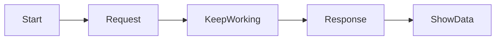
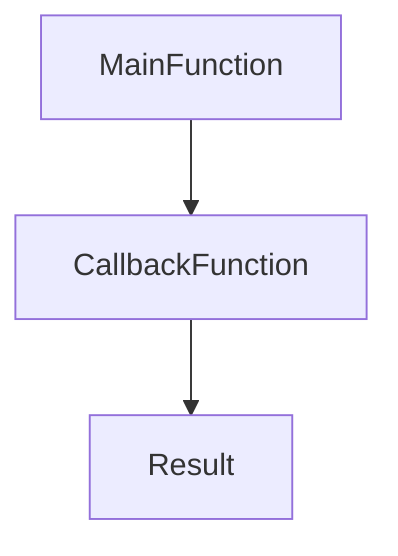

# Day 1 — Asynchronous JavaScript (Callbacks, Promises, Fetch, Async/Await)

> **Session Duration:** 1 – 1.5 hours
> **Branch:** `Async_concepts`
> **Audience:** Beginners who know variables, functions, and loops.

---

## Hello students 👋

Welcome to today's class! Today we are going to learn one of the **most important** topics in modern JavaScript — **Asynchronous Programming**.

Don't worry if it sounds scary. By the end of this session, you will:

- Understand how JavaScript handles waiting tasks
- Write your first **callback** function
- Use **Promises** with `.then()` and `.catch()`
- Call real APIs using **Fetch**
- Write clean code using **async / await**

Let's begin! 🚀

---

## 1. Introduction — Why Async JavaScript?

Imagine you go to a restaurant 🍔.

- You **order** a burger
- The chef takes **5 minutes** to cook
- During those 5 minutes, do you just sit frozen? **No!** You talk, drink water, scroll Instagram.
- When the burger is ready, the waiter **brings it to you**.

This is exactly how **Asynchronous JavaScript** works!

> JavaScript does not sit and wait. It continues doing other work and **calls you back** when the slow task is finished.

### Where do we use async code?

- Calling an API (fetching users, posts, products)
- Reading a file
- Waiting for a timer (`setTimeout`)
- Database queries
- File uploads

**Question to class:** 🤔 Can you think of one more real-life "waiting" situation?
(Examples: waiting for an Uber, waiting for a parcel, waiting for water to boil…)

---

## 2. Synchronous vs Asynchronous JavaScript

### 🐢 Synchronous (one-by-one)

Every line waits for the previous one to finish.

```js id="sync1"
console.log("1. Start");
console.log("2. Middle");
console.log("3. End");
```

**Output:**

```
1. Start
2. Middle
3. End
```

Simple — each line runs **in order**.

### ⚡ Asynchronous (non-blocking)

Some tasks take time. JavaScript **does not wait** — it keeps going.

```js id="async1"
console.log("1. Start");

setTimeout(() => {
  console.log("2. Middle (after 2 seconds)");
}, 2000);

console.log("3. End");
```

**Output:**

```
1. Start
3. End
2. Middle (after 2 seconds)
```

👀 Notice — `3. End` printed **before** `2. Middle`!
That's asynchronous behavior.

### Visual Flow



---

## 3. Callback Functions

### What is a Callback?

> A **callback** is a function passed as an argument to another function, to be **called later**.

**Real-world analogy:** 📞
You call a pizza shop. They say, *"We'll call you back when it's ready."*
Your phone number = the **callback**.

### Basic Example — Line by Line

```js id="cb1"
function greet(name, callback) {
  console.log("Hello " + name);
  callback(); // call the function passed in
}

function sayBye() {
  console.log("Bye bye!");
}

greet("Asif", sayBye);
```

**Explanation:**

- Line 1: `greet` takes two parameters — `name` and `callback` (a function).
- Line 2: Print hello.
- Line 3: Execute whatever function was passed.
- Line 10: We pass `sayBye` as the callback.

**Output:**

```
Hello Asif
Bye bye!
```

### Async Callback Example — Order Delivery

```js id="cb2"
function orderFood(item, callback) {
  console.log("Order placed for " + item);
  setTimeout(() => {
    console.log(item + " is ready! 🍕");
    callback();
  }, 2000);
}

orderFood("Pizza", () => {
  console.log("Thank you, let's eat!");
});
```

### Callback Flow Diagram



---
