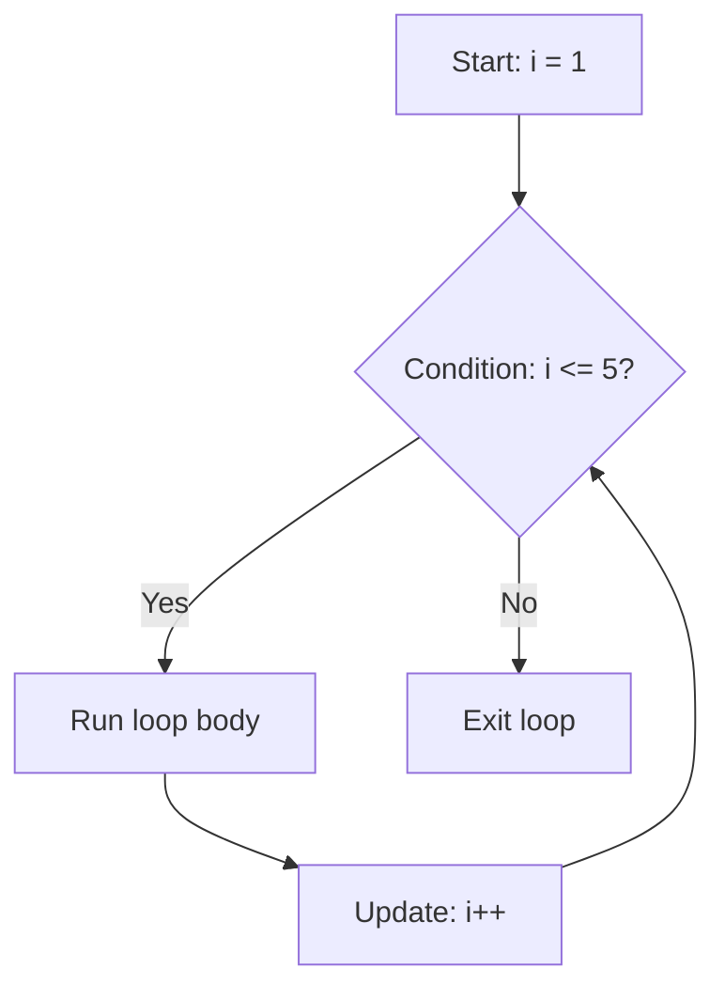

# Day 1: Loops Basics

Hello students 👋

Welcome to **Day 1** of our JavaScript Logic Building Course! Today we start with the foundation of all programming — **loops**.

---

## 1. Introduction

### What we will learn today
- What is a loop and why we need it
- `for` loop
- `while` loop
- `do-while` loop
- Printing numbers in different ways
- Your first basic star patterns

### Why is logic building important?
Coding is **not about memorizing syntax** — it is about **thinking**. If you know how to think step by step, you can solve ANY problem in ANY language. Loops are the first big thinking tool we learn.

---

## 2. Concept Explanation

### What is a loop?
A loop tells the computer: **"Do this task again and again until I say stop."**

### Real-world analogy 🏃
Imagine you have to do **10 pushups**. You don't write "do 1 pushup" ten times on paper — you just say:
> "Repeat pushup 10 times."

That's exactly what a loop does.

Another example: a **washing machine** spins the drum again and again until the timer ends. That is a loop in real life!

### The 3 things every loop has

| Part | Meaning | Example |
|---|---|---|
| **Start** | Where do we begin? | `i = 1` |
| **Condition** | When do we stop? | `i <= 10` |
| **Update** | How do we move forward? | `i++` |

If ANY of these is wrong, your loop will either not run, or run forever (infinite loop 😱).

---

## 3. Problem Solving Approach

Before writing code, ALWAYS follow these 4 steps. This is the habit of great programmers.

**Step 1 — Understand the problem.**
Read it twice. Ask: what is the input? what is the output?

**Step 2 — Dry run.**
Solve it on paper first with a small example. Pretend YOU are the computer.

**Step 3 — Identify the pattern.**
Does something repeat? That's where a loop will fit.

**Step 4 — Code it.**
Only now open the editor.

---

## 4. 💡 Visual Learning

### How a `for` loop actually runs



### Loop movement on a number line

```
i=1  i=2  i=3  i=4  i=5   STOP (i=6)
 ●----●----●----●----●------X
```

Each `●` is one round of the loop (called an **iteration**).

---

## Syntax of all three loops

### `for` loop — when you KNOW how many times

```js
// Print "Hello" 3 times
for (let i = 1; i <= 3; i++) {
  console.log("Hello");
}
```

### `while` loop — when you DON'T know how many times

```js
// Keep running while condition is true
let i = 1;
while (i <= 3) {
  console.log("Hello");
  i++; // very important — don't forget!
}
```

### `do-while` loop — run AT LEAST once

```js
let i = 1;
do {
  console.log("Hello");
  i++;
} while (i <= 3);
```

👉 **Question for you:** What if the condition is `false` from the start? In `while` it won't run. In `do-while` it runs once. Remember that!

---

## 5. 🔥 Coding Problems

### Problem 1 — Print numbers from 1 to 10 (Easy)

**Input:** nothing
**Output:** `1 2 3 4 5 6 7 8 9 10`

**Dry run:** i starts at 1, prints, becomes 2, prints... until 10. At 11 condition fails, stop.

```js
for (let i = 1; i <= 10; i++) {
  console.log(i);
}
```

**Explanation:** Simple counting. The loop runs 10 times.

---

### Problem 2 — Print numbers from 10 to 1 (Easy)

**Input:** nothing
**Output:** `10 9 8 7 6 5 4 3 2 1`

**Dry run:** Start at 10, decrease by 1, stop when less than 1.

```js
for (let i = 10; i >= 1; i--) {
  console.log(i);
}
```

**Explanation:** We just REVERSE the loop. Start high, go low, use `i--`.

---

### Problem 3 — Print all even numbers from 1 to 20 (Easy)

**Input:** nothing
**Output:** `2 4 6 8 10 12 14 16 18 20`

**Thinking:** Even numbers are divisible by 2. Two ways to solve — check with `%` OR increment by 2.

```js
// Way 1 — using modulus
for (let i = 1; i <= 20; i++) {
  if (i % 2 === 0) console.log(i);
}

// Way 2 — smarter (jump by 2)
for (let i = 2; i <= 20; i += 2) {
  console.log(i);
}
```

**Explanation:** Way 2 is faster because it skips odd numbers completely.

---

### Problem 4 — Sum of first N natural numbers (Easy)

**Input:** `n = 5`
**Output:** `15` (because 1+2+3+4+5)

**Dry run:**
- i=1, sum=0+1=1
- i=2, sum=1+2=3
- i=3, sum=3+3=6
- i=4, sum=6+4=10
- i=5, sum=10+5=15 ✅

```js
let n = 5;
let sum = 0;
for (let i = 1; i <= n; i++) {
  sum = sum + i; // add current number
}
console.log(sum); // 15
```

**Edge case:** if `n = 0`, sum stays 0. Loop never runs. Good!

---

### Problem 5 — Multiplication table of a number (Easy)

**Input:** `n = 7`
**Output:** `7 x 1 = 7`, `7 x 2 = 14` ... `7 x 10 = 70`

```js
let n = 7;
for (let i = 1; i <= 10; i++) {
  console.log(`${n} x ${i} = ${n * i}`);
}
```

**Explanation:** We loop 10 times, each time multiplying `n` by `i`.

---

### Problem 6 — Count digits in a number (Medium)

**Input:** `num = 4567`
**Output:** `4`

**Thinking:** Keep dividing the number by 10 and count until it becomes 0.

**Dry run with 4567:**
- 4567 / 10 = 456, count=1
- 456 / 10 = 45, count=2
- 45 / 10 = 4, count=3
- 4 / 10 = 0, count=4 ✅

```js
let num = 4567;
let count = 0;
while (num > 0) {
  num = Math.floor(num / 10); // remove last digit
  count++;
}
console.log(count); // 4
```

**Edge case:** if `num = 0`, loop doesn't run, answer is 0 (technically should be 1). Fix by starting `count = 1` if input is 0.

---

### Problem 7 — Sum of digits (Medium)

**Input:** `num = 123`
**Output:** `6` (1+2+3)

**Thinking:** `num % 10` gives the LAST digit. `Math.floor(num / 10)` removes it.

**Dry run with 123:**
- 123 % 10 = 3, sum=3, num=12
- 12 % 10 = 2, sum=5, num=1
- 1 % 10 = 1, sum=6, num=0 ✅

```js
let num = 123;
let sum = 0;
while (num > 0) {
  sum += num % 10;
  num = Math.floor(num / 10);
}
console.log(sum); // 6
```

---

### Problem 8 — Print a solid square of stars (Medium pattern)

**Input:** `n = 4`
**Output:**
```
* * * *
* * * *
* * * *
* * * *
```

**Thinking:** We need two loops. Outer = rows, Inner = columns. This is your first **nested loop**!

```js
let n = 4;
for (let i = 1; i <= n; i++) {        // rows
  let line = "";
  for (let j = 1; j <= n; j++) {      // columns
    line += "* ";
  }
  console.log(line);
}
```

**Explanation:** For each row, we build a string of stars, then print it.

---

### Problem 9 — Print a right-angle triangle (Interview level)

**Input:** `n = 4`
**Output:**
```
*
* *
* * *
* * * *
```

**Pattern identify:** Row 1 has 1 star, row 2 has 2 stars... row `i` has `i` stars. So the inner loop depends on the outer loop!

```js
let n = 4;
for (let i = 1; i <= n; i++) {
  let line = "";
  for (let j = 1; j <= i; j++) {   // notice: j <= i, not n!
    line += "* ";
  }
  console.log(line);
}
```

**Dry run:**
- i=1 → j runs 1 time → `*`
- i=2 → j runs 2 times → `* *`
- i=3 → j runs 3 times → `* * *`
- i=4 → j runs 4 times → `* * * *`

---

### Problem 10 — Check if a number is prime (Interview classic)

**Input:** `n = 7`
**Output:** `true`

**Definition:** A prime number is divisible ONLY by 1 and itself (e.g., 2, 3, 5, 7, 11).

**Thinking:** Check if any number from 2 to `n-1` divides `n`. If yes → not prime.

```js
function isPrime(n) {
  if (n < 2) return false;          // edge case — 0 and 1 are not prime
  for (let i = 2; i < n; i++) {
    if (n % i === 0) return false;  // found a divisor → not prime
  }
  return true;
}

console.log(isPrime(7));  // true
console.log(isPrime(10)); // false
console.log(isPrime(1));  // false
```

**Optimization:** You only need to check till `Math.sqrt(n)`. Why? Because divisors come in pairs.

```js
for (let i = 2; i <= Math.sqrt(n); i++) { ... }
```

---

## 🎯 Homework for tonight

1. Print numbers from 1 to 100 that are divisible by 3 AND 5.
2. Print the table of 9 in reverse (9×10 first, 9×1 last).
3. Find the largest digit in a number (e.g., 4729 → 9).

Tomorrow we go DEEP into **pattern problems** — the favorite topic of interviewers! 🔥