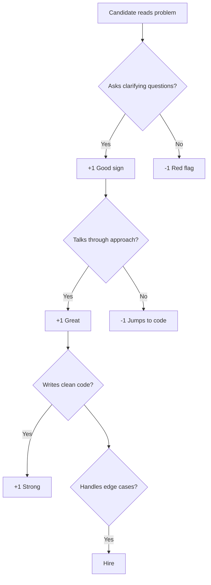

# Day 10: Grand Finale — Interview Problem Solving

Hello students 👋

Welcome to the **final day** of your 10-day journey 🎉. Today is NOT about new concepts — it's about **combining everything** you've learned to solve REAL interview problems like a senior developer.

---

## 1. Introduction

### What we will do today
- Tackle full interview-style problems
- Practice multiple approaches (brute force → optimized)
- Talk about **time and space complexity**
- Cover problems mixing arrays, strings, recursion, hash maps
- Finish with a **mock interview walkthrough**

### Your journey so far
| Day | Topic |
|---|---|
| 1 | Loops |
| 2 | Patterns |
| 3 | Advanced loops |
| 4 | Recursion |
| 5 | Backtracking |
| 6 | Arrays |
| 7 | Sorting & Searching |
| 8 | Strings |
| 9 | Hash maps |
| **10** | **Everything combined** |

---

## 2. The Interview Playbook (Memorize This!)

### The 5-step process

**Step 1 — Clarify:** Ask at least 2 questions. "Are inputs always positive?", "Empty array ok?", "Duplicates?"

**Step 2 — Example:** Work a small example by hand. Draw it. Show your thinking.

**Step 3 — Brute force first:** Always state the obvious solution first, then say "Let's optimize."

**Step 4 — Optimize:** Think — can sorting help? Hash map? Two pointers? Sliding window?

**Step 5 — Code & dry run:** Write clean code, then dry-run with the example.

### Real-world analogy 🎤
Interviews are like **live concerts**. You don't just walk on stage and play — you warm up, tune, play, and acknowledge the audience. Coding problems work the same way: talk OUT LOUD, show your process, be human.

---

## 3. Complexity Quick Reference

| Complexity | Name | Good for |
|---|---|---|
| O(1) | Constant | Hash lookup, array index |
| O(log n) | Logarithmic | Binary search |
| O(n) | Linear | Single pass |
| O(n log n) | Linearithmic | Efficient sort |
| O(n²) | Quadratic | Nested loops (avoid!) |
| O(2ⁿ) | Exponential | Recursion without memo |
| O(n!) | Factorial | Permutations |

---

## 4. 💡 Visual — How an interviewer thinks



---

## 5. 🔥 Full Interview Problems

### Problem 1 — Valid Parentheses (Amazon, Microsoft)

**Input:** `"({[]})"` → `true`, `"({[})"` → `false`

**Thinking:** Use a **stack**. Push opening brackets, pop on closing.

```js
function isValid(s) {
  const stack = [];
  const pairs = { ")": "(", "}": "{", "]": "[" };
  for (let ch of s) {
    if ("({[".includes(ch)) stack.push(ch);
    else {
      if (stack.pop() !== pairs[ch]) return false;
    }
  }
  return stack.length === 0;
}

console.log(isValid("({[]})")); // true
console.log(isValid("({[})"));  // false
```

**Complexity:** O(n) time, O(n) space.

---

### Problem 2 — Merge intervals (Google)

**Input:** `[[1,3],[2,6],[8,10],[15,18]]`
**Output:** `[[1,6],[8,10],[15,18]]`

**Approach:** Sort by start, then merge overlapping.

```js
function mergeIntervals(intervals) {
  intervals.sort((a, b) => a[0] - b[0]);
  let result = [intervals[0]];
  for (let i = 1; i < intervals.length; i++) {
    let last = result[result.length - 1];
    if (intervals[i][0] <= last[1]) {
      last[1] = Math.max(last[1], intervals[i][1]);
    } else {
      result.push(intervals[i]);
    }
  }
  return result;
}

console.log(mergeIntervals([[1,3],[2,6],[8,10],[15,18]]));
```

---

### Problem 3 — Best time to buy and sell stock (Interview CLASSIC)

**Input:** `[7,1,5,3,6,4]` → **Output:** `5` (buy at 1, sell at 6)

```js
function maxProfit(prices) {
  let minPrice = Infinity, maxProfit = 0;
  for (let p of prices) {
    if (p < minPrice) minPrice = p;
    else if (p - minPrice > maxProfit) maxProfit = p - minPrice;
  }
  return maxProfit;
}

console.log(maxProfit([7, 1, 5, 3, 6, 4])); // 5
```

**Key insight:** Track lowest seen so far, compute profit at each step.

---

### Problem 4 — Product of array except self (FAANG)

**Input:** `[1,2,3,4]` → **Output:** `[24,12,8,6]`

**Constraint:** NO DIVISION, and O(n) time!

```js
function productExceptSelf(arr) {
  let result = new Array(arr.length).fill(1);

  let left = 1;
  for (let i = 0; i < arr.length; i++) {
    result[i] = left;
    left *= arr[i];
  }

  let right = 1;
  for (let i = arr.length - 1; i >= 0; i--) {
    result[i] *= right;
    right *= arr[i];
  }

  return result;
}

console.log(productExceptSelf([1, 2, 3, 4])); // [24, 12, 8, 6]
```

**Two-pass trick** — elegant!

---

### Problem 5 — Climbing stairs (DP intro)

**Problem:** You can climb 1 or 2 steps. How many ways to reach step `n`?

**Input:** `n=3` → `3` ways (1+1+1, 1+2, 2+1)

```js
function climb(n) {
  if (n <= 2) return n;
  let a = 1, b = 2;
  for (let i = 3; i <= n; i++) {
    let next = a + b;
    a = b;
    b = next;
  }
  return b;
}

console.log(climb(5)); // 8
```

**This is Fibonacci in disguise!** 🤯

---

### Problem 6 — Coin change (DP interview classic)

**Input:** `coins=[1,2,5], amount=11` → **Output:** `3` (5+5+1)

```js
function coinChange(coins, amount) {
  let dp = new Array(amount + 1).fill(Infinity);
  dp[0] = 0;
  for (let i = 1; i <= amount; i++) {
    for (let c of coins) {
      if (i - c >= 0) dp[i] = Math.min(dp[i], dp[i - c] + 1);
    }
  }
  return dp[amount] === Infinity ? -1 : dp[amount];
}

console.log(coinChange([1, 2, 5], 11)); // 3
```

**Dynamic programming** — build up from smaller sub-problems.

---

### Problem 7 — Rotate matrix 90° (Interview)

**Input:**
```
1 2 3
4 5 6
7 8 9
```
**Output:**
```
7 4 1
8 5 2
9 6 3
```

**Trick:** Transpose, then reverse each row.

```js
function rotate(matrix) {
  const n = matrix.length;
  // transpose
  for (let i = 0; i < n; i++) {
    for (let j = i; j < n; j++) {
      [matrix[i][j], matrix[j][i]] = [matrix[j][i], matrix[i][j]];
    }
  }
  // reverse each row
  for (let row of matrix) row.reverse();
  return matrix;
}

console.log(rotate([[1,2,3],[4,5,6],[7,8,9]]));
```

---

### Problem 8 — Set matrix zeros (Microsoft)

**Problem:** If any cell is 0, set its entire row and column to 0.

```js
function setZeros(matrix) {
  let rows = new Set(), cols = new Set();
  for (let i = 0; i < matrix.length; i++) {
    for (let j = 0; j < matrix[0].length; j++) {
      if (matrix[i][j] === 0) {
        rows.add(i);
        cols.add(j);
      }
    }
  }
  for (let i = 0; i < matrix.length; i++) {
    for (let j = 0; j < matrix[0].length; j++) {
      if (rows.has(i) || cols.has(j)) matrix[i][j] = 0;
    }
  }
  return matrix;
}
```

---

### Problem 9 — Spiral matrix traversal (Google)

**Input:**
```
1 2 3
4 5 6
7 8 9
```
**Output:** `[1,2,3,6,9,8,7,4,5]`

```js
function spiral(matrix) {
  let result = [];
  while (matrix.length) {
    result.push(...matrix.shift());                    // top row
    for (let row of matrix) if (row.length) result.push(row.pop()); // right col
    if (matrix.length) result.push(...matrix.pop().reverse());     // bottom row
    for (let i = matrix.length - 1; i >= 0; i--)
      if (matrix[i].length) result.push(matrix[i].shift());         // left col
  }
  return result;
}

console.log(spiral([[1,2,3],[4,5,6],[7,8,9]])); // [1,2,3,6,9,8,7,4,5]
```

---

### Problem 10 — LRU Cache (Uber, Flipkart)

**Problem:** Build a cache with `get` and `put` — when full, remove the least recently used.

```js
class LRUCache {
  constructor(capacity) {
    this.capacity = capacity;
    this.cache = new Map(); // Map keeps insertion order!
  }
  get(key) {
    if (!this.cache.has(key)) return -1;
    let val = this.cache.get(key);
    this.cache.delete(key);    // refresh
    this.cache.set(key, val);
    return val;
  }
  put(key, val) {
    if (this.cache.has(key)) this.cache.delete(key);
    else if (this.cache.size >= this.capacity) {
      this.cache.delete(this.cache.keys().next().value); // remove oldest
    }
    this.cache.set(key, val);
  }
}

let lru = new LRUCache(2);
lru.put(1, 1);
lru.put(2, 2);
console.log(lru.get(1)); // 1
lru.put(3, 3);           // evicts 2
console.log(lru.get(2)); // -1
```

---

### Problem 11 — Flatten a nested array (Real-world)

**Input:** `[1, [2, [3, [4]], 5]]` → **Output:** `[1, 2, 3, 4, 5]`

```js
function flatten(arr) {
  let result = [];
  for (let item of arr) {
    if (Array.isArray(item)) result.push(...flatten(item));
    else result.push(item);
  }
  return result;
}

console.log(flatten([1, [2, [3, [4]], 5]])); // [1,2,3,4,5]
```

**Recursion + arrays combined.** 🔥

---

### Problem 12 — FizzBuzz but classy (Warm-up + Variant)

```js
function fizzBuzz(n) {
  for (let i = 1; i <= n; i++) {
    let out = "";
    if (i % 3 === 0) out += "Fizz";
    if (i % 5 === 0) out += "Buzz";
    console.log(out || i);
  }
}

fizzBuzz(15);
```

**Interview trick:** Ask "Can I extend it?" — add Fizz for 3, Buzz for 5, Bang for 7.

---

## 🎤 Mock Interview Walkthrough

**Interviewer:** "Given an array, find the most frequent element."

**You (out loud):**
> "Okay, let me make sure I understand. Are the elements numbers only, or can they be strings too? And if there's a tie, should I return any one, or all of them?"

**Interviewer:** "Numbers. Return any on tie."

**You:**
> "Great. Brute force: count each element by scanning the array — that's O(n²). But we can use a hash map to count in O(n), then one more pass to find the max. Total O(n) time, O(n) space."

```js
function mostFrequent(arr) {
  let freq = new Map();
  let maxEl = arr[0], maxCount = 0;
  for (let n of arr) {
    let c = (freq.get(n) || 0) + 1;
    freq.set(n, c);
    if (c > maxCount) { maxCount = c; maxEl = n; }
  }
  return maxEl;
}

console.log(mostFrequent([1,3,2,3,4,3,2])); // 3
```

> "Let me dry run: 1 → count=1, 3 → count=1, 2 → count=1, 3 → count=2 (maxEl=3), 4 → 1, 3 → count=3 (maxEl=3), 2 → 2. Final answer: 3. ✅"

**That's how you win interviews!**

---

## 🎯 Final Advice — From a 30-Year Developer

1. **Consistency > Intensity.** 2 problems a day for 6 months beats 200 problems in 2 weeks.
2. **Don't memorize — understand.** If you understand WHY a trick works, you can apply it to new problems.
3. **Draw before you code.** Paper + pen beats typing when stuck.
4. **Teach what you learn.** Explaining to others (even to yourself out loud) is the best test of understanding.
5. **Be patient.** Every senior dev was once stuck on "reverse a string". You are not behind — you are growing.

---

## 🎓 Congratulations — 10 Days Completed! 🎉

You now have:
- ✅ Loop mastery
- ✅ Recursion and backtracking
- ✅ Array and string expertise
- ✅ Sorting, searching, hash maps
- ✅ Interview-ready thinking

### Recommended next steps
1. **LeetCode** — start with 75 "Top Interview Questions" list.
2. **Learn a data structure a week**: Linked list → Stack → Queue → Tree → Graph.
3. **Build projects** — apply these skills on real code, not just problem-solving.
4. **Mock interviews** — Pramp, Interviewing.io, or practice with a friend.

### One last thing 💙
The difference between a GOOD developer and a GREAT developer is not talent. It is **curiosity and persistence**. Keep asking "why?". Keep trying "what if?". Keep showing up daily.

You have what it takes. Now go build amazing things! 🚀

— Your instructor
