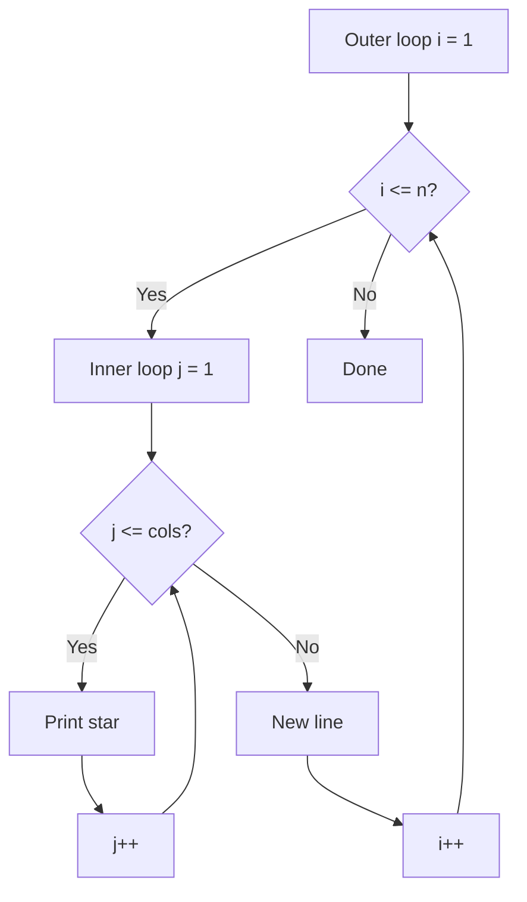

# Day 2: Pattern Problems

Hello students 👋

Welcome back! Today is one of the **MOST important** days — **pattern problems**. Almost every fresher interview asks at least one pattern question. Why? Because they test your **nested loop thinking**.

---

## 1. Introduction

### What we will learn today
- Star patterns (triangle, inverted, pyramid)
- Number patterns
- How to THINK about any pattern in 3 steps
- Nested loop mastery

### Why patterns?
Patterns teach your brain to see **rows and columns** separately. Once you master this, arrays, matrices, and grids become VERY easy.

---

## 2. Concept Explanation

### The pattern thinking formula (MEMORIZE THIS!)

Every pattern problem has 3 questions:
1. **How many rows?** → Outer loop
2. **How many columns in each row?** → Inner loop
3. **What to print?** → `*`, number, space, etc.

That's it. If you answer these 3 questions, you can solve ANY pattern.

### Real-world analogy 🧱
Think of patterns like building a **brick wall**:
- Each **horizontal layer** = a row (outer loop)
- Each **brick** in that layer = a column (inner loop)
- The **type of brick** = what you print

---

## 3. Problem Solving Approach

**Step 1:** Count the rows in the output.
**Step 2:** For EACH row, count how many items are there.
**Step 3:** Find the relationship between row number (`i`) and column count.
**Step 4:** Code it.

---

## 4. 💡 Visual Learning

### Nested loop flow



### Visual — why inner loop depends on outer

```
Row 1 (i=1):  *            ← inner runs 1 time
Row 2 (i=2):  * *          ← inner runs 2 times
Row 3 (i=3):  * * *        ← inner runs 3 times
Row 4 (i=4):  * * * *      ← inner runs 4 times
```

See? **Inner runs `i` times**, not `n` times.

---

## 5. 🔥 Coding Problems

### Problem 1 — Solid Square (Easy)

**Input:** `n = 4`
**Output:**
```
* * * *
* * * *
* * * *
* * * *
```

**Thinking:** Rows = n, Columns = n (same for every row).

```js
let n = 4;
for (let i = 1; i <= n; i++) {
  let line = "";
  for (let j = 1; j <= n; j++) {
    line += "* ";
  }
  console.log(line);
}
```

---

### Problem 2 — Right-angle Triangle (Easy)

**Output:**
```
*
* *
* * *
* * * *
```

**Thinking:** Row `i` has `i` stars.

```js
let n = 4;
for (let i = 1; i <= n; i++) {
  let line = "";
  for (let j = 1; j <= i; j++) {
    line += "* ";
  }
  console.log(line);
}
```

---

### Problem 3 — Inverted Right Triangle (Easy)

**Output:**
```
* * * *
* * *
* *
*
```

**Thinking:** Row 1 has n stars, row 2 has n-1... row i has `n - i + 1` stars.

```js
let n = 4;
for (let i = 1; i <= n; i++) {
  let line = "";
  for (let j = 1; j <= n - i + 1; j++) {
    line += "* ";
  }
  console.log(line);
}
```

**Or even simpler — run the outer loop in reverse:**
```js
for (let i = n; i >= 1; i--) {
  // inner runs i times
}
```

---

### Problem 4 — Number Triangle (Easy)

**Output:**
```
1
1 2
1 2 3
1 2 3 4
```

**Thinking:** Same as right triangle, but print `j` instead of `*`.

```js
let n = 4;
for (let i = 1; i <= n; i++) {
  let line = "";
  for (let j = 1; j <= i; j++) {
    line += j + " ";
  }
  console.log(line);
}
```

---

### Problem 5 — Repeated Number Triangle (Medium)

**Output:**
```
1
2 2
3 3 3
4 4 4 4
```

**Thinking:** Print `i` (not `j`) in the inner loop.

```js
let n = 4;
for (let i = 1; i <= n; i++) {
  let line = "";
  for (let j = 1; j <= i; j++) {
    line += i + " ";
  }
  console.log(line);
}
```

---

### Problem 6 — Pyramid Pattern (Medium)

**Output:**
```
   *
  * *
 * * *
* * * *
```

**Thinking:** This is a right-triangle PLUS spaces before it.
- Row `i` needs `n - i` spaces
- Then `i` stars

```js
let n = 4;
for (let i = 1; i <= n; i++) {
  let line = "";

  // print spaces
  for (let s = 1; s <= n - i; s++) {
    line += " ";
  }

  // print stars
  for (let j = 1; j <= i; j++) {
    line += "* ";
  }

  console.log(line);
}
```

**Dry run for i=1:** 3 spaces + 1 star = `   *`
**Dry run for i=4:** 0 spaces + 4 stars = `* * * *`

---

### Problem 7 — Inverted Pyramid (Medium)

**Output:**
```
* * * *
 * * *
  * *
   *
```

**Thinking:** Just reverse the loop of Problem 6.

```js
let n = 4;
for (let i = n; i >= 1; i--) {
  let line = "";
  for (let s = 1; s <= n - i; s++) line += " ";
  for (let j = 1; j <= i; j++) line += "* ";
  console.log(line);
}
```

---

### Problem 8 — Diamond Pattern (Interview level)

**Output (n=4):**
```
   *
  * *
 * * *
* * * *
 * * *
  * *
   *
```

**Thinking:** Diamond = pyramid (top half) + inverted pyramid (bottom half).

```js
let n = 4;

// top half
for (let i = 1; i <= n; i++) {
  let line = "";
  for (let s = 1; s <= n - i; s++) line += " ";
  for (let j = 1; j <= i; j++) line += "* ";
  console.log(line);
}

// bottom half (start from n-1 to avoid double middle line)
for (let i = n - 1; i >= 1; i--) {
  let line = "";
  for (let s = 1; s <= n - i; s++) line += " ";
  for (let j = 1; j <= i; j++) line += "* ";
  console.log(line);
}
```

---

### Problem 9 — Floyd's Triangle (Interview favorite)

**Output:**
```
1
2 3
4 5 6
7 8 9 10
```

**Thinking:** Numbers keep increasing continuously — use a counter variable that does NOT reset.

```js
let n = 4;
let num = 1;
for (let i = 1; i <= n; i++) {
  let line = "";
  for (let j = 1; j <= i; j++) {
    line += num + " ";
    num++;
  }
  console.log(line);
}
```

**Key insight:** `num` lives OUTSIDE both loops — it never resets.

---

### Problem 10 — Pascal's Triangle (Hard / Interview)

**Output (n=5):**
```
    1
   1 1
  1 2 1
 1 3 3 1
1 4 6 4 1
```

**Thinking:** Each row is built from the previous one — element at position `j` = sum of two elements above it. We'll use arrays.

```js
let n = 5;
let prev = [1];
console.log(" ".repeat(n - 1) + prev.join(" "));

for (let i = 1; i < n; i++) {
  let row = [1];
  for (let j = 1; j < i; j++) {
    row.push(prev[j - 1] + prev[j]);
  }
  row.push(1);
  console.log(" ".repeat(n - i - 1) + row.join(" "));
  prev = row;
}
```

**Dry run:**
- prev = [1]
- Row 2: [1, 1]
- Row 3: [1, 1+1, 1] = [1, 2, 1]
- Row 4: [1, 1+2, 2+1, 1] = [1, 3, 3, 1]
- Row 5: [1, 1+3, 3+3, 3+1, 1] = [1, 4, 6, 4, 1] ✅

---

### Bonus Problem 11 — Hollow Square (Interview twist)

**Output (n=4):**
```
* * * *
*     *
*     *
* * * *
```

**Thinking:** Print star only on the BORDER — when `i == 1`, `i == n`, `j == 1`, or `j == n`.

```js
let n = 4;
for (let i = 1; i <= n; i++) {
  let line = "";
  for (let j = 1; j <= n; j++) {
    if (i === 1 || i === n || j === 1 || j === n) {
      line += "* ";
    } else {
      line += "  ";
    }
  }
  console.log(line);
}
```

---

## 🎯 Key Takeaways

1. **Outer loop = rows**, **inner loop = columns**.
2. Always ask: "Does the inner loop depend on `i` or on `n`?"
3. Spaces are ALSO part of the pattern — don't forget them.
4. Complex pattern = simpler patterns combined (diamond = pyramid + inverted).

## Homework

1. Print a **hollow triangle** (star on border only).
2. Print a **number pyramid**: `1`, `1 2 1`, `1 2 3 2 1`...
3. Print alphabet triangle: `A`, `A B`, `A B C`...

Tomorrow we tackle **advanced loop problems**: palindromes, Armstrong, Fibonacci! 💪