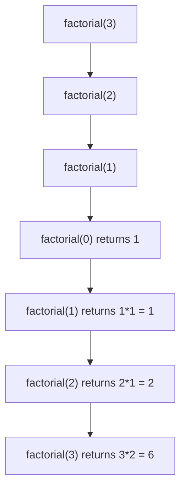

# Day 4: Recursion Basics

Hello students 👋

Today is a **magical day** — we are learning **recursion**. Many students FEAR recursion, but by the end of today, you will LOVE it. Promise! 🌟

---

## 1. Introduction

### What we will learn today
- What is recursion?
- How the call stack works
- Base case vs recursive case
- Factorial and Fibonacci using recursion
- Simple recursion problems

### Why recursion?
- **Interview must-have** — trees, graphs, backtracking all need it.
- Cleaner code for certain problems (5 lines vs 20 lines of loops).
- Trains your brain to think in **"smaller sub-problems"**.

---

## 2. Concept Explanation

### What is recursion?
**A function that calls ITSELF.** That's it.

### Real-world analogy 🪆
Think of **Russian nesting dolls (Matryoshka)**. You open a big doll → there's a smaller one inside → open it → even smaller one → ... → eventually the tiniest doll. You STOP when you reach the smallest.

Recursion works exactly like this:
- Each call opens a "smaller version" of the problem.
- The **base case** is the tiniest doll — where we stop.

### The 2 MUST-HAVE parts of every recursion

```js
function recurse(n) {
  if (n === 0) return;   // 1. BASE CASE — when to stop
  recurse(n - 1);        // 2. RECURSIVE CALL — smaller problem
}
```

**Without base case → stack overflow (infinite recursion).** ⚠️

---

## 3. Problem Solving Approach

**Step 1:** What is the smallest case? → That's your base case.
**Step 2:** Assume the function already works for `n-1`. How do you use it to solve `n`?
**Step 3:** Write the recursive call.
**Step 4:** Dry run with a SMALL input (n=3 or n=4).

### The "magic trust" rule 🪄
When writing recursion, **TRUST** that the smaller call works correctly. Don't trace deeply — just assume. Your brain will thank you!

---

## 4. 💡 Visual Learning

### Call stack for `factorial(3)`



### Call stack visual

```
Going DOWN (calls piling up):
  factorial(3)
    factorial(2)
      factorial(1)
        factorial(0) ← base case, return 1

Going UP (returning results):
        returns 1
      returns 1*1 = 1
    returns 2*1 = 2
  returns 3*2 = 6  ← final answer
```

**KEY INSIGHT:** Recursion builds a stack of calls, then "unwinds" returning answers back up.

---

## 5. 🔥 Coding Problems

### Problem 1 — Print 1 to N using recursion (Easy)

**Input:** `n = 5` → **Output:** `1 2 3 4 5`

**Thinking:** Print the number, then call with `n+1`. Stop when `n > 5`.

```js
function printOneToN(current, n) {
  if (current > n) return;   // base case
  console.log(current);
  printOneToN(current + 1, n); // recursive call
}

printOneToN(1, 5);
```

**Dry run:** Call(1) prints 1 → Call(2) prints 2 → ... → Call(5) prints 5 → Call(6) stops.

---

### Problem 2 — Print N to 1 using recursion (Easy)

**Input:** `n = 5` → **Output:** `5 4 3 2 1`

```js
function printNtoOne(n) {
  if (n === 0) return;
  console.log(n);
  printNtoOne(n - 1);
}

printNtoOne(5);
```

---

### Problem 3 — Print 1 to N WITHOUT loops, by reversing order (Medium mind-bender)

**Trick:** Put the recursive call BEFORE the print statement!

```js
function print1toN(n) {
  if (n === 0) return;
  print1toN(n - 1);   // go deep first
  console.log(n);      // print on the way back up
}

print1toN(5);  // 1 2 3 4 5
```

**Why does this work?** Recursion goes down first, prints happen as the stack unwinds — in reverse order of the calls!

This idea (doing work AFTER the recursive call) is called **"post-order"** thinking. Very important for trees.

---

### Problem 4 — Factorial using recursion (Classic)

**Definition:** `n! = n × (n-1)!`, and `0! = 1`.

```js
function factorial(n) {
  if (n === 0) return 1;        // base case
  return n * factorial(n - 1);   // recursive case
}

console.log(factorial(5)); // 120
console.log(factorial(0)); // 1
```

**Reading the code:** "Factorial of n is n times factorial of n-1." Pure math translated directly!

---

### Problem 5 — Fibonacci using recursion (Classic / Interview)

```js
function fib(n) {
  if (n === 0) return 0;   // base case 1
  if (n === 1) return 1;   // base case 2
  return fib(n - 1) + fib(n - 2);
}

console.log(fib(7)); // 13
```

**Warning:** This is SLOW for big n (exponential). Fine for learning, but in interviews mention that **memoization** or **loops** are faster.

---

### Problem 6 — Sum of first N numbers (Easy)

```js
function sum(n) {
  if (n === 0) return 0;
  return n + sum(n - 1);
}

console.log(sum(5)); // 15 (5+4+3+2+1)
```

**Dry run:**
- sum(5) = 5 + sum(4)
- sum(4) = 4 + sum(3)
- sum(3) = 3 + sum(2)
- sum(2) = 2 + sum(1)
- sum(1) = 1 + sum(0)
- sum(0) = 0 → returns bubble back up → 15 ✅

---

### Problem 7 — Power of a number (Medium)

**Input:** `base=2, exp=5` → **Output:** `32`

```js
function power(base, exp) {
  if (exp === 0) return 1;
  return base * power(base, exp - 1);
}

console.log(power(2, 5));  // 32
console.log(power(3, 4));  // 81
```

**Formula in words:** "base to the power exp = base × (base to the power exp-1)."

---

### Problem 8 — Sum of digits using recursion (Medium)

**Input:** `1234` → **Output:** `10` (1+2+3+4)

```js
function sumDigits(num) {
  if (num === 0) return 0;
  return (num % 10) + sumDigits(Math.floor(num / 10));
}

console.log(sumDigits(1234)); // 10
```

**Same digit-tricks from Day 3**, but recursively!

---

### Problem 9 — Reverse a string using recursion (Interview)

**Input:** `"hello"` → **Output:** `"olleh"`

```js
function reverseStr(s) {
  if (s === "") return "";
  return reverseStr(s.slice(1)) + s[0];
}

console.log(reverseStr("hello")); // "olleh"
```

**Reading:** "Reverse of 'hello' = reverse of 'ello' + 'h'." Smaller problem, then attach first character at the end.

**Dry run:**
- reverseStr("hello") → reverseStr("ello") + "h"
- reverseStr("ello") → reverseStr("llo") + "e"
- reverseStr("llo") → reverseStr("lo") + "l"
- reverseStr("lo") → reverseStr("o") + "l"
- reverseStr("o") → reverseStr("") + "o" = "" + "o" = "o"
- Bubble up: "o"+"l" = "ol" → "ol"+"l" = "oll" → "oll"+"e" = "olle" → "olle"+"h" = "olleh" ✅

---

### Problem 10 — Check palindrome using recursion (Interview)

```js
function isPalin(s) {
  if (s.length <= 1) return true;                  // base case
  if (s[0] !== s[s.length - 1]) return false;      // first ≠ last → no
  return isPalin(s.slice(1, -1));                   // check middle part
}

console.log(isPalin("madam")); // true
console.log(isPalin("hello")); // false
```

**Thinking:** Compare first and last chars → if equal, recurse on the middle substring.

---

### Problem 11 — Count occurrences of a digit in a number (Medium)

**Input:** `num=12223, digit=2` → **Output:** `3`

```js
function countDigit(num, digit) {
  if (num === 0) return 0;
  let last = num % 10;
  let rest = countDigit(Math.floor(num / 10), digit);
  return (last === digit ? 1 : 0) + rest;
}

console.log(countDigit(12223, 2)); // 3
```

---

### Problem 12 — Find if an element is in array (Recursion on arrays)

**Input:** `arr=[1,2,3,4,5], target=3` → **Output:** `true`

```js
function search(arr, target, i = 0) {
  if (i === arr.length) return false;    // reached end, not found
  if (arr[i] === target) return true;
  return search(arr, target, i + 1);
}

console.log(search([1, 2, 3, 4, 5], 3));  // true
console.log(search([1, 2, 3, 4, 5], 10)); // false
```

---

## 🎯 Key Takeaways

1. **Base case first** — always. No base case = stack overflow.
2. **Trust the smaller call** — don't trace too deep.
3. Work **BEFORE** the recursive call = top-down (forward).
4. Work **AFTER** the recursive call = bottom-up (reverse).
5. Recursion = cleaner code, but loops are usually FASTER.

## Homework

1. Recursively find the **maximum** element in an array.
2. Recursively count the number of **vowels** in a string.
3. Recursively print all numbers divisible by 3 from 1 to N.

Tomorrow — the **boss level** — backtracking and real interview problems! 🔥🧩