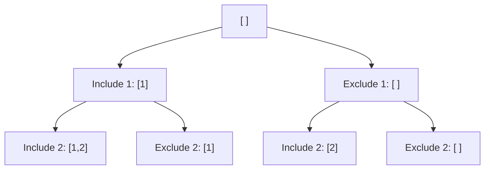

# Day 5: Advanced Recursion + Interview Problems

Hello students 👋

Welcome to the **final day** 🎉. You have come a long way — from basic loops to recursion. Today we step into **interview-level territory**: backtracking, string problems, combinations, and real questions asked at **Google, Amazon, TCS, Infosys, and startups**.

---

## 1. Introduction

### What we will learn today
- Backtracking basics
- String problems (substrings, permutations)
- Combination / subset problems
- Classic interview recursion
- Thinking like a problem-solver

### Why this matters
These problems are the **difference between getting a job offer and not**. Interviewers love them because they test:
- Recursive thinking
- Decision-making at each step
- Edge case handling

---

## 2. Concept Explanation

### What is Backtracking?
Backtracking = **try something, if it fails, UNDO it and try something else.**

### Real-world analogy 🗺️
You're in a **maze**. You pick a path. Dead end? → Walk back, try a different path. Keep going until you find the exit, OR you've tried every path.

### The backtracking template

```js
function backtrack(currentState) {
  if (goalReached(currentState)) {
    saveResult(currentState);
    return;
  }
  for (let choice of allChoices) {
    makeChoice(choice);          // 1. try it
    backtrack(newState);          // 2. recurse
    undoChoice(choice);           // 3. undo it ← the KEY step
  }
}
```

That "undo" step is what makes it **backtracking** instead of plain recursion.

---

## 3. Problem Solving Approach

**Step 1 — Identify choices:** At each step, what options do you have?
**Step 2 — Identify the base case:** When have you finished?
**Step 3 — Make, recurse, undo:** Follow the template above.
**Step 4 — Dry run tiny input:** Try n=2 or n=3 before big ones.

---

## 4. 💡 Visual Learning

### Recursion tree for generating all subsets of [1, 2]



**Leaves of this tree:** `[1,2], [1], [2], [ ]` — all 4 subsets!

### At every step, you make 2 choices

```
      Choose 1?  →  YES or NO
       /              \
      YES              NO
     /  \             /  \
   C2Y  C2N         C2Y  C2N
```

---

## 5. 🔥 Coding Problems

### Problem 1 — Print all subsets of a string (Interview classic)

**Input:** `"ab"` → **Output:** `["", "a", "b", "ab"]`

**Thinking:** For each character, two choices — **include** or **exclude**.

```js
function subsets(str, current = "", i = 0, result = []) {
  if (i === str.length) {
    result.push(current);
    return result;
  }
  subsets(str, current + str[i], i + 1, result); // include
  subsets(str, current,          i + 1, result); // exclude
  return result;
}

console.log(subsets("ab"));  // ["ab", "a", "b", ""]
console.log(subsets("abc")); // 8 subsets
```

**Formula:** `n` characters → `2^n` subsets.

---

### Problem 2 — Print all permutations of a string (Interview favorite)

**Input:** `"abc"` → **Output:** `["abc","acb","bac","bca","cab","cba"]`

**Thinking:** Pick ONE character as the first letter, then permute the rest. Repeat for every character.

```js
function permute(str, prefix = "", result = []) {
  if (str.length === 0) {
    result.push(prefix);
    return result;
  }
  for (let i = 0; i < str.length; i++) {
    let remaining = str.slice(0, i) + str.slice(i + 1);
    permute(remaining, prefix + str[i], result);
  }
  return result;
}

console.log(permute("abc"));
// ["abc", "acb", "bac", "bca", "cab", "cba"]
```

**Formula:** `n` characters → `n!` permutations.

---

### Problem 3 — Generate all balanced parentheses (Google / Amazon)

**Input:** `n = 3` → **Output:** `["((()))","(()())","(())()","()(())","()()()"]`

**Rules:**
- You can place `(` if you still have open ones left.
- You can place `)` only if there's a matching `(` already.

```js
function generateParens(n, current = "", open = 0, close = 0, result = []) {
  if (current.length === 2 * n) {
    result.push(current);
    return result;
  }
  if (open < n)    generateParens(n, current + "(", open + 1, close, result);
  if (close < open) generateParens(n, current + ")", open, close + 1, result);
  return result;
}

console.log(generateParens(3));
```

---

### Problem 4 — Phone number letter combinations (Interview classic)

**Input:** `"23"` → **Output:** `["ad","ae","af","bd","be","bf","cd","ce","cf"]`

(2 = abc, 3 = def, just like old mobile keypads)

```js
function letterCombinations(digits) {
  if (!digits) return [];
  const map = { 2:"abc", 3:"def", 4:"ghi", 5:"jkl",
                6:"mno", 7:"pqrs", 8:"tuv", 9:"wxyz" };
  let result = [];

  function backtrack(index, current) {
    if (index === digits.length) {
      result.push(current);
      return;
    }
    let letters = map[digits[index]];
    for (let ch of letters) {
      backtrack(index + 1, current + ch);
    }
  }

  backtrack(0, "");
  return result;
}

console.log(letterCombinations("23"));
```

---

### Problem 5 — Subset sum — does any subset sum to target? (Medium)

**Input:** `arr=[2,3,5,7], target=8` → **Output:** `true` (3+5 = 8)

```js
function subsetSum(arr, target, i = 0) {
  if (target === 0) return true;           // found!
  if (i === arr.length) return false;      // no more elements
  // include OR exclude
  return subsetSum(arr, target - arr[i], i + 1) ||
         subsetSum(arr, target, i + 1);
}

console.log(subsetSum([2, 3, 5, 7], 8));  // true
console.log(subsetSum([2, 3, 5, 7], 100)); // false
```

---

### Problem 6 — N-th Fibonacci with memoization (optimization)

Recursive Fibonacci is slow. Let's make it fast!

```js
function fibMemo(n, memo = {}) {
  if (n in memo) return memo[n];
  if (n <= 1) return n;
  memo[n] = fibMemo(n - 1, memo) + fibMemo(n - 2, memo);
  return memo[n];
}

console.log(fibMemo(50)); // instant! Without memo it would take minutes
```

**Lesson:** Store answers you've already computed. This is **Dynamic Programming**'s core idea.

---

### Problem 7 — Print all paths in a grid (Interview tough)

**Problem:** From top-left (0,0) to bottom-right (m-1, n-1) of a grid, moving only RIGHT or DOWN. Print all paths.

**Input:** `m=2, n=2`
**Output:** `"RD", "DR"` (for a 2×2 grid)

```js
function gridPaths(m, n, i = 0, j = 0, path = "", result = []) {
  if (i === m - 1 && j === n - 1) {
    result.push(path);
    return result;
  }
  if (j < n - 1) gridPaths(m, n, i, j + 1, path + "R", result); // move right
  if (i < m - 1) gridPaths(m, n, i + 1, j, path + "D", result); // move down
  return result;
}

console.log(gridPaths(3, 3));
// ["RRDD", "RDRD", "RDDR", "DRRD", "DRDR", "DDRR"]
```

---

### Problem 8 — Reverse a string using recursion (Warm-up revisit)

```js
function reverseString(s) {
  if (s.length <= 1) return s;
  return reverseString(s.slice(1)) + s[0];
}

console.log(reverseString("interview")); // "weivretni"
```

---

### Problem 9 — Check if an array is sorted (Recursion on arrays)

```js
function isSorted(arr, i = 0) {
  if (i === arr.length - 1) return true;         // reached end
  if (arr[i] > arr[i + 1]) return false;         // found disorder
  return isSorted(arr, i + 1);
}

console.log(isSorted([1, 2, 3, 4, 5])); // true
console.log(isSorted([1, 5, 3, 4]));    // false
```

---

### Problem 10 — Tower of Hanoi (Legendary interview problem)

**Problem:** Move `n` disks from rod A to rod C using rod B, following these rules:
1. Only one disk moves at a time.
2. Bigger disk can never be on a smaller one.

```js
function hanoi(n, from, to, via) {
  if (n === 0) return;
  hanoi(n - 1, from, via, to);           // move n-1 to helper
  console.log(`Move disk ${n} from ${from} to ${to}`);
  hanoi(n - 1, via, to, from);           // move n-1 back onto target
}

hanoi(3, "A", "C", "B");
```

**Output for n=3:**
```
Move disk 1 from A to C
Move disk 2 from A to B
Move disk 1 from C to B
Move disk 3 from A to C
Move disk 1 from B to A
Move disk 2 from B to C
Move disk 1 from A to C
```

**Elegant!** 3 recursive calls solve an exponentially complex puzzle. 🤯

---

### Problem 11 — Word break problem (Amazon / Microsoft)

**Problem:** Given a string and a dictionary, can the string be broken into dictionary words?

**Input:** `s="leetcode", dict=["leet","code"]` → **Output:** `true`

```js
function wordBreak(s, dict) {
  if (s.length === 0) return true;
  for (let i = 1; i <= s.length; i++) {
    let prefix = s.slice(0, i);
    if (dict.includes(prefix) && wordBreak(s.slice(i), dict)) {
      return true;
    }
  }
  return false;
}

console.log(wordBreak("leetcode", ["leet", "code"])); // true
console.log(wordBreak("applepie", ["apple", "pie"])); // true
console.log(wordBreak("hello", ["hi"]));               // false
```

---

### Problem 12 — N-Queens count (FAANG-level)

**Problem:** On an N×N chessboard, place N queens so none attack each other. Count the number of valid arrangements.

```js
function solveNQueens(n) {
  let count = 0;
  let cols = new Set(), diag1 = new Set(), diag2 = new Set();

  function place(row) {
    if (row === n) { count++; return; }
    for (let col = 0; col < n; col++) {
      if (cols.has(col) || diag1.has(row - col) || diag2.has(row + col)) continue;
      // place queen
      cols.add(col); diag1.add(row - col); diag2.add(row + col);
      place(row + 1);
      // UNDO (backtrack)
      cols.delete(col); diag1.delete(row - col); diag2.delete(row + col);
    }
  }

  place(0);
  return count;
}

console.log(solveNQueens(4)); // 2
console.log(solveNQueens(8)); // 92
```

**This is the PUREST example of backtracking.** Place → recurse → UNDO.

---

## 🎯 Final Interview Tips

1. **Always clarify the problem first.** Ask for examples. Ask about edge cases.
2. **Start with brute force.** Then optimize. Interviewers love to see your thought process.
3. **Dry run your code out loud.** It shows confidence and catches bugs.
4. **Know the complexity.**
   - Subsets → `O(2^n)`
   - Permutations → `O(n!)`
   - Fibonacci (recursive) → `O(2^n)`, with memo → `O(n)`
5. **Practice daily.** 2–3 problems a day for 30 days beats 100 problems in one weekend.

---

## 🎓 Congratulations!

You just completed 5 days of **hardcore logic building**. Here's what you can do now:

✅ Write and debug any loop
✅ Draw any pattern with confidence
✅ Handle digit and number problems
✅ Think recursively
✅ Tackle backtracking problems

### What's next?
- Start solving **LeetCode Easy** problems daily.
- Move to **Arrays, Strings, Hash Maps** — next logical step.
- Then: **Trees, Graphs, Dynamic Programming**.

**Remember:** Every great developer was once confused by `for (let i = 0; i < n; i++)`. Keep coding, keep thinking, keep failing and trying again.

Good luck — I'm proud of you! 🚀💪

— Your instructor