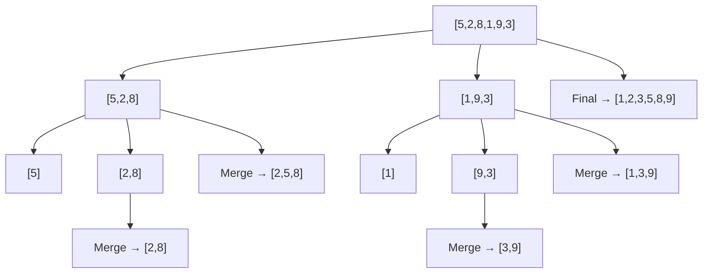

# Day 7: Sorting & Searching Deep Dive

Hello students 👋

Yesterday you learned arrays. Today we explore **how to organize them** — sorting — and **how to find things faster** — advanced searching. Every senior developer must know these cold.

---

## 1. Introduction

### What we will learn today
- Bubble sort, Selection sort, Insertion sort
- Merge sort (divide and conquer!)
- Quick sort
- Binary search variations
- Searching in rotated arrays
- Time complexity intuition

### Why sorting & searching?
- Almost every hard problem becomes EASY after sorting.
- Binary search patterns show up in Google/Amazon interviews constantly.
- Understanding sort algorithms = understanding recursion and complexity.

---

## 2. Concept Explanation

### Real-world analogy 🃏
Imagine **sorting a deck of cards** in your hand. You have several strategies:
- **Bubble sort** — keep swapping neighbors until no swaps needed (slow).
- **Selection sort** — find the smallest, put it first. Repeat.
- **Insertion sort** — pick one card, slide it to the right spot.
- **Merge sort** — split in half, sort each half, merge.
- **Quick sort** — pick a "pivot" card, split smaller/bigger, repeat.

All 5 give the same result — the difference is **speed**.

### Time complexity cheat sheet

| Algorithm | Best | Average | Worst |
|---|---|---|---|
| Bubble | O(n) | O(n²) | O(n²) |
| Selection | O(n²) | O(n²) | O(n²) |
| Insertion | O(n) | O(n²) | O(n²) |
| Merge | O(n log n) | O(n log n) | O(n log n) |
| Quick | O(n log n) | O(n log n) | O(n²) |

**Rule of thumb:** For interviews, know Merge and Quick sort by heart.

---

## 3. Problem Solving Approach

For sorting problems:
**Step 1:** Are the values numbers, strings, objects?
**Step 2:** Sort ascending or descending? By what key?
**Step 3:** Do you need stability (equal elements keep order)?
**Step 4:** Choose the right algorithm.

---

## 4. 💡 Visual Learning

### Merge sort recursion tree



### Binary search halving visual

```
search 9 in [1,3,5,7,9,11,13,15]
Step 1:  [1,3,5,7] | 9 | [11,13,15]   mid=7, go RIGHT? no, go LEFT half of 9's side
Step 2:  ...       [9] ...             found!
```

---

## 5. 🔥 Coding Problems

### Problem 1 — Bubble Sort (Easy)

```js
function bubbleSort(arr) {
  let n = arr.length;
  for (let i = 0; i < n - 1; i++) {
    let swapped = false;
    for (let j = 0; j < n - i - 1; j++) {
      if (arr[j] > arr[j + 1]) {
        [arr[j], arr[j + 1]] = [arr[j + 1], arr[j]];
        swapped = true;
      }
    }
    if (!swapped) break; // early exit if already sorted
  }
  return arr;
}

console.log(bubbleSort([5, 2, 8, 1, 9])); // [1, 2, 5, 8, 9]
```

**Name origin:** Big elements "bubble" to the right each pass.

---

### Problem 2 — Selection Sort (Easy)

```js
function selectionSort(arr) {
  for (let i = 0; i < arr.length - 1; i++) {
    let minIdx = i;
    for (let j = i + 1; j < arr.length; j++) {
      if (arr[j] < arr[minIdx]) minIdx = j;
    }
    [arr[i], arr[minIdx]] = [arr[minIdx], arr[i]];
  }
  return arr;
}

console.log(selectionSort([64, 25, 12, 22, 11])); // [11, 12, 22, 25, 64]
```

**Idea:** Find smallest, swap to front. Repeat for remaining.

---

### Problem 3 — Insertion Sort (Easy)

```js
function insertionSort(arr) {
  for (let i = 1; i < arr.length; i++) {
    let current = arr[i];
    let j = i - 1;
    while (j >= 0 && arr[j] > current) {
      arr[j + 1] = arr[j];
      j--;
    }
    arr[j + 1] = current;
  }
  return arr;
}

console.log(insertionSort([5, 2, 4, 6, 1, 3])); // [1, 2, 3, 4, 5, 6]
```

**Idea:** Like sorting cards in your hand — pick a card, slide backwards to the right slot.

---

### Problem 4 — Merge Sort (Interview must-know!)

```js
function mergeSort(arr) {
  if (arr.length <= 1) return arr;
  let mid = Math.floor(arr.length / 2);
  let left = mergeSort(arr.slice(0, mid));
  let right = mergeSort(arr.slice(mid));
  return merge(left, right);
}

function merge(a, b) {
  let result = [], i = 0, j = 0;
  while (i < a.length && j < b.length) {
    if (a[i] < b[j]) result.push(a[i++]);
    else result.push(b[j++]);
  }
  return [...result, ...a.slice(i), ...b.slice(j)];
}

console.log(mergeSort([5, 2, 8, 1, 9, 3])); // [1,2,3,5,8,9]
```

**Why it's fast:** Divides the problem in HALF each time. Guaranteed O(n log n).

---

### Problem 5 — Quick Sort (Interview must-know!)

```js
function quickSort(arr) {
  if (arr.length <= 1) return arr;
  let pivot = arr[arr.length - 1];
  let left = [], right = [];
  for (let i = 0; i < arr.length - 1; i++) {
    if (arr[i] < pivot) left.push(arr[i]);
    else right.push(arr[i]);
  }
  return [...quickSort(left), pivot, ...quickSort(right)];
}

console.log(quickSort([10, 7, 8, 9, 1, 5])); // [1,5,7,8,9,10]
```

**Idea:** Pick a **pivot**, split into smaller/bigger, recurse.

---

### Problem 6 — Sort strings by length (Medium)

```js
let words = ["banana", "apple", "pie", "strawberry"];
words.sort((a, b) => a.length - b.length);
console.log(words); // ["pie", "apple", "banana", "strawberry"]
```

**Trick:** JS's built-in `.sort()` uses Timsort (O(n log n)). Custom comparator via arrow function.

---

### Problem 7 — Sort objects by key (Real-world use)

```js
let users = [
  { name: "Ali", age: 28 },
  { name: "Hasan", age: 22 },
  { name: "Zara", age: 35 }
];
users.sort((a, b) => a.age - b.age);
console.log(users); // sorted youngest to oldest
```

**Real-world:** Sorting user tables, product lists, search results.

---

### Problem 8 — First & Last occurrence (Binary search variation)

**Input:** `[1,2,2,2,3,4,5], target=2` → **Output:** `first=1, last=3`

```js
function firstOccurrence(arr, target) {
  let left = 0, right = arr.length - 1, result = -1;
  while (left <= right) {
    let mid = Math.floor((left + right) / 2);
    if (arr[mid] === target) {
      result = mid;
      right = mid - 1; // keep going left
    } else if (arr[mid] < target) left = mid + 1;
    else right = mid - 1;
  }
  return result;
}

console.log(firstOccurrence([1,2,2,2,3,4,5], 2)); // 1
```

**Key insight:** When found, don't stop — keep searching to the left (or right for last occurrence).

---

### Problem 9 — Search in rotated sorted array (Google favorite)

**Input:** `[4,5,6,7,0,1,2], target=0` → **Output:** `4`

```js
function searchRotated(arr, target) {
  let left = 0, right = arr.length - 1;
  while (left <= right) {
    let mid = Math.floor((left + right) / 2);
    if (arr[mid] === target) return mid;
    if (arr[left] <= arr[mid]) {
      // left half is sorted
      if (arr[left] <= target && target < arr[mid]) right = mid - 1;
      else left = mid + 1;
    } else {
      // right half is sorted
      if (arr[mid] < target && target <= arr[right]) left = mid + 1;
      else right = mid - 1;
    }
  }
  return -1;
}

console.log(searchRotated([4,5,6,7,0,1,2], 0)); // 4
```

---

### Problem 10 — Find peak element (Medium binary search)

**Definition:** An element greater than its neighbors.

```js
function findPeak(arr) {
  let left = 0, right = arr.length - 1;
  while (left < right) {
    let mid = Math.floor((left + right) / 2);
    if (arr[mid] > arr[mid + 1]) right = mid;
    else left = mid + 1;
  }
  return left;
}

console.log(findPeak([1, 3, 20, 4, 1])); // 2 (20 is peak)
```

---

### Problem 11 — Count sort (Medium but elegant)

**Idea:** Count how many times each number appears, then rebuild sorted.

```js
function countingSort(arr) {
  let max = Math.max(...arr);
  let count = new Array(max + 1).fill(0);
  for (let num of arr) count[num]++;

  let result = [];
  for (let i = 0; i <= max; i++) {
    while (count[i]-- > 0) result.push(i);
  }
  return result;
}

console.log(countingSort([4, 2, 2, 8, 3, 3, 1])); // [1,2,2,3,3,4,8]
```

**Speed:** O(n + k) where k = max. Faster than comparison sorts when values are small.

---

### Problem 12 — Kth largest element (Interview classic)

**Input:** `[3,2,1,5,6,4], k=2` → **Output:** `5`

```js
function kthLargest(arr, k) {
  arr.sort((a, b) => b - a); // sort descending
  return arr[k - 1];
}

console.log(kthLargest([3,2,1,5,6,4], 2)); // 5
```

**Optimized:** Use a min-heap of size k (O(n log k)) — but sorting is fine for most interviews if you mention the heap alternative.

---

## 🎯 Key Takeaways

1. **O(n log n)** is the gold standard for sorting.
2. **Binary search** isn't just for search — it's for any "halving" problem.
3. Always clarify: "Can I modify the input?", "Is it sorted?", "Duplicates allowed?"
4. Know JS's built-in `.sort()` comparator: `(a, b) => a - b`.

## Homework

1. Implement Merge Sort for strings (sort alphabetically).
2. Write binary search for "find first element ≥ target".
3. Sort an array of objects by 2 keys (age first, then name).

Tomorrow — **Strings in depth**! 📝
