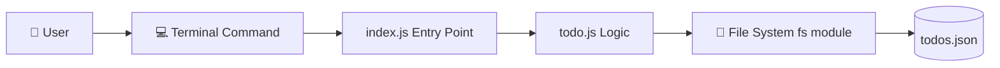

# 📅 Day 1: Node.js Todo App — Setup + Add & Read Todos

Hello students 👋

Welcome to our first day of building a **Console-based Todo Application** using **Node.js**. Today is going to be super fun because we will build a real project — the kind you can actually use every day to manage your tasks.

Before we write a single line of code, let me tell you something important:

> Learning to code is like learning to cook. First we learn where the kitchen is, then what the ingredients are, and finally how to make the dish. Same here — first we understand Node.js, then modules, and then we cook the Todo App. 🍲

---

## 1. 📖 Introduction

### What will we build today?

A **command-line Todo app** that lets us:

- ➕ Add a new todo
- 📋 View all todos

And we will save them in a file called `todos.json` so our todos don't disappear when we close the terminal.

### Why is this project useful?

- You use **Node.js** (backend runtime)
- You learn **modules** (how big apps are organized)
- You learn the **file system** (how to save data)
- You learn **CLI** (the black screen developers love 🖤)

Think of it as your **personal daily planner** — but built by you, for you.

❓ **Quick question for you:** Do you use a todo list on your phone? If yes — we are building the *engine* behind it today.

---

## 2. 🧠 Concept Explanation

### What is Node.js?

Node.js is a **JavaScript runtime**. That means — it allows us to run JavaScript **outside the browser**.

Earlier, JavaScript only worked inside Chrome, Firefox, etc. But Node.js said,
> "Hey JS, come out of the browser. Let's build servers, tools, and apps!"

**Real world analogy:**
- Browser = Your living room 📺
- Node.js = The whole world 🌍

### What are Modules?

A **module** is just a **JavaScript file** that does one specific job.

**Analogy:** Imagine a kitchen.
- One drawer has spoons
- One drawer has knives
- One drawer has plates

You don't keep everything in one huge drawer, right? Same in code — we split logic into files called **modules**.

### Why import / export?

- `export` → "I am sharing this thing with others."
- `import` → "I want to use that thing here."

Just like sharing your notes with a friend in class. ✍️

---

## 3. 💡 Visual Learning

Here is how our Todo App will work:



**Read it like a story:**
1. User types a command in the terminal
2. `index.js` receives it
3. `index.js` calls a function from `todo.js`
4. `todo.js` uses `fs` to read/write
5. Data is saved in `todos.json`

Simple, right? 😊

---

## 4. 🛠️ Project Setup

### Step 1: Create a folder

```bash
mkdir todo-app
cd todo-app
```

### Step 2: Initialize Node.js project

```bash
npm init -y
```

This creates a `package.json` file — the **ID card** of your project.

### Step 3: Enable ES Modules

Open `package.json` and add this line:

```json
{
  "type": "module"
}
```

This tells Node.js: *"We will use modern `import/export` syntax."*

### Step 4: Create these files

```
todo-app/
├── package.json
├── index.js       ← entry point (CLI handler)
├── todo.js        ← logic (add, get)
└── todos.json     ← storage
```

And put an empty array inside `todos.json`:

```json
[]
```

> ⚠️ Very important: the file must contain `[]`, not be empty. Otherwise JSON parsing will fail.

---

## 5. ⚙️ Core Features Implementation (Day 1)

Today we build **two** functions:

1. `addTodo(task)` — add a new task
2. `getTodos()` — read all tasks

### 📄 todo.js

```js
import fs from 'fs';

const FILE = './todos.json';

// Helper: read todos from file
function readFile() {
  try {
    const data = fs.readFileSync(FILE, 'utf-8');
    return JSON.parse(data);
  } catch (err) {
    return [];
  }
}

// Helper: save todos to file
function writeFile(todos) {
  fs.writeFileSync(FILE, JSON.stringify(todos, null, 2));
}

// ➕ Add a todo
export function addTodo(task) {
  const todos = readFile();
  const newTodo = {
    id: Date.now(),
    task: task,
    done: false
  };
  todos.push(newTodo);
  writeFile(todos);
  console.log(`✅ Added: "${task}"`);
}

// 📋 Get all todos
export function getTodos() {
  const todos = readFile();
  if (todos.length === 0) {
    console.log('📭 No todos yet. Add one!');
    return;
  }
  console.log('\n📋 Your Todos:');
  todos.forEach((t, i) => {
    const status = t.done ? '✅' : '⬜';
    console.log(`${i + 1}. ${status} ${t.task}`);
  });
}
```

#### 🔍 Line-by-line explanation

- `import fs from 'fs'` → bring Node's built-in File System module
- `Date.now()` → unique ID using current timestamp
- `readFileSync` / `writeFileSync` → synchronous read & write (simple for beginners)
- `JSON.parse` → text ➜ JavaScript object
- `JSON.stringify` → JavaScript object ➜ text

#### 📥 Example Input / Output

**Input:**
```js
addTodo("Learn Node.js");
```

**Output in console:**
```
✅ Added: "Learn Node.js"
```

**Inside todos.json:**
```json
[
  { "id": 1739000000000, "task": "Learn Node.js", "done": false }
]
```

---

## 6. 📦 Module System

In `todo.js` we wrote:

```js
export function addTodo(task) { ... }
export function getTodos() { ... }
```

Now in `index.js` we **import** them:

```js
import { addTodo, getTodos } from './todo.js';
```

✅ Notice the `.js` at the end — **required** in ES Modules.

**Analogy:** `todo.js` is a shop 🏪 selling items (functions). `index.js` is the customer 🛒 who imports them.

---

## 7. 💾 File System Usage

Node.js gives us the **`fs`** module to talk to files.

| Action | Method |
|--------|--------|
| Read  | `fs.readFileSync(path, 'utf-8')` |
| Write | `fs.writeFileSync(path, data)` |

### Error handling with try / catch

```js
try {
  const data = fs.readFileSync(FILE, 'utf-8');
  return JSON.parse(data);
} catch (err) {
  return [];
}
```

If the file doesn't exist or JSON is broken — we **don't crash**, we return an empty list. Smooth. 😎

---

## 8. 💻 CLI Interaction

Node.js gives us `process.argv` — an **array** of everything the user types.

```
node index.js add "Learn Node"
```

becomes:

```js
process.argv = [
  'node',                  // 0
  '/path/to/index.js',     // 1
  'add',                   // 2 → command
  'Learn Node'             // 3 → argument
];
```

### 📄 index.js

```js
import { addTodo, getTodos } from './todo.js';

const command = process.argv[2];
const argument = process.argv[3];

switch (command) {
  case 'add':
    if (!argument) {
      console.log('⚠️  Please provide a task. Example: node index.js add "Buy milk"');
      break;
    }
    addTodo(argument);
    break;

  case 'list':
    getTodos();
    break;

  default:
    console.log('❓ Unknown command. Try: add | list');
}
```

### ▶️ Try it now

```bash
node index.js add "Learn Node.js"
node index.js add "Drink water"
node index.js list
```

Expected output:

```
📋 Your Todos:
1. ⬜ Learn Node.js
2. ⬜ Drink water
```

🎉 Congrats — your **first backend CLI app is live!**

---

## 9. 🧪 Hands-on Practice

Try these one by one:

1. Add 5 todos of your own daily tasks
2. Open `todos.json` — can you see your data?
3. Delete everything inside `todos.json` (keep `[]`) — run `list` again
4. Change the emoji `⬜` to `📝` in `todo.js`
5. Add a `console.log("Welcome!")` at the top of `index.js` — when does it run?

---

## 10. ⚠️ Common Mistakes

| Mistake | Fix |
|---------|-----|
| `Cannot use import statement` | Add `"type": "module"` in package.json |
| `ENOENT: no such file` | Make sure `todos.json` exists |
| `Unexpected end of JSON input` | File must contain `[]`, not be empty |
| `Cannot find module './todo'` | Add `.js` extension → `./todo.js` |
| Argument with spaces not working | Wrap in **quotes**: `add "Buy milk"` |

---

## 11. 📝 Mini Assignment

Before Day 2, try this:

1. Add a new command `count` that prints how many todos exist.
2. Example:
   ```bash
   node index.js count
   → You have 3 todos.
   ```

Hint: read the array length from `readFile()`.

---

## 12. 🔁 Recap

Today we learned:

- ✅ What Node.js is and why we use it
- ✅ What modules are and why we split code
- ✅ ES Modules: `import` / `export`
- ✅ `fs` module — reading & writing files
- ✅ `process.argv` — reading CLI input
- ✅ JSON for storing data
- ✅ Built **`addTodo`** and **`getTodos`**

Tomorrow we will make our app **complete** with update and delete, plus cleaner code.

See you in Day 2! 👋
