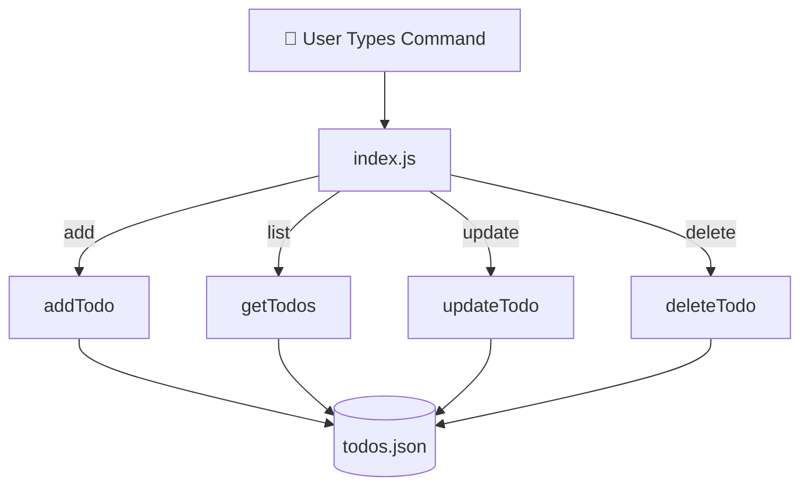

# 📅 Day 2: Node.js Todo App — Update, Delete & Improvements

Hello students 👋

Welcome back! Yesterday we built the foundation — today we **finish the app**. By the end of this session, you'll have a **fully working CRUD Todo CLI** that you can actually brag about. 💪

Quick recap before we start:

- ✅ Day 1 → Setup, modules, `addTodo`, `getTodos`
- 🎯 Day 2 → `deleteTodo`, `updateTodo`, better CLI, error handling, clean code

---

## 1. 📖 Introduction

### What will we build today?

We will add:

- ✏️ **Update** a todo (mark it done or change text)
- ❌ **Delete** a todo
- 🛡️ Proper error handling
- 🧹 Cleaner, modular code

### Why is this important?

Every real app in the world does **CRUD**:

| Letter | Meaning | Example |
|--------|---------|---------|
| C | Create | addTodo |
| R | Read   | getTodos |
| U | Update | updateTodo |
| D | Delete | deleteTodo |

Instagram, WhatsApp, Amazon — all are just fancy CRUD apps. So what you learn today is **the backbone of every backend job**. 🔑

❓ **Quick question:** Can you tell me one app you use that does CRUD? (Hint: almost every app 😉)

---

## 2. 🧠 Concept Refresh

### Quick Module Recap

```js
// todo.js
export function addTodo() {}

// index.js
import { addTodo } from './todo.js';
```

One file **shares**, another file **uses**. Simple.

### Why error handling?

In real life — files can be missing, data can be broken, users type wrong things. A good developer **expects problems** and handles them gracefully.

**Analogy:** A good driver doesn't just drive — they **watch for potholes** 🕳️. Our code should too.

---

## 3. 💡 Visual Learning

Today's full flow:



Command in → function runs → file updates. That's the full story.

---

## 4. 🛠️ Project Structure (Day 2)

We'll reorganize slightly for cleaner code:

```
todo-app/
├── package.json
├── index.js        ← CLI commands
├── todo.js         ← business logic
├── fileHelper.js   ← read/write helpers (NEW)
└── todos.json      ← storage
```

**Why a new file?** Because `readFile` and `writeFile` are used by *every* function. Putting them in a shared helper = **no repeated code**. That's called the **DRY principle** (Don't Repeat Yourself).

---

## 5. ⚙️ Core Features Implementation

### 📄 fileHelper.js (new)

```js
import fs from 'fs';

const FILE = './todos.json';

export function readFile() {
  try {
    const data = fs.readFileSync(FILE, 'utf-8');
    return JSON.parse(data);
  } catch (err) {
    console.log('⚠️  Could not read file. Starting fresh.');
    return [];
  }
}

export function writeFile(todos) {
  try {
    fs.writeFileSync(FILE, JSON.stringify(todos, null, 2));
  } catch (err) {
    console.log('❌ Could not save file:', err.message);
  }
}
```

### 📄 todo.js (updated)

```js
import { readFile, writeFile } from './fileHelper.js';

// ➕ Add
export function addTodo(task) {
  if (!task) return console.log('⚠️  Task cannot be empty.');
  const todos = readFile();
  todos.push({ id: Date.now(), task, done: false });
  writeFile(todos);
  console.log(`✅ Added: "${task}"`);
}

// 📋 Read
export function getTodos() {
  const todos = readFile();
  if (todos.length === 0) return console.log('📭 No todos yet.');
  console.log('\n📋 Your Todos:');
  todos.forEach((t, i) => {
    const status = t.done ? '✅' : '⬜';
    console.log(`${i + 1}. ${status} ${t.task}  (id: ${t.id})`);
  });
}

// ✏️ Update
export function updateTodo(id, newTask) {
  const todos = readFile();
  const todo = todos.find(t => t.id === Number(id));
  if (!todo) return console.log(`❌ Todo with id ${id} not found.`);
  todo.task = newTask;
  writeFile(todos);
  console.log(`✏️  Updated todo ${id}`);
}

// ✅ Mark as done
export function markDone(id) {
  const todos = readFile();
  const todo = todos.find(t => t.id === Number(id));
  if (!todo) return console.log(`❌ Todo with id ${id} not found.`);
  todo.done = true;
  writeFile(todos);
  console.log(`🎉 Marked as done: "${todo.task}"`);
}

// ❌ Delete
export function deleteTodo(id) {
  const todos = readFile();
  const newTodos = todos.filter(t => t.id !== Number(id));
  if (newTodos.length === todos.length) {
    return console.log(`❌ Todo with id ${id} not found.`);
  }
  writeFile(newTodos);
  console.log(`🗑️  Deleted todo ${id}`);
}
```

### 🔍 How each function works

#### `updateTodo(id, newTask)`
- Finds the todo with `.find()`
- Replaces `task` text
- Saves file

**Input:**
```bash
node index.js update 1739000000000 "Learn Express"
```
**Output:**
```
✏️  Updated todo 1739000000000
```

#### `deleteTodo(id)`
- Uses `.filter()` to keep everything **except** the matching id
- Saves the new array

**Input:**
```bash
node index.js delete 1739000000000
```
**Output:**
```
🗑️  Deleted todo 1739000000000
```

#### `markDone(id)`
- Finds the todo
- Sets `done = true`

**Input:**
```bash
node index.js done 1739000000000
```

---

## 6. 📦 Module System (Bigger Picture)

Now we have **3 modules** talking to each other:


Each file has **one clear job**. This is how professional Node.js apps are built. 🏗️

---

## 7. 💻 Updated CLI — index.js

```js
import {
  addTodo,
  getTodos,
  updateTodo,
  deleteTodo,
  markDone
} from './todo.js';

const [, , command, ...args] = process.argv;

switch (command) {
  case 'add':
    addTodo(args.join(' '));
    break;

  case 'list':
    getTodos();
    break;

  case 'update': {
    const [id, ...rest] = args;
    updateTodo(id, rest.join(' '));
    break;
  }

  case 'done':
    markDone(args[0]);
    break;

  case 'delete':
    deleteTodo(args[0]);
    break;

  case 'help':
  default:
    console.log(`
📘 Todo App Commands:

  node index.js add "task"              ➕ Add new todo
  node index.js list                    📋 Show all todos
  node index.js update <id> "new text"  ✏️  Update todo
  node index.js done <id>               ✅ Mark done
  node index.js delete <id>             🗑️  Delete todo
`);
}
```

### 🎯 Tip — Destructuring `process.argv`

```js
const [, , command, ...args] = process.argv;
```

- First two values (`node` and script path) are skipped with empty commas
- `command` = third item
- `...args` = everything else as an array

Clean and professional. ✨

---

## 8. 🛡️ Error Handling — Best Practices

We already use `try/catch` in `fileHelper.js`. Also:

- ✅ Check if input is empty before using it
- ✅ Check if a todo exists before updating / deleting
- ✅ Always give a **helpful message** to the user

**Bad:**
```
TypeError: Cannot read property 'task' of undefined
```

**Good:**
```
❌ Todo with id 123 not found.
```

Users should **never** see scary stack traces. 😌

---

## 9. 🧪 Hands-on Practice

1. Add 3 todos, list them, copy one id
2. Run `update <id> "New text"` — check the JSON file
3. Run `done <id>` — see the ✅ appear in list
4. Run `delete <id>` — confirm it's gone
5. Try `delete 999999` (wrong id) — see graceful error

---

## 10. ⚠️ Common Mistakes

| Mistake | Fix |
|---------|-----|
| `id` not matching | Remember `process.argv` gives **strings**, convert with `Number(id)` |
| Text with spaces cut off | Use `args.join(' ')` |
| Forgot `.js` in import | ES modules need full extension |
| Edited `todos.json` manually and broke JSON | Always keep valid JSON — or delete & restart with `[]` |
| `readFile`/`writeFile` collide with `fs` | We named ours differently — good habit! |

---

## 11. 📝 Mini Assignment

Extend your app with **these features**:

1. 🔍 **Search** — `node index.js search "node"` → show todos containing that word
2. 🧮 **Stats** — `node index.js stats` → print total, done, pending counts
3. 🧹 **Clear all** — `node index.js clear` → empties the file (ask "are you sure?" using `readline`)
4. 📅 Add `createdAt: new Date().toISOString()` to every new todo
5. 🌈 Use a package like [`chalk`](https://www.npmjs.com/package/chalk) for colored output

Bonus: Share your solution with classmates tomorrow! 🎓

---

## 12. 🔁 Recap

In 2 days you have built a **complete Node.js backend CLI application**. Let's celebrate what you now know:

- ✅ Run JavaScript with Node.js
- ✅ Structure a project into **modules** (`index.js`, `todo.js`, `fileHelper.js`)
- ✅ Use **ES Modules** (`import` / `export`)
- ✅ Read & write files with `fs`
- ✅ Use `process.argv` for CLI commands
- ✅ Perform **CRUD** operations
- ✅ Handle errors gracefully with `try/catch`
- ✅ Follow the **DRY principle** (shared helpers)

### 🏆 What's next?

- Replace `fs` with a real **database** (MongoDB)
- Wrap these functions in an **Express** API
- Build a **frontend** (React) that talks to your API

You've just taken your first real step as a **backend developer**. 🚀

Well done, students! See you in the next module. 👋
