# Day 1: Introduction to MongoDB & NoSQL

---
---

## 1. Introduction

### What will we learn today?

- What is NoSQL and why does it exist?
- SQL vs NoSQL — the key differences
- What is MongoDB and why is it so popular?
- Understanding JSON and BSON
- Collections and Documents — the building blocks
- Installing MongoDB on your machine
- Your very first `insert` and `find` operations

### Why is this important?

Imagine you're building the next Instagram or WhatsApp. Millions of users are posting photos, sending messages, and updating profiles every second. Traditional SQL databases can handle this, but they weren't *designed* for this kind of flexibility and scale.

MongoDB was built from the ground up to handle modern application data — flexible, fast, and scalable.

> **Think of it this way:** SQL is like a filing cabinet with strict labeled folders. MongoDB is like a smart notebook where you can write anything, anywhere, and still find it instantly.

---

## 2. Concept Explanation

### 2.1 What is NoSQL?

**NoSQL** stands for **"Not Only SQL"**. It's a category of databases that don't follow the traditional table-row-column structure.

**Why was NoSQL created?**

In the early 2000s, companies like Google, Amazon, and Facebook were dealing with MASSIVE amounts of data. They needed databases that could:

- Handle millions of reads/writes per second
- Scale horizontally (add more servers instead of buying bigger ones)
- Store flexible data (not every record needs the same columns)

SQL databases struggled with these requirements. So, NoSQL was born.

**Types of NoSQL Databases:**

| Type | Example | Best For |
|------|---------|----------|
| Document Store | **MongoDB** | General purpose, web apps |
| Key-Value Store | Redis | Caching, sessions |
| Column Family | Cassandra | Time-series, analytics |
| Graph Database | Neo4j | Social networks, recommendations |

We're learning **MongoDB** — the most popular document database in the world.

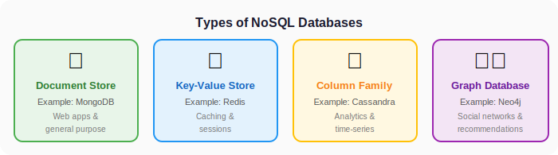

### 2.2 SQL vs NoSQL

Let's compare with a real example. Suppose we're storing user data:

**In SQL (MySQL/PostgreSQL):**

| id | name | email | age |
|----|------|-------|-----|
| 1 | Amit | amit@mail.com | 25 |
| 2 | Sara | sara@mail.com | 30 |

Every row MUST have the same columns. Want to add a "phone" field? You need to ALTER the entire table.

**In MongoDB (NoSQL):**

```json
{
  "_id": ObjectId("64a7..."),
  "name": "Amit",
  "email": "amit@mail.com",
  "age": 25
}
```

```json
{
  "_id": ObjectId("64a8..."),
  "name": "Sara",
  "email": "sara@mail.com",
  "age": 30,
  "phone": "+91-9876543210"
}
```

Sara has a "phone" field, Amit doesn't. **That's totally fine in MongoDB!** No schema changes needed.

**Quick Question for you:** Can you think of a situation where different users might have different fields? (Hint: Think about social media profiles — some people add their birthday, some don't!)

### Full SQL vs MongoDB Comparison:

| Feature | SQL (MySQL) | MongoDB |
|---------|-------------|---------|
| Data Format | Tables with rows & columns | Collections with documents (JSON) |
| Schema | Fixed (must define columns first) | Flexible (documents can differ) |
| Relationships | JOINs across tables | Embedded documents or references |
| Scaling | Vertical (bigger server) | Horizontal (more servers) |
| Query Language | SQL | MongoDB Query Language (MQL) |
| Primary Key | `id` (auto-increment) | `_id` (ObjectId) |
| Best For | Banking, ERP, strict data | Web apps, real-time, flexible data |

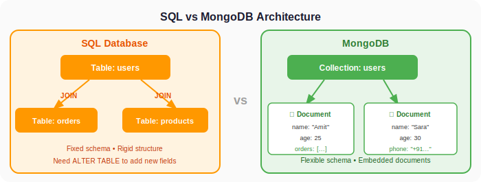

### 2.3 What is MongoDB?

**MongoDB** is an open-source, document-oriented NoSQL database.

- Created in **2009** by MongoDB Inc.
- Name comes from "hu**mongo**us" (meaning very large)
- Stores data as **JSON-like documents** (actually BSON internally)
- Used by companies like: **Uber, eBay, Forbes, Adobe, Google**

**Real-world analogy:**

Think of MongoDB like a **WhatsApp chat**:
- Each **chat** is a **collection** (e.g., "Family Group", "Work Group")
- Each **message** is a **document**
- Messages can have **text, images, videos, links** — they're not all the same shape
- You can search, filter, and scroll through messages easily

### 2.4 JSON and BSON

#### What is JSON?

**JSON** (JavaScript Object Notation) is a way to represent data as key-value pairs.

```json
{
  "name": "Rahul",
  "age": 22,
  "isStudent": true,
  "skills": ["JavaScript", "Python", "MongoDB"],
  "address": {
    "city": "Mumbai",
    "pin": "400001"
  }
}
```

**JSON supports these data types:**

| Type | Example |
|------|---------|
| String | `"hello"` |
| Number | `42`, `3.14` |
| Boolean | `true`, `false` |
| Array | `["a", "b", "c"]` |
| Object | `{"key": "value"}` |
| Null | `null` |

#### What is BSON?

**BSON** = **Binary JSON**

MongoDB stores data in BSON format, not plain JSON. Why?

- BSON is **faster** to read/write (binary format)
- BSON supports **more data types** (Date, ObjectId, Binary, etc.)
- BSON is **smaller** in storage size

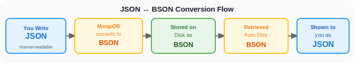

**You don't need to worry about BSON** — MongoDB handles the conversion automatically. You always work with JSON.

### 2.5 Collections and Documents

This is the core structure of MongoDB:

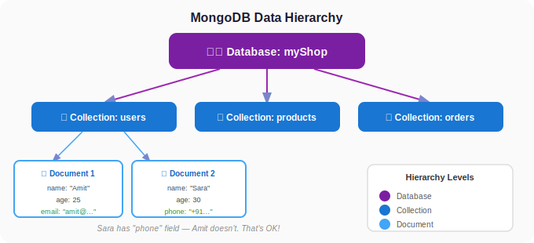

| SQL Term | MongoDB Term |
|----------|--------------|
| Database | Database |
| Table | **Collection** |
| Row | **Document** |
| Column | **Field** |
| Primary Key | **_id** |

**Example — An Amazon-like system:**

**Collection: `users`**
```json
{
  "_id": ObjectId("64a7b1c2d3e4f5a6b7c8d9e0"),
  "name": "Priya Sharma",
  "email": "priya@gmail.com",
  "age": 28,
  "address": {
    "city": "Delhi",
    "state": "Delhi",
    "pin": "110001"
  }
}
```

**Collection: `products`**
```json
{
  "_id": ObjectId("64a7b1c2d3e4f5a6b7c8d9e1"),
  "title": "Wireless Headphones",
  "price": 1999,
  "brand": "boAt",
  "category": "Electronics",
  "ratings": [5, 4, 4, 5, 3]
}
```

**Collection: `orders`**
```json
{
  "_id": ObjectId("64a7b1c2d3e4f5a6b7c8d9e2"),
  "userId": ObjectId("64a7b1c2d3e4f5a6b7c8d9e0"),
  "items": [
    { "productId": ObjectId("64a7b1c2d3e4f5a6b7c8d9e1"), "quantity": 1 }
  ],
  "total": 1999,
  "status": "delivered",
  "orderDate": "2025-01-15"
}
```

**Quick Question:** Looking at the order document above, can you identify which field connects the order to a specific user?

---

## 3. Installing MongoDB

### Option A: Install MongoDB Locally

**Step 1:** Go to [https://www.mongodb.com/try/download/community](https://www.mongodb.com/try/download/community)

**Step 2:** Download the MSI installer (Windows) or pkg (Mac)

**Step 3:** During installation, check "Install MongoDB as a Service"

**Step 4:** Also install **MongoDB Compass** (the GUI tool) — it comes bundled

**Step 5:** Verify installation by opening your terminal:

```bash
mongosh
```

You should see something like:

```
Current Mongosh Log ID: 64a7...
Connecting to: mongodb://127.0.0.1:27017
MongoDB Server version: 7.0.x
```

### Option B: Use MongoDB Atlas (Cloud — Recommended for Beginners)

1. Go to [https://www.mongodb.com/atlas](https://www.mongodb.com/atlas)
2. Create a free account
3. Create a **free cluster** (M0 Sandbox)
4. Get your connection string
5. Connect using `mongosh` or MongoDB Compass

### Option C: Use Docker

```bash
docker run -d --name mongodb -p 27017:27017 mongo:latest
```

Then connect:
```bash
mongosh "mongodb://localhost:27017"
```

---

## 4. Your First MongoDB Commands

Let's write our very first queries! Open `mongosh` in your terminal.

### 4.1 Create / Switch to a Database

```javascript
// Switch to a database (creates it if it doesn't exist)
use myFirstDB
```

**SQL equivalent:**
```sql
CREATE DATABASE myFirstDB;
USE myFirstDB;
```

> In MongoDB, a database is created automatically when you first insert data into it. No need for CREATE DATABASE!

### 4.2 Insert Your First Document

```javascript
// Insert a single document into the "students" collection
db.students.insertOne({
  name: "Amit Kumar",
  age: 21,
  course: "Computer Science",
  skills: ["JavaScript", "Python"],
  isActive: true
})
```

**Output:**
```json
{
  "acknowledged": true,
  "insertedId": ObjectId("64a7b1c2d3e4f5a6b7c8d9e0")
}
```

MongoDB automatically:
- Created the `students` collection (since it didn't exist)
- Added a unique `_id` field

**SQL equivalent:**
```sql
INSERT INTO students (name, age, course, isActive)
VALUES ('Amit Kumar', 21, 'Computer Science', true);
```

Notice: In SQL, you can't easily store an array like `skills`. You'd need a separate table!

### 4.3 Insert Multiple Documents

```javascript
db.students.insertMany([
  {
    name: "Sara Ali",
    age: 22,
    course: "Information Technology",
    skills: ["Java", "SQL"],
    isActive: true
  },
  {
    name: "Rahul Verma",
    age: 20,
    course: "Computer Science",
    skills: ["C++", "JavaScript", "MongoDB"],
    isActive: false
  },
  {
    name: "Priya Singh",
    age: 23,
    course: "Data Science",
    skills: ["Python", "R", "Machine Learning"],
    isActive: true
  }
])
```

### 4.4 Find (Read) Documents

```javascript
// Find ALL documents in the collection
db.students.find()

// Pretty print (easier to read)
db.students.find().pretty()
```

**SQL equivalent:**
```sql
SELECT * FROM students;
```

```javascript
// Find ONE document
db.students.findOne({ name: "Amit Kumar" })
```

**SQL equivalent:**
```sql
SELECT * FROM students WHERE name = 'Amit Kumar' LIMIT 1;
```

```javascript
// Find with a filter
db.students.find({ course: "Computer Science" })
```

**SQL equivalent:**
```sql
SELECT * FROM students WHERE course = 'Computer Science';
```

```javascript
// Find active students
db.students.find({ isActive: true })
```

### 4.5 Count Documents

```javascript
// Count all students
db.students.countDocuments()

// Count with filter
db.students.countDocuments({ isActive: true })
```

### 4.6 Show All Databases and Collections

```javascript
// Show all databases
show dbs

// Show all collections in current database
show collections
```

---

## 5. More Examples with Real-World Data

### Example 1: Social Media Post

```javascript
db.posts.insertOne({
  author: "john_doe",
  content: "Just had the best coffee ever! ☕",
  likes: 42,
  tags: ["coffee", "morning", "vibes"],
  comments: [
    { user: "jane", text: "Where?!" },
    { user: "mike", text: "Same here!" }
  ],
  createdAt: new Date()
})
```

### Example 2: E-commerce Product

```javascript
db.products.insertOne({
  title: "Nike Air Max 270",
  price: 8999,
  category: "Shoes",
  sizes: [7, 8, 9, 10, 11],
  colors: ["Black", "White", "Red"],
  inStock: true,
  reviews: [
    { user: "Amit", rating: 5, comment: "Super comfortable!" },
    { user: "Sara", rating: 4, comment: "Good but pricey" }
  ]
})
```

### Example 3: WhatsApp-like Message

```javascript
db.messages.insertOne({
  from: "+91-9876543210",
  to: "+91-9123456789",
  text: "Hey! Are you coming to the party tonight?",
  type: "text",
  timestamp: new Date(),
  isRead: false,
  deliveredAt: new Date()
})
```

### Example 4: Movie Database Entry

```javascript
db.movies.insertOne({
  title: "Inception",
  director: "Christopher Nolan",
  year: 2010,
  genres: ["Sci-Fi", "Thriller", "Action"],
  rating: 8.8,
  cast: ["Leonardo DiCaprio", "Tom Hardy", "Elliot Page"],
  boxOffice: {
    budget: 160000000,
    worldwide: 836800000
  }
})
```

---

## 6. 💡 Visual Learning

### How MongoDB Stores Data — The Big Picture

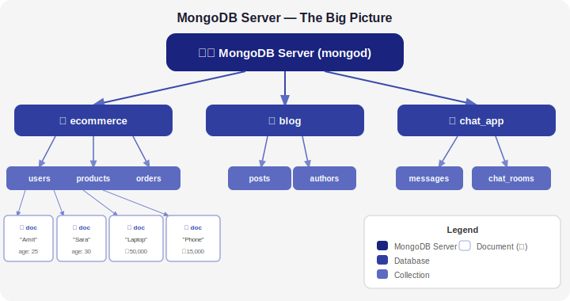

### Document Structure Breakdown

```json
{
  "_id": "auto-generated unique ID",
  "field1": "string value",
  "field2": 42,
  "field3": true,
  "field4": ["array", "of", "values"],
  "field5": {
    "nested": "object",
    "with": "its own fields"
  },
  "field6": null,
  "field7": "2025-01-15T10:30:00Z"
}
```

### SQL Table vs MongoDB Document

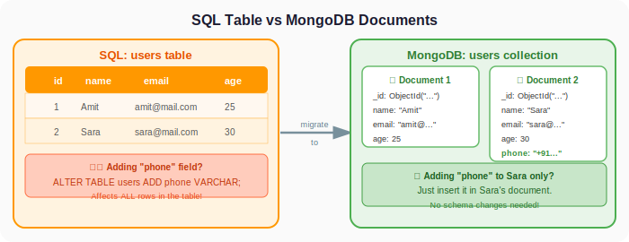

---

## 7. 🧪 Hands-on Practice

Try these queries on your own! Open `mongosh` and practice.

### Setup: Insert Sample Data

```javascript
use practiceDB

db.employees.insertMany([
  { name: "Alice", department: "Engineering", salary: 85000, skills: ["Python", "AWS"], isRemote: true },
  { name: "Bob", department: "Marketing", salary: 55000, skills: ["SEO", "Content"], isRemote: false },
  { name: "Charlie", department: "Engineering", salary: 92000, skills: ["Java", "Docker", "K8s"], isRemote: true },
  { name: "Diana", department: "HR", salary: 60000, skills: ["Recruiting", "Excel"], isRemote: false },
  { name: "Eve", department: "Engineering", salary: 78000, skills: ["JavaScript", "React", "Node"], isRemote: true },
  { name: "Frank", department: "Marketing", salary: 52000, skills: ["Social Media", "Analytics"], isRemote: true },
  { name: "Grace", department: "Engineering", salary: 95000, skills: ["Go", "Rust", "AWS"], isRemote: false }
])
```

### Practice Questions:

**Q1.** Find all employees in the Engineering department.

<details>
<summary>Show Answer</summary>

```javascript
db.employees.find({ department: "Engineering" })
```
</details>

**Q2.** Find all remote employees.

<details>
<summary>Show Answer</summary>

```javascript
db.employees.find({ isRemote: true })
```
</details>

**Q3.** Find the first employee in the Marketing department.

<details>
<summary>Show Answer</summary>

```javascript
db.employees.findOne({ department: "Marketing" })
```
</details>

**Q4.** Count the total number of employees.

<details>
<summary>Show Answer</summary>

```javascript
db.employees.countDocuments()
```
</details>

**Q5.** Count how many employees work in Engineering.

<details>
<summary>Show Answer</summary>

```javascript
db.employees.countDocuments({ department: "Engineering" })
```
</details>

---

## 8. ⚠️ Common Mistakes

### Mistake 1: Forgetting that collection names are case-sensitive

```javascript
// These are TWO DIFFERENT collections!
db.Students.find()   // "Students" collection
db.students.find()   // "students" collection
```

**Fix:** Always use lowercase for collection names.

### Mistake 2: Using SQL syntax in MongoDB

```javascript
// WRONG - this is SQL, not MongoDB!
SELECT * FROM students WHERE age = 21;

// CORRECT - MongoDB syntax
db.students.find({ age: 21 })
```

### Mistake 3: Forgetting curly braces in find()

```javascript
// WRONG
db.students.find(name: "Amit")

// CORRECT
db.students.find({ name: "Amit" })
```

### Mistake 4: Not using `new Date()` for dates

```javascript
// WRONG - this stores a string, not a date
db.events.insertOne({ date: "2025-01-15" })

// CORRECT - this stores a proper Date object
db.events.insertOne({ date: new Date("2025-01-15") })
```

### Mistake 5: Trying to CREATE a database explicitly

```javascript
// WRONG - there's no CREATE DATABASE in MongoDB
CREATE DATABASE mydb;

// CORRECT - just use it, and insert data
use mydb
db.myCollection.insertOne({ hello: "world" })
```

---

## 9. 📝 Mini Assignment

### Build a "Movie Database"

1. Create a database called `movieDB`
2. Create a collection called `movies`
3. Insert **at least 5 movies** with the following fields:
   - `title` (string)
   - `director` (string)
   - `year` (number)
   - `genres` (array of strings)
   - `rating` (number)
   - `cast` (array of strings)
   - `isAvailableOnNetflix` (boolean)
4. Use `find()` to:
   - List all movies
   - Find all movies by a specific director
   - Find all movies available on Netflix
   - Count total movies
5. **Bonus:** Add a movie that has an extra field that other movies don't have (like `sequel: true`). Notice how MongoDB doesn't complain!

---

## 10. 🔁 Recap

Let's summarize what we learned today:

- **NoSQL** databases were created to handle flexible, large-scale data
- **MongoDB** is a document-oriented NoSQL database that stores data as JSON-like documents
- **SQL uses tables** (rigid), **MongoDB uses collections** (flexible)
- **JSON** is the data format you write; **BSON** is how MongoDB stores it internally
- **Database → Collection → Document → Field** is the hierarchy
- `use dbName` — switch/create database
- `db.collection.insertOne({})` — insert one document
- `db.collection.insertMany([{}, {}])` — insert multiple documents
- `db.collection.find({})` — find documents
- `db.collection.findOne({})` — find the first matching document
- `db.collection.countDocuments()` — count documents
- MongoDB **auto-creates** databases and collections when you first insert data
- Every document gets a unique `_id` field automatically

---

# Day 2: CRUD Operations in MongoDB

---


**CRUD = Create, Read, Update, Delete**

Every app you use — Instagram, Amazon, Netflix — runs on CRUD. When you post a photo, that's **Create**. When you scroll your feed, that's **Read**. When you edit your bio, that's **Update**. When you delete a comment, that's **Delete**.

Let's master each one!

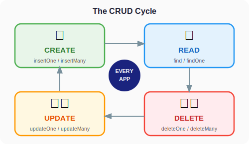

---

## 1. Introduction

### What will we learn today?

- `insertOne()` and `insertMany()` — Creating data
- `find()` and `findOne()` — Reading data
- `updateOne()` and `updateMany()` — Modifying data
- `deleteOne()` and `deleteMany()` — Removing data
- Using filters to target specific documents
- The `$set`, `$unset`, `$inc`, `$push`, and `$pull` update operators

### Why is this important?

CRUD operations are the **foundation** of every backend application. If you're building a REST API (Express.js, FastAPI, Spring Boot), every endpoint maps to one of these operations:

| HTTP Method | CRUD Operation | MongoDB Method |
|-------------|---------------|----------------|
| POST | **C**reate | `insertOne()`, `insertMany()` |
| GET | **R**ead | `find()`, `findOne()` |
| PUT/PATCH | **U**pdate | `updateOne()`, `updateMany()` |
| DELETE | **D**elete | `deleteOne()`, `deleteMany()` |

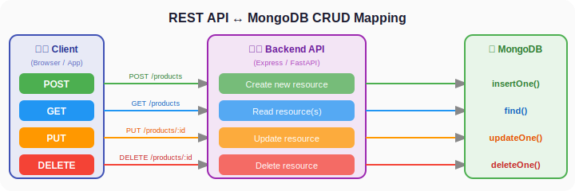

---

## 2. Setup — Our Practice Dataset

Before we start, let's create a fresh database with sample data:

```javascript
use shopDB

db.products.insertMany([
  { name: "iPhone 15", brand: "Apple", price: 79999, category: "Phones", stock: 50, ratings: [5, 4, 5, 5, 4] },
  { name: "Galaxy S24", brand: "Samsung", price: 69999, category: "Phones", stock: 75, ratings: [4, 4, 5, 4] },
  { name: "MacBook Air M3", brand: "Apple", price: 114999, category: "Laptops", stock: 30, ratings: [5, 5, 5, 4, 5] },
  { name: "ThinkPad X1", brand: "Lenovo", price: 89999, category: "Laptops", stock: 20, ratings: [4, 4, 3, 4] },
  { name: "AirPods Pro", brand: "Apple", price: 24999, category: "Audio", stock: 100, ratings: [5, 5, 4, 5, 5] },
  { name: "Sony WH-1000XM5", brand: "Sony", price: 29999, category: "Audio", stock: 45, ratings: [5, 5, 5, 4, 5] },
  { name: "iPad Air", brand: "Apple", price: 59999, category: "Tablets", stock: 40, ratings: [4, 5, 4, 5] },
  { name: "Pixel 8", brand: "Google", price: 52999, category: "Phones", stock: 60, ratings: [4, 4, 5, 4, 4] }
])
```

---

## 3. CREATE — Inserting Documents

### 3.1 insertOne()

Inserts a **single document** into a collection.

```javascript
db.products.insertOne({
  name: "Galaxy Buds3",
  brand: "Samsung",
  price: 14999,
  category: "Audio",
  stock: 80,
  ratings: [4, 4, 5]
})
```

**Result:**
```json
{
  "acknowledged": true,
  "insertedId": ObjectId("64b2c3d4e5f6a7b8c9d0e1f2")
}
```

**SQL Equivalent:**
```sql
INSERT INTO products (name, brand, price, category, stock)
VALUES ('Galaxy Buds3', 'Samsung', 14999, 'Audio', 80);
```

### 3.2 insertMany()

Inserts **multiple documents** at once. Much faster than calling insertOne() multiple times!

```javascript
db.products.insertMany([
  {
    name: "Dell XPS 15",
    brand: "Dell",
    price: 134999,
    category: "Laptops",
    stock: 15,
    ratings: [5, 4, 5]
  },
  {
    name: "OnePlus 12",
    brand: "OnePlus",
    price: 64999,
    category: "Phones",
    stock: 55,
    ratings: [4, 5, 4, 4]
  },
  {
    name: "Kindle Paperwhite",
    brand: "Amazon",
    price: 13999,
    category: "E-Readers",
    stock: 200,
    ratings: [5, 5, 5, 4, 5]
  }
])
```

**Result:**
```json
{
  "acknowledged": true,
  "insertedIds": {
    "0": ObjectId("..."),
    "1": ObjectId("..."),
    "2": ObjectId("...")
  }
}
```

### 3.3 What Happens with _id?

Every document needs a unique `_id`. If you don't provide one, MongoDB generates an **ObjectId** automatically.

But you CAN provide your own:

```javascript
db.products.insertOne({
  _id: "PROD-001",
  name: "Custom ID Product",
  price: 999
})
```

> **Warning:** If you insert a document with an `_id` that already exists, MongoDB will throw a **duplicate key error**!

```javascript
// This will FAIL if PROD-001 already exists
db.products.insertOne({ _id: "PROD-001", name: "Duplicate" })
// Error: E11000 duplicate key error
```

**Quick Question:** Why do you think MongoDB uses ObjectId instead of auto-incrementing numbers like SQL? (Hint: Think about distributed systems with multiple servers!)

---

## 4. READ — Finding Documents

### 4.1 find() — Get Multiple Documents

```javascript
// Find ALL products
db.products.find()

// Find all Apple products
db.products.find({ brand: "Apple" })

// Find all phones
db.products.find({ category: "Phones" })
```

**SQL Equivalent:**
```sql
-- All products
SELECT * FROM products;

-- Apple products
SELECT * FROM products WHERE brand = 'Apple';

-- All phones
SELECT * FROM products WHERE category = 'Phones';
```

### 4.2 findOne() — Get the First Match

```javascript
// Find the first laptop
db.products.findOne({ category: "Laptops" })

// Find the cheapest Apple product (first match, not sorted)
db.products.findOne({ brand: "Apple" })
```

**SQL Equivalent:**
```sql
SELECT * FROM products WHERE category = 'Laptops' LIMIT 1;
```

### 4.3 Filtering with Multiple Conditions

```javascript
// Apple products in the Audio category
db.products.find({ brand: "Apple", category: "Audio" })

// Samsung phones
db.products.find({ brand: "Samsung", category: "Phones" })
```

**SQL Equivalent:**
```sql
SELECT * FROM products WHERE brand = 'Apple' AND category = 'Audio';
```

> When you pass multiple fields in the filter, MongoDB treats them as an **AND** condition by default.

### 4.4 Checking if a Field Exists

```javascript
// Find documents that HAVE a "discount" field
db.products.find({ discount: { $exists: true } })

// Find documents that DON'T have a "discount" field
db.products.find({ discount: { $exists: false } })
```

### 4.5 Finding by Array Values

```javascript
// Products that have a rating of 5 somewhere in their ratings array
db.products.find({ ratings: 5 })

// Products with EXACTLY this ratings array
db.products.find({ ratings: [4, 4, 5] })
```

---

## 5. UPDATE — Modifying Documents

### 5.1 updateOne()

Updates the **first document** that matches the filter.

**Syntax:**
```javascript
db.collection.updateOne(
  { filter },      // WHICH document to update
  { $set: { } }   // WHAT to update
)
```

**Example — Update the price of iPhone 15:**

```javascript
db.products.updateOne(
  { name: "iPhone 15" },
  { $set: { price: 74999 } }
)
```

**Result:**
```json
{
  "acknowledged": true,
  "matchedCount": 1,
  "modifiedCount": 1
}
```

**SQL Equivalent:**
```sql
UPDATE products SET price = 74999 WHERE name = 'iPhone 15';
```

### 5.2 updateMany()

Updates **ALL documents** that match the filter.

**Example — Give all Apple products a 10% discount label:**

```javascript
db.products.updateMany(
  { brand: "Apple" },
  { $set: { onSale: true, discount: "10%" } }
)
```

**SQL Equivalent:**
```sql
UPDATE products SET onSale = true, discount = '10%' WHERE brand = 'Apple';
```

### 5.3 Update Operators

These are the tools you use to modify documents:

#### `$set` — Set a field's value (create it if it doesn't exist)

```javascript
// Add a new field "color" to iPhone 15
db.products.updateOne(
  { name: "iPhone 15" },
  { $set: { color: "Natural Titanium" } }
)
```

#### `$unset` — Remove a field entirely

```javascript
// Remove the "color" field from iPhone 15
db.products.updateOne(
  { name: "iPhone 15" },
  { $unset: { color: "" } }
)
```

**SQL Equivalent:** In SQL, you'd need `ALTER TABLE DROP COLUMN`, which affects ALL rows. In MongoDB, you can remove a field from just ONE document!

#### `$inc` — Increment a numeric value

```javascript
// Decrease stock by 1 (someone bought an iPhone!)
db.products.updateOne(
  { name: "iPhone 15" },
  { $inc: { stock: -1 } }
)

// Increase stock by 100 (new shipment arrived!)
db.products.updateOne(
  { name: "iPhone 15" },
  { $inc: { stock: 100 } }
)
```

**SQL Equivalent:**
```sql
UPDATE products SET stock = stock - 1 WHERE name = 'iPhone 15';
```

**Real-world use:** Think of a "Like" button. Every click runs `$inc: { likes: 1 }`.

#### `$push` — Add an element to an array

```javascript
// Add a new rating to iPhone 15
db.products.updateOne(
  { name: "iPhone 15" },
  { $push: { ratings: 3 } }
)
```

**Think of it like:** Adding a new comment to an Instagram post. The post document has a `comments` array, and `$push` adds the new comment.

#### `$pull` — Remove an element from an array

```javascript
// Remove all ratings of 3 from iPhone 15
db.products.updateOne(
  { name: "iPhone 15" },
  { $pull: { ratings: 3 } }
)
```

#### `$addToSet` — Add to array only if it doesn't already exist

```javascript
// Add "waterproof" tag (only if not already there)
db.products.updateOne(
  { name: "iPhone 15" },
  { $addToSet: { tags: "waterproof" } }
)
```

### Update Operators Summary:

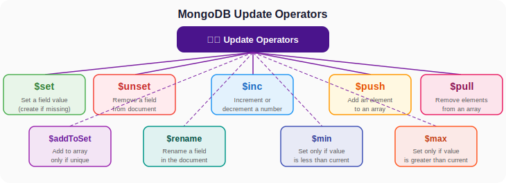

### 5.4 replaceOne() — Replace an Entire Document

Unlike `updateOne()` which modifies specific fields, `replaceOne()` replaces the WHOLE document:

```javascript
db.products.replaceOne(
  { name: "Kindle Paperwhite" },
  {
    name: "Kindle Paperwhite 2025",
    brand: "Amazon",
    price: 15999,
    category: "E-Readers",
    stock: 150,
    features: ["Waterproof", "6.8 inch", "USB-C"]
  }
)
```

> **Warning:** replaceOne() removes ALL existing fields (except `_id`) and replaces them with the new ones. If you forget a field, it's gone!

---

## 6. DELETE — Removing Documents

### 6.1 deleteOne()

Deletes the **first document** that matches the filter.

```javascript
// Delete the Galaxy Buds3
db.products.deleteOne({ name: "Galaxy Buds3" })
```

**Result:**
```json
{
  "acknowledged": true,
  "deletedCount": 1
}
```

**SQL Equivalent:**
```sql
DELETE FROM products WHERE name = 'Galaxy Buds3' LIMIT 1;
```

### 6.2 deleteMany()

Deletes **ALL documents** that match the filter.

```javascript
// Delete all products with stock less than 20
db.products.deleteMany({ stock: { $lt: 20 } })

// Delete all Lenovo products
db.products.deleteMany({ brand: "Lenovo" })
```

**SQL Equivalent:**
```sql
DELETE FROM products WHERE brand = 'Lenovo';
```

### 6.3 Delete ALL Documents (Clear a Collection)

```javascript
// Delete everything in the collection (but keep the collection itself)
db.products.deleteMany({})
```

**SQL Equivalent:**
```sql
DELETE FROM products;
-- or
TRUNCATE TABLE products;
```

### 6.4 Drop a Collection Entirely

```javascript
// Remove the entire collection (structure + data)
db.products.drop()
```

**SQL Equivalent:**
```sql
DROP TABLE products;
```

> **Be careful!** `drop()` is permanent and removes the collection completely.

---

## 7. 💡 Visual Learning

### CRUD Operations Flow

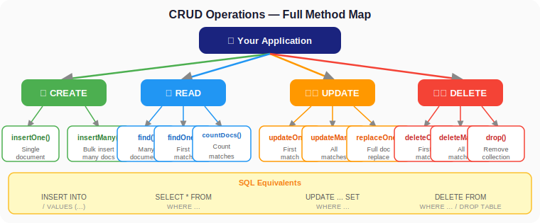

### Update Operators in Action — Before & After

**Before update:**
```json
{
  "_id": ObjectId("..."),
  "name": "iPhone 15",
  "price": 79999,
  "stock": 50,
  "ratings": [5, 4, 5]
}
```

**After running:**
```javascript
db.products.updateOne(
  { name: "iPhone 15" },
  {
    $set: { color: "Blue" },
    $inc: { stock: -1 },
    $push: { ratings: 4 }
  }
)
```

**After update:**
```json
{
  "_id": ObjectId("..."),
  "name": "iPhone 15",
  "price": 79999,
  "stock": 49,
  "ratings": [5, 4, 5, 4],
  "color": "Blue"
}
```

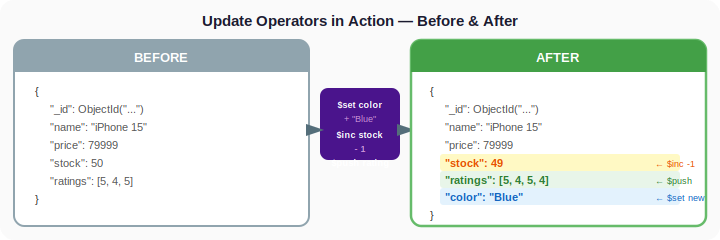

Notice how ONE updateOne() call can use MULTIPLE operators!

### Node.js Example — Full CRUD

Here's how you'd use these in a real Express.js API:

```javascript
const { MongoClient, ObjectId } = require('mongodb');
const express = require('express');
const app = express();
app.use(express.json());

const client = new MongoClient('mongodb://localhost:27017');
const db = client.db('shopDB');
const products = db.collection('products');

// CREATE — Add a product
app.post('/products', async (req, res) => {
  const result = await products.insertOne(req.body);
  res.json({ id: result.insertedId });
});

// READ — Get all products
app.get('/products', async (req, res) => {
  const allProducts = await products.find().toArray();
  res.json(allProducts);
});

// READ — Get one product
app.get('/products/:id', async (req, res) => {
  const product = await products.findOne({ _id: new ObjectId(req.params.id) });
  res.json(product);
});

// UPDATE — Update a product
app.put('/products/:id', async (req, res) => {
  const result = await products.updateOne(
    { _id: new ObjectId(req.params.id) },
    { $set: req.body }
  );
  res.json({ modified: result.modifiedCount });
});

// DELETE — Delete a product
app.delete('/products/:id', async (req, res) => {
  const result = await products.deleteOne({ _id: new ObjectId(req.params.id) });
  res.json({ deleted: result.deletedCount });
});

app.listen(3000, () => console.log('Server running on port 3000'));
```

---

## 8. 🧪 Hands-on Practice

Use the `shopDB` dataset from the setup section. Try these on your own!

**Q1.** Insert a new product: "Google Pixel Watch 3", brand "Google", price 32999, category "Wearables", stock 70.

<details>
<summary>Show Answer</summary>

```javascript
db.products.insertOne({
  name: "Google Pixel Watch 3",
  brand: "Google",
  price: 32999,
  category: "Wearables",
  stock: 70,
  ratings: []
})
```
</details>

**Q2.** Find all products in the "Audio" category.

<details>
<summary>Show Answer</summary>

```javascript
db.products.find({ category: "Audio" })
```
</details>

**Q3.** Update the price of "Galaxy S24" to 64999.

<details>
<summary>Show Answer</summary>

```javascript
db.products.updateOne(
  { name: "Galaxy S24" },
  { $set: { price: 64999 } }
)
```
</details>

**Q4.** Add a new rating of 5 to "MacBook Air M3".

<details>
<summary>Show Answer</summary>

```javascript
db.products.updateOne(
  { name: "MacBook Air M3" },
  { $push: { ratings: 5 } }
)
```
</details>

**Q5.** Decrease the stock of "AirPods Pro" by 5.

<details>
<summary>Show Answer</summary>

```javascript
db.products.updateOne(
  { name: "AirPods Pro" },
  { $inc: { stock: -5 } }
)
```
</details>

**Q6.** Add a field `freeDelivery: true` to all products priced above 50000.

<details>
<summary>Show Answer</summary>

```javascript
db.products.updateMany(
  { price: { $gt: 50000 } },
  { $set: { freeDelivery: true } }
)
```
</details>

**Q7.** Delete the product "Kindle Paperwhite".

<details>
<summary>Show Answer</summary>

```javascript
db.products.deleteOne({ name: "Kindle Paperwhite" })
```
</details>

**Q8.** Find the first Google product.

<details>
<summary>Show Answer</summary>

```javascript
db.products.findOne({ brand: "Google" })
```
</details>

---

## 9. ⚠️ Common Mistakes

### Mistake 1: Forgetting `$set` in updates

```javascript
// WRONG — This REPLACES the entire document!
db.products.updateOne(
  { name: "iPhone 15" },
  { price: 74999 }
)
// Now the document ONLY has { _id: ..., price: 74999 } — name, brand, etc. are GONE!

// CORRECT — Use $set to update specific fields
db.products.updateOne(
  { name: "iPhone 15" },
  { $set: { price: 74999 } }
)
```

> This is the **#1 beginner mistake** in MongoDB. Always use `$set`!

### Mistake 2: Using updateOne() when you need updateMany()

```javascript
// This only updates the FIRST Apple product it finds
db.products.updateOne(
  { brand: "Apple" },
  { $set: { onSale: true } }
)

// This updates ALL Apple products
db.products.updateMany(
  { brand: "Apple" },
  { $set: { onSale: true } }
)
```

### Mistake 3: deleteMany({}) deletes EVERYTHING

```javascript
// This deletes ALL documents — be very careful!
db.products.deleteMany({})

// Probably what you meant:
db.products.deleteMany({ stock: 0 })
```

### Mistake 4: Not checking the result

```javascript
const result = db.products.updateOne(
  { name: "NonExistent Product" },
  { $set: { price: 999 } }
)
// result.matchedCount === 0 — nothing was updated!
// Always check matchedCount and modifiedCount
```

### Mistake 5: Using $push when $addToSet is better

```javascript
// $push adds duplicates
db.products.updateOne({ name: "iPhone 15" }, { $push: { tags: "premium" } })
db.products.updateOne({ name: "iPhone 15" }, { $push: { tags: "premium" } })
// tags: ["premium", "premium"] — duplicate!

// $addToSet prevents duplicates
db.products.updateOne({ name: "iPhone 15" }, { $addToSet: { tags: "premium" } })
db.products.updateOne({ name: "iPhone 15" }, { $addToSet: { tags: "premium" } })
// tags: ["premium"] — no duplicate!
```

---

## 10. 📝 Mini Assignment

### Build a "Student Management System"

1. Create a database called `universityDB`
2. Create a `students` collection
3. Insert **8 students** with these fields:
   - `name`, `rollNumber`, `department`, `year` (1-4), `gpa`, `courses` (array), `isActive` (boolean)
4. Perform the following operations:
   - Find all students in "Computer Science" department
   - Update the GPA of a specific student
   - Add a new course to a student's courses array
   - Increment the year of ALL active students by 1 (they passed!)
   - Delete all students who are not active
   - Add a `scholarship: true` field to students with GPA above 3.5
5. **Verify** each operation by running `find()` after it

---

## 11. 🔁 Recap

Here's everything we covered today:

- **Create:** `insertOne()` for single documents, `insertMany()` for bulk inserts
- **Read:** `find()` returns multiple documents, `findOne()` returns the first match
- **Update:** `updateOne()` modifies the first match, `updateMany()` modifies all matches
- **Delete:** `deleteOne()` removes the first match, `deleteMany()` removes all matches
- **Update Operators:**
  - `$set` — set a field value
  - `$unset` — remove a field
  - `$inc` — increment a number
  - `$push` — add to an array
  - `$pull` — remove from an array
  - `$addToSet` — add unique value to array
- Always use `$set` with `updateOne/updateMany` to avoid accidentally replacing documents
- `replaceOne()` replaces the entire document
- `drop()` removes a collection permanently
- In a real Node.js app, these map directly to REST API endpoints

---

### What's Coming Next?

**Day 3: Query Operators** — We'll learn powerful filtering with comparison operators ($gt, $lt, $in), logical operators ($and, $or), projections, sorting, and limiting results. Get ready to write pro-level queries! 🚀

---
