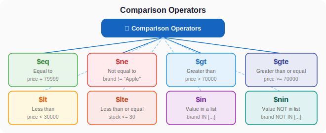
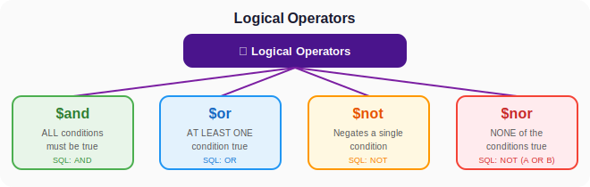
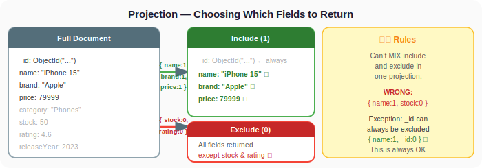
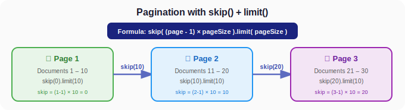
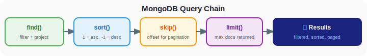
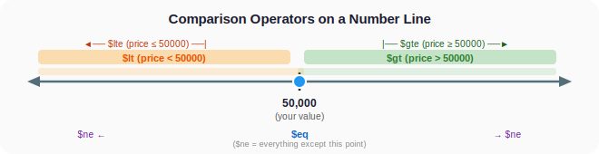
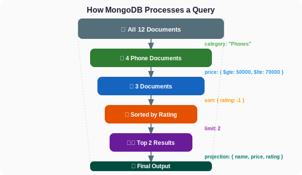

# Day 2: Query Operators, Projection, Sorting & Limiting

## 1. Introduction

### What will we learn today?

- **Comparison Operators:** `$eq`, `$ne`, `$gt`, `$gte`, `$lt`, `$lte`, `$in`, `$nin`
- **Logical Operators:** `$and`, `$or`, `$not`, `$nor`
- **Element Operators:** `$exists`, `$type`
- **Projection:** Choosing which fields to return
- **Sorting:** Ordering results
- **Limit & Skip:** Pagination

### Why is this important?

In real apps, you almost NEVER want "all documents." You want:
- Products under ₹10,000
- Users who signed up in the last 7 days
- Orders that are "pending" OR "processing"
- Only the name and email fields (not the entire document)
- Results sorted by newest first, 10 per page

This is what query operators give you — **precision and power**.

---

## 2. Setup — Our Practice Dataset

```javascript
use queryPracticeDB

db.products.insertMany([
  { name: "iPhone 15", brand: "Apple", price: 79999, category: "Phones", stock: 50, rating: 4.6, releaseYear: 2023 },
  { name: "Galaxy S24", brand: "Samsung", price: 69999, category: "Phones", stock: 75, rating: 4.4, releaseYear: 2024 },
  { name: "Pixel 8", brand: "Google", price: 52999, category: "Phones", stock: 60, rating: 4.5, releaseYear: 2023 },
  { name: "OnePlus 12", brand: "OnePlus", price: 64999, category: "Phones", stock: 55, rating: 4.3, releaseYear: 2024 },
  { name: "MacBook Air M3", brand: "Apple", price: 114999, category: "Laptops", stock: 30, rating: 4.8, releaseYear: 2024 },
  { name: "ThinkPad X1", brand: "Lenovo", price: 89999, category: "Laptops", stock: 20, rating: 4.2, releaseYear: 2023 },
  { name: "Dell XPS 15", brand: "Dell", price: 134999, category: "Laptops", stock: 15, rating: 4.7, releaseYear: 2024 },
  { name: "AirPods Pro", brand: "Apple", price: 24999, category: "Audio", stock: 100, rating: 4.7, releaseYear: 2023 },
  { name: "Sony WH-1000XM5", brand: "Sony", price: 29999, category: "Audio", stock: 45, rating: 4.8, releaseYear: 2023 },
  { name: "iPad Air", brand: "Apple", price: 59999, category: "Tablets", stock: 40, rating: 4.5, releaseYear: 2024 },
  { name: "Galaxy Tab S9", brand: "Samsung", price: 74999, category: "Tablets", stock: 35, rating: 4.3, releaseYear: 2023 },
  { name: "Kindle Paperwhite", brand: "Amazon", price: 13999, category: "E-Readers", stock: 200, rating: 4.6, releaseYear: 2023 }
])
```

---

## 3. Comparison Operators

These operators compare field values against the value you specify.

### Overview

| Operator | Meaning | SQL Equivalent |
|----------|---------|----------------|
| `$eq` | Equal to | `=` |
| `$ne` | Not equal to | `!=` or `<>` |
| `$gt` | Greater than | `>` |
| `$gte` | Greater than or equal | `>=` |
| `$lt` | Less than | `<` |
| `$lte` | Less than or equal | `<=` |
| `$in` | Value is in array | `IN (...)` |
| `$nin` | Value is NOT in array | `NOT IN (...)` |



### 3.1 `$eq` — Equal To

```javascript
// Find products with price exactly 79999
db.products.find({ price: { $eq: 79999 } })

// Shorthand (same thing!)
db.products.find({ price: 79999 })
```

**SQL Equivalent:**
```sql
SELECT * FROM products WHERE price = 79999;
```

### 3.2 `$ne` — Not Equal To

```javascript
// Find all products that are NOT Apple
db.products.find({ brand: { $ne: "Apple" } })
```

**SQL Equivalent:**
```sql
SELECT * FROM products WHERE brand != 'Apple';
```

### 3.3 `$gt` and `$gte` — Greater Than

```javascript
// Products priced ABOVE 70000
db.products.find({ price: { $gt: 70000 } })

// Products priced 70000 or above
db.products.find({ price: { $gte: 70000 } })
```

**SQL Equivalent:**
```sql
SELECT * FROM products WHERE price > 70000;
SELECT * FROM products WHERE price >= 70000;
```

**Real-world analogy:** On Amazon, when you set a minimum price filter, that's `$gte`!

### 3.4 `$lt` and `$lte` — Less Than

```javascript
// Products priced below 30000 (budget-friendly!)
db.products.find({ price: { $lt: 30000 } })

// Products with stock 30 or less (low stock alert!)
db.products.find({ stock: { $lte: 30 } })
```

**SQL Equivalent:**
```sql
SELECT * FROM products WHERE price < 30000;
SELECT * FROM products WHERE stock <= 30;
```

### 3.5 Combining $gt and $lt — Range Queries

```javascript
// Products priced between 50000 and 80000
db.products.find({
  price: { $gte: 50000, $lte: 80000 }
})
```

**SQL Equivalent:**
```sql
SELECT * FROM products WHERE price BETWEEN 50000 AND 80000;
```

**Real-world analogy:** This is exactly how price range sliders work on e-commerce sites!

```json
// These are the products you'd get:
{ "name": "iPhone 15", "price": 79999 }
{ "name": "Galaxy S24", "price": 69999 }
{ "name": "Pixel 8", "price": 52999 }
{ "name": "OnePlus 12", "price": 64999 }
{ "name": "iPad Air", "price": 59999 }
{ "name": "Galaxy Tab S9", "price": 74999 }
```

### 3.6 `$in` — Value In a List

```javascript
// Find products by Apple, Samsung, or Google
db.products.find({ brand: { $in: ["Apple", "Samsung", "Google"] } })

// Find products in Phones or Tablets category
db.products.find({ category: { $in: ["Phones", "Tablets"] } })
```

**SQL Equivalent:**
```sql
SELECT * FROM products WHERE brand IN ('Apple', 'Samsung', 'Google');
```

**Real-world analogy:** When you check multiple checkboxes on a filter (Brand: ✅ Apple ✅ Samsung ✅ Google), that's `$in`!

### 3.7 `$nin` — Value NOT In a List

```javascript
// Products that are NOT phones or laptops
db.products.find({ category: { $nin: ["Phones", "Laptops"] } })
```

**SQL Equivalent:**
```sql
SELECT * FROM products WHERE category NOT IN ('Phones', 'Laptops');
```

---

## 4. Logical Operators

Combine multiple conditions together.

| Operator | Meaning | SQL Equivalent |
|----------|---------|----------------|
| `$and` | All conditions must be true | `AND` |
| `$or` | At least one condition must be true | `OR` |
| `$not` | Negates a condition | `NOT` |
| `$nor` | None of the conditions must be true | `NOT (... OR ...)` |



### 4.1 `$and` — All Conditions Must Be True

```javascript
// Apple products that cost less than 60000
db.products.find({
  $and: [
    { brand: "Apple" },
    { price: { $lt: 60000 } }
  ]
})
```

**Shorthand (when fields are different):**
```javascript
// This is the same thing — MongoDB implicitly ANDs multiple fields
db.products.find({
  brand: "Apple",
  price: { $lt: 60000 }
})
```

**But you NEED explicit $and when querying the same field twice:**
```javascript
// Products priced between 30000 and 70000
db.products.find({
  $and: [
    { price: { $gte: 30000 } },
    { price: { $lte: 70000 } }
  ]
})

// Or the simpler way (for the same field):
db.products.find({
  price: { $gte: 30000, $lte: 70000 }
})
```

**SQL Equivalent:**
```sql
SELECT * FROM products WHERE brand = 'Apple' AND price < 60000;
```

### 4.2 `$or` — At Least One Condition Must Be True

```javascript
// Products that are either Apple OR priced under 20000
db.products.find({
  $or: [
    { brand: "Apple" },
    { price: { $lt: 20000 } }
  ]
})
```

**SQL Equivalent:**
```sql
SELECT * FROM products WHERE brand = 'Apple' OR price < 20000;
```

**Real-world example — Search filter:**
```javascript
// Show products that match a search: in name OR brand OR category
// (We'll learn $regex later, but here's a preview)
db.products.find({
  $or: [
    { name: { $regex: "air", $options: "i" } },
    { brand: { $regex: "air", $options: "i" } },
    { category: { $regex: "air", $options: "i" } }
  ]
})
// Returns: MacBook Air M3, AirPods Pro, iPad Air
```

### 4.3 `$not` — Negate a Condition

```javascript
// Products where rating is NOT greater than 4.5
// (i.e., rating is 4.5 or below)
db.products.find({
  rating: { $not: { $gt: 4.5 } }
})
```

### 4.4 `$nor` — None of the Conditions Are True

```javascript
// Products that are NOT Apple AND NOT in Phones category
db.products.find({
  $nor: [
    { brand: "Apple" },
    { category: "Phones" }
  ]
})
```

### 4.5 Combining Logical Operators

```javascript
// Complex query: (Apple OR Samsung) AND (price < 80000) AND (rating >= 4.4)
db.products.find({
  $and: [
    { $or: [{ brand: "Apple" }, { brand: "Samsung" }] },
    { price: { $lt: 80000 } },
    { rating: { $gte: 4.4 } }
  ]
})
```

**SQL Equivalent:**
```sql
SELECT * FROM products
WHERE (brand = 'Apple' OR brand = 'Samsung')
  AND price < 80000
  AND rating >= 4.4;
```

**Quick Question:** Can you think of a real-world scenario where you'd combine $and and $or? (Hint: filtering products on Flipkart by brand + price range!)

---

## 5. Element Operators

### 5.1 `$exists` — Check If a Field Exists

```javascript
// Find products that have a "discount" field
db.products.find({ discount: { $exists: true } })

// Find products that DON'T have a "discount" field
db.products.find({ discount: { $exists: false } })
```

This is useful because MongoDB documents are flexible — not every document has the same fields!

### 5.2 `$type` — Check the Data Type of a Field

```javascript
// Find products where price is a number
db.products.find({ price: { $type: "number" } })

// Find products where name is a string
db.products.find({ name: { $type: "string" } })
```

**Supported types:** `"string"`, `"number"`, `"bool"`, `"array"`, `"object"`, `"null"`, `"date"`, `"objectId"`, etc.

---

## 6. Projection — Choosing Which Fields to Return

By default, `find()` returns ALL fields. Projection lets you pick only the fields you need.

**Syntax:**
```javascript
db.collection.find({ filter }, { field1: 1, field2: 1 })
```

- `1` means **include** this field
- `0` means **exclude** this field
- `_id` is included by default (you must explicitly exclude it with `_id: 0`)

### Examples

```javascript
// Only return name and price (and _id by default)
db.products.find({}, { name: 1, price: 1 })
```

**Result:**
```json
[
  { "_id": ObjectId("..."), "name": "iPhone 15", "price": 79999 },
  { "_id": ObjectId("..."), "name": "Galaxy S24", "price": 69999 },
  ...
]
```

```javascript
// Return name and price, but exclude _id
db.products.find({}, { name: 1, price: 1, _id: 0 })
```

**Result:**
```json
[
  { "name": "iPhone 15", "price": 79999 },
  { "name": "Galaxy S24", "price": 69999 },
  ...
]
```

```javascript
// Return everything EXCEPT ratings
db.products.find({}, { ratings: 0 })
```

**SQL Equivalent:**
```sql
-- Projection (include)
SELECT name, price FROM products;

-- Projection (exclude)
SELECT id, name, brand, price, category, stock FROM products;
-- (SQL doesn't have "exclude" — you list what you want)
```

### Projection with Filters

```javascript
// Apple products — only show name and price
db.products.find(
  { brand: "Apple" },
  { name: 1, price: 1, _id: 0 }
)
```

**Result:**
```json
[
  { "name": "iPhone 15", "price": 79999 },
  { "name": "MacBook Air M3", "price": 114999 },
  { "name": "AirPods Pro", "price": 24999 },
  { "name": "iPad Air", "price": 59999 }
]
```



> **Important rule:** You can't mix include (1) and exclude (0) in the same projection — EXCEPT for `_id`. Either include the fields you want, or exclude the ones you don't.

```javascript
// WRONG — can't mix include and exclude
db.products.find({}, { name: 1, stock: 0 })  // ERROR!

// CORRECT — include what you want
db.products.find({}, { name: 1, price: 1, brand: 1 })

// CORRECT — exclude what you don't want
db.products.find({}, { stock: 0, ratings: 0 })
```

---

## 7. Sorting Results

### 7.1 sort()

```javascript
// Sort by price — ascending (low to high)
db.products.find().sort({ price: 1 })

// Sort by price — descending (high to low)
db.products.find().sort({ price: -1 })

// Sort by rating descending, then by price ascending
db.products.find().sort({ rating: -1, price: 1 })
```

**SQL Equivalent:**
```sql
SELECT * FROM products ORDER BY price ASC;
SELECT * FROM products ORDER BY price DESC;
SELECT * FROM products ORDER BY rating DESC, price ASC;
```

### 7.2 Sorting with Filters and Projection

```javascript
// Top-rated phones, showing only name and rating
db.products
  .find(
    { category: "Phones" },
    { name: 1, rating: 1, _id: 0 }
  )
  .sort({ rating: -1 })
```

**Result:**
```json
[
  { "name": "iPhone 15", "rating": 4.6 },
  { "name": "Pixel 8", "rating": 4.5 },
  { "name": "Galaxy S24", "rating": 4.4 },
  { "name": "OnePlus 12", "rating": 4.3 }
]
```

---

## 8. Limit & Skip — Pagination

### 8.1 limit()

```javascript
// Get only the top 3 most expensive products
db.products.find().sort({ price: -1 }).limit(3)
```

**SQL Equivalent:**
```sql
SELECT * FROM products ORDER BY price DESC LIMIT 3;
```

### 8.2 skip()

```javascript
// Skip the first 5 products and get the next 5
db.products.find().skip(5).limit(5)
```

**SQL Equivalent:**
```sql
SELECT * FROM products LIMIT 5 OFFSET 5;
```

### 8.3 Real-World Pagination

Imagine building an API with 10 products per page:

```javascript
// Page 1 (products 1-10)
db.products.find().sort({ _id: 1 }).skip(0).limit(10)

// Page 2 (products 11-20)
db.products.find().sort({ _id: 1 }).skip(10).limit(10)

// Page 3 (products 21-30)
db.products.find().sort({ _id: 1 }).skip(20).limit(10)

// General formula:
// Page N → skip((N - 1) * pageSize).limit(pageSize)
```



### Node.js Pagination Example

```javascript
app.get('/products', async (req, res) => {
  const page = parseInt(req.query.page) || 1;
  const pageSize = parseInt(req.query.limit) || 10;
  const skip = (page - 1) * pageSize;

  const products = await db.collection('products')
    .find()
    .sort({ createdAt: -1 })
    .skip(skip)
    .limit(pageSize)
    .toArray();

  const total = await db.collection('products').countDocuments();

  res.json({
    data: products,
    page,
    totalPages: Math.ceil(total / pageSize),
    totalProducts: total
  });
});
```

---

## 9. Chaining It All Together

MongoDB allows you to chain `find()`, `sort()`, `limit()`, `skip()`, and projection — building powerful queries step by step.

```javascript
// Top 5 cheapest phones with rating >= 4.4
// Show only name, price, and rating
db.products
  .find(
    {
      category: "Phones",
      rating: { $gte: 4.4 }
    },
    {
      name: 1,
      price: 1,
      rating: 1,
      _id: 0
    }
  )
  .sort({ price: 1 })
  .limit(5)
```

**SQL Equivalent:**
```sql
SELECT name, price, rating
FROM products
WHERE category = 'Phones' AND rating >= 4.4
ORDER BY price ASC
LIMIT 5;
```



---

## 10. 💡 Visual Learning

### Comparison Operators on a Number Line



### Filter Flow — How MongoDB Processes a Query



---

## 11. 🧪 Hands-on Practice

**Q1.** Find all products with a rating greater than 4.5.

<details>
<summary>Show Answer</summary>

```javascript
db.products.find({ rating: { $gt: 4.5 } })
```
</details>

**Q2.** Find all products priced between ₹25,000 and ₹75,000 (inclusive).

<details>
<summary>Show Answer</summary>

```javascript
db.products.find({ price: { $gte: 25000, $lte: 75000 } })
```
</details>

**Q3.** Find all products from Apple or Sony.

<details>
<summary>Show Answer</summary>

```javascript
db.products.find({ brand: { $in: ["Apple", "Sony"] } })
```
</details>

**Q4.** Find products that are Phones AND priced below ₹60,000.

<details>
<summary>Show Answer</summary>

```javascript
db.products.find({ category: "Phones", price: { $lt: 60000 } })
```
</details>

**Q5.** Find products that are either in "Audio" category OR have a rating >= 4.7.

<details>
<summary>Show Answer</summary>

```javascript
db.products.find({
  $or: [
    { category: "Audio" },
    { rating: { $gte: 4.7 } }
  ]
})
```
</details>

**Q6.** Get the top 3 most expensive products. Show only name, brand, and price.

<details>
<summary>Show Answer</summary>

```javascript
db.products
  .find({}, { name: 1, brand: 1, price: 1, _id: 0 })
  .sort({ price: -1 })
  .limit(3)
```
</details>

**Q7.** Implement page 2 of products with 4 items per page, sorted by name alphabetically.

<details>
<summary>Show Answer</summary>

```javascript
db.products
  .find()
  .sort({ name: 1 })
  .skip(4)
  .limit(4)
```
</details>

**Q8.** Find all 2024 products that are NOT in the "Phones" category.

<details>
<summary>Show Answer</summary>

```javascript
db.products.find({
  releaseYear: 2024,
  category: { $ne: "Phones" }
})
```
</details>

---

## 12. ⚠️ Common Mistakes

### Mistake 1: Mixing include and exclude in projection

```javascript
// WRONG — can't include some and exclude others
db.products.find({}, { name: 1, stock: 0 })

// CORRECT options:
db.products.find({}, { name: 1, price: 1, brand: 1 })  // include
db.products.find({}, { stock: 0 })                       // exclude
```

### Mistake 2: Forgetting the `$` in operators

```javascript
// WRONG
db.products.find({ price: { gt: 50000 } })  // 'gt' is not an operator!

// CORRECT
db.products.find({ price: { $gt: 50000 } })  // Note the $
```

### Mistake 3: Using $or when implicit AND works

```javascript
// Unnecessarily complex:
db.products.find({
  $and: [
    { brand: "Apple" },
    { category: "Phones" }
  ]
})

// Simpler (implicit AND):
db.products.find({ brand: "Apple", category: "Phones" })
```

### Mistake 4: Sorting with wrong values

```javascript
// WRONG — sort values must be 1 or -1
db.products.find().sort({ price: "ascending" })

// CORRECT
db.products.find().sort({ price: 1 })   // ascending
db.products.find().sort({ price: -1 })  // descending
```

### Mistake 5: Using large skip values for pagination

```javascript
// Works but SLOW for large datasets (MongoDB has to scan all skipped docs)
db.products.find().skip(1000000).limit(10)

// Better approach for large datasets: use range queries
// (Store the last document's _id and use $gt)
db.products.find({ _id: { $gt: lastSeenId } }).limit(10)
```

---

## 13. 📝 Mini Assignment

### Build an "Employee Dashboard Query System"

Setup data:
```javascript
use employeeDashboard

db.employees.insertMany([
  { name: "Aarav", department: "Engineering", salary: 95000, experience: 5, skills: ["Python", "AWS", "Docker"], city: "Bangalore", isManager: false },
  { name: "Neha", department: "Engineering", salary: 120000, experience: 8, skills: ["Java", "Spring", "K8s"], city: "Hyderabad", isManager: true },
  { name: "Rohan", department: "Marketing", salary: 65000, experience: 3, skills: ["SEO", "Content", "Analytics"], city: "Mumbai", isManager: false },
  { name: "Priya", department: "Engineering", salary: 88000, experience: 4, skills: ["JavaScript", "React", "Node"], city: "Bangalore", isManager: false },
  { name: "Amit", department: "HR", salary: 72000, experience: 6, skills: ["Recruiting", "Excel", "SAP"], city: "Delhi", isManager: true },
  { name: "Sneha", department: "Marketing", salary: 58000, experience: 2, skills: ["Social Media", "Design"], city: "Pune", isManager: false },
  { name: "Vikram", department: "Engineering", salary: 135000, experience: 10, skills: ["Go", "Rust", "AWS", "K8s"], city: "Bangalore", isManager: true },
  { name: "Kavya", department: "Data Science", salary: 110000, experience: 7, skills: ["Python", "ML", "SQL", "Spark"], city: "Hyderabad", isManager: false },
  { name: "Raj", department: "Engineering", salary: 78000, experience: 3, skills: ["C++", "Linux"], city: "Chennai", isManager: false },
  { name: "Divya", department: "Data Science", salary: 98000, experience: 5, skills: ["Python", "R", "Tableau"], city: "Mumbai", isManager: false }
])
```

Write queries for:

1. Find all engineers with salary above ₹90,000
2. Find employees in Bangalore or Hyderabad
3. Find non-managers with experience between 3 and 7 years
4. Find the top 3 highest-paid employees (show only name, department, salary)
5. Find all employees who are NOT in Engineering or Marketing
6. Page 2 of employees sorted by salary descending (3 per page)
7. Find managers who earn more than ₹100,000
8. Find employees in Engineering who are in Bangalore

---

## 14. 🔁 Recap

- **Comparison Operators:** `$eq`, `$ne`, `$gt`, `$gte`, `$lt`, `$lte`, `$in`, `$nin`
- **Logical Operators:** `$and`, `$or`, `$not`, `$nor`
- **Element Operators:** `$exists`, `$type`
- **Projection:** `{ field: 1 }` to include, `{ field: 0 }` to exclude
- Can't mix include/exclude except for `_id`
- **Sorting:** `.sort({ field: 1 })` for ascending, `.sort({ field: -1 })` for descending
- **Limiting:** `.limit(n)` returns only `n` documents
- **Skipping:** `.skip(n)` skips the first `n` documents
- **Pagination formula:** `skip((page - 1) * pageSize).limit(pageSize)`
- All of these can be **chained**: `find().sort().skip().limit()`
- Implicit AND works when filtering different fields
- Use explicit `$and` when querying the same field twice

---

