# Day 3: Schema Design & Relationships

## 1. Introduction

### What will we learn today?

- Embedded documents vs Referenced documents
- When to embed and when to reference
- One-to-One relationships
- One-to-Many relationships
- Many-to-Many relationships
- Real-world schema design patterns
- Designing schemas for: Users & Orders, Blog System, Social Media

### Why is this important?

**Real-world analogy:** Think of schema design like organizing your house.

- You keep your **toothbrush IN your bathroom** (embedded — it always goes with the bathroom)
- But your **electricity bill is SEPARATE** from your house (referenced — it connects to your house but exists independently)

If you put everything inside one giant room, it's a mess. If you separate everything into 100 tiny rooms, you'll spend all day walking between them. **Good design is about finding the right balance.**

---

## 2. Two Approaches: Embed vs Reference

This is the **most important decision** in MongoDB schema design.

### Approach 1: Embedded Documents (Denormalized)

Store related data **inside** the same document.

```json
{
  "_id": ObjectId("user1"),
  "name": "Amit Sharma",
  "email": "amit@gmail.com",
  "address": {
    "street": "123 MG Road",
    "city": "Mumbai",
    "state": "Maharashtra",
    "pin": "400001"
  }
}
```

The `address` is **embedded** directly inside the user document.

### Approach 2: Referenced Documents (Normalized)

Store related data in **separate collections** and link them with IDs.

**Users collection:**
```json
{
  "_id": ObjectId("user1"),
  "name": "Amit Sharma",
  "email": "amit@gmail.com",
  "addressId": ObjectId("addr1")
}
```

**Addresses collection:**
```json
{
  "_id": ObjectId("addr1"),
  "street": "123 MG Road",
  "city": "Mumbai",
  "state": "Maharashtra",
  "pin": "400001"
}
```

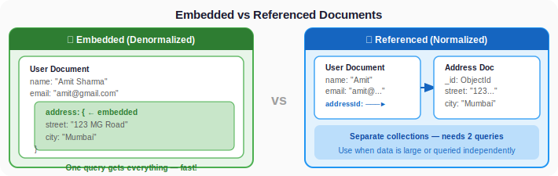

### When to Embed vs When to Reference?

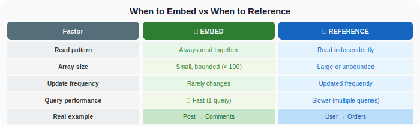

### The Golden Rules

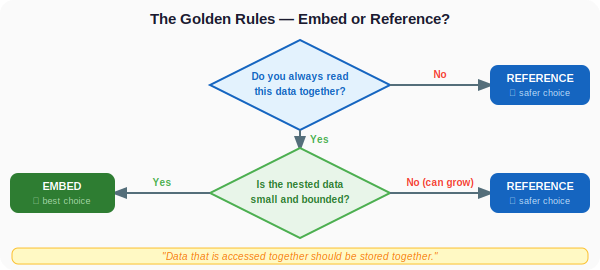

**Rule of thumb:**
> **"Data that is accessed together should be stored together."**

---

## 3. One-to-One Relationships

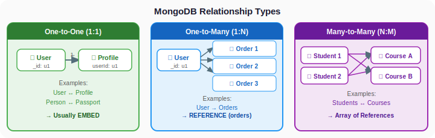

One entity is associated with exactly one other entity.

**Examples:** User ↔ Profile, Person ↔ Passport, Employee ↔ Salary Details

### Approach: Embed (Usually the Best Choice)

```javascript
// User with embedded profile
db.users.insertOne({
  name: "Neha Kapoor",
  email: "neha@gmail.com",
  profile: {
    bio: "Full-stack developer | Coffee lover",
    avatar: "https://example.com/neha.jpg",
    dateOfBirth: new Date("1995-08-15"),
    socialLinks: {
      github: "neha-dev",
      linkedin: "neha-kapoor"
    }
  }
})
```

**Why embed?**
- Profile is always read with the user
- One profile per user (bounded)
- One query gets everything

**SQL comparison — you'd need a JOIN:**
```sql
-- SQL: Two tables + JOIN
SELECT u.*, p.*
FROM users u
JOIN profiles p ON u.id = p.user_id
WHERE u.email = 'neha@gmail.com';
```

**MongoDB: One query, no joins!**
```javascript
db.users.findOne({ email: "neha@gmail.com" })
```

### When to Reference One-to-One

If the related data is large and rarely accessed:

```javascript
// User document (lightweight)
{
  "_id": ObjectId("user1"),
  "name": "Neha Kapoor",
  "email": "neha@gmail.com"
}

// Detailed analytics (heavy, rarely accessed)
{
  "_id": ObjectId("analytics1"),
  "userId": ObjectId("user1"),
  "loginHistory": [/* 1000s of entries */],
  "activityLog": [/* 1000s of entries */],
  "deviceFingerprints": [/* ... */]
}
```

Here we reference because the analytics data is huge and only needed for admin dashboards, not every user request.

---

## 4. One-to-Many Relationships

One entity has multiple related entities.

**Examples:** User → Orders, Blog Post → Comments, Course → Students

This is where it gets interesting! You have **three options**:

### Option 1: Embed (Small, Bounded "Many")

**Use case:** A blog post with comments (assuming limited comments)

```javascript
db.posts.insertOne({
  title: "Getting Started with MongoDB",
  author: "Rahul Verma",
  content: "MongoDB is a NoSQL database that...",
  createdAt: new Date("2025-01-10"),
  tags: ["mongodb", "database", "nosql"],
  comments: [
    {
      user: "Priya",
      text: "Great article!",
      date: new Date("2025-01-11")
    },
    {
      user: "Amit",
      text: "Very helpful, thanks!",
      date: new Date("2025-01-11")
    },
    {
      user: "Sara",
      text: "Can you write about aggregation next?",
      date: new Date("2025-01-12")
    }
  ]
})
```

**Why embed?**
- Comments are always read with the post
- Number of comments is bounded (not millions)
- One query gets the post + all comments

```javascript
// Get a post with all its comments — ONE query!
db.posts.findOne({ title: "Getting Started with MongoDB" })
```

### Option 2: Reference (Large or Unbounded "Many")

**Use case:** A user with thousands of orders

```javascript
// Users collection
db.users.insertOne({
  _id: ObjectId("user1"),
  name: "Amit Sharma",
  email: "amit@gmail.com"
})

// Orders collection — each order references the user
db.orders.insertMany([
  {
    _id: ObjectId("order1"),
    userId: ObjectId("user1"),
    items: [
      { product: "iPhone 15", price: 79999, qty: 1 },
      { product: "AirPods Pro", price: 24999, qty: 1 }
    ],
    total: 104998,
    status: "delivered",
    orderDate: new Date("2025-01-15")
  },
  {
    _id: ObjectId("order2"),
    userId: ObjectId("user1"),
    items: [
      { product: "MacBook Air M3", price: 114999, qty: 1 }
    ],
    total: 114999,
    status: "shipped",
    orderDate: new Date("2025-02-01")
  }
])
```

```javascript
// Get all orders for a user — separate query
db.orders.find({ userId: ObjectId("user1") })
```

**Why reference?**
- A user can have 1000s of orders — embedding would make the user document too large
- Orders are often queried independently (admin dashboard, shipping system)
- MongoDB has a **16MB document size limit** — embedding could hit this

### Option 3: Hybrid (Array of References)

Store an array of IDs in the parent document:

```javascript
// User with order IDs
{
  "_id": ObjectId("user1"),
  "name": "Amit Sharma",
  "orderIds": [ObjectId("order1"), ObjectId("order2"), ObjectId("order3")]
}
```

Then look up the actual orders when needed. This is useful when you need to quickly check IF a user has orders without loading them all.

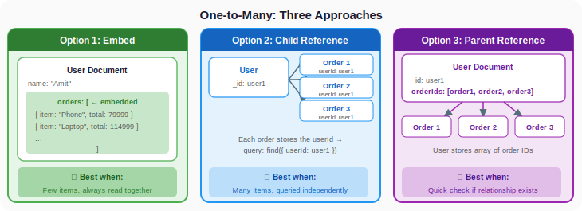

### Comparison Table

| Approach | When to Use | Example |
|----------|------------|---------|
| Embed | Few items, always read together | Post → Comments (10-50) |
| Child Reference | Many items, queried independently | User ← Orders |
| Parent Reference (Array of IDs) | Need quick access to relationship | User → [OrderId1, OrderId2] |

---

## 5. Many-to-Many Relationships

Multiple entities related to multiple other entities.

**Examples:** Students ↔ Courses, Users ↔ Roles, Products ↔ Categories

**In SQL,** you'd create a junction/pivot table:
```sql
-- SQL approach
CREATE TABLE student_courses (
  student_id INT,
  course_id INT,
  enrolled_at DATE,
  PRIMARY KEY (student_id, course_id)
);
```

**In MongoDB,** you have two main approaches:

### Approach 1: Array of References (Most Common)

```javascript
// Students collection
db.students.insertMany([
  {
    _id: ObjectId("s1"),
    name: "Aarav Patel",
    courseIds: [ObjectId("c1"), ObjectId("c2"), ObjectId("c3")]
  },
  {
    _id: ObjectId("s2"),
    name: "Neha Gupta",
    courseIds: [ObjectId("c1"), ObjectId("c3")]
  }
])

// Courses collection
db.courses.insertMany([
  {
    _id: ObjectId("c1"),
    name: "Data Structures",
    instructor: "Prof. Kumar",
    studentIds: [ObjectId("s1"), ObjectId("s2")]
  },
  {
    _id: ObjectId("c2"),
    name: "Web Development",
    instructor: "Prof. Singh",
    studentIds: [ObjectId("s1")]
  },
  {
    _id: ObjectId("c3"),
    name: "Database Systems",
    instructor: "Prof. Sharma",
    studentIds: [ObjectId("s1"), ObjectId("s2")]
  }
])
```

```javascript
// Find all courses for Aarav
const student = db.students.findOne({ name: "Aarav Patel" })
db.courses.find({ _id: { $in: student.courseIds } })

// Find all students in "Data Structures"
const course = db.courses.findOne({ name: "Data Structures" })
db.students.find({ _id: { $in: course.studentIds } })
```

### Approach 2: Embed if One Side is Small

If a user can have only a few roles:

```javascript
{
  "_id": ObjectId("user1"),
  "name": "Admin User",
  "roles": [
    { "name": "admin", "permissions": ["read", "write", "delete"] },
    { "name": "editor", "permissions": ["read", "write"] }
  ]
}
```

---

## 6. Real-World Schema Designs

### 6.1 E-Commerce System (Amazon-like)

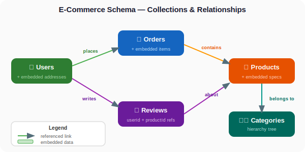

**Users Collection:**
```javascript
{
  _id: ObjectId("u1"),
  name: "Priya Singh",
  email: "priya@gmail.com",
  password: "$2b$10$hashedpassword...",
  phone: "+91-9876543210",
  addresses: [                          // Embedded — bounded (few addresses)
    {
      label: "Home",
      street: "456 Park Street",
      city: "Kolkata",
      state: "West Bengal",
      pin: "700016",
      isDefault: true
    },
    {
      label: "Office",
      street: "789 Salt Lake",
      city: "Kolkata",
      state: "West Bengal",
      pin: "700091",
      isDefault: false
    }
  ],
  createdAt: new Date("2024-06-15")
}
```

**Products Collection:**
```javascript
{
  _id: ObjectId("p1"),
  title: "Sony WH-1000XM5",
  description: "Industry-leading noise canceling headphones...",
  price: 29999,
  originalPrice: 34999,
  discount: 14,
  brand: "Sony",
  category: "Electronics > Audio > Headphones",
  categoryId: ObjectId("cat1"),
  images: [
    "https://cdn.shop.com/sony-xm5-1.jpg",
    "https://cdn.shop.com/sony-xm5-2.jpg"
  ],
  specs: {                               // Embedded — always read with product
    batteryLife: "30 hours",
    weight: "250g",
    connectivity: "Bluetooth 5.2",
    noiseCanceling: true
  },
  stock: 45,
  averageRating: 4.8,
  totalReviews: 1250,
  createdAt: new Date("2024-01-10")
}
```

**Orders Collection:**
```javascript
{
  _id: ObjectId("o1"),
  userId: ObjectId("u1"),                // Referenced — user has many orders
  items: [                               // Embedded — order items belong to this order
    {
      productId: ObjectId("p1"),
      title: "Sony WH-1000XM5",         // Denormalized for fast display
      price: 29999,
      quantity: 1,
      imageUrl: "https://cdn.shop.com/sony-xm5-1.jpg"
    }
  ],
  shippingAddress: {                     // Embedded — snapshot at order time
    street: "456 Park Street",
    city: "Kolkata",
    state: "West Bengal",
    pin: "700016"
  },
  payment: {
    method: "UPI",
    transactionId: "TXN123456",
    status: "completed"
  },
  subtotal: 29999,
  deliveryCharge: 0,
  total: 29999,
  status: "delivered",
  orderedAt: new Date("2025-01-20"),
  deliveredAt: new Date("2025-01-25")
}
```

**Reviews Collection:**
```javascript
{
  _id: ObjectId("r1"),
  productId: ObjectId("p1"),             // Referenced
  userId: ObjectId("u1"),                // Referenced
  userName: "Priya Singh",               // Denormalized for display
  rating: 5,
  title: "Best headphones I've ever owned!",
  text: "The noise canceling is incredible...",
  helpful: 42,
  images: ["https://cdn.shop.com/review-img1.jpg"],
  createdAt: new Date("2025-02-01")
}
```

> **Notice:** We store `title` and `imageUrl` in the order items AND `userName` in reviews. This is **intentional denormalization**. When showing an order, we don't want to query the products collection for each item. A little duplication is fine if it saves expensive lookups!

### 6.2 Blog System

```javascript
// Authors collection (Referenced — one author, many posts)
{
  _id: ObjectId("a1"),
  name: "Rahul Verma",
  bio: "Tech blogger and software engineer",
  avatar: "https://blog.com/rahul.jpg",
  email: "rahul@blog.com",
  socialLinks: {
    twitter: "@rahul_dev",
    github: "rahulverma"
  }
}

// Posts collection
{
  _id: ObjectId("post1"),
  title: "Understanding MongoDB Aggregation",
  slug: "understanding-mongodb-aggregation",
  authorId: ObjectId("a1"),
  authorName: "Rahul Verma",              // Denormalized
  content: "The aggregation framework is one of the most powerful...",
  excerpt: "Learn how to use MongoDB's aggregation pipeline...",
  tags: ["mongodb", "database", "tutorial"],
  category: "Databases",
  coverImage: "https://blog.com/mongo-agg.jpg",
  readTime: 8,
  likes: 156,
  views: 2340,
  comments: [                              // Embedded — bounded per post
    {
      userId: ObjectId("u5"),
      userName: "Sneha Roy",
      text: "This is exactly what I needed!",
      createdAt: new Date("2025-01-12")
    },
    {
      userId: ObjectId("u8"),
      userName: "Dev Patel",
      text: "Can you cover $lookup next?",
      createdAt: new Date("2025-01-13")
    }
  ],
  isPublished: true,
  publishedAt: new Date("2025-01-10"),
  updatedAt: new Date("2025-01-15")
}
```

### 6.3 Social Media (Instagram-like)

```javascript
// Posts collection
{
  _id: ObjectId("post1"),
  userId: ObjectId("u1"),
  username: "priya_travels",
  userAvatar: "https://cdn.app.com/priya.jpg",
  media: [
    { type: "image", url: "https://cdn.app.com/img1.jpg" },
    { type: "image", url: "https://cdn.app.com/img2.jpg" }
  ],
  caption: "Sunset in Goa! 🌅 #travel #goa",
  hashtags: ["travel", "goa", "sunset"],
  location: {
    name: "Baga Beach, Goa",
    coordinates: { lat: 15.5553, lng: 73.7514 }
  },
  likes: 342,
  commentCount: 28,
  isPublic: true,
  createdAt: new Date("2025-01-18")
}

// Followers collection (Many-to-Many)
{
  followerId: ObjectId("u2"),
  followingId: ObjectId("u1"),
  followedAt: new Date("2024-12-01")
}

// Likes collection (separate — can be millions)
{
  postId: ObjectId("post1"),
  userId: ObjectId("u5"),
  createdAt: new Date("2025-01-18")
}
```

---

## 7. 💡 Visual Learning

### SQL vs MongoDB — E-Commerce Schema

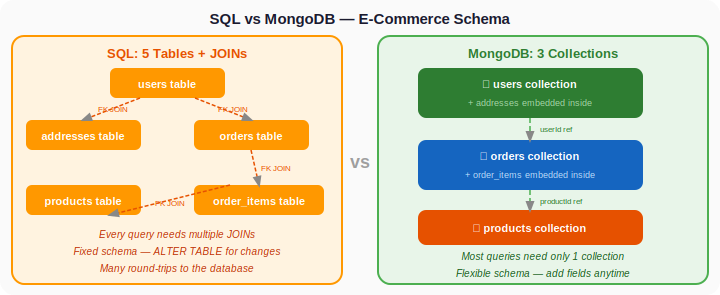

### The Embedding Decision Tree

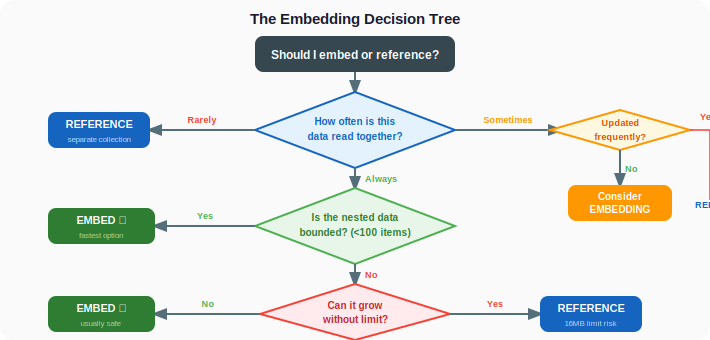

---

## 8. Anti-Patterns — What NOT to Do

### Anti-Pattern 1: Massive Arrays

```javascript
// BAD — A user with 100,000 followers embedded
{
  name: "Celebrity",
  followers: [
    ObjectId("f1"), ObjectId("f2"), // ... 100,000 more
  ]
}
// This document will hit the 16MB limit!

// GOOD — Separate followers collection
// followers collection
{ followerId: ObjectId("f1"), followingId: ObjectId("celebrity") }
{ followerId: ObjectId("f2"), followingId: ObjectId("celebrity") }
```

### Anti-Pattern 2: Deeply Nested Documents

```javascript
// BAD — Too many levels of nesting
{
  company: {
    departments: [{
      teams: [{
        members: [{
          tasks: [{
            subtasks: [{
              comments: [{ /* 6 levels deep! */ }]
            }]
          }]
        }]
      }]
    }]
  }
}

// GOOD — Break into separate collections
// companies, departments, teams, members, tasks
```

### Anti-Pattern 3: Unnecessary Normalization

```javascript
// BAD — Over-referencing (SQL mindset)
// user: { _id, nameId, emailId, addressId, phoneId }
// names: { _id, firstName, lastName }
// emails: { _id, email }
// This is SQL thinking — don't do this in MongoDB!

// GOOD — Embed naturally related data
{
  _id: ObjectId("..."),
  name: "Amit Sharma",
  email: "amit@gmail.com",
  address: { street: "...", city: "..." },
  phone: "+91-9876543210"
}
```

---

## 9. 🧪 Hands-on Practice

**Q1.** Design a schema for a **Music Streaming App** (like Spotify). What would you embed and what would you reference for: Users, Playlists, Songs, Artists?

<details>
<summary>Show Answer</summary>

```javascript
// Artists — standalone collection
{ _id: ObjectId("a1"), name: "Arijit Singh", genre: "Bollywood", followers: 5000000 }

// Songs — references artist
{ _id: ObjectId("s1"), title: "Tum Hi Ho", artistId: ObjectId("a1"), artistName: "Arijit Singh", duration: 254, album: "Aashiqui 2" }

// Users — standalone with embedded preferences
{ _id: ObjectId("u1"), name: "Priya", email: "priya@mail.com",
  preferences: { language: ["Hindi", "English"], genres: ["Pop", "Bollywood"] }  // Embedded — small
}

// Playlists — references songs (array of IDs)
{ _id: ObjectId("pl1"), name: "Chill Vibes", userId: ObjectId("u1"),
  songIds: [ObjectId("s1"), ObjectId("s2"), ObjectId("s3")],  // Referenced — can grow
  isPublic: true, createdAt: new Date() }
```
</details>

**Q2.** Create a user with 2 embedded addresses and insert into a collection.

<details>
<summary>Show Answer</summary>

```javascript
db.users.insertOne({
  name: "Rohan Mehta",
  email: "rohan@gmail.com",
  addresses: [
    { label: "Home", city: "Delhi", pin: "110001" },
    { label: "Work", city: "Gurgaon", pin: "122001" }
  ]
})
```
</details>

**Q3.** Create a blog post with 3 embedded comments.

<details>
<summary>Show Answer</summary>

```javascript
db.posts.insertOne({
  title: "Learning MongoDB",
  author: "Neha",
  content: "MongoDB is a powerful NoSQL database...",
  comments: [
    { user: "Amit", text: "Nice post!", date: new Date() },
    { user: "Sara", text: "Very helpful", date: new Date() },
    { user: "Raj", text: "Waiting for more!", date: new Date() }
  ]
})
```
</details>

**Q4.** Create an order document with 2 items, where items embed product info.

<details>
<summary>Show Answer</summary>

```javascript
db.orders.insertOne({
  userId: ObjectId("u1"),
  items: [
    { productId: ObjectId("p1"), title: "iPhone 15", price: 79999, qty: 1 },
    { productId: ObjectId("p2"), title: "AirPods Pro", price: 24999, qty: 2 }
  ],
  total: 129997,
  status: "processing",
  orderDate: new Date()
})
```
</details>

**Q5.** Query: Find all orders for a specific user.

<details>
<summary>Show Answer</summary>

```javascript
db.orders.find({ userId: ObjectId("u1") })
```
</details>

---

## 10. ⚠️ Common Mistakes

### Mistake 1: Embedding everything (SQL PTSD in reverse)

"I heard MongoDB embeds everything!" — No. Only embed when it makes sense. If an array can grow to thousands of items, reference it.

### Mistake 2: Always referencing (SQL mindset)

"I'll make a separate collection for everything!" — This defeats the purpose of MongoDB. If data is always read together, embed it.

### Mistake 3: Forgetting the 16MB document limit

MongoDB documents have a maximum size of **16MB**. If you're embedding unbounded arrays, you'll hit this limit. Always ask: "Can this array grow forever?"

### Mistake 4: Not denormalizing when you should

```javascript
// Storing only productId in an order
{ items: [{ productId: ObjectId("p1"), qty: 1 }] }
// Now to display the order, you need a SECOND query to get the product name and price!

// Better: denormalize key fields
{ items: [{ productId: ObjectId("p1"), title: "iPhone 15", price: 79999, qty: 1 }] }
```

### Mistake 5: Updating denormalized data inconsistently

If you store `userName` in both the users collection AND the reviews collection, and the user changes their name, you need to update it in BOTH places. Be aware of this trade-off.

---

## 11. 📝 Mini Assignment

### Design a "Food Delivery App" Schema (like Swiggy/Zomato)

Design schemas for:

1. **Restaurants** — name, address, cuisine types, rating, menu items
2. **Users** — name, email, phone, saved addresses
3. **Menu Items** — name, description, price, category, isVeg, isAvailable
4. **Orders** — user, restaurant, items ordered, delivery address, status, payment

For each collection, decide:
- What to embed vs reference
- Write a justification for your choices
- Insert at least 2 sample documents per collection
- Write 3 queries:
  - Find all restaurants that serve "Chinese" cuisine
  - Find all orders for a specific user with status "delivered"
  - Find all veg items from a specific restaurant's menu

---

## 12. 🔁 Recap

- **Embedded documents** = store related data inside the same document
  - Faster reads, simpler queries
  - Use for: small, bounded, always-read-together data
- **Referenced documents** = store in separate collections, link by IDs
  - More flexible, avoids bloated documents
  - Use for: large, unbounded, independently-accessed data
- **One-to-One** → Usually embed
- **One-to-Few** → Embed (comments on a post)
- **One-to-Many** → Reference (user → orders)
- **Many-to-Many** → Array of references (students ↔ courses)
- **Denormalization** is OK in MongoDB — duplicate key display data to avoid extra queries
- **16MB document size limit** — never embed unbounded arrays
- **"Data that is accessed together should be stored together"**
- Think about your app's **read patterns** first, then design your schema

---

# Aggregation Framework

---

## 1. Introduction

### What will we learn today?

- What is aggregation and why do we need it?
- The aggregation pipeline concept
- `$match` — filtering data
- `$group` — grouping and calculating totals/averages
- `$sort` — ordering aggregated results
- `$project` — reshaping output
- `$count` — counting results
- `$limit` and `$skip` — pagination in aggregation
- `$unwind` — flattening arrays
- `$lookup` — joining collections (like SQL JOIN!)
- Real-world analytics examples

### Why is this important?

**Regular `find()` can only:**
- Filter documents
- Choose fields (projection)
- Sort and limit

**Aggregation can:**
- Calculate totals, averages, min, max
- Group data by categories
- Count documents per group
- Transform and reshape data
- Join multiple collections
- Build complex analytics pipelines

**Real-world analogy:** Think of aggregation like an **assembly line in a factory**.

Raw materials (your documents) go in → they pass through different stages (match, group, sort) → a finished product (your analytics report) comes out.

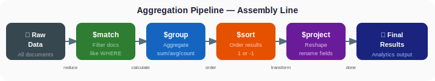

---

## 2. Setup — Our Practice Dataset

Let's create a realistic e-commerce dataset:

```javascript
use analyticsDB

db.orders.insertMany([
  { customer: "Amit", product: "iPhone 15", category: "Phones", amount: 79999, quantity: 1, city: "Mumbai", date: new Date("2025-01-05"), status: "delivered" },
  { customer: "Priya", product: "MacBook Air", category: "Laptops", amount: 114999, quantity: 1, city: "Delhi", date: new Date("2025-01-08"), status: "delivered" },
  { customer: "Rahul", product: "AirPods Pro", category: "Audio", amount: 24999, quantity: 2, city: "Bangalore", date: new Date("2025-01-10"), status: "delivered" },
  { customer: "Sara", product: "Galaxy S24", category: "Phones", amount: 69999, quantity: 1, city: "Mumbai", date: new Date("2025-01-12"), status: "delivered" },
  { customer: "Neha", product: "iPad Air", category: "Tablets", amount: 59999, quantity: 1, city: "Hyderabad", date: new Date("2025-01-15"), status: "shipped" },
  { customer: "Amit", product: "Sony WH-1000XM5", category: "Audio", amount: 29999, quantity: 1, city: "Mumbai", date: new Date("2025-01-18"), status: "delivered" },
  { customer: "Vikram", product: "Dell XPS 15", category: "Laptops", amount: 134999, quantity: 1, city: "Bangalore", date: new Date("2025-01-20"), status: "delivered" },
  { customer: "Priya", product: "AirPods Pro", category: "Audio", amount: 24999, quantity: 1, city: "Delhi", date: new Date("2025-01-22"), status: "delivered" },
  { customer: "Kavya", product: "Pixel 8", category: "Phones", amount: 52999, quantity: 1, city: "Chennai", date: new Date("2025-01-25"), status: "cancelled" },
  { customer: "Rohan", product: "MacBook Air", category: "Laptops", amount: 114999, quantity: 1, city: "Pune", date: new Date("2025-01-28"), status: "shipped" },
  { customer: "Amit", product: "Kindle", category: "E-Readers", amount: 13999, quantity: 1, city: "Mumbai", date: new Date("2025-02-01"), status: "delivered" },
  { customer: "Sara", product: "iPad Air", category: "Tablets", amount: 59999, quantity: 1, city: "Mumbai", date: new Date("2025-02-05"), status: "delivered" },
  { customer: "Divya", product: "Galaxy S24", category: "Phones", amount: 69999, quantity: 2, city: "Hyderabad", date: new Date("2025-02-08"), status: "delivered" },
  { customer: "Neha", product: "iPhone 15", category: "Phones", amount: 79999, quantity: 1, city: "Hyderabad", date: new Date("2025-02-10"), status: "delivered" },
  { customer: "Raj", product: "Sony WH-1000XM5", category: "Audio", amount: 29999, quantity: 1, city: "Delhi", date: new Date("2025-02-12"), status: "processing" }
])
```

---

## 3. The Aggregation Pipeline — Basics

### Syntax

```javascript
db.collection.aggregate([
  { stage1 },
  { stage2 },
  { stage3 },
  // ... more stages
])
```

Each stage takes the output of the previous stage as its input. Like pipes in Unix/Linux!

**SQL comparison:**
```sql
SELECT category, SUM(amount) as total
FROM orders
WHERE status = 'delivered'
GROUP BY category
ORDER BY total DESC;
```

**MongoDB equivalent:**
```javascript
db.orders.aggregate([
  { $match: { status: "delivered" } },        // WHERE
  { $group: {                                  // GROUP BY
      _id: "$category",
      total: { $sum: "$amount" }
  }},
  { $sort: { total: -1 } }                    // ORDER BY
])
```

---

## 4. $match — Filtering

`$match` works exactly like `find()` filters but as a pipeline stage.

```javascript
// Get only delivered orders
db.orders.aggregate([
  { $match: { status: "delivered" } }
])
```

```javascript
// Get orders from Mumbai with amount > 50000
db.orders.aggregate([
  { $match: {
      city: "Mumbai",
      amount: { $gt: 50000 }
  }}
])
```

**SQL Equivalent:**
```sql
SELECT * FROM orders WHERE status = 'delivered';
SELECT * FROM orders WHERE city = 'Mumbai' AND amount > 50000;
```

> **Best Practice:** Always put `$match` as early as possible in the pipeline. It reduces the number of documents for later stages to process, making your query faster!

---

## 5. $group — Grouping and Aggregating

This is the **heart** of the aggregation framework. It groups documents by a key and lets you calculate totals, averages, counts, etc.

### Syntax

```javascript
{
  $group: {
    _id: "$fieldToGroupBy",             // The grouping key
    newField: { $accumulator: "$field" } // The calculation
  }
}
```

### Available Accumulators

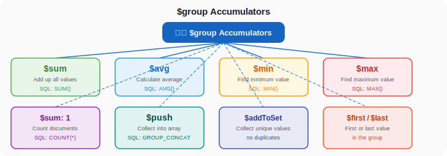

### Example 1: Total Revenue Per Category

```javascript
db.orders.aggregate([
  { $match: { status: "delivered" } },
  { $group: {
      _id: "$category",
      totalRevenue: { $sum: "$amount" },
      orderCount: { $sum: 1 }
  }}
])
```

**Result:**
```json
[
  { "_id": "Phones", "totalRevenue": 299996, "orderCount": 4 },
  { "_id": "Laptops", "totalRevenue": 249998, "orderCount": 2 },
  { "_id": "Audio", "totalRevenue": 79997, "orderCount": 3 },
  { "_id": "Tablets", "totalRevenue": 59999, "orderCount": 1 },
  { "_id": "E-Readers", "totalRevenue": 13999, "orderCount": 1 }
]
```

**SQL Equivalent:**
```sql
SELECT category, SUM(amount) AS totalRevenue, COUNT(*) AS orderCount
FROM orders
WHERE status = 'delivered'
GROUP BY category;
```

### Example 2: Average Order Amount Per City

```javascript
db.orders.aggregate([
  { $group: {
      _id: "$city",
      avgOrderValue: { $avg: "$amount" },
      totalOrders: { $sum: 1 }
  }},
  { $sort: { avgOrderValue: -1 } }
])
```

### Example 3: Total Spending Per Customer

```javascript
db.orders.aggregate([
  { $match: { status: "delivered" } },
  { $group: {
      _id: "$customer",
      totalSpent: { $sum: "$amount" },
      orderCount: { $sum: 1 },
      avgOrderValue: { $avg: "$amount" }
  }},
  { $sort: { totalSpent: -1 } }
])
```

**Result:**
```json
[
  { "_id": "Amit", "totalSpent": 123997, "orderCount": 3, "avgOrderValue": 41332.33 },
  { "_id": "Priya", "totalSpent": 139998, "orderCount": 2, "avgOrderValue": 69999 },
  { "_id": "Sara", "totalSpent": 129998, "orderCount": 2, "avgOrderValue": 64999 },
  ...
]
```

### Example 4: Min and Max Order Per Category

```javascript
db.orders.aggregate([
  { $group: {
      _id: "$category",
      cheapest: { $min: "$amount" },
      mostExpensive: { $max: "$amount" },
      products: { $addToSet: "$product" }
  }}
])
```

### Example 5: Count All Orders by Status

```javascript
db.orders.aggregate([
  { $group: {
      _id: "$status",
      count: { $sum: 1 }
  }}
])
```

**Result:**
```json
[
  { "_id": "delivered", "count": 11 },
  { "_id": "shipped", "count": 2 },
  { "_id": "cancelled", "count": 1 },
  { "_id": "processing", "count": 1 }
]
```

### Example 6: Grand Total (Group All Together)

Use `_id: null` to group ALL documents into one:

```javascript
db.orders.aggregate([
  { $match: { status: "delivered" } },
  { $group: {
      _id: null,
      totalRevenue: { $sum: "$amount" },
      totalOrders: { $sum: 1 },
      avgOrderValue: { $avg: "$amount" }
  }}
])
```

**Result:**
```json
[
  {
    "_id": null,
    "totalRevenue": 703989,
    "totalOrders": 11,
    "avgOrderValue": 63999
  }
]
```

**SQL Equivalent:**
```sql
SELECT SUM(amount) AS totalRevenue, COUNT(*) AS totalOrders, AVG(amount) AS avgOrderValue
FROM orders
WHERE status = 'delivered';
```

---

## 6. $sort — Sorting Aggregated Results

```javascript
// Top categories by revenue (highest first)
db.orders.aggregate([
  { $match: { status: "delivered" } },
  { $group: {
      _id: "$category",
      totalRevenue: { $sum: "$amount" }
  }},
  { $sort: { totalRevenue: -1 } }      // -1 = descending
])
```

```javascript
// Top 3 spending customers
db.orders.aggregate([
  { $match: { status: "delivered" } },
  { $group: {
      _id: "$customer",
      totalSpent: { $sum: "$amount" }
  }},
  { $sort: { totalSpent: -1 } },
  { $limit: 3 }
])
```

---

## 7. $project — Reshaping Output

`$project` lets you rename fields, create new computed fields, and control what's in the output.

```javascript
// Rename _id to "category" and add a formatted revenue string
db.orders.aggregate([
  { $match: { status: "delivered" } },
  { $group: {
      _id: "$category",
      totalRevenue: { $sum: "$amount" },
      orderCount: { $sum: 1 }
  }},
  { $project: {
      _id: 0,
      category: "$_id",
      totalRevenue: 1,
      orderCount: 1,
      avgPerOrder: { $divide: ["$totalRevenue", "$orderCount"] }
  }},
  { $sort: { totalRevenue: -1 } }
])
```

**Result:**
```json
[
  { "category": "Phones", "totalRevenue": 299996, "orderCount": 4, "avgPerOrder": 74999 },
  { "category": "Laptops", "totalRevenue": 249998, "orderCount": 2, "avgPerOrder": 124999 },
  { "category": "Audio", "totalRevenue": 79997, "orderCount": 3, "avgPerOrder": 26665.67 },
  ...
]
```

### $project — Arithmetic Operators

```javascript
// Calculate discounted price (10% off)
db.orders.aggregate([
  { $project: {
      product: 1,
      originalPrice: "$amount",
      discountedPrice: { $multiply: ["$amount", 0.9] },
      savings: { $multiply: ["$amount", 0.1] }
  }}
])
```

**Available math operators:** `$add`, `$subtract`, `$multiply`, `$divide`, `$mod`, `$round`

---

## 8. $count — Counting Results

```javascript
// How many unique cities do we have orders from?
db.orders.aggregate([
  { $group: { _id: "$city" } },
  { $count: "totalCities" }
])
```

**Result:**
```json
[{ "totalCities": 6 }]
```

---

## 9. $unwind — Flattening Arrays

`$unwind` takes a document with an array and creates one document per array element.

**Before $unwind:**
```json
{ "name": "Amit", "skills": ["Python", "AWS", "Docker"] }
```

**After $unwind on skills:**
```json
{ "name": "Amit", "skills": "Python" }
{ "name": "Amit", "skills": "AWS" }
{ "name": "Amit", "skills": "Docker" }
```

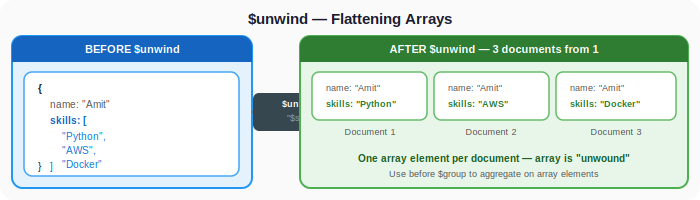

### Real-World Example — Most Sold Product (by quantity)

Let's add some data with arrays:

```javascript
db.invoices.insertMany([
  {
    invoiceId: "INV001",
    customer: "Amit",
    items: [
      { product: "iPhone 15", qty: 1, price: 79999 },
      { product: "AirPods Pro", qty: 2, price: 24999 }
    ]
  },
  {
    invoiceId: "INV002",
    customer: "Priya",
    items: [
      { product: "MacBook Air", qty: 1, price: 114999 },
      { product: "AirPods Pro", qty: 1, price: 24999 }
    ]
  },
  {
    invoiceId: "INV003",
    customer: "Sara",
    items: [
      { product: "iPhone 15", qty: 2, price: 79999 },
      { product: "Galaxy S24", qty: 1, price: 69999 }
    ]
  }
])
```

```javascript
// Find total quantity sold per product
db.invoices.aggregate([
  { $unwind: "$items" },
  { $group: {
      _id: "$items.product",
      totalQtySold: { $sum: "$items.qty" },
      totalRevenue: { $sum: { $multiply: ["$items.qty", "$items.price"] } }
  }},
  { $sort: { totalQtySold: -1 } }
])
```

**Result:**
```json
[
  { "_id": "AirPods Pro", "totalQtySold": 3, "totalRevenue": 74997 },
  { "_id": "iPhone 15", "totalQtySold": 3, "totalRevenue": 239997 },
  { "_id": "MacBook Air", "totalQtySold": 1, "totalRevenue": 114999 },
  { "_id": "Galaxy S24", "totalQtySold": 1, "totalRevenue": 69999 }
]
```

---

## 10. $lookup — Joining Collections

`$lookup` is MongoDB's version of SQL JOIN!

### Setup

```javascript
// Users collection
db.users.insertMany([
  { _id: ObjectId("65a1b2c3d4e5f6a7b8c9d0e1"), name: "Amit Sharma", email: "amit@gmail.com", city: "Mumbai" },
  { _id: ObjectId("65a1b2c3d4e5f6a7b8c9d0e2"), name: "Priya Singh", email: "priya@gmail.com", city: "Delhi" },
  { _id: ObjectId("65a1b2c3d4e5f6a7b8c9d0e3"), name: "Rahul Verma", email: "rahul@gmail.com", city: "Bangalore" }
])

// User orders
db.userOrders.insertMany([
  { userId: ObjectId("65a1b2c3d4e5f6a7b8c9d0e1"), product: "iPhone 15", amount: 79999 },
  { userId: ObjectId("65a1b2c3d4e5f6a7b8c9d0e1"), product: "AirPods Pro", amount: 24999 },
  { userId: ObjectId("65a1b2c3d4e5f6a7b8c9d0e2"), product: "MacBook Air", amount: 114999 },
  { userId: ObjectId("65a1b2c3d4e5f6a7b8c9d0e3"), product: "Pixel 8", amount: 52999 }
])
```

### Performing a JOIN with $lookup

```javascript
db.users.aggregate([
  { $lookup: {
      from: "userOrders",          // The collection to join with
      localField: "_id",           // Field from the users collection
      foreignField: "userId",      // Field from the userOrders collection
      as: "orders"                 // Name of the new array field
  }}
])
```

**Result:**
```json
[
  {
    "_id": ObjectId("65a1...e1"),
    "name": "Amit Sharma",
    "email": "amit@gmail.com",
    "city": "Mumbai",
    "orders": [
      { "userId": ObjectId("65a1...e1"), "product": "iPhone 15", "amount": 79999 },
      { "userId": ObjectId("65a1...e1"), "product": "AirPods Pro", "amount": 24999 }
    ]
  },
  {
    "_id": ObjectId("65a1...e2"),
    "name": "Priya Singh",
    "orders": [
      { "userId": ObjectId("65a1...e2"), "product": "MacBook Air", "amount": 114999 }
    ]
  },
  ...
]
```

**SQL Equivalent:**
```sql
SELECT u.*, o.*
FROM users u
LEFT JOIN userOrders o ON u._id = o.userId;
```

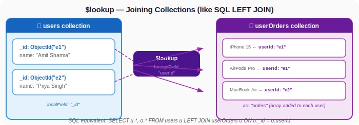

### $lookup + Other Stages — Full Example

```javascript
// Get each user's total spending
db.users.aggregate([
  { $lookup: {
      from: "userOrders",
      localField: "_id",
      foreignField: "userId",
      as: "orders"
  }},
  { $unwind: "$orders" },
  { $group: {
      _id: { id: "$_id", name: "$name", city: "$city" },
      totalSpent: { $sum: "$orders.amount" },
      orderCount: { $sum: 1 }
  }},
  { $project: {
      _id: 0,
      name: "$_id.name",
      city: "$_id.city",
      totalSpent: 1,
      orderCount: 1
  }},
  { $sort: { totalSpent: -1 } }
])
```

---

## 11. Real-World Analytics Examples

### Example 1: Monthly Revenue Report

```javascript
db.orders.aggregate([
  { $match: { status: "delivered" } },
  { $group: {
      _id: { $month: "$date" },
      monthlyRevenue: { $sum: "$amount" },
      orderCount: { $sum: 1 }
  }},
  { $project: {
      _id: 0,
      month: "$_id",
      monthlyRevenue: 1,
      orderCount: 1
  }},
  { $sort: { month: 1 } }
])
```

### Example 2: City-wise Sales Dashboard

```javascript
db.orders.aggregate([
  { $match: { status: "delivered" } },
  { $group: {
      _id: "$city",
      totalSales: { $sum: "$amount" },
      orderCount: { $sum: 1 },
      avgOrderValue: { $avg: "$amount" },
      topProduct: { $first: "$product" }
  }},
  { $sort: { totalSales: -1 } },
  { $project: {
      _id: 0,
      city: "$_id",
      totalSales: 1,
      orderCount: 1,
      avgOrderValue: { $round: ["$avgOrderValue", 2] }
  }}
])
```

### Example 3: Repeat Customers (More Than 1 Order)

```javascript
db.orders.aggregate([
  { $match: { status: "delivered" } },
  { $group: {
      _id: "$customer",
      orderCount: { $sum: 1 },
      totalSpent: { $sum: "$amount" }
  }},
  { $match: { orderCount: { $gt: 1 } } },   // Second $match!
  { $sort: { orderCount: -1 } }
])
```

> You can use `$match` multiple times in a pipeline! First filter raw data, then filter grouped results.

### Example 4: Category Revenue Percentage

```javascript
db.orders.aggregate([
  { $match: { status: "delivered" } },
  { $group: {
      _id: null,
      totalRevenue: { $sum: "$amount" },
      categories: { $push: { category: "$category", amount: "$amount" } }
  }},
  { $unwind: "$categories" },
  { $group: {
      _id: "$categories.category",
      categoryRevenue: { $sum: "$categories.amount" },
      totalRevenue: { $first: "$totalRevenue" }
  }},
  { $project: {
      _id: 0,
      category: "$_id",
      categoryRevenue: 1,
      percentage: {
        $round: [
          { $multiply: [{ $divide: ["$categoryRevenue", "$totalRevenue"] }, 100] },
          1
        ]
      }
  }},
  { $sort: { percentage: -1 } }
])
```

---

## 12. 💡 Visual Learning

### Aggregation Pipeline Flow

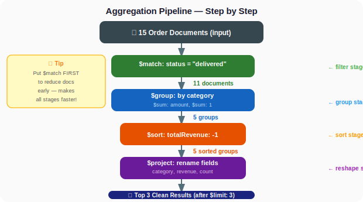

### $group Visualized

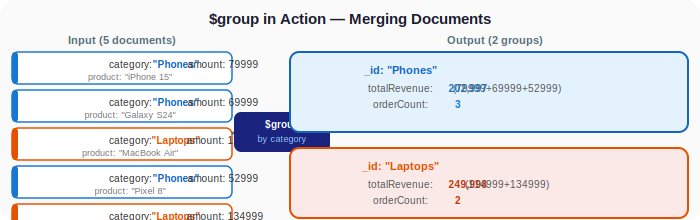

---

## 13. 🧪 Hands-on Practice

Use the `analyticsDB` dataset from the setup.

**Q1.** Find the total revenue from ALL orders (regardless of status).

<details>
<summary>Show Answer</summary>

```javascript
db.orders.aggregate([
  { $group: {
      _id: null,
      totalRevenue: { $sum: "$amount" }
  }}
])
```
</details>

**Q2.** Find the number of orders per status (delivered, shipped, cancelled, processing).

<details>
<summary>Show Answer</summary>

```javascript
db.orders.aggregate([
  { $group: {
      _id: "$status",
      count: { $sum: 1 }
  }}
])
```
</details>

**Q3.** Find the top 3 customers by total spending (only delivered orders).

<details>
<summary>Show Answer</summary>

```javascript
db.orders.aggregate([
  { $match: { status: "delivered" } },
  { $group: {
      _id: "$customer",
      totalSpent: { $sum: "$amount" }
  }},
  { $sort: { totalSpent: -1 } },
  { $limit: 3 }
])
```
</details>

**Q4.** Find the average order value per city.

<details>
<summary>Show Answer</summary>

```javascript
db.orders.aggregate([
  { $group: {
      _id: "$city",
      avgOrderValue: { $avg: "$amount" }
  }},
  { $project: {
      _id: 0,
      city: "$_id",
      avgOrderValue: { $round: ["$avgOrderValue", 2] }
  }},
  { $sort: { avgOrderValue: -1 } }
])
```
</details>

**Q5.** Find which products have been ordered more than once.

<details>
<summary>Show Answer</summary>

```javascript
db.orders.aggregate([
  { $group: {
      _id: "$product",
      timesOrdered: { $sum: 1 }
  }},
  { $match: { timesOrdered: { $gt: 1 } } },
  { $sort: { timesOrdered: -1 } }
])
```
</details>

---

## 14. ⚠️ Common Mistakes

### Mistake 1: Putting $match after $group when it should be before

```javascript
// SLOW — groups ALL documents, THEN filters
db.orders.aggregate([
  { $group: { _id: "$category", total: { $sum: "$amount" } } },
  { $match: { /* some filter on original fields */ } }  // Too late!
])

// FAST — filters FIRST, then groups the smaller set
db.orders.aggregate([
  { $match: { status: "delivered" } },  // Filter early!
  { $group: { _id: "$category", total: { $sum: "$amount" } } }
])
```

### Mistake 2: Forgetting the $ sign for field references

```javascript
// WRONG — "amount" is a literal string, not a field reference
{ $group: { _id: "$category", total: { $sum: "amount" } } }

// CORRECT — "$amount" refers to the field value
{ $group: { _id: "$category", total: { $sum: "$amount" } } }
```

### Mistake 3: Using $count: 1 inside $group

```javascript
// WRONG — $count is not an accumulator inside $group
{ $group: { _id: "$city", count: { $count: 1 } } }

// CORRECT — use $sum: 1 to count
{ $group: { _id: "$city", count: { $sum: 1 } } }
```

### Mistake 4: Forgetting that $unwind creates duplicates

If you `$unwind` an array of 5 items, you get 5 documents from 1. If you're counting, you'll count 5 instead of 1. Be aware of this!

### Mistake 5: Not handling empty arrays in $unwind

```javascript
// If "items" is empty [], the document is REMOVED from results
{ $unwind: "$items" }

// To keep documents with empty arrays:
{ $unwind: { path: "$items", preserveNullAndEmptyArrays: true } }
```

---

## 15. 📝 Mini Assignment

### Build a "Sales Analytics Dashboard"

Using the `analyticsDB` dataset, write aggregation queries for:

1. **Revenue by Month** — Show total revenue per month, sorted chronologically
2. **Top City** — Which city has the highest total sales?
3. **Customer Loyalty Report** — List customers who ordered 2+ times, with their total spending and average order value
4. **Category Breakdown** — Show each category's order count and average price, sorted by order count
5. **Most Popular Product** — Which product was ordered the most times?
6. **Revenue Split** — What percentage of total revenue does each city contribute?
7. **Cancelled Order Impact** — How much revenue was lost to cancelled orders?

**Bonus:** Create the invoices collection from section 9 and find the total quantity sold per product using `$unwind`.

---

## 16. 🔁 Recap

- **Aggregation** = a pipeline of stages that transforms data step by step
- **`$match`** — filter documents (like WHERE) — always put it first for performance!
- **`$group`** — group by a field and calculate aggregates ($sum, $avg, $min, $max, $count)
- **`$sort`** — sort results (1 = ascending, -1 = descending)
- **`$project`** — reshape output, rename fields, compute new fields
- **`$count`** — count the number of documents in the pipeline
- **`$limit`** and **`$skip`** — pagination within aggregation
- **`$unwind`** — flatten arrays (one document per array element)
- **`$lookup`** — JOIN collections (like SQL JOIN)
- Use `_id: null` in `$group` to aggregate all documents together
- You can use `$match` multiple times — once for raw filtering, once for filtering grouped results
- **`$` prefix** references a field value — don't forget it!
- The order of stages matters — put `$match` early, `$sort` and `$limit` late

---

