# 📅 Day 1: Introduction to SQL & Databases

Hello students 👋

Welcome to Day 1 of our 10-day SQL journey! Today is all about understanding the **big picture** — what databases are, why they exist, and writing your very first SQL query. By the end of today, you'll already be talking to a database!

---

## 📖 1. Introduction

### What will we learn today?
- What is a database and why do we need one?
- What is SQL?
- Why PostgreSQL?
- Understanding tables, rows, and columns
- Installing PostgreSQL on your machine
- Writing your very first SQL query

### Why is this important?
Every app you use — Instagram, Amazon, WhatsApp, YouTube — stores data. That data lives in a **database**. SQL is the language you use to talk to that database. Learning SQL is like learning the language of data — and data runs the world.

Think about it: when you scroll through Instagram and "like" a photo, that action is recorded in a database. When Amazon recommends products to you, it queries a database. When you send a WhatsApp message, it gets stored in a database. **Every digital interaction you have ultimately touches a database.** That is why SQL is one of the most in-demand skills across the entire tech industry — from software engineering to data science to business analytics.

> 🎯 **Key Takeaway:** SQL is not just for "database people." It is a foundational skill for anyone who works with data — developers, analysts, product managers, and even marketers. Learning SQL gives you direct access to the raw information that powers every modern application.

---

## 🧠 2. Concept Explanation

### What is a Database?

Think of a database as a **super-organized digital filing cabinet**.

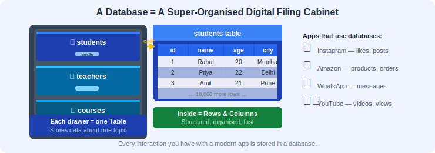

**Real-world analogy:** Imagine your school office has a cabinet with folders:
- One folder for **student records**
- One folder for **teacher records**
- One folder for **exam results**

Each folder has papers organized in rows and columns — just like a spreadsheet. A database does the same thing, but digitally, and much faster.

> 💡 A **database** is an organized collection of data stored electronically so that it can be easily accessed, managed, and updated.

#### Why not just use a spreadsheet?

Great question! If databases are like spreadsheets, why not just use Excel or Google Sheets? Here is why:

| Feature                  | Spreadsheet            | Database                        |
|--------------------------|------------------------|---------------------------------|
| Max rows                 | ~1 million             | Billions+                       |
| Multiple users at once   | Limited / conflicts    | Hundreds of concurrent users    |
| Data integrity rules     | Manual / error-prone   | Enforced automatically          |
| Speed for large data     | Slows down quickly     | Optimized for massive datasets  |
| Security & permissions   | Basic                  | Fine-grained access control     |
| Connecting to apps/APIs  | Difficult              | Built for it                    |

Spreadsheets are great for small, personal datasets. But the moment you need multiple users, millions of rows, or a connection to an application, you need a proper database.

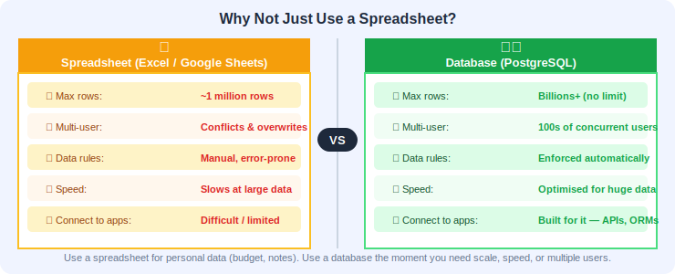

**Another analogy:** A spreadsheet is like a notebook — perfect for personal use. A database is like a **library system** — it can track millions of books, handle thousands of visitors at once, and has strict rules about how things are organized and who can access what.

> 🎯 **Key Takeaway:** Databases exist because real-world applications need to store massive amounts of data reliably, securely, and fast. Spreadsheets simply cannot scale to meet those demands.

### What is SQL?

**SQL** stands for **Structured Query Language**. It's the language we use to "talk" to a database.

Think of it this way:
- You speak **English** to communicate with people
- You write **Python/JavaScript** to communicate with computers
- You write **SQL** to communicate with databases

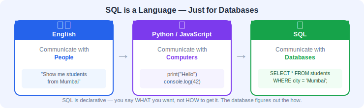

```
You: "Hey database, show me all students who scored above 90"
SQL:  SELECT * FROM students WHERE marks > 90;
```

#### How does SQL actually work under the hood?

When you type a SQL query and press Enter, here is what happens behind the scenes:

1. **Parsing** — PostgreSQL reads your query and checks if the syntax is correct (like a spell-checker for SQL).
2. **Planning** — The database figures out the most efficient way to get the data you asked for. This is called the **query plan**. It is like asking for directions — there might be many routes, but the planner picks the fastest one.
3. **Execution** — The database engine actually goes and fetches the data from disk (or memory cache) following the plan.
4. **Result** — The data is assembled into a neat table and sent back to you.

All of this happens in **milliseconds**, even for tables with millions of rows. That is the power of a well-designed database engine.

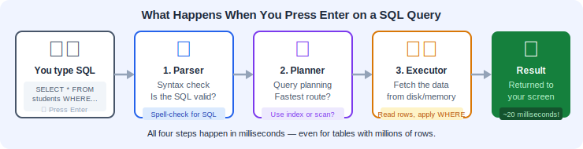

> 🧩 **Fun Fact:** SQL was originally developed at IBM in the early 1970s by Donald Chamberlin and Raymond Boyce. It was initially called "SEQUEL" (Structured English Query Language) but the name was shortened to "SQL" due to a trademark conflict. Despite being over 50 years old, SQL remains the most widely used language for working with data — a testament to how well-designed it is!

> 🎯 **Key Takeaway:** SQL is a declarative language — you tell the database *what* you want, not *how* to get it. The database engine figures out the "how" for you. This makes SQL incredibly powerful yet relatively simple to learn.

### Why PostgreSQL?

There are many database systems: MySQL, SQLite, Oracle, SQL Server, etc. We chose **PostgreSQL** because:

| Feature                | PostgreSQL                                          |
|------------------------|-----------------------------------------------------|
| Free & Open Source     | ✅ Yes                                               |
| Industry Standard      | ✅ Used by Apple, Netflix, Spotify, Instagram        |
| Feature Rich           | ✅ Supports advanced features                        |
| Reliable               | ✅ 30+ years of development                          |
| Great for Learning     | ✅ Follows SQL standards closely                     |
| Community Support      | ✅ Massive community, great documentation            |
| Extensibility          | ✅ Supports custom types, functions, and extensions  |

#### How PostgreSQL compares to others

- **MySQL** — Also popular and free, but PostgreSQL is more standards-compliant and has richer features (better JSON support, window functions, etc.).
- **SQLite** — A lightweight, file-based database. Great for small apps and mobile, but not designed for multi-user server environments.
- **Oracle / SQL Server** — Powerful enterprise databases, but they are commercial (expensive licenses). Most of what they offer, PostgreSQL can do for free.

The best part? **Almost everything you learn in PostgreSQL transfers directly to other databases.** SQL is a standard, so switching from PostgreSQL to MySQL or SQL Server later is straightforward.

> 🎯 **Key Takeaway:** PostgreSQL is the ideal learning database — it is free, powerful, follows standards closely, and is used by top companies worldwide. Skills you build here are portable to any SQL database.

### Tables, Rows, and Columns

A database stores data in **tables**. Think of a table like a spreadsheet:

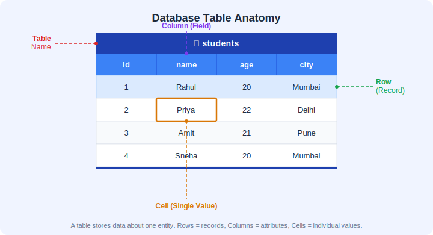

| id  | name  | age | city   |
|-----|-------|-----|--------|
| 1   | Rahul | 20  | Mumbai |
| 2   | Priya | 22  | Delhi  |
| 3   | Amit  | 21  | Pune   |

- **Table** = The entire spreadsheet (e.g., `students`)
- **Column** = A category of data (e.g., `name`, `age`, `city`) — also called a **field**
- **Row** = One complete record (e.g., Rahul's entire info) — also called a **record**

#### Going deeper: Data Types

Every column in a table has a **data type** — a rule that says what kind of data it can hold. This is one of the biggest differences between a database and a spreadsheet. In a spreadsheet, you can type anything anywhere. In a database, the column enforces rules:

| Data Type        | What It Stores                  | Example              |
|------------------|---------------------------------|----------------------|
| `INT`            | Whole numbers                   | 42, -7, 1000        |
| `VARCHAR(n)`     | Text up to n characters         | 'Rahul', 'Mumbai'   |
| `BOOLEAN`        | True or False                   | true, false          |
| `DECIMAL(p, s)`  | Precise decimal numbers         | 99.99, 1500.50      |
| `DATE`           | Calendar dates                  | '2026-04-14'        |
| `SERIAL`         | Auto-incrementing integer       | 1, 2, 3, 4...       |

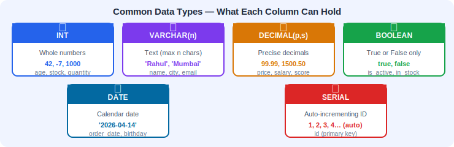

**Why do data types matter?** They prevent bad data from getting into your database. For example, if `age` is defined as `INT`, you cannot accidentally store "twenty" in it. The database will reject it. This is called **data integrity** and it is one of the most important features of a database.

> 🎯 **Key Takeaway:** Tables organize data into rows and columns, and every column has a data type that enforces what kind of data it can hold. This structure keeps your data clean and reliable.

---

## 💡 3. Visual Learning

### How a Database System Works

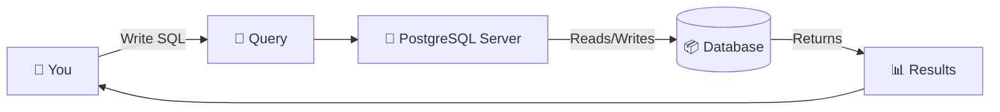

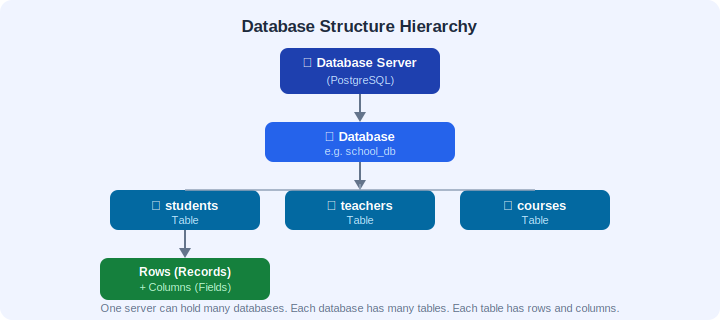

### Database Structure

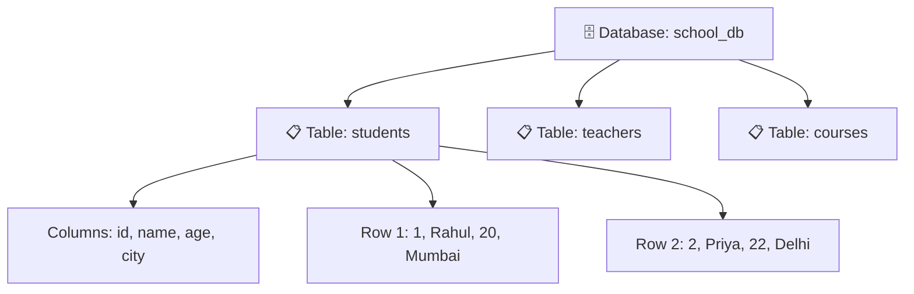

### Table Anatomy

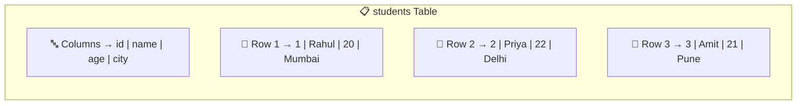

### SQL Query Execution Flow


---

## 🖥️ 4. Installing PostgreSQL

### Step 1: Download PostgreSQL

1. Go to [https://www.postgresql.org/download/](https://www.postgresql.org/download/)
2. Choose your operating system (Windows/macOS/Linux)
3. Download the installer

### Step 2: Install

- Run the installer
- Keep all default settings
- **Remember the password** you set for the `postgres` user (you'll need it!)
- Default port: `5432` (keep it)

### Step 3: Open psql (PostgreSQL Terminal)

After installation, open the **psql** shell:

- **Windows:** Search for "SQL Shell (psql)" in Start Menu
- **macOS:** Open Terminal and type `psql -U postgres`
- **Linux:** Open Terminal and type `sudo -u postgres psql`

You should see something like:

```
postgres=#
```

Congratulations! You're connected to PostgreSQL! 🎉

### Step 4: Create Your First Database

```sql
CREATE DATABASE school_db;
```

### Step 5: Connect to It

```sql
\c school_db
```

You'll see: `You are now connected to database "school_db"`

> 🎯 **Key Takeaway:** Getting PostgreSQL installed and running is the hardest part of today. Once you see that `postgres=#` prompt, you are ready to write SQL!

---

## 📝 5. Syntax + Examples

### Creating a Table

Before we can query data, we need a table. Let's create one:

```sql
CREATE TABLE students (
    id SERIAL PRIMARY KEY,
    name VARCHAR(100),
    age INT,
    city VARCHAR(50),
    marks INT
);
```

**What does this mean?**
- `SERIAL` — auto-incrementing number (1, 2, 3...)
- `PRIMARY KEY` — unique identifier for each row
- `VARCHAR(100)` — text with max 100 characters
- `INT` — whole number

**Why do we need a PRIMARY KEY?** Every table should have a column (or set of columns) that uniquely identifies each row. Think of it like a roll number in a class — even if two students have the same name, their roll numbers are different. The `id` column with `SERIAL PRIMARY KEY` automatically assigns a unique number to every new row, so you never have to worry about duplicates.

### Inserting Data

```sql
INSERT INTO students (name, age, city, marks) VALUES ('Rahul', 20, 'Mumbai', 85);
INSERT INTO students (name, age, city, marks) VALUES ('Priya', 22, 'Delhi', 92);
INSERT INTO students (name, age, city, marks) VALUES ('Amit', 21, 'Pune', 78);
INSERT INTO students (name, age, city, marks) VALUES ('Sneha', 20, 'Mumbai', 95);
INSERT INTO students (name, age, city, marks) VALUES ('Vikram', 23, 'Chennai', 88);
INSERT INTO students (name, age, city, marks) VALUES ('Neha', 21, 'Delhi', 72);
INSERT INTO students (name, age, city, marks) VALUES ('Arjun', 22, 'Bangalore', 91);
INSERT INTO students (name, age, city, marks) VALUES ('Kavita', 20, 'Pune', 68);
INSERT INTO students (name, age, city, marks) VALUES ('Ravi', 24, 'Mumbai', 82);
INSERT INTO students (name, age, city, marks) VALUES ('Meera', 21, 'Chennai', 97);
```

> 💡 **Tip:** Notice that we did not provide a value for `id` in the INSERT statements. That is because `SERIAL` means PostgreSQL automatically generates the next number for us. Handy!

### Your First Query: SELECT

The `SELECT` statement is how you **read data** from a database.

#### Example 1: Select Everything

```sql
SELECT * FROM students;
```

`*` means "all columns". This returns every row and every column.

**Result:**

| id  | name  | age | city   | marks |
|-----|-------|-----|--------|-------|
| 1   | Rahul | 20  | Mumbai | 85    |
| 2   | Priya | 22  | Delhi  | 92    |
| 3   | Amit  | 21  | Pune   | 78    |
| ... | ...   | ... | ...    | ...   |

#### Example 2: Select Specific Columns

```sql
SELECT name, city FROM students;
```

Only shows the `name` and `city` columns.

#### Example 3: Select with a Condition

```sql
SELECT * FROM students WHERE city = 'Mumbai';
```

Shows only students from Mumbai.

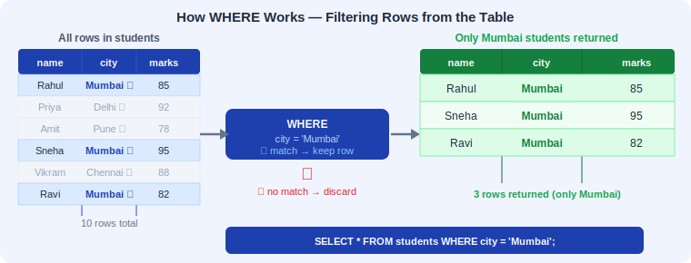

#### Example 4: Select with Multiple Conditions

```sql
SELECT name, marks FROM students WHERE marks > 80;
```

Shows names and marks of students who scored above 80.

#### Example 5: Count the Rows

```sql
SELECT COUNT(*) FROM students;
```

Returns: `10` (the total number of students)

#### Example 6: Select Unique Cities

```sql
SELECT DISTINCT city FROM students;
```

Returns each city only once (no duplicates).

#### Example 7: Alias — Rename a Column in Output

```sql
SELECT name, marks AS score FROM students;
```

The `marks` column will show as `score` in the result.

#### Example 8: Simple Math in SELECT

```sql
SELECT name, marks, marks * 2 AS double_marks FROM students;
```

#### Example 9: Select with Text Matching

```sql
SELECT * FROM students WHERE name = 'Priya';
```

#### Example 10: Combine Columns

```sql
SELECT name || ' from ' || city AS student_info FROM students;
```

The `||` operator joins text together. Result: `Rahul from Mumbai`

---

#### Example 11: ORDER BY — Sorting Results

```sql
SELECT name, marks FROM students ORDER BY marks DESC;
```

This sorts students by marks in **descending** order (highest first). Use `ASC` for ascending (lowest first, which is also the default).

```sql
-- Sort by city alphabetically, then by marks (highest first) within each city
SELECT name, city, marks FROM students ORDER BY city ASC, marks DESC;
```

**Why is ORDER BY important?** Databases do **not** guarantee any particular order of rows unless you explicitly ask for it. Even if your data looks sorted today, it might come back in a different order tomorrow. Always use `ORDER BY` when the order of results matters to you.

#### Example 12: LIMIT — Controlling How Many Rows You Get

```sql
SELECT name, marks FROM students ORDER BY marks DESC LIMIT 3;
```

This returns only the **top 3 students** by marks. `LIMIT` is extremely useful when you have millions of rows but only want to see a few.

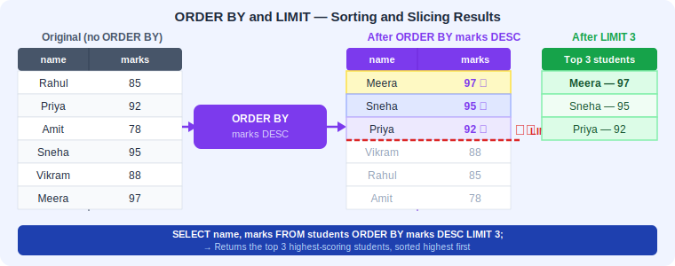

```sql
-- Just peek at the first 5 rows of any table (great for exploring!)
SELECT * FROM students LIMIT 5;
```

#### Example 13: WHERE with AND / OR — Multiple Conditions

```sql
-- Students from Mumbai who scored above 80
SELECT * FROM students WHERE city = 'Mumbai' AND marks > 80;
```

```sql
-- Students from either Delhi OR Chennai
SELECT * FROM students WHERE city = 'Delhi' OR city = 'Chennai';
```

```sql
-- Combining AND and OR with parentheses for clarity
SELECT * FROM students WHERE (city = 'Mumbai' OR city = 'Pune') AND marks > 75;
```

**Why parentheses matter:** SQL evaluates `AND` before `OR` (just like math does multiplication before addition). Parentheses let you control the order explicitly so you get exactly what you want.

#### Example 14: NULL Handling Basics

```sql
-- Find students who have no marks recorded (NULL means "unknown" or "missing")
SELECT * FROM students WHERE marks IS NULL;
```

```sql
-- Find students who DO have marks recorded
SELECT * FROM students WHERE marks IS NOT NULL;
```

**Important:** You cannot use `= NULL` or `!= NULL`. NULLs are special — they represent the *absence* of a value. The only way to check for them is with `IS NULL` or `IS NOT NULL`.

**Analogy:** Think of NULL as an empty box. You cannot say an empty box "equals" anything — it is simply empty. That is why SQL uses `IS NULL` instead of `= NULL`.

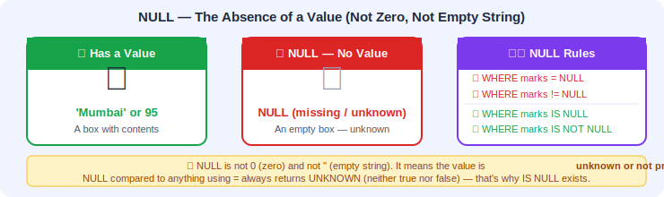

#### Example 15: Comments in SQL

```sql
-- This is a single-line comment (everything after -- is ignored)
SELECT name, marks FROM students; -- You can also put comments at the end of a line

/*
  This is a multi-line comment.
  Useful for longer explanations or temporarily
  disabling a block of SQL code.
*/
SELECT * FROM students WHERE city = 'Mumbai';
```

**Why use comments?** As your queries get more complex, comments help you (and your teammates) understand what the query is doing and *why*. A good comment explains the intent, not just the code.

> 🎯 **Key Takeaway:** SELECT is the most used SQL command. Combined with WHERE, ORDER BY, LIMIT, and DISTINCT, you can answer a huge variety of questions about your data — all from Day 1!

---

## ✅ Checkpoint! 

> Quick question: What does `SELECT * FROM students` do?
> 
> a) Deletes all students  
> b) Shows all data from the students table ✅  
> c) Creates a new table  
> d) Updates student records

---

## 🧪 6. Hands-on Practice

Try these on your own! Write the SQL query for each:

**Problem 1:** Show all columns and rows from the `students` table.

<details>
<summary>💡 Solution</summary>

```sql
SELECT * FROM students;
```

</details>

**Problem 2:** Show only the `name` and `marks` of all students.

<details>
<summary>💡 Solution</summary>

```sql
SELECT name, marks FROM students;
```

</details>

**Problem 3:** Show all students from Delhi.

<details>
<summary>💡 Solution</summary>

```sql
SELECT * FROM students WHERE city = 'Delhi';
```

</details>

**Problem 4:** Show the names of students who scored more than 90.

<details>
<summary>💡 Solution</summary>

```sql
SELECT name FROM students WHERE marks > 90;
```

</details>

**Problem 5:** How many students are there in total?

<details>
<summary>💡 Solution</summary>

```sql
SELECT COUNT(*) FROM students;
```

</details>

**Problem 6:** Show all unique cities where students are from.

<details>
<summary>💡 Solution</summary>

```sql
SELECT DISTINCT city FROM students;
```

</details>

**Problem 7:** Show student names along with their marks labeled as "score".

<details>
<summary>💡 Solution</summary>

```sql
SELECT name, marks AS score FROM students;
```

</details>

---

**Problem 8:** Show the top 3 students by marks (highest first).

<details>
<summary>💡 Solution</summary>

```sql
SELECT name, marks FROM students ORDER BY marks DESC LIMIT 3;
```

</details>

**Problem 9:** Show all students who are from Mumbai AND scored above 80.

<details>
<summary>💡 Solution</summary>

```sql
SELECT * FROM students WHERE city = 'Mumbai' AND marks > 80;
```

</details>

**Problem 10:** Show students who are from either Delhi or Chennai, sorted by name alphabetically.

<details>
<summary>💡 Solution</summary>

```sql
SELECT * FROM students WHERE city = 'Delhi' OR city = 'Chennai' ORDER BY name ASC;
```

</details>

**Problem 11:** Show each student's name and a custom column called `pass_status` that says whether they passed (marks > 75) by displaying their marks. *(Hint: Just select name and marks with a WHERE condition.)*

<details>
<summary>💡 Solution</summary>

```sql
SELECT name, marks FROM students WHERE marks > 75;
```

</details>

---

## ⚠️ 7. Common Mistakes

| Mistake                          | Wrong ❌                                   | Correct ✅                                               |
|----------------------------------|--------------------------------------------|---------------------------------------------------------|
| Forgetting semicolon             | `SELECT * FROM students`                   | `SELECT * FROM students;`                                |
| Wrong quotes for text            | `WHERE name = "Rahul"`                     | `WHERE name = 'Rahul';`                                  |
| Using wrong case for values      | `WHERE city = 'mumbai'`                    | `WHERE city = 'Mumbai';` (SQL values are case-sensitive!) |
| Misspelling table name           | `SELECT * FROM student;`                   | `SELECT * FROM students;`                                |
| Forgetting FROM                  | `SELECT name;`                             | `SELECT name FROM students;`                             |
| Using = with NULL                | `WHERE marks = NULL`                       | `WHERE marks IS NULL;`                                   |
| Forgetting quotes around text    | `WHERE city = Mumbai`                      | `WHERE city = 'Mumbai';`                                 |
| Using comma after last column    | `CREATE TABLE t (id INT, name TEXT,);`     | `CREATE TABLE t (id INT, name TEXT);`                    |

> 💡 **Pro tip:** SQL **keywords** (SELECT, FROM, WHERE) are case-insensitive, but it's a convention to write them in UPPERCASE for readability. Data values ('Mumbai', 'Rahul') **are** case-sensitive!

> ⚠️ **Common confusion — single quotes vs. double quotes:** In PostgreSQL, **single quotes** (`'...'`) are for text values (strings), while **double quotes** (`"..."`) are for identifiers like table or column names (and are rarely needed). Mixing these up is one of the most common beginner errors. When in doubt, use single quotes for values.

> 🎯 **Key Takeaway:** Most SQL errors beginners face are simple typos — a missing semicolon, wrong quotes, or a misspelled name. Read your error messages carefully; PostgreSQL gives very helpful hints about what went wrong and where.

---

## 🌍 Real-World Scenario

### How "FreshCart" Uses What You Learned Today

Imagine a small online grocery delivery startup called **FreshCart**. They just launched in 3 cities — Mumbai, Delhi, and Pune. Their development team needs to set up a database to track customers and orders.

**Step 1:** The backend developer creates a PostgreSQL database called `freshcart_db` and a `customers` table:

```sql
CREATE DATABASE freshcart_db;
\c freshcart_db

CREATE TABLE customers (
    id SERIAL PRIMARY KEY,
    name VARCHAR(100),
    email VARCHAR(150),
    city VARCHAR(50),
    signup_date DATE
);
```

**Step 2:** As customers sign up on the app, their data gets inserted:

```sql
INSERT INTO customers (name, email, city, signup_date) VALUES ('Ananya Sharma', 'ananya@email.com', 'Mumbai', '2026-04-01');
INSERT INTO customers (name, email, city, signup_date) VALUES ('Rohan Mehta', 'rohan@email.com', 'Delhi', '2026-04-03');
INSERT INTO customers (name, email, city, signup_date) VALUES ('Fatima Khan', 'fatima@email.com', 'Pune', '2026-04-05');
INSERT INTO customers (name, email, city, signup_date) VALUES ('Arjun Nair', 'arjun@email.com', 'Mumbai', '2026-04-07');
INSERT INTO customers (name, email, city, signup_date) VALUES ('Divya Patel', 'divya@email.com', 'Delhi', '2026-04-10');
```

**Step 3:** Now the marketing team wants answers:

*"How many customers do we have?"*
```sql
SELECT COUNT(*) FROM customers;
-- Result: 5
```

*"Which cities are our customers from?"*
```sql
SELECT DISTINCT city FROM customers;
-- Result: Mumbai, Delhi, Pune
```

*"Show me all Mumbai customers so I can send them a local promotion."*
```sql
SELECT name, email FROM customers WHERE city = 'Mumbai';
```

*"Who signed up most recently?"*
```sql
SELECT name, signup_date FROM customers ORDER BY signup_date DESC LIMIT 1;
```

**The point:** Everything you learned today — `CREATE TABLE`, `INSERT`, `SELECT`, `WHERE`, `DISTINCT`, `ORDER BY`, `LIMIT`, `COUNT` — these are the exact same commands used in production by real companies every single day. You are not learning toy examples; you are learning real skills.

> 🎯 **Key Takeaway:** The SQL you wrote today in practice problems is the same SQL that powers real applications. The difference is just the scale — instead of 10 rows, real companies have millions. But the queries look exactly the same!

---

## 📋 Quick Reference Card

A compact cheat-sheet of everything you learned today. Bookmark this!

```
╔══════════════════════════════════════════════════════════════════╗
║                    📋 DAY 1 — SQL QUICK REFERENCE               ║
╠══════════════════════════════════════════════════════════════════╣
║                                                                  ║
║  🗄️  DATABASE COMMANDS                                          ║
║  ──────────────────────────────────────────                      ║
║  CREATE DATABASE dbname;        Create a new database            ║
║  \c dbname                      Connect to a database            ║
║                                                                  ║
║  📋 TABLE COMMANDS                                               ║
║  ──────────────────────────────────────────                      ║
║  CREATE TABLE tbl (             Create a new table               ║
║      col1 TYPE,                                                  ║
║      col2 TYPE                                                   ║
║  );                                                              ║
║                                                                  ║
║  INSERT INTO tbl (col1, col2)   Insert a row                     ║
║  VALUES ('val1', 'val2');                                        ║
║                                                                  ║
║  🔍 SELECT QUERIES                                               ║
║  ──────────────────────────────────────────                      ║
║  SELECT * FROM tbl;             All columns, all rows            ║
║  SELECT col1, col2 FROM tbl;    Specific columns                 ║
║  SELECT DISTINCT col FROM tbl;  Unique values only               ║
║  SELECT COUNT(*) FROM tbl;      Count total rows                 ║
║                                                                  ║
║  🎯 FILTERING & SORTING                                         ║
║  ──────────────────────────────────────────                      ║
║  WHERE col = 'value'            Filter by condition              ║
║  WHERE col > 80                 Comparison operators             ║
║  WHERE col1 = 'x' AND col2 > 5 Multiple conditions (both)       ║
║  WHERE col1 = 'x' OR col1 = 'y' Multiple conditions (either)    ║
║  WHERE col IS NULL              Check for missing values         ║
║  WHERE col IS NOT NULL          Check for existing values        ║
║  ORDER BY col ASC/DESC          Sort results                     ║
║  LIMIT n                        Return only n rows               ║
║                                                                  ║
║  ✨ EXTRAS                                                       ║
║  ──────────────────────────────────────────                      ║
║  col AS alias                   Rename column in output          ║
║  col1 || ' ' || col2           Concatenate text                  ║
║  -- comment                     Single-line comment              ║
║  /* comment */                  Multi-line comment               ║
║                                                                  ║
║  📏 COMMON DATA TYPES                                            ║
║  ──────────────────────────────────────────                      ║
║  SERIAL          Auto-incrementing integer                       ║
║  INT             Whole number                                    ║
║  VARCHAR(n)      Text (max n characters)                         ║
║  BOOLEAN         true / false                                    ║
║  DECIMAL(p, s)   Precise decimal number                          ║
║  DATE            Calendar date                                   ║
║                                                                  ║
║  ⚠️  REMEMBER                                                    ║
║  ──────────────────────────────────────────                      ║
║  • End every statement with ;                                    ║
║  • Use 'single quotes' for text values                           ║
║  • SQL keywords are CASE-INSENSITIVE                             ║
║  • Data values ARE case-sensitive                                ║
║  • Use IS NULL, not = NULL                                       ║
║                                                                  ║
╚══════════════════════════════════════════════════════════════════╝
```

---

## 📝 8. Mini Assignment

### 🎯 Task: Create a Products Table

1. Create a new database called `shop_db`
2. Create a table called `products` with these columns:
   - `id` (auto-incrementing primary key)
   - `product_name` (text, max 100 characters)
   - `price` (decimal number)
   - `category` (text, max 50 characters)
   - `in_stock` (boolean — true/false)

3. Insert at least 5 products (e.g., Laptop, Phone, Headphones, Keyboard, Mouse)

4. Write these queries:
   - Show all products
   - Show only product names and prices
   - Show products that cost more than 500
   - Count total number of products

<details>
<summary>💡 Solution</summary>

```sql
-- Step 1: Create database
CREATE DATABASE shop_db;
\c shop_db

-- Step 2: Create table
CREATE TABLE products (
    id SERIAL PRIMARY KEY,
    product_name VARCHAR(100),
    price DECIMAL(10, 2),
    category VARCHAR(50),
    in_stock BOOLEAN
);

-- Step 3: Insert data
INSERT INTO products (product_name, price, category, in_stock) VALUES ('Laptop', 55000.00, 'Electronics', true);
INSERT INTO products (product_name, price, category, in_stock) VALUES ('Phone', 25000.00, 'Electronics', true);
INSERT INTO products (product_name, price, category, in_stock) VALUES ('Headphones', 2000.00, 'Accessories', true);
INSERT INTO products (product_name, price, category, in_stock) VALUES ('Keyboard', 1500.00, 'Accessories', false);
INSERT INTO products (product_name, price, category, in_stock) VALUES ('Mouse', 800.00, 'Accessories', true);

-- Step 4: Queries
SELECT * FROM products;
SELECT product_name, price FROM products;
SELECT * FROM products WHERE price > 500;
SELECT COUNT(*) FROM products;
```

</details>

---

## 🔁 9. Recap

Let's summarize what we learned today:

- ✅ A **database** is an organized collection of data stored electronically
- ✅ **SQL** (Structured Query Language) is how we talk to databases
- ✅ **PostgreSQL** is a powerful, free, open-source database system
- ✅ Data is stored in **tables**, made up of **rows** (records) and **columns** (fields)
- ✅ Every column has a **data type** (INT, VARCHAR, BOOLEAN, etc.) that enforces what kind of data it holds
- ✅ We installed PostgreSQL and created our first database
- ✅ `SELECT` is used to read/retrieve data from a table
- ✅ `SELECT *` means "give me everything"
- ✅ `WHERE` lets us filter results
- ✅ `AND` / `OR` let us combine multiple conditions in `WHERE`
- ✅ `ORDER BY` sorts results (ASC or DESC)
- ✅ `LIMIT` controls how many rows are returned
- ✅ `DISTINCT` removes duplicates
- ✅ `IS NULL` / `IS NOT NULL` checks for missing values
- ✅ Always end SQL statements with a **semicolon** `;`
- ✅ Use **single quotes** `' '` for text values
- ✅ Use `--` or `/* */` for comments

---

## 🔮 Preview of Day 2

Tomorrow we'll learn **CRUD operations** — the four fundamental things you can do with data:
- **C**reate (INSERT)
- **R**ead (SELECT — we started this today!)
- **U**pdate (UPDATE)
- **D**elete (DELETE)

See you tomorrow! 🚀

---

> 💬 **Remember:** The best way to learn SQL is by **doing**. Open psql and practice every example. Don't just read — type it out!
