# 📅 Day 2: CRUD Basics — Create, Read, Update, Delete
---

## 📖 1. Introduction

### What will we learn today?
- The CRUD concept
- `INSERT INTO` — adding new data
- `SELECT` — reading data (going deeper)
- `UPDATE` — modifying existing data
- `DELETE` — removing data
- `WHERE` clause in detail
- `RETURNING` clause — getting feedback from your writes
- `TRUNCATE` vs `DELETE` — understanding the difference
- Safety practices for production databases

### Why is this important?
Every app you use performs CRUD operations:
- **Instagram:** You **create** a post, **read** your feed, **update** your bio, **delete** a story
- **Amazon:** You **create** an account, **read** product listings, **update** your cart, **delete** items from your wishlist
- **WhatsApp:** You **create** a message, **read** chats, **update** (edit) a message, **delete** a message

CRUD = the 4 things software does with data. That's it.

> 🧩 **Did You Know?** The term "CRUD" was first used by British computer scientist James Martin in his 1983 book *Managing the Data-base Environment*. Over 40 years later, every single web application on the planet still revolves around these same four operations. Whether it's a tiny to-do app or a massive system like Netflix — it's all CRUD under the hood!

---

## 🧠 2. Concept Explanation

### What is CRUD?

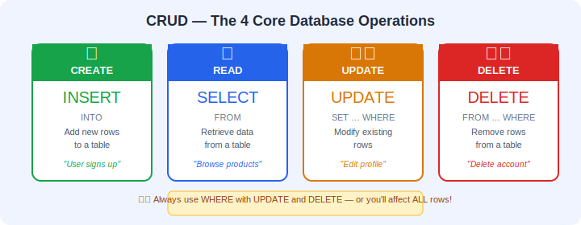


| Operation   | SQL Command   | Real-World Example             | What Happens Internally                          |
|-------------|---------------|--------------------------------|--------------------------------------------------|
| **C**reate  | `INSERT INTO` | Sign up for a new account      | A new row is written to disk in the table's file  |
| **R**ead    | `SELECT`      | View your profile              | The database scans rows and returns matches       |
| **U**pdate  | `UPDATE`      | Change your password           | Existing row is located, modified, and saved      |
| **D**elete  | `DELETE`      | Delete your account            | The row is marked for removal and space reclaimed |

### The Golden Rule of CRUD

> Every piece of software that works with data — websites, apps, APIs — uses CRUD. Master these 4 operations and you understand 80% of backend development.

### 🔬 What Happens Under the Hood?

When you execute a CRUD command, the database doesn't just blindly follow your instruction. Here's the simplified pipeline every SQL statement goes through:

1. **Parsing** — The database checks your SQL for syntax errors.
2. **Planning** — The query planner decides the most efficient way to execute your command (e.g., should it use an index or scan the whole table?).
3. **Execution** — The engine performs the actual read/write on the data files.
4. **Transaction Logging** — For write operations (INSERT, UPDATE, DELETE), the database writes to a **WAL (Write-Ahead Log)** first. This ensures that even if the server crashes mid-operation, your data is safe.
5. **Response** — The result (rows affected, data returned, or an error) is sent back to you.

> 📦 **Key Takeaway:** Every CRUD operation goes through parsing, planning, execution, and logging. The database is doing a LOT of work behind every simple SQL statement you write!

---

## 💡 3. Visual Learning

### CRUD Lifecycle

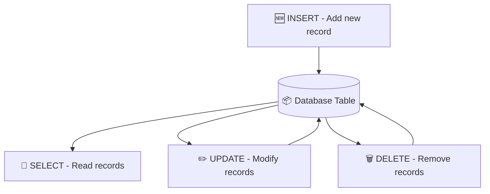

### How WHERE Works

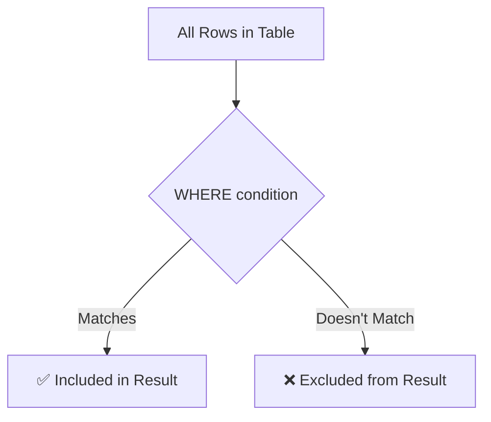

### CRUD in a Real Application

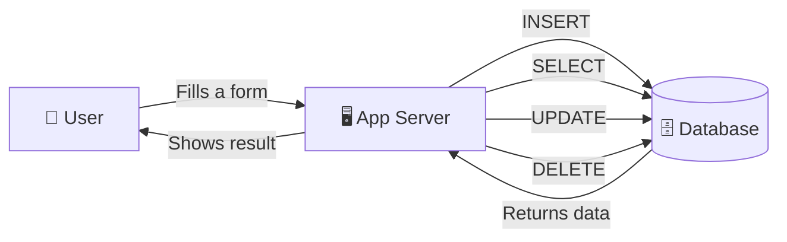

---

## 🖥️ 4. Setup — Let's Prepare Our Data

First, let's create a database and tables we'll use throughout today:

```sql
-- Create and connect to database
CREATE DATABASE ecommerce_db;
\c ecommerce_db

-- Create users table
CREATE TABLE users (
    id SERIAL PRIMARY KEY,
    name VARCHAR(100),
    email VARCHAR(150),
    age INT,
    city VARCHAR(50),
    created_at TIMESTAMP DEFAULT CURRENT_TIMESTAMP
);

-- Create products table
CREATE TABLE products (
    id SERIAL PRIMARY KEY,
    product_name VARCHAR(100),
    price DECIMAL(10, 2),
    category VARCHAR(50),
    stock INT,
    is_available BOOLEAN DEFAULT true
);
```

---

## 📝 5. Syntax + Examples

---

### 🆕 CREATE — INSERT INTO

The `INSERT INTO` command adds new rows to a table.

**Syntax:**
```sql
INSERT INTO table_name (column1, column2, ...) VALUES (value1, value2, ...);
```

#### 🔬 What Happens Internally When You INSERT?

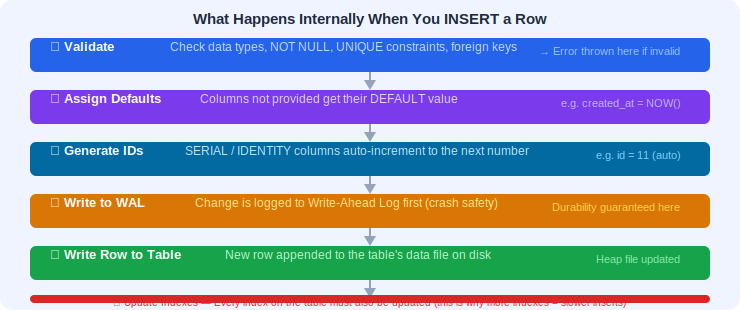

When you run an INSERT statement, the database:

1. **Validates** your data — checks data types, NOT NULL constraints, UNIQUE constraints, and foreign keys.
2. **Assigns default values** — any column you left out gets its DEFAULT value (like `CURRENT_TIMESTAMP` or `true`).
3. **Generates serial IDs** — if you have a `SERIAL` or `IDENTITY` column, the database auto-increments and assigns the next number.
4. **Writes to the WAL** — the insert is first recorded in the Write-Ahead Log for crash safety.
5. **Writes to the table** — the new row is appended to the table's data file on disk.
6. **Updates indexes** — if the table has indexes (like on the PRIMARY KEY), those are updated too.

This is why inserting into a table with many indexes is slower than inserting into a table with none — more bookkeeping!

#### Example 1: Insert a Single User

```sql
INSERT INTO users (name, email, age, city) 
VALUES ('Rahul Sharma', 'rahul@email.com', 25, 'Mumbai');
```

#### Example 2: Insert Multiple Users at Once

```sql
INSERT INTO users (name, email, age, city) VALUES 
('Priya Patel', 'priya@email.com', 28, 'Delhi'),
('Amit Kumar', 'amit@email.com', 22, 'Pune'),
('Sneha Reddy', 'sneha@email.com', 30, 'Hyderabad'),
('Vikram Singh', 'vikram@email.com', 26, 'Chennai'),
('Neha Gupta', 'neha@email.com', 24, 'Mumbai'),
('Arjun Das', 'arjun@email.com', 27, 'Kolkata'),
('Kavita Nair', 'kavita@email.com', 23, 'Bangalore'),
('Ravi Joshi', 'ravi@email.com', 29, 'Pune'),
('Meera Iyer', 'meera@email.com', 21, 'Chennai');
```

#### Example 3: Insert Products

```sql
INSERT INTO products (product_name, price, category, stock) VALUES
('Laptop', 55000.00, 'Electronics', 50),
('Smartphone', 25000.00, 'Electronics', 200),
('Headphones', 2500.00, 'Accessories', 150),
('Backpack', 1200.00, 'Bags', 100),
('Running Shoes', 3500.00, 'Footwear', 75),
('Water Bottle', 500.00, 'Accessories', 300),
('Desk Lamp', 1500.00, 'Home', 80),
('Notebook', 150.00, 'Stationery', 500),
('Mouse', 800.00, 'Electronics', 250),
('Keyboard', 1800.00, 'Electronics', 120);
```

#### Example 4: Insert with Default Values

```sql
-- is_available defaults to true, created_at defaults to current time
INSERT INTO products (product_name, price, category, stock) 
VALUES ('USB Cable', 300.00, 'Accessories', 400);
```

#### Example 5: INSERT with RETURNING Clause ✨

The `RETURNING` clause lets you see what was actually inserted — super useful for getting auto-generated IDs!

```sql
-- Insert a user and immediately get back their auto-generated ID
INSERT INTO users (name, email, age, city) 
VALUES ('Pooja Mehta', 'pooja@email.com', 24, 'Ahmedabad')
RETURNING id, name;
```

This returns:

| id  | name        |
|-----|-------------|
| 11  | Pooja Mehta |

Without `RETURNING`, you'd have to run a separate `SELECT` to find out the new user's ID. This is a huge time-saver in real applications!

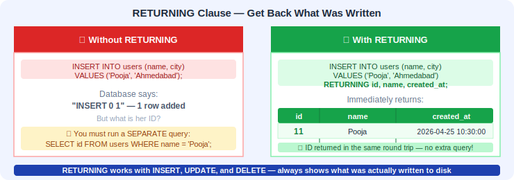

#### Example 6: INSERT INTO ... SELECT (Copy Data Between Tables)

You can insert rows by pulling data from another table — no need to type values manually!

```sql
-- First, create an archive table with the same structure
CREATE TABLE expensive_products (
    id SERIAL PRIMARY KEY,
    product_name VARCHAR(100),
    price DECIMAL(10, 2),
    category VARCHAR(50)
);

-- Copy all products over ₹5000 into the archive
INSERT INTO expensive_products (product_name, price, category)
SELECT product_name, price, category 
FROM products 
WHERE price > 5000;
```

This is incredibly useful for **data migration**, **archiving old records**, or **populating summary tables**.

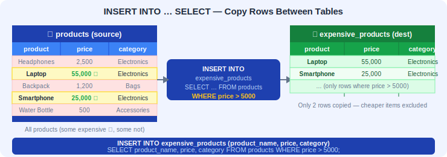

> ✅ **Checkpoint:** What happens if you try to insert a row without providing a value for a column that has no default and is NOT NULL? → You get an error!

> 📦 **Key Takeaway:** INSERT adds rows. Use multi-row INSERT for bulk data, RETURNING to get auto-generated values back, and INSERT INTO...SELECT to copy data between tables. Always ensure your values match the column types and constraints!

---

### 📖 READ — SELECT (Going Deeper)

We covered `SELECT` basics yesterday. Let's go deeper:

#### Example 7: Select All Users

```sql
SELECT * FROM users;
```

#### Example 8: Select Specific Columns

```sql
SELECT name, email FROM users;
```

#### Example 9: Select with WHERE

```sql
-- Users from Mumbai
SELECT * FROM users WHERE city = 'Mumbai';

-- Products under ₹2000
SELECT product_name, price FROM products WHERE price < 2000;
```

#### Example 10: Using Aliases for Readability

```sql
SELECT 
    product_name AS "Product", 
    price AS "Price (₹)", 
    stock AS "Available Stock" 
FROM products;
```

#### Example 11: Expressions in SELECT

```sql
-- Calculate price with 18% GST
SELECT 
    product_name, 
    price, 
    price * 0.18 AS gst,
    price * 1.18 AS price_with_gst 
FROM products;
```

#### Example 12: SELECT DISTINCT — Remove Duplicate Values

```sql
-- See all unique cities where users live
SELECT DISTINCT city FROM users;
```

#### Example 13: COUNT Rows

```sql
-- How many users do we have?
SELECT COUNT(*) AS total_users FROM users;

-- How many products are in the Electronics category?
SELECT COUNT(*) AS electronics_count FROM products WHERE category = 'Electronics';
```

> 📦 **Key Takeaway:** SELECT is the most used SQL command by far. In real applications, reads outnumber writes by 10:1 or even 100:1. Get comfortable with SELECT — you'll be writing it all day, every day!

---

### ✏️ UPDATE — Modifying Data

The `UPDATE` command changes existing data.

**Syntax:**
```sql
UPDATE table_name SET column1 = value1 WHERE condition;
```

> ⚠️ **CRITICAL RULE:** ALWAYS use `WHERE` with `UPDATE`. Without it, you'll update **EVERY** row in the table!

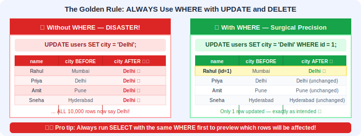

#### 🔬 What Happens Internally When You UPDATE?

An UPDATE is actually more complex than you'd think. Under the hood, most databases (including PostgreSQL) do this:

1. **Find the rows** — the database uses the WHERE clause to locate matching rows (using indexes if available).
2. **Lock the rows** — to prevent other users from modifying the same rows at the same time, the database places a lock.
3. **Create new row versions** — in PostgreSQL, an UPDATE doesn't modify the row in-place. Instead, it marks the old row as "dead" and inserts a **new version** of the row with the updated values. This is called **MVCC (Multi-Version Concurrency Control)**.
4. **Update indexes** — any indexes involving the changed columns are updated.
5. **Write to WAL** — the change is logged for crash recovery.
6. **Release locks** — once the transaction commits, the locks are released.

This is why UPDATE is more "expensive" than SELECT — it's doing a lot more work behind the scenes!

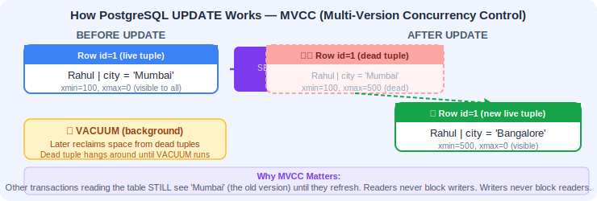

#### Example 14: Update a Single Record

```sql
-- Rahul moved to Bangalore
UPDATE users SET city = 'Bangalore' WHERE name = 'Rahul Sharma';
```

#### Example 15: Update Multiple Columns

```sql
-- Priya changed her email and city
UPDATE users 
SET email = 'priya.new@email.com', city = 'Gurgaon' 
WHERE name = 'Priya Patel';
```

#### Example 16: Update Based on a Condition

```sql
-- Give 10% discount on all Electronics
UPDATE products 
SET price = price * 0.90 
WHERE category = 'Electronics';
```

#### Example 17: Update Stock After a Sale

```sql
-- 5 laptops were sold
UPDATE products 
SET stock = stock - 5 
WHERE product_name = 'Laptop';
```

#### Example 18: Mark Product as Unavailable

```sql
UPDATE products 
SET is_available = false 
WHERE stock = 0;
```

#### Example 19: UPDATE with RETURNING Clause ✨

Just like INSERT, you can use RETURNING with UPDATE to see exactly what changed:

```sql
-- Give a 15% raise in price to all Footwear and see the result
UPDATE products 
SET price = price * 1.15 
WHERE category = 'Footwear'
RETURNING product_name, price AS new_price;
```

This immediately shows you the updated rows — no need to run a separate SELECT!

#### Example 20: UPDATE with AND/OR in WHERE

```sql
-- Increase stock for cheap accessories (price under ₹1000 AND category is Accessories)
UPDATE products 
SET stock = stock + 100 
WHERE category = 'Accessories' AND price < 1000;

-- Give a discount to products that are either overstocked OR in the Stationery category
UPDATE products 
SET price = price * 0.85 
WHERE stock > 400 OR category = 'Stationery';
```

> ✅ **Checkpoint:** What does `UPDATE users SET city = 'Delhi';` do (without WHERE)?
> 
> Answer: It changes the city of **ALL** users to Delhi! 😱 Always use WHERE!

> 📦 **Key Takeaway:** UPDATE modifies existing data in place. Always pair it with WHERE. Use RETURNING to verify your changes. When combining conditions, use AND (both must be true) and OR (either can be true) carefully!

---

### 🗑️ DELETE — Removing Data

The `DELETE` command removes rows from a table.

**Syntax:**
```sql
DELETE FROM table_name WHERE condition;
```

> ⚠️ **CRITICAL RULE:** ALWAYS use `WHERE` with `DELETE`. Without it, you'll delete **ALL** rows!

#### 🔬 What Happens Internally When You DELETE?

When you DELETE a row:

1. **Find the rows** — using the WHERE clause and available indexes.
2. **Lock the rows** — just like UPDATE, the rows are locked first.
3. **Mark as dead** — in PostgreSQL, the row isn't immediately erased from disk. It's marked as a "dead tuple." The space is reclaimed later by a background process called **VACUUM**.
4. **Update indexes** — index entries pointing to the deleted rows are cleaned up.
5. **Write to WAL** — the deletion is logged for crash safety.

This means DELETE is a "soft" operation at the physical level — the data hangs around temporarily. This is also why `TRUNCATE` (explained below) can be faster for removing ALL rows.

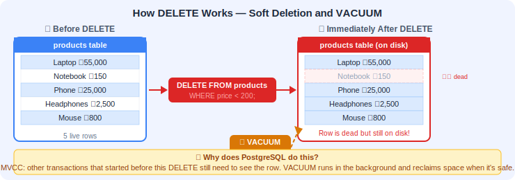

#### Example 21: Delete a Specific Record

```sql
-- Remove user Arjun Das
DELETE FROM users WHERE name = 'Arjun Das';
```

#### Example 22: Delete Based on a Condition

```sql
-- Remove all products that are out of stock
DELETE FROM products WHERE stock = 0;
```

#### Example 23: Delete All Rows (Use with caution!)

```sql
-- This removes EVERYTHING from the table (table structure remains)
DELETE FROM products;
```

#### Example 24: DELETE with RETURNING Clause ✨

Want to see exactly what you just deleted? RETURNING has your back:

```sql
-- Delete cheap products and see what was removed
DELETE FROM products 
WHERE price < 200
RETURNING product_name, price;
```

This is great for **audit logging** — you can capture the deleted data before it's gone.

#### Example 25: DELETE with AND/OR in WHERE

```sql
-- Delete users who are under 22 AND from Chennai
DELETE FROM users 
WHERE age < 22 AND city = 'Chennai';

-- Delete products that are unavailable OR have zero stock
DELETE FROM products 
WHERE is_available = false OR stock = 0;
```

#### Example 26: TRUNCATE vs DELETE — What's the Difference? 🤔

Both remove data, but they work very differently:

```sql
-- DELETE: Removes rows one by one, can use WHERE, logs each deletion
DELETE FROM products;

-- TRUNCATE: Removes ALL rows instantly, cannot use WHERE, minimal logging
TRUNCATE TABLE products;
```

| Feature            | `DELETE FROM table`             | `TRUNCATE TABLE table`             |
|--------------------|--------------------------------|------------------------------------|
| **Speed**          | Slower (row-by-row)            | Much faster (drops all at once)    |
| **WHERE clause**   | ✅ Yes                         | ❌ No                              |
| **RETURNING**      | ✅ Yes                         | ❌ No                              |
| **Triggers fired** | ✅ Yes                         | ❌ No                              |
| **Resets SERIAL**  | ❌ No (IDs continue counting)  | ✅ Yes (IDs restart from 1)        |
| **Rollback**       | ✅ Yes (in a transaction)      | ✅ Yes (in PostgreSQL)             |
| **Use when**       | Removing specific/some rows    | Wiping the entire table clean      |

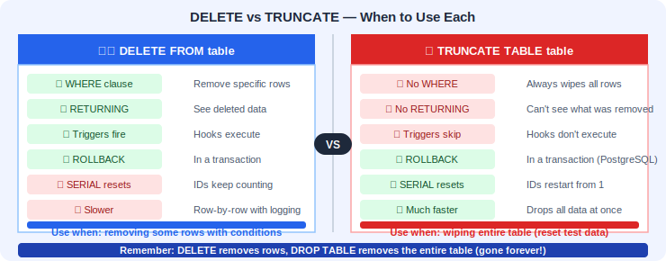

> 💡 **Rule of thumb:** Use `DELETE` when you need precision. Use `TRUNCATE` when you want to empty the entire table quickly (like resetting test data).

> 💡 **Note:** `DELETE FROM products` removes all data but keeps the table. `DROP TABLE products` deletes the table itself — gone forever!

> 📦 **Key Takeaway:** DELETE removes rows and logs each one. TRUNCATE is the "nuke" option — faster but less flexible. Use DELETE for surgical removal, TRUNCATE for full resets, and DROP TABLE only when you want the table gone entirely!

---

### 🔍 WHERE Clause — Deep Dive

The `WHERE` clause is used with `SELECT`, `UPDATE`, and `DELETE` to specify **which rows** to affect.

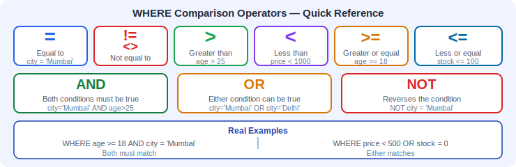

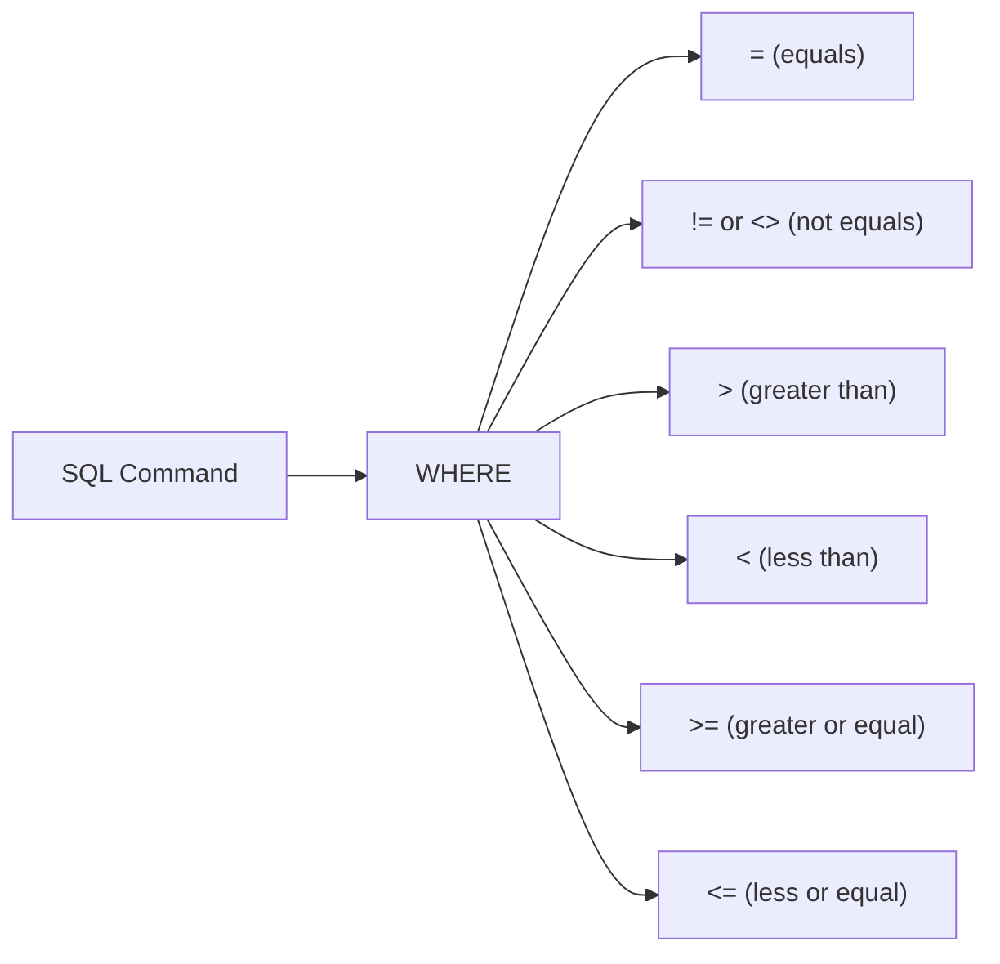

#### Example 27: Equals

```sql
SELECT * FROM users WHERE city = 'Mumbai';
```

#### Example 28: Not Equals

```sql
SELECT * FROM products WHERE category != 'Electronics';
-- OR
SELECT * FROM products WHERE category <> 'Electronics';
```

#### Example 29: Greater Than / Less Than

```sql
-- Users older than 25
SELECT * FROM users WHERE age > 25;

-- Products cheaper than ₹1000
SELECT * FROM products WHERE price < 1000;
```

#### Example 30: Greater/Less Than or Equal

```sql
-- Users aged 25 or older
SELECT * FROM users WHERE age >= 25;

-- Products with 100 or fewer in stock
SELECT * FROM products WHERE stock <= 100;
```

#### Example 31: Combining WHERE with UPDATE and DELETE

```sql
-- Update: Increase stock for cheap products
UPDATE products SET stock = stock + 50 WHERE price < 1000;

-- Delete: Remove users who are under 22
DELETE FROM users WHERE age < 22;
```

---

## 🌍 Real-World Scenario: A Day in the Life of an E-Commerce App

Let's follow a real user flow on **"ShopKart"**, a fictional e-commerce app, and see exactly what SQL runs behind the scenes.

---

**🕐 9:00 AM — Anita signs up for ShopKart**

```sql
INSERT INTO users (name, email, age, city) 
VALUES ('Anita Verma', 'anita@email.com', 27, 'Jaipur')
RETURNING id;
-- Returns: id = 15
```

The app gets back Anita's new user ID (15) and uses it to create her session.

---

**🕙 10:00 AM — Anita browses products**

```sql
-- She opens the Electronics category
SELECT product_name, price, stock 
FROM products 
WHERE category = 'Electronics' AND is_available = true;
```

The app shows her all available electronics.

---

**🕚 11:00 AM — Anita buys a Smartphone**

The backend runs two queries in a single transaction:

```sql
-- 1. Reduce stock by 1
UPDATE products 
SET stock = stock - 1 
WHERE product_name = 'Smartphone' AND stock > 0
RETURNING stock AS remaining_stock;

-- 2. Record the order (in a hypothetical orders table)
INSERT INTO orders (user_id, product_id, quantity, order_date)
VALUES (15, 2, 1, CURRENT_TIMESTAMP);
```

Notice the `stock > 0` check — this prevents overselling!

---

**🕐 1:00 PM — Anita updates her shipping address**

```sql
UPDATE users 
SET city = 'Udaipur' 
WHERE id = 15
RETURNING name, city;
-- Returns: Anita Verma | Udaipur
```

---

**🕓 4:00 PM — Anita cancels her order**

```sql
-- Remove the order
DELETE FROM orders 
WHERE user_id = 15 AND product_id = 2
RETURNING *;

-- Restore the stock
UPDATE products 
SET stock = stock + 1 
WHERE product_name = 'Smartphone';
```

---

> 📦 **Key Takeaway:** In real applications, CRUD operations work together in sequences. A single user action (like "buy a product") often triggers multiple SQL commands. Understanding each operation individually lets you compose them into powerful workflows!

---

## 🛡️ Safety Checklist — Before Running UPDATE or DELETE

Running UPDATE or DELETE on a production database can be nerve-wracking. Use this checklist every time:

- [ ] **1. Am I on the right database?** Double-check with `SELECT current_database();`
- [ ] **2. Do I have a WHERE clause?** If not, STOP. You're about to affect every row.
- [ ] **3. Did I preview with SELECT first?** Run the same WHERE with a SELECT to see which rows will be affected:
  ```sql
  -- PREVIEW first
  SELECT * FROM users WHERE city = 'Mumbai';
  -- Only THEN delete
  DELETE FROM users WHERE city = 'Mumbai';
  ```
- [ ] **4. How many rows will be affected?** Use COUNT to check:
  ```sql
  SELECT COUNT(*) FROM products WHERE price < 100;
  ```
- [ ] **5. Am I inside a transaction?** For critical operations, wrap in a transaction so you can ROLLBACK if something goes wrong:
  ```sql
  BEGIN;
  DELETE FROM users WHERE age < 18;
  -- Check the result... if it looks wrong:
  ROLLBACK;
  -- If it looks right:
  COMMIT;
  ```
- [ ] **6. Do I have a backup?** For large-scale changes on production, make sure there's a recent backup.
- [ ] **7. Is anyone else using this data right now?** Coordinate with your team to avoid conflicts during big changes.

> 💡 **Pro Tip from the trenches:** Many senior developers have horror stories about running an UPDATE or DELETE without WHERE on a production database. Using this checklist will save you from joining that club!

---

## 🧪 6. Hands-on Practice

**Problem 1:** Insert a new user named "Sara Khan", age 26, from "Lucknow", email "sara@email.com".

<details>
<summary>💡 Solution</summary>

```sql
INSERT INTO users (name, email, age, city) 
VALUES ('Sara Khan', 'sara@email.com', 26, 'Lucknow');
```

</details>

**Problem 2:** Show the names and prices of all products in the "Accessories" category.

<details>
<summary>💡 Solution</summary>

```sql
SELECT product_name, price FROM products WHERE category = 'Accessories';
```

</details>

**Problem 3:** Update Sneha Reddy's age to 31.

<details>
<summary>💡 Solution</summary>

```sql
UPDATE users SET age = 31 WHERE name = 'Sneha Reddy';
```

</details>

**Problem 4:** Delete all products that cost less than ₹200.

<details>
<summary>💡 Solution</summary>

```sql
DELETE FROM products WHERE price < 200;
```

</details>

**Problem 5:** Show all users who are NOT from Mumbai.

<details>
<summary>💡 Solution</summary>

```sql
SELECT * FROM users WHERE city != 'Mumbai';
```

</details>

**Problem 6:** Insert 3 new products of your choice into the products table.

<details>
<summary>💡 Solution</summary>

```sql
INSERT INTO products (product_name, price, category, stock) VALUES
('Tablet', 18000.00, 'Electronics', 60),
('Sunglasses', 2000.00, 'Accessories', 90),
('T-Shirt', 800.00, 'Clothing', 200);
```

</details>

**Problem 7:** Increase the price of all "Accessories" by ₹100.

<details>
<summary>💡 Solution</summary>

```sql
UPDATE products SET price = price + 100 WHERE category = 'Accessories';
```

</details>

---

**Problem 8:** Insert a new user and use RETURNING to get their auto-generated `id` and `created_at` timestamp.

<details>
<summary>💡 Solution</summary>

```sql
INSERT INTO users (name, email, age, city) 
VALUES ('Deepak Rao', 'deepak@email.com', 31, 'Mysore')
RETURNING id, created_at;
```

</details>

**Problem 9:** Update the stock of all products in the "Electronics" category — set stock to 0 — and use RETURNING to see which products were affected.

<details>
<summary>💡 Solution</summary>

```sql
UPDATE products 
SET stock = 0 
WHERE category = 'Electronics'
RETURNING product_name, stock;
```

</details>

**Problem 10:** Delete all users from "Pune" and return their names so you know who was removed.

<details>
<summary>💡 Solution</summary>

```sql
DELETE FROM users 
WHERE city = 'Pune'
RETURNING name, email;
```

</details>

**Problem 11:** Write a query to copy all products in the "Home" category into a new table called `home_products` (create the table first, then use INSERT INTO ... SELECT).

<details>
<summary>💡 Solution</summary>

```sql
CREATE TABLE home_products (
    id SERIAL PRIMARY KEY,
    product_name VARCHAR(100),
    price DECIMAL(10, 2),
    stock INT
);

INSERT INTO home_products (product_name, price, stock)
SELECT product_name, price, stock 
FROM products 
WHERE category = 'Home';
```

</details>

---

## ⚠️ 7. Common Mistakes

| #  | Mistake                                 | What Goes Wrong                                                                 | Correct Way                                              |
|----|-----------------------------------------|---------------------------------------------------------------------------------|----------------------------------------------------------|
| 1  | `UPDATE` without `WHERE`               | Updates ALL rows                                                                | Always add `WHERE` to target specific rows               |
| 2  | `DELETE` without `WHERE`               | Deletes ALL rows                                                                | Always add `WHERE` to target specific rows               |
| 3  | Using double quotes for values          | `'Rahul'` is correct, `"Rahul"` is not (in PostgreSQL, double quotes are for identifiers) | Use single quotes: `'Rahul'`                             |
| 4  | Forgetting commas between values        | `INSERT INTO users VALUES ('A' 'B')`                                            | `INSERT INTO users VALUES ('A', 'B')`                    |
| 5  | Not matching column count with values   | `INSERT INTO users (name, age) VALUES ('Rahul')` — missing age value            | Provide a value for every column listed                  |
| 6  | Confusing `DELETE` with `DROP`          | `DROP TABLE` removes the entire table                                           | `DELETE` removes rows, `DROP` removes the table          |
| 7  | Using `=` instead of `IS` for NULL     | `WHERE city = NULL` returns nothing!                                            | Use `WHERE city IS NULL` to check for NULLs              |
| 8  | Forgetting to commit a transaction      | Changes seem to "disappear" after disconnect                                    | Always `COMMIT` after `BEGIN` or use auto-commit mode    |
| 9  | Updating with wrong data type           | `UPDATE users SET age = 'twenty'` fails because age is INT                      | Always match the data type: `SET age = 20`               |

> 💡 **Pro Tip:** Before running an `UPDATE` or `DELETE`, first run a `SELECT` with the same `WHERE` clause to preview which rows will be affected:
> ```sql
> -- Preview first
> SELECT * FROM users WHERE city = 'Mumbai';
> -- Then delete if it looks right
> DELETE FROM users WHERE city = 'Mumbai';
> ```

---

## 📋 Quick Reference Card — CRUD Commands Cheat Sheet

Keep this handy while you practice!

### ➕ INSERT (Create)
```sql
-- Single row
INSERT INTO table (col1, col2) VALUES ('val1', 'val2');

-- Multiple rows
INSERT INTO table (col1, col2) VALUES ('a', 'b'), ('c', 'd');

-- With RETURNING
INSERT INTO table (col1) VALUES ('val') RETURNING id;

-- From another table
INSERT INTO table2 (col1) SELECT col1 FROM table1 WHERE condition;
```

### 📖 SELECT (Read)
```sql
-- All columns
SELECT * FROM table;

-- Specific columns
SELECT col1, col2 FROM table;

-- With filter
SELECT * FROM table WHERE condition;

-- With alias
SELECT col1 AS "Friendly Name" FROM table;

-- With expression
SELECT col1, col1 * 1.18 AS with_tax FROM table;
```

### ✏️ UPDATE (Update)
```sql
-- Basic update
UPDATE table SET col1 = 'new_val' WHERE condition;

-- Multiple columns
UPDATE table SET col1 = 'a', col2 = 'b' WHERE condition;

-- With RETURNING
UPDATE table SET col1 = 'a' WHERE condition RETURNING *;

-- Math operations
UPDATE table SET price = price * 0.9 WHERE condition;
```

### 🗑️ DELETE (Delete)
```sql
-- Specific rows
DELETE FROM table WHERE condition;

-- With RETURNING
DELETE FROM table WHERE condition RETURNING *;

-- All rows (careful!)
DELETE FROM table;

-- Faster full wipe
TRUNCATE TABLE table;
```

### 🔍 WHERE Operators
```sql
=    -- Equal to
!=   -- Not equal to (also <>)
>    -- Greater than
<    -- Less than
>=   -- Greater than or equal
<=   -- Less than or equal
AND  -- Both conditions must be true
OR   -- Either condition can be true
```

---

## 📝 8. Mini Assignment

### 🎯 Task: Build a Library System

1. Create a database called `library_db`
2. Create a table called `books` with columns:
   - `id` (auto-increment primary key)
   - `title` (text, max 200)
   - `author` (text, max 100)
   - `genre` (text, max 50)
   - `price` (decimal)
   - `published_year` (integer)
   - `is_available` (boolean, default true)

3. Insert at least 8 books

4. Perform these operations:
   - **READ:** Show all books
   - **READ:** Show books published after 2010
   - **READ:** Show only book titles and authors
   - **UPDATE:** Change the price of one book
   - **UPDATE:** Mark a book as unavailable
   - **DELETE:** Remove a book by its title
   - **READ:** Count how many books remain

<details>
<summary>💡 Solution</summary>

```sql
CREATE DATABASE library_db;
\c library_db

CREATE TABLE books (
    id SERIAL PRIMARY KEY,
    title VARCHAR(200),
    author VARCHAR(100),
    genre VARCHAR(50),
    price DECIMAL(8, 2),
    published_year INT,
    is_available BOOLEAN DEFAULT true
);

INSERT INTO books (title, author, genre, price, published_year) VALUES
('The Alchemist', 'Paulo Coelho', 'Fiction', 350.00, 1988),
('Sapiens', 'Yuval Noah Harari', 'Non-Fiction', 550.00, 2011),
('Harry Potter', 'J.K. Rowling', 'Fantasy', 450.00, 1997),
('Clean Code', 'Robert C. Martin', 'Technology', 800.00, 2008),
('Atomic Habits', 'James Clear', 'Self-Help', 400.00, 2018),
('1984', 'George Orwell', 'Fiction', 300.00, 1949),
('The Lean Startup', 'Eric Ries', 'Business', 500.00, 2011),
('Wings of Fire', 'A.P.J. Abdul Kalam', 'Biography', 250.00, 1999);

-- Show all books
SELECT * FROM books;

-- Books published after 2010
SELECT * FROM books WHERE published_year > 2010;

-- Only titles and authors
SELECT title, author FROM books;

-- Update price
UPDATE books SET price = 900.00 WHERE title = 'Clean Code';

-- Mark unavailable
UPDATE books SET is_available = false WHERE title = '1984';

-- Delete a book
DELETE FROM books WHERE title = 'The Lean Startup';

-- Count remaining
SELECT COUNT(*) FROM books;
```

</details>

---

## 🔁 9. Recap

- ✅ **CRUD** stands for Create, Read, Update, Delete — the 4 core database operations
- ✅ `INSERT INTO` adds new rows to a table
- ✅ `SELECT` reads/retrieves data from a table
- ✅ `UPDATE` modifies existing rows (always use `WHERE`!)
- ✅ `DELETE` removes rows from a table (always use `WHERE`!)
- ✅ `WHERE` filters which rows are affected by your query
- ✅ Comparison operators: `=`, `!=`, `<>`, `>`, `<`, `>=`, `<=`
- ✅ `RETURNING` lets you see the result of INSERT, UPDATE, and DELETE immediately
- ✅ `INSERT INTO ... SELECT` lets you copy data between tables
- ✅ `TRUNCATE` is faster than `DELETE` for removing all rows, but offers less control
- ✅ **Safety tip:** Preview with `SELECT` before running `UPDATE` or `DELETE`
- ✅ **Safety tip:** Use `BEGIN` / `COMMIT` / `ROLLBACK` for critical changes
- ✅ `DELETE` removes data; `DROP TABLE` removes the whole table

---
