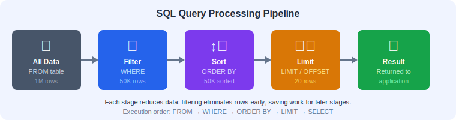
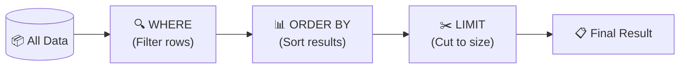
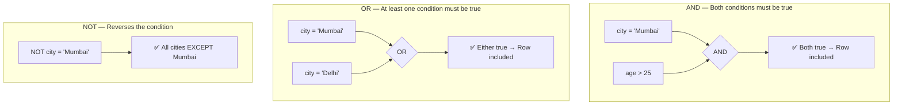
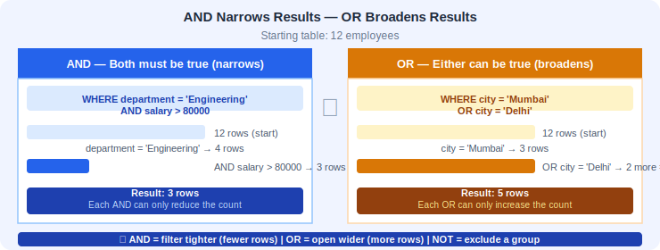
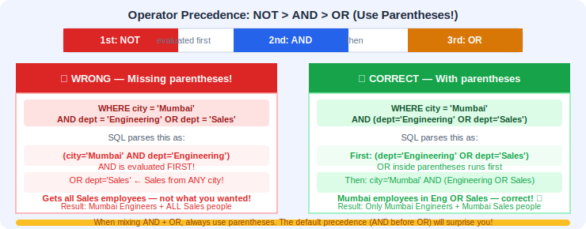
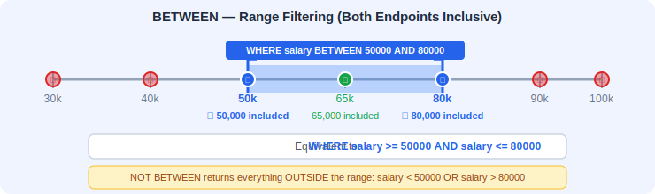
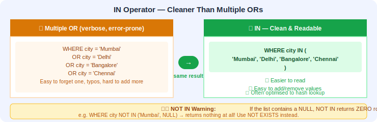
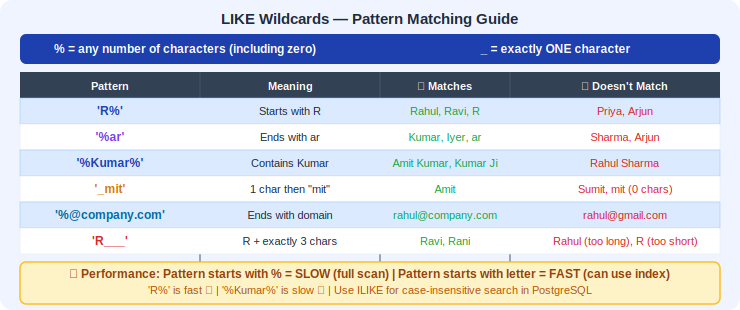

# 📅 Day 3: Filtering & Sorting Data
---

## 📖 1. Introduction

### What will we learn today?
- Advanced filtering with `AND`, `OR`, `NOT`
- Range filtering with `BETWEEN`
- List matching with `IN`
- Pattern matching with `LIKE`
- Handling missing data with `IS NULL` / `IS NOT NULL`
- Sorting results with `ORDER BY`
- Limiting results with `LIMIT` and `OFFSET`

### Why is this important?
Real databases have **millions** of rows. You never want to see all of them. You need to:
- **Filter** — Show me only electronics under ₹5000
- **Sort** — Show cheapest first
- **Limit** — Show only the top 10

This is exactly what Amazon, Netflix, and every app does behind the scenes!

### How Does the Database Engine Process These Clauses?

When you write a query like `SELECT ... FROM ... WHERE ... ORDER BY ... LIMIT ...`, the database doesn't just read it left to right. Internally, it follows a specific **logical execution order**:

1. **FROM** — The engine first identifies which table(s) to read from. It loads the relevant data pages from disk into memory.
2. **WHERE** — Next, it scans through rows and applies your filter conditions. Rows that don't match are discarded early — this is why filtering is so powerful for performance. If an **index** exists on the filtered column, the engine can skip directly to matching rows instead of scanning every single one (like using a book's index instead of reading every page).
3. **ORDER BY** — After filtering, the surviving rows are sorted. The engine uses sorting algorithms (like quicksort or merge sort) in memory. If the result set is too large for memory, it spills to disk (called an "external sort"), which is slower.
4. **LIMIT / OFFSET** — Finally, the engine counts off the requested number of rows and returns only those. This step is very cheap since the heavy work is already done.

Think of it like a restaurant kitchen: the **FROM** is choosing which pantry to open, the **WHERE** is picking only the fresh ingredients, the **ORDER BY** is arranging them neatly on the counter, and the **LIMIT** is plating just the portion the customer ordered.

> 🎯 **Key Takeaway:** Understanding execution order helps you write better queries. Filtering happens before sorting, so a good WHERE clause reduces the amount of data the database needs to sort — making your query faster.

---

## 🧠 2. Concept Explanation

### The Filter & Sort Pipeline





**Real-world analogy:**
1. You go to Amazon and see **all products** (the full table)
2. You apply **filters** (category: Electronics, price: under ₹5000) → `WHERE`
3. You click **"Sort by: Price Low to High"** → `ORDER BY`
4. You see **page 1 with 20 items** → `LIMIT`

### Why This Order Matters

The pipeline is not just a convenience — it's an optimization strategy. By filtering **first**, the database reduces the number of rows that need to be sorted. Sorting is computationally expensive (O(n log n) complexity), so working with fewer rows is always better. Finally, LIMIT chops off everything you don't need, saving network bandwidth when sending results to your application.

Imagine you have 10 million products. Without WHERE, the database must sort all 10 million rows. With `WHERE category = 'Electronics'`, maybe only 500,000 rows need sorting. With LIMIT 20, you only transfer 20 rows over the network. Each stage dramatically reduces the work for the next stage.

> 🎯 **Key Takeaway:** The WHERE → ORDER BY → LIMIT pipeline progressively reduces data at each step. Always filter as aggressively as possible to make sorting and pagination fast.

---

## 💡 3. Visual Learning

### How Logical Operators Work



### How the Database Evaluates Logical Operators

Under the hood, the database evaluates logical operators using **short-circuit evaluation**:

- **AND**: If the first condition is `false`, the engine skips the second condition entirely (no need to check — the result is already `false`). This is why you should put the most restrictive condition first.
- **OR**: If the first condition is `true`, the engine skips the second condition (the result is already `true`).
- **NOT**: Simply inverts the boolean result of the inner condition.

This is exactly how `&&` and `||` work in programming languages like Java, Python, or JavaScript!

> 🎯 **Key Takeaway:** Place the most selective (restrictive) condition first in AND chains, and the least selective condition first in OR chains. This lets the database skip unnecessary checks through short-circuit evaluation.

---

## 🖥️ 4. Setup

Let's use our existing tables. If you're starting fresh:

```sql
CREATE DATABASE shop_db;
\c shop_db

CREATE TABLE employees (
    id SERIAL PRIMARY KEY,
    name VARCHAR(100),
    department VARCHAR(50),
    salary DECIMAL(10, 2),
    age INT,
    city VARCHAR(50),
    join_date DATE,
    email VARCHAR(150)
);

INSERT INTO employees (name, department, salary, age, city, join_date, email) VALUES
('Rahul Sharma', 'Engineering', 75000.00, 28, 'Mumbai', '2020-03-15', 'rahul@company.com'),
('Priya Patel', 'Marketing', 55000.00, 32, 'Delhi', '2019-07-01', 'priya@company.com'),
('Amit Kumar', 'Engineering', 82000.00, 35, 'Bangalore', '2018-01-10', 'amit@company.com'),
('Sneha Reddy', 'HR', 48000.00, 26, 'Hyderabad', '2021-06-20', NULL),
('Vikram Singh', 'Engineering', 90000.00, 40, 'Mumbai', '2015-11-05', 'vikram@company.com'),
('Neha Gupta', 'Marketing', 60000.00, 29, 'Delhi', '2020-09-12', 'neha@company.com'),
('Arjun Das', 'Sales', 45000.00, 24, 'Kolkata', '2022-02-28', NULL),
('Kavita Nair', 'HR', 52000.00, 31, 'Bangalore', '2019-04-18', 'kavita@company.com'),
('Ravi Joshi', 'Sales', 47000.00, 27, 'Pune', '2021-08-03', 'ravi@company.com'),
('Meera Iyer', 'Engineering', 85000.00, 33, 'Chennai', '2017-12-22', 'meera@company.com'),
('Suresh Menon', 'Sales', 42000.00, 23, 'Mumbai', '2023-01-15', 'suresh@company.com'),
('Divya Krishnan', 'Marketing', 58000.00, 30, 'Chennai', '2020-05-10', NULL);

CREATE TABLE products (
    id SERIAL PRIMARY KEY,
    product_name VARCHAR(100),
    price DECIMAL(10, 2),
    category VARCHAR(50),
    stock INT,
    rating DECIMAL(2, 1),
    brand VARCHAR(50)
);

INSERT INTO products (product_name, price, category, stock, rating, brand) VALUES
('Laptop Pro', 75000.00, 'Electronics', 30, 4.5, 'TechBrand'),
('Smartphone X', 25000.00, 'Electronics', 150, 4.2, 'PhoneCo'),
('Wireless Headphones', 3500.00, 'Electronics', 200, 4.7, 'SoundMax'),
('Running Shoes', 4500.00, 'Footwear', 80, 4.3, 'RunFast'),
('Cotton T-Shirt', 800.00, 'Clothing', 300, 3.8, 'WearIt'),
('Backpack', 1500.00, 'Bags', 120, 4.1, 'PackPro'),
('Water Bottle', 500.00, 'Accessories', 400, 4.0, 'HydroLife'),
('Desk Lamp', 1200.00, 'Home', 90, 3.5, 'BrightHome'),
('Gaming Mouse', 2200.00, 'Electronics', 175, 4.6, 'TechBrand'),
('Yoga Mat', 1000.00, 'Fitness', 60, 4.4, 'FitGear'),
('Bluetooth Speaker', 3000.00, 'Electronics', 100, 4.3, 'SoundMax'),
('Leather Wallet', 1800.00, 'Accessories', 200, 4.0, 'LeatherCo');
```

---

## 📝 5. Syntax + Examples

---

### 🔗 AND — Both Conditions Must Be True



**Analogy:** "I want a shirt that is **blue AND under ₹1000**" — both must match.

**How it works under the hood:** When the database encounters an AND, it evaluates both conditions for each row. If the first condition is false, it immediately skips the row without checking the second condition (short-circuit evaluation). This means the database does less work when the first condition eliminates many rows.

```sql
-- Employees in Engineering AND earning more than 80000
SELECT name, department, salary 
FROM employees 
WHERE department = 'Engineering' AND salary > 80000;
```

**Result:**

| name | department | salary |
|------|-----------|--------|
| Amit Kumar | Engineering | 82000.00 |
| Vikram Singh | Engineering | 90000.00 |
| Meera Iyer | Engineering | 85000.00 |

#### Example 2: Products in Electronics Under ₹5000

```sql
SELECT product_name, price, category 
FROM products 
WHERE category = 'Electronics' AND price < 5000;
```

#### Example 3: Multiple AND Conditions

```sql
-- Employees from Mumbai, in Engineering, older than 30
SELECT name, city, department, age 
FROM employees 
WHERE city = 'Mumbai' AND department = 'Engineering' AND age > 30;
```

> 🎯 **Key Takeaway:** AND narrows your results. Each additional AND condition can only reduce or maintain the number of rows — never increase them. Think of AND as applying multiple filters simultaneously.

---

### 🔀 OR — At Least One Condition Must Be True

**Analogy:** "Show me products that are either **Electronics OR Footwear**" — either one works.

**How it works under the hood:** With OR, the database checks each condition and includes the row if **any** condition is true. Unlike AND, OR **broadens** results — each additional OR condition can only increase or maintain the row count. The database may need to scan more of the table since it's looking for rows matching any of the conditions.

#### Example 4: Employees from Mumbai OR Delhi

```sql
SELECT name, city 
FROM employees 
WHERE city = 'Mumbai' OR city = 'Delhi';
```

#### Example 5: Products in Electronics OR Fitness

```sql
SELECT product_name, category, price 
FROM products 
WHERE category = 'Electronics' OR category = 'Fitness';
```

> 🎯 **Key Takeaway:** OR broadens your results. When you have multiple OR conditions on the same column (like `city = 'Mumbai' OR city = 'Delhi'`), prefer using `IN` instead — it's cleaner and often faster.

---

### 🚫 NOT — Reverses the Condition

**Analogy:** "Show me everything that is **NOT** Electronics"

**How it works under the hood:** NOT simply flips the boolean result of a condition. However, be aware that NOT can make queries harder for the database to optimize. A condition like `WHERE NOT department = 'Engineering'` often forces a **full table scan** because the database can't efficiently use an index to find "everything except" a value — it's easier to look up what matches than what doesn't.

#### Example 6: Employees NOT in Engineering

```sql
SELECT name, department 
FROM employees 
WHERE NOT department = 'Engineering';
-- OR equivalently:
SELECT name, department 
FROM employees 
WHERE department != 'Engineering';
```

> 🎯 **Key Takeaway:** NOT is powerful but use it wisely. Prefer positive conditions when possible, as they are easier for the database to optimize with indexes.

---

### 🔗 Combining AND, OR, NOT

> ⚠️ **Important:** `AND` is evaluated before `OR`. Use parentheses `()` to control order!



**Why does this happen?** Just like in math where multiplication is done before addition (2 + 3 * 4 = 14, not 20), SQL has **operator precedence**: NOT is evaluated first, then AND, then OR. This default order can produce surprising results if you're not careful. **Always use parentheses** to make your intent explicit — it also makes your query easier to read for other developers.

#### Example 7: Complex Conditions

```sql
-- Employees from Mumbai in Engineering OR Sales
-- WRONG (confusing):
SELECT name, city, department FROM employees 
WHERE city = 'Mumbai' AND department = 'Engineering' OR department = 'Sales';

-- CORRECT (use parentheses):
SELECT name, city, department FROM employees 
WHERE city = 'Mumbai' AND (department = 'Engineering' OR department = 'Sales');
```

The first query means: `(Mumbai AND Engineering) OR (Sales anywhere)` — not what you wanted!

The second query means: `Mumbai AND (Engineering OR Sales)` — correct!

> 🎯 **Key Takeaway:** Always use parentheses when mixing AND and OR. It prevents bugs and makes your intent crystal clear. SQL's operator precedence (NOT > AND > OR) can trip up even experienced developers.

---

### 📏 BETWEEN — Range Filtering

**Analogy:** "Show me products priced **between ₹1000 and ₹5000**"

**Syntax:** `WHERE column BETWEEN low AND high` (inclusive on both ends)



**How it works under the hood:** BETWEEN is syntactic sugar — the database internally converts `column BETWEEN a AND b` into `column >= a AND column <= b`. However, BETWEEN is preferred for readability. When an index exists on the column, the database can perform a highly efficient **index range scan** — it jumps to the start of the range and reads sequentially until the end, skipping everything outside the range. This is one of the most index-friendly operations.

#### Example 8: Salary Range

```sql
SELECT name, salary 
FROM employees 
WHERE salary BETWEEN 50000 AND 80000;
```

This is the same as:
```sql
SELECT name, salary 
FROM employees 
WHERE salary >= 50000 AND salary <= 80000;
```

#### Example 9: Date Range

```sql
-- Employees who joined between 2020 and 2021
SELECT name, join_date 
FROM employees 
WHERE join_date BETWEEN '2020-01-01' AND '2021-12-31';
```

#### Example 10: Age Range

```sql
SELECT name, age FROM employees WHERE age BETWEEN 25 AND 30;
```

#### Example: NOT BETWEEN — Exclude a Range

```sql
-- Find employees whose salary is NOT in the 50000-80000 range
SELECT name, salary 
FROM employees 
WHERE salary NOT BETWEEN 50000 AND 80000;
```

This returns employees earning less than 50,000 or more than 80,000. It's equivalent to `salary < 50000 OR salary > 80000`.

#### Example: Combining BETWEEN with IN

```sql
-- Find employees in Engineering or Marketing who earn between 50000 and 90000
SELECT name, department, salary 
FROM employees 
WHERE department IN ('Engineering', 'Marketing') 
  AND salary BETWEEN 50000 AND 90000;
```

This is a common real-world pattern: filter by category first (IN), then narrow down by a numeric range (BETWEEN).

> 🎯 **Key Takeaway:** BETWEEN is inclusive on both ends. Remember that `NOT BETWEEN` excludes the boundaries too. For date ranges, be careful — `BETWEEN '2020-01-01' AND '2020-12-31'` does NOT include timestamps on Dec 31 after midnight (like '2020-12-31 15:30:00' in a TIMESTAMP column).

---

### 📋 IN — Match Against a List

**Analogy:** "Show me products from these categories: Electronics, Fitness, Footwear"

**Syntax:** `WHERE column IN (value1, value2, value3)`



**How it works under the hood:** IN is functionally equivalent to multiple OR conditions, but the database optimizer can often handle IN more efficiently. With an indexed column, the database may convert the IN list into multiple index lookups and merge the results. Some databases even sort the IN list internally to perform faster comparisons. For large lists, databases may convert the IN clause into a temporary hash table for O(1) lookups per row.

#### Example 11: Cities in a List

```sql
SELECT name, city 
FROM employees 
WHERE city IN ('Mumbai', 'Delhi', 'Bangalore');
```

This is cleaner than:
```sql
SELECT name, city FROM employees 
WHERE city = 'Mumbai' OR city = 'Delhi' OR city = 'Bangalore';
```

#### Example 12: NOT IN

```sql
-- Products NOT in these categories
SELECT product_name, category 
FROM products 
WHERE category NOT IN ('Electronics', 'Clothing');
```

> 🎯 **Key Takeaway:** Always prefer IN over multiple OR conditions on the same column. It's more readable, less error-prone, and often optimized better by the database engine. Be careful with NOT IN when NULL values are involved — if the list contains a NULL, NOT IN returns no rows!

---

### 🔍 LIKE — Pattern Matching

**Analogy:** "Search for users whose name **starts with 'R'**" — like a search bar!

**How it works under the hood:** LIKE performs pattern matching character by character. When your pattern starts with a **literal prefix** (e.g., `'R%'`), the database can use an index to jump directly to the 'R' section — this is very fast. But when the pattern starts with a wildcard (e.g., `'%Kumar%'`), the database **must scan every single row** because it can't predict where matches will be. This is why `LIKE '%something%'` queries can be slow on large tables.

**Wildcards:**
- `%` — matches **any number** of characters (including zero)
- `_` — matches **exactly one** character



#### Complete Wildcard Pattern Reference

| Pattern | Meaning | Example | Matches | Doesn't Match |
|---------|---------|---------|---------|----------------|
| `'R%'` | Starts with R | `WHERE name LIKE 'R%'` | Rahul, Ravi, R | Arjun, Priya |
| `'%ar'` | Ends with ar | `WHERE name LIKE '%ar'` | Kumar, ar | Sharma, Arjun |
| `'%Kumar%'` | Contains Kumar anywhere | `WHERE name LIKE '%Kumar%'` | Amit Kumar, Kumar Ji | Rahul Sharma |
| `'_mit'` | Exactly one char before "mit" | `WHERE name LIKE '_mit'` | Amit | Sumit, mit |
| `'__a%'` | Third character is 'a' | `WHERE name LIKE '__a%'` | Prachi, Shanti | Amit, Ravi |
| `'R___'` | Starts with R, exactly 4 chars | `WHERE name LIKE 'R___'` | Ravi, Rani | Rahul, R |
| `'%@gmail.com'` | Ends with @gmail.com | `WHERE email LIKE '%@gmail.com'` | user@gmail.com | user@yahoo.com |
| `'____%'` | At least 4 characters | `WHERE name LIKE '____%'` | Rahul, Amit | Raj, Al |
| `'A%a'` | Starts with A, ends with a | `WHERE name LIKE 'A%a'` | Abha, Anuradha | Amit, Arjun |

#### Example 13: Names Starting with 'R'

```sql
SELECT name FROM employees WHERE name LIKE 'R%';
```

Result: Rahul Sharma, Ravi Joshi

#### Example 14: Names Ending with 'ar'

```sql
SELECT name FROM employees WHERE name LIKE '%ar';
```

#### Example 15: Names Containing 'Kumar'

```sql
SELECT name FROM employees WHERE name LIKE '%Kumar%';
```

#### Example 16: Email Pattern

```sql
-- Find all emails from company.com
SELECT name, email FROM employees WHERE email LIKE '%@company.com';
```

#### Example 17: Single Character Wildcard

```sql
-- Names with exactly 4 characters in first name
SELECT name FROM employees WHERE name LIKE '____ %';
```

The four underscores match exactly 4 characters before the space.

#### Example 18: Case-Insensitive Search (PostgreSQL)

```sql
-- ILIKE is PostgreSQL-specific for case-insensitive matching
SELECT name FROM employees WHERE name ILIKE '%kumar%';
```

#### Example: NOT LIKE — Exclude a Pattern

```sql
-- Find employees whose name does NOT start with 'R'
SELECT name FROM employees WHERE name NOT LIKE 'R%';
```

This returns everyone except Rahul Sharma and Ravi Joshi. NOT LIKE is useful when you want to exclude a specific pattern from your results.

#### Example: LIKE with Multiple Patterns Using OR

```sql
-- Find employees whose name starts with 'R' OR contains 'Patel'
SELECT name, department 
FROM employees 
WHERE name LIKE 'R%' OR name LIKE '%Patel%';
```

You can chain as many LIKE conditions as needed with OR. This is how search features often work — matching against multiple possible patterns.

```sql
-- Find products that contain 'Wireless', 'Bluetooth', or 'Gaming' in the name
SELECT product_name, price 
FROM products 
WHERE product_name LIKE '%Wireless%' 
   OR product_name LIKE '%Bluetooth%' 
   OR product_name LIKE '%Gaming%';
```

> 🎯 **Key Takeaway:** LIKE is powerful but can be slow. Patterns starting with `%` force full table scans. Prefer `ILIKE` in PostgreSQL for case-insensitive searches. For complex text search needs, consider PostgreSQL's Full Text Search (`tsvector`/`tsquery`) instead of multiple LIKE clauses.

---

### ❓ IS NULL / IS NOT NULL — Handling Missing Data

**Analogy:** Some fields might be empty (like a WhatsApp user who hasn't set a profile picture). `NULL` means "no value."

**How it works under the hood:** NULL in SQL is special — it's not zero, not an empty string, not false. It represents the **absence of a value**. This is why you can't use `= NULL` — any comparison with NULL returns `UNKNOWN` (not true, not false). Even `NULL = NULL` is UNKNOWN! SQL uses **three-valued logic** (true, false, unknown) specifically because of NULL. The `IS NULL` operator is a special check that handles this correctly.

> ⚠️ You **cannot** use `= NULL` or `!= NULL`. You **must** use `IS NULL` or `IS NOT NULL`.

#### Example 19: Find Employees Without Email

```sql
SELECT name, email FROM employees WHERE email IS NULL;
```

Result: Sneha Reddy, Arjun Das, Divya Krishnan

#### Example 20: Find Employees WITH Email

```sql
SELECT name, email FROM employees WHERE email IS NOT NULL;
```

> 🎯 **Key Takeaway:** NULL is not a value — it's the absence of one. Always use IS NULL / IS NOT NULL, never `= NULL`. Be extra careful with NULL in NOT IN clauses: `WHERE city NOT IN ('Mumbai', NULL)` returns zero rows because the comparison with NULL is UNKNOWN.

---
