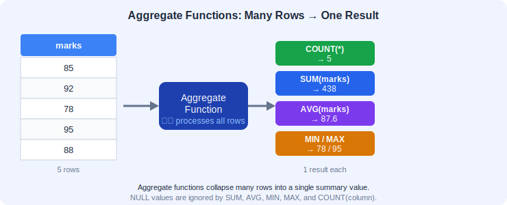
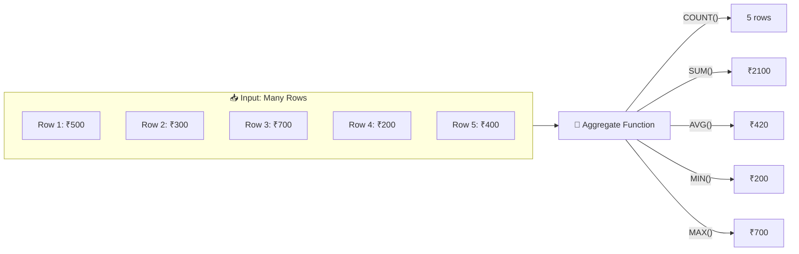
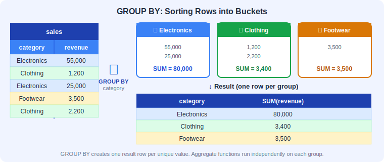
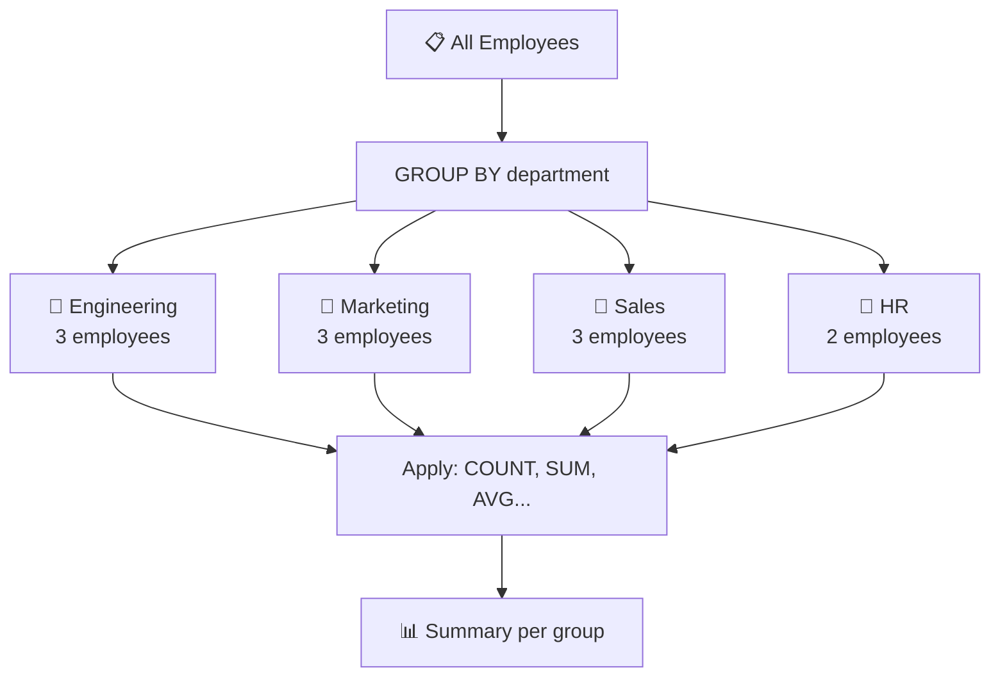
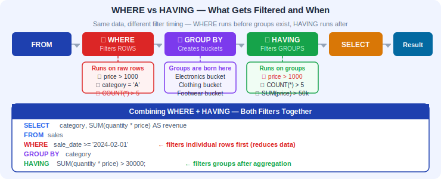
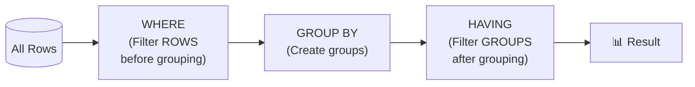
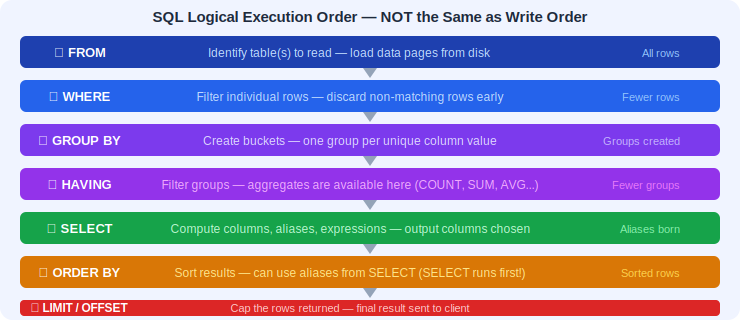
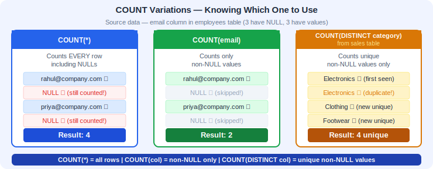
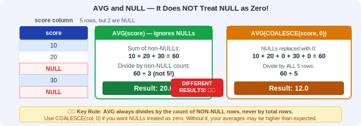
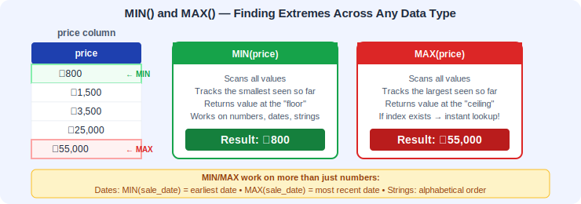

# 📅 Day 4: Aggregate Functions & GROUP BY
---

## 📖 1. Introduction

### What will we learn today?
- What are aggregate functions?
- `COUNT()` — counting rows
- `SUM()` — adding up values
- `AVG()` — calculating averages
- `MIN()` — finding the smallest value
- `MAX()` — finding the largest value
- `GROUP BY` — grouping data for summaries
- `HAVING` — filtering groups
- SQL's logical execution order
- How to combine aggregates for real-world dashboards

### Why is this important?
Imagine you're a store manager and you need answers to:
- "How many orders did we get today?" → `COUNT()`
- "What's our total revenue this month?" → `SUM()`
- "What's the average order value?" → `AVG()`
- "What was our cheapest sale?" → `MIN()`
- "What was our biggest sale?" → `MAX()`
- "Show me revenue **by category**" → `GROUP BY`

These are the questions **every business asks every day**. Aggregate functions answer them.

Every analytics dashboard, every financial report, every KPI metric you see on a screen — behind it is a SQL query using these exact functions. Mastering them is the bridge between "I can query a database" and "I can answer real business questions."

> 🎯 **Key Takeaway:** Aggregate functions transform raw data into insights. They are the backbone of every reporting system and business intelligence tool in the world.

---

## 🧠 2. Concept Explanation

### What Are Aggregate Functions?

Regular queries return **individual rows**. Aggregate functions take **many rows** and return **one summarized value**.

Think of it like this: if a regular `SELECT` is like reading every single exam paper one by one, an aggregate function is like the teacher calculating the class average, the highest score, or the total number of students who passed — all without showing you every individual paper.



**Under the hood**, when the database engine encounters an aggregate function, it:
1. Scans through all qualifying rows (after applying any WHERE filter)
2. Maintains a running accumulator (a counter for COUNT, a running total for SUM, etc.)
3. After processing all rows, it computes the final result and returns a single value

This is why aggregate functions "collapse" many rows into one — the engine is literally reducing an entire column of data down to a single number.



**Real-world analogy:** 
- Looking at individual marks = `SELECT marks FROM students` (many rows)
- Asking "What's the class average?" = `SELECT AVG(marks) FROM students` (one answer)

**Another analogy:** Imagine a jar of coins. A regular query lets you see each coin individually. Aggregate functions let you answer: "How many coins are there?" (COUNT), "What's the total value?" (SUM), "What's the average coin value?" (AVG), "What's the smallest coin?" (MIN), "What's the largest coin?" (MAX).

> 🎯 **Key Takeaway:** Aggregate functions are reducers — they take a set of values and reduce them to a single summary value. Without them, SQL would only show you raw data, never summaries.

---

## 💡 3. Visual Learning

### GROUP BY Explained



`GROUP BY` is one of the most powerful clauses in SQL. It works by creating **buckets** (or "bins") — one bucket for each unique value in the column you group by. Every row in the table gets placed into its matching bucket. Then, aggregate functions run **independently on each bucket**.

**Analogy:** Imagine you have a bag of mixed candies. GROUP BY is like sorting them by color into separate bowls. Then you can count how many are in each bowl (COUNT), weigh each bowl (SUM), or find the biggest candy in each bowl (MAX). The key insight: each bowl is processed independently.



**How GROUP BY works internally:**
1. The database scans the table
2. It creates a hash map (or sorts the data) using the GROUP BY column(s) as keys
3. Each unique combination of GROUP BY values becomes one "group"
4. Aggregate functions are computed for each group separately
5. One result row is produced per group

### WHERE vs HAVING





**How HAVING filters after grouping:** Once GROUP BY has created its buckets and the aggregate functions have computed their values for each bucket, HAVING steps in to evaluate a condition against each group's aggregate result. Groups that don't meet the HAVING condition are simply discarded from the output. This is fundamentally different from WHERE, which discards individual rows before any grouping happens.

> 🎯 **Key Takeaway:** GROUP BY creates buckets of related rows. Aggregate functions summarize each bucket. HAVING decides which buckets to show. Think: sort into piles, measure each pile, then keep only the piles that matter.

---

## 🔄 Execution Order — How SQL Really Runs Your Query

This is one of the most important concepts to understand. **SQL does NOT execute in the order you write it.** Here is the logical execution order:

```
┌─────────────────────────────────────────────────────────┐
│                SQL Logical Execution Order                │
├──────┬──────────────────────────────────────────────────┤
│ Step │ Clause                                           │
├──────┼──────────────────────────────────────────────────┤
│  1   │ FROM       → Pick the table(s)                  │
│  2   │ WHERE      → Filter individual rows             │
│  3   │ GROUP BY   → Create groups/buckets              │
│  4   │ HAVING     → Filter groups                      │
│  5   │ SELECT     → Choose columns & compute values    │
│  6   │ DISTINCT   → Remove duplicates                  │
│  7   │ ORDER BY   → Sort the results                   │
│  8   │ LIMIT      → Cap the number of rows returned    │
└──────┴──────────────────────────────────────────────────┘
```

**Why does this matter?**

1. **You can't use a SELECT alias in WHERE** — because WHERE runs before SELECT.
2. **You can't use aggregate functions in WHERE** — because WHERE runs before GROUP BY (aggregates haven't been computed yet).
3. **You CAN use a SELECT alias in ORDER BY** — because ORDER BY runs after SELECT.
4. **HAVING can use aggregates** — because HAVING runs after GROUP BY.

**Visual walkthrough with an example:**

```sql
SELECT category, SUM(quantity * price) AS revenue
FROM sales
WHERE sale_date >= '2024-02-01'
GROUP BY category
HAVING SUM(quantity * price) > 30000
ORDER BY revenue DESC
LIMIT 3;
```

Here is what happens step by step:

| Step | What Happens | Rows |
|------|-------------|------|
| 1. FROM | Load all rows from `sales` | 15 rows |
| 2. WHERE | Keep only rows where `sale_date >= '2024-02-01'` | ~10 rows |
| 3. GROUP BY | Create one bucket per `category` | 4-5 groups |
| 4. HAVING | Keep only groups where total revenue > 30000 | Fewer groups |
| 5. SELECT | Compute `SUM(quantity * price)` and label it `revenue` | Result columns |
| 6. ORDER BY | Sort by `revenue` descending | Sorted |
| 7. LIMIT | Return only top 3 | 3 rows max |



> 🎯 **Key Takeaway:** Understanding execution order is the key to debugging SQL errors. If you remember nothing else: FROM first, then WHERE, then GROUP BY, then HAVING, then SELECT, then ORDER BY, then LIMIT.

---

## 🖥️ 4. Setup

```sql
CREATE TABLE sales (
    id SERIAL PRIMARY KEY,
    product_name VARCHAR(100),
    category VARCHAR(50),
    quantity INT,
    price DECIMAL(10, 2),
    sale_date DATE,
    salesperson VARCHAR(100),
    region VARCHAR(50)
);

INSERT INTO sales (product_name, category, quantity, price, sale_date, salesperson, region) VALUES
('Laptop', 'Electronics', 2, 55000.00, '2024-01-15', 'Rahul', 'North'),
('Phone', 'Electronics', 5, 25000.00, '2024-01-16', 'Priya', 'South'),
('Headphones', 'Electronics', 10, 2500.00, '2024-01-17', 'Rahul', 'North'),
('T-Shirt', 'Clothing', 20, 800.00, '2024-01-18', 'Amit', 'West'),
('Jeans', 'Clothing', 15, 1500.00, '2024-01-19', 'Sneha', 'East'),
('Running Shoes', 'Footwear', 8, 3500.00, '2024-01-20', 'Priya', 'South'),
('Laptop', 'Electronics', 1, 55000.00, '2024-02-01', 'Vikram', 'North'),
('Phone', 'Electronics', 3, 25000.00, '2024-02-05', 'Amit', 'West'),
('Backpack', 'Accessories', 12, 1200.00, '2024-02-10', 'Rahul', 'North'),
('Watch', 'Accessories', 6, 5000.00, '2024-02-15', 'Sneha', 'East'),
('Jacket', 'Clothing', 7, 2500.00, '2024-02-20', 'Vikram', 'North'),
('Sandals', 'Footwear', 25, 1000.00, '2024-02-25', 'Priya', 'South'),
('Tablet', 'Electronics', 4, 30000.00, '2024-03-01', 'Rahul', 'North'),
('Kurta', 'Clothing', 18, 1200.00, '2024-03-05', 'Amit', 'West'),
('Sneakers', 'Footwear', 10, 4000.00, '2024-03-10', 'Sneha', 'East');

CREATE TABLE students (
    id SERIAL PRIMARY KEY,
    name VARCHAR(100),
    class VARCHAR(10),
    subject VARCHAR(50),
    marks INT
);

INSERT INTO students (name, class, subject, marks) VALUES
('Rahul', '10A', 'Math', 85),
('Rahul', '10A', 'Science', 78),
('Priya', '10A', 'Math', 92),
('Priya', '10A', 'Science', 88),
('Amit', '10B', 'Math', 76),
('Amit', '10B', 'Science', 82),
('Sneha', '10B', 'Math', 95),
('Sneha', '10B', 'Science', 90),
('Vikram', '10A', 'Math', 68),
('Vikram', '10A', 'Science', 72),
('Neha', '10B', 'Math', 88),
('Neha', '10B', 'Science', 85);
```

---

## 📝 5. Syntax + Examples

---

### 🔢 COUNT() — Counting Rows

`COUNT()` tells you **how many rows** match your query.

**How it works:** COUNT maintains an internal counter. For `COUNT(*)`, it increments for every row, period — even rows full of NULLs. For `COUNT(column)`, it only increments when that specific column is not NULL. For `COUNT(DISTINCT column)`, it maintains a set of unique values and returns the size of that set.



#### Example 1: Count All Sales

```sql
SELECT COUNT(*) FROM sales;
```

Result: `15`

#### Example 2: Count Sales in a Category

```sql
SELECT COUNT(*) FROM sales WHERE category = 'Electronics';
```

Result: `6`

#### Example 3: Count Non-NULL Values

```sql
-- COUNT(column) only counts rows where that column is NOT NULL
SELECT COUNT(email) FROM employees;
```

This skips rows where email is NULL.

#### Example 4: Count Distinct Values

```sql
-- How many unique categories do we sell?
SELECT COUNT(DISTINCT category) FROM sales;
```

Result: `4` (Electronics, Clothing, Footwear, Accessories)

**How this works:** `CASE WHEN` returns `1` when the condition is true and `NULL` when it's false (since there's no ELSE). Since `COUNT(column)` skips NULLs, it only counts the rows where the condition matched. This is incredibly useful for creating pivot-style summaries in a single query.

> 🎯 **Key Takeaway:** COUNT(*) counts all rows. COUNT(column) skips NULLs. COUNT(DISTINCT column) counts unique values. COUNT with CASE WHEN lets you count conditionally — a powerful technique for creating multi-column summaries.

---

### ➕ SUM() — Adding Values

`SUM()` adds up all values in a column.

**How it works:** SUM maintains a running total. It scans each qualifying row, reads the numeric value, and adds it to the accumulator. NULL values are silently skipped (not treated as zero). If ALL values are NULL, SUM returns NULL (not zero — be careful!).

#### Example 5: Total Revenue

```sql
-- Total revenue = quantity × price for each sale
SELECT SUM(quantity * price) AS total_revenue FROM sales;
```

#### Example 6: Total Quantity Sold for Electronics

```sql
SELECT SUM(quantity) AS total_electronics_sold 
FROM sales 
WHERE category = 'Electronics';
```


**Why is this useful?** Instead of running 4 separate queries or using GROUP BY (which gives you 4 rows), this technique gives you all category revenues as columns in a single row — perfect for dashboard summaries and reports that need a side-by-side comparison.

> 🎯 **Key Takeaway:** SUM adds up values. Use SUM with CASE WHEN to create pivot-table-style summaries where different categories become different columns. Remember that SUM ignores NULLs.

---

### 📊 AVG() — Calculating Averages

`AVG()` returns the mean (average) value.

**How it works:** AVG is essentially `SUM(column) / COUNT(column)`. Crucially, it only considers non-NULL values in both the sum and the count. This means if you have 10 rows but 3 have NULL in that column, AVG divides by 7, not 10. This can lead to surprising results if you're not aware of it.



#### Example 7: Average Marks in Math

```sql
SELECT AVG(marks) AS average_math_marks 
FROM students 
WHERE subject = 'Math';
```

#### Example 8: Average Price Across All Sales

```sql
SELECT AVG(price) AS average_price FROM sales;
```

#### Example 9: Round the Average

```sql
-- ROUND to 2 decimal places
SELECT ROUND(AVG(marks), 2) AS average_marks FROM students;
```

#### Example 9b: ROUND with AVG for Clean Reports

```sql
-- Always round averages in production reports for readability
SELECT 
    category,
    ROUND(AVG(price), 2) AS avg_price,
    ROUND(AVG(quantity), 1) AS avg_quantity,
    ROUND(AVG(quantity * price), 2) AS avg_sale_value
FROM sales
GROUP BY category
ORDER BY avg_sale_value DESC;
```

**Pro tip:** Always use `ROUND()` when presenting averages to users. Raw averages often have 10+ decimal places (e.g., 84.166666666667), which looks messy in reports. `ROUND(value, 2)` is the standard for currency; `ROUND(value, 1)` works well for quantities and percentages.

> 🎯 **Key Takeaway:** AVG ignores NULLs (it does NOT treat them as zero). Always use ROUND with AVG in production queries for clean, readable output.

---

### ⬇️ MIN() and ⬆️ MAX()



#### Example 10: Cheapest and Most Expensive Product

```sql
SELECT 
    MIN(price) AS cheapest, 
    MAX(price) AS most_expensive 
FROM sales;
```

#### Example 11: Lowest and Highest Marks

```sql
SELECT 
    MIN(marks) AS lowest_marks,
    MAX(marks) AS highest_marks 
FROM students;
```

#### Example 12: All Aggregates Together

```sql
SELECT 
    COUNT(*) AS total_sales,
    SUM(quantity) AS total_items_sold,
    ROUND(AVG(price), 2) AS avg_price,
    MIN(price) AS min_price,
    MAX(price) AS max_price
FROM sales;
```

#### Example 12b: Dashboard Query — Multiple Aggregates Combined

```sql
-- A single "executive summary" query combining all aggregates
SELECT 
    COUNT(*) AS total_transactions,
    COUNT(DISTINCT product_name) AS unique_products,
    COUNT(DISTINCT salesperson) AS active_salespeople,
    SUM(quantity) AS total_items_sold,
    SUM(quantity * price) AS total_revenue,
    ROUND(AVG(quantity * price), 2) AS avg_transaction_value,
    MIN(quantity * price) AS smallest_sale,
    MAX(quantity * price) AS largest_sale,
    MAX(sale_date) AS most_recent_sale,
    MIN(sale_date) AS earliest_sale
FROM sales;
```

This single query gives you an entire business snapshot. In real companies, queries like this power the top-line numbers on executive dashboards.

> 🎯 **Key Takeaway:** MIN and MAX work on numbers, dates, and even strings (alphabetical order). You can combine ALL aggregate functions in a single SELECT to build powerful summary queries.

---

### 👥 GROUP BY — Grouping Data

This is where it gets really powerful! `GROUP BY` splits your data into groups and applies aggregate functions to each group.

**Analogy:** Instead of asking "What's the average marks?", you ask "What's the average marks **per class**?"

**How GROUP BY creates buckets:** Imagine you dump all your sales receipts on a table. GROUP BY is like saying "sort these into piles by category." You end up with an Electronics pile, a Clothing pile, a Footwear pile, and an Accessories pile. Now you can count each pile, total each pile, or average each pile — independently. That's exactly what the database does, just much faster.

**Syntax:**
```sql
SELECT column, AGGREGATE(column) 
FROM table 
GROUP BY column;
```

**The Golden Rule of GROUP BY:** Every column in your SELECT that is NOT inside an aggregate function MUST appear in the GROUP BY clause. Why? Because GROUP BY collapses multiple rows into one. If a column isn't being aggregated and isn't in the GROUP BY, the database wouldn't know which value to show for that column.

#### Example 13: Count Sales Per Category

```sql
SELECT category, COUNT(*) AS total_sales 
FROM sales 
GROUP BY category;
```

**Result:**

| category | total_sales |
|----------|-------------|
| Electronics | 6 |
| Clothing | 4 |
| Footwear | 3 |
| Accessories | 2 |

#### Example 14: Total Revenue Per Category

```sql
SELECT category, SUM(quantity * price) AS revenue 
FROM sales 
GROUP BY category 
ORDER BY revenue DESC;
```

#### Example 15: Average Marks Per Subject

```sql
SELECT subject, ROUND(AVG(marks), 2) AS avg_marks 
FROM students 
GROUP BY subject;
```

#### Example 16: Sales Per Salesperson

```sql
SELECT salesperson, 
    COUNT(*) AS total_sales,
    SUM(quantity * price) AS total_revenue
FROM sales 
GROUP BY salesperson 
ORDER BY total_revenue DESC;
```

#### Example 17: Revenue Per Region Per Category

```sql
SELECT region, category, SUM(quantity * price) AS revenue 
FROM sales 
GROUP BY region, category 
ORDER BY region, revenue DESC;
```

#### Example 17b: GROUP BY with Multiple Columns — Deeper Dive

```sql
-- Sales breakdown by salesperson AND category
SELECT 
    salesperson,
    category,
    COUNT(*) AS num_sales,
    SUM(quantity) AS total_items,
    SUM(quantity * price) AS revenue
FROM sales
GROUP BY salesperson, category
ORDER BY salesperson, revenue DESC;
```

**How multi-column GROUP BY works:** When you GROUP BY two columns, the database creates a bucket for every **unique combination** of those columns. So "Rahul + Electronics" is one bucket, "Rahul + Accessories" is another, "Priya + Electronics" is a third, and so on. Each combination gets its own row in the result.

#### Example 17c: GROUP BY with DATE Functions

```sql
-- Monthly sales summary using EXTRACT
SELECT 
    EXTRACT(YEAR FROM sale_date) AS sale_year,
    EXTRACT(MONTH FROM sale_date) AS sale_month,
    COUNT(*) AS num_sales,
    SUM(quantity * price) AS monthly_revenue
FROM sales
GROUP BY EXTRACT(YEAR FROM sale_date), EXTRACT(MONTH FROM sale_date)
ORDER BY sale_year, sale_month;
```

```sql
-- Using DATE_TRUNC for cleaner monthly grouping (PostgreSQL)
SELECT 
    DATE_TRUNC('month', sale_date) AS month,
    COUNT(*) AS num_sales,
    SUM(quantity * price) AS revenue,
    ROUND(AVG(quantity * price), 2) AS avg_sale_value
FROM sales
GROUP BY DATE_TRUNC('month', sale_date)
ORDER BY month;
```

**DATE_TRUNC vs EXTRACT:** `DATE_TRUNC('month', sale_date)` truncates the date to the first of the month (e.g., '2024-01-15' becomes '2024-01-01'), giving you a proper date to group by. `EXTRACT` pulls out a number (e.g., month = 1), which is simpler but loses the year context if your data spans multiple years. For production reports, `DATE_TRUNC` is usually the better choice.

#### Example 18: Average Marks Per Student

```sql
SELECT name, ROUND(AVG(marks), 2) AS avg_marks 
FROM students 
GROUP BY name 
ORDER BY avg_marks DESC;
```

> 🎯 **Key Takeaway:** GROUP BY creates one row per unique value (or unique combination for multi-column grouping). Every non-aggregated column in SELECT must be in GROUP BY. Use DATE functions with GROUP BY for time-based analysis — one of the most common patterns in business reporting.

---

### 🎯 HAVING — Filtering Groups

`HAVING` is like `WHERE`, but for **groups** (after `GROUP BY`).

**Under the hood:** After GROUP BY has created all the groups and aggregate functions have been calculated, HAVING evaluates its condition against each group. Groups that fail the condition are excluded from the result. This is why HAVING can use aggregate functions — by the time it runs, those aggregates have already been computed.

> 🔑 **Key Rule:**
> - `WHERE` filters **individual rows** (before grouping)
> - `HAVING` filters **groups** (after grouping)

#### Example 19: Categories with More Than 3 Sales

```sql
SELECT category, COUNT(*) AS total_sales 
FROM sales 
GROUP BY category 
HAVING COUNT(*) > 3;
```

Only shows categories that have more than 3 sales.

#### Example 20: Salespersons with Revenue Over ₹50,000

```sql
SELECT salesperson, SUM(quantity * price) AS revenue 
FROM sales 
GROUP BY salesperson 
HAVING SUM(quantity * price) > 50000
ORDER BY revenue DESC;
```

#### Example 21: Students with Average Above 80

```sql
SELECT name, ROUND(AVG(marks), 2) AS avg_marks 
FROM students 
GROUP BY name 
HAVING AVG(marks) > 80 
ORDER BY avg_marks DESC;
```

#### Example 22: Combining WHERE and HAVING

```sql
-- In January sales only, find categories with revenue over ₹30,000
SELECT category, SUM(quantity * price) AS revenue 
FROM sales 
WHERE sale_date BETWEEN '2024-01-01' AND '2024-01-31'  -- filter rows first
GROUP BY category 
HAVING SUM(quantity * price) > 30000  -- then filter groups
ORDER BY revenue DESC;
```

> 🎯 **Key Takeaway:** Use WHERE to filter rows before grouping (to reduce the data set). Use HAVING to filter groups after aggregation (to keep only interesting groups). Using both together is a powerful combination.

---

### 🔀 WHERE vs HAVING — Decision Guide

Not sure when to use WHERE vs HAVING? Follow this guide:

```
┌──────────────────────────────────────────────────────┐
│          WHERE vs HAVING Decision Guide              │
├──────────────────────────────────────────────────────┤
│                                                      │
│  Ask yourself: "Am I filtering based on..."          │
│                                                      │
│  ┌─────────────────────┐  ┌────────────────────────┐ │
│  │ A value in a single │  │ A calculated value     │ │
│  │ row? (column value) │  │ across a group?        │ │
│  │                     │  │ (aggregate result)     │ │
│  │ Examples:           │  │                        │ │
│  │ • price > 1000      │  │ Examples:              │ │
│  │ • category = 'X'    │  │ • COUNT(*) > 5         │ │
│  │ • sale_date > '...' │  │ • SUM(price) > 10000   │ │
│  │ • region = 'North'  │  │ • AVG(marks) > 80      │ │
│  │                     │  │                        │ │
│  │  ──▶ Use WHERE      │  │  ──▶ Use HAVING        │ │
│  └─────────────────────┘  └────────────────────────┘ │
│                                                      │
│  ⚡ Performance tip: Always prefer WHERE when you     │
│  can. It filters BEFORE grouping, reducing the       │
│  amount of data the database has to process.         │
│                                                      │
│  🔗 You can use BOTH together:                        │
│  WHERE filters rows → GROUP BY groups → HAVING       │
│  filters groups                                      │
└──────────────────────────────────────────────────────┘
```

**Quick test examples:**

| Question | Clause | Why |
|----------|--------|-----|
| "Show sales where price > 5000" | WHERE | Filtering individual row values |
| "Show categories with total revenue > 100000" | HAVING | Filtering an aggregate (SUM) |
| "Show Jan sales for categories with 3+ transactions" | Both | WHERE for Jan, HAVING for count |
| "Show salesperson where region = 'North'" | WHERE | Filtering a row-level column |
| "Show salesperson with average sale value > 50000" | HAVING | Filtering an aggregate (AVG) |

> 🎯 **Key Takeaway:** If you can express your filter without an aggregate function, use WHERE — it's faster. If your filter involves COUNT, SUM, AVG, MIN, or MAX, you need HAVING.

---

### 🏗️ Complete Query Order

```sql
SELECT columns, AGGREGATE(column)    -- 5. What to show
FROM table                           -- 1. Where to look
WHERE condition                      -- 2. Filter rows
GROUP BY column                      -- 3. Make groups
HAVING condition                     -- 4. Filter groups
ORDER BY column                      -- 6. Sort results
LIMIT n;                             -- 7. Limit results
```

> 💡 The numbers show the **order of execution**, not the order you write them!

---

## ✅ Checkpoint!

> What's the difference between `WHERE` and `HAVING`?
> 
> - `WHERE` filters **rows** before grouping
> - `HAVING` filters **groups** after grouping
> 
> You **cannot** use aggregate functions in `WHERE`!
> - ❌ `WHERE COUNT(*) > 3`
> - ✅ `HAVING COUNT(*) > 3`

---

## 🌍 Real-World Scenario: ShopKart's Analytics Dashboard

Let's see how a fictional e-commerce company called **ShopKart** uses aggregate functions to power their analytics dashboard. Their data team runs these queries daily to track KPIs (Key Performance Indicators).

### Scenario Setup

ShopKart uses our `sales` table. Every morning, the data team runs a set of queries to populate their dashboard. Let's walk through each one.

### KPI 1: Daily Revenue Report

The CEO wants to see revenue per day to spot trends.

```sql
-- Daily revenue for the current dataset
SELECT 
    sale_date,
    COUNT(*) AS num_orders,
    SUM(quantity) AS items_sold,
    SUM(quantity * price) AS daily_revenue,
    ROUND(AVG(quantity * price), 2) AS avg_order_value
FROM sales
GROUP BY sale_date
ORDER BY sale_date;
```

### KPI 2: Top Sellers Leaderboard

The sales team wants to see who's performing best.

```sql
-- Salesperson leaderboard with multiple metrics
SELECT 
    salesperson,
    COUNT(*) AS total_transactions,
    SUM(quantity) AS total_items_sold,
    SUM(quantity * price) AS total_revenue,
    ROUND(AVG(quantity * price), 2) AS avg_deal_size,
    MAX(quantity * price) AS biggest_sale
FROM sales
GROUP BY salesperson
ORDER BY total_revenue DESC;
```

### KPI 3: Category Breakdown with Percentages

The product team needs to understand which categories drive the business.

```sql
-- Category breakdown
SELECT 
    category,
    COUNT(*) AS num_sales,
    SUM(quantity * price) AS revenue,
    ROUND(100.0 * SUM(quantity * price) / (SELECT SUM(quantity * price) FROM sales), 1) AS revenue_pct
FROM sales
GROUP BY category
ORDER BY revenue DESC;
```

This uses a **subquery** to calculate each category's percentage of total revenue — a common pattern in business dashboards.

### KPI 4: Month-over-Month Comparison

Management wants to see if the business is growing.

```sql
-- Monthly revenue trend
SELECT 
    EXTRACT(MONTH FROM sale_date) AS month_num,
    TO_CHAR(DATE_TRUNC('month', sale_date), 'Month YYYY') AS month_name,
    COUNT(*) AS orders,
    SUM(quantity * price) AS revenue,
    SUM(quantity) AS items_sold,
    ROUND(AVG(price), 2) AS avg_price
FROM sales
GROUP BY EXTRACT(MONTH FROM sale_date), DATE_TRUNC('month', sale_date)
ORDER BY month_num;
```

### KPI 5: Regional Performance with Conditional Flags

The operations team needs to flag underperforming regions.

> 🎯 **Key Takeaway:** In the real world, aggregate queries aren't written in isolation. A company's dashboard is powered by a collection of GROUP BY queries — each one answering a specific business question. The patterns above (daily trends, leaderboards, category breakdowns, month-over-month comparisons) are the bread and butter of every data analyst.

---

## 💡 Did You Know? — Aggregate Query Performance

> 💡 **Did You Know?**
> 
> **How databases optimize aggregate queries:**
> - When you run `COUNT(*)` on a table, some databases (like MySQL with InnoDB) don't need to read every row — they can use the smallest index to count rows faster.
> - For `MIN()` and `MAX()`, if there's a B-tree index on that column, the database can find the answer instantly by looking at the first or last entry in the index — no scanning needed!
> - `GROUP BY` can be optimized using indexes too. If you frequently GROUP BY a column, adding an index on it allows the database to read already-sorted data, avoiding an expensive sort operation.
> 
> **Performance tips for aggregate queries:**
> - **Use WHERE to reduce data early.** A query that filters 1 million rows down to 1,000 before grouping is much faster than grouping all 1 million rows and filtering with HAVING.
> - **Index your GROUP BY columns.** This allows the database to use an "index scan" instead of sorting all the data.
> - **Avoid `SELECT *` with GROUP BY.** Only select the columns you need — fewer columns means less memory usage.
> - **Be careful with COUNT(DISTINCT).** It requires the database to track every unique value, which uses more memory than a simple COUNT(*).
> 
> **Fun fact:** Some analytical databases (like ClickHouse or DuckDB) use a technique called "vectorized execution" where they process aggregate functions on thousands of values at once using CPU SIMD instructions, making them incredibly fast on large datasets!

---

## 🧪 6. Hands-on Practice

**Problem 1:** How many total items (quantity) have been sold across all sales?

<details>
<summary>💡 Solution</summary>

```sql
SELECT SUM(quantity) AS total_items_sold FROM sales;
```

</details>

**Problem 2:** Find the average marks per class.

<details>
<summary>💡 Solution</summary>

```sql
SELECT class, ROUND(AVG(marks), 2) AS avg_marks 
FROM students 
GROUP BY class;
```

</details>

**Problem 3:** Find the total revenue per region, sorted from highest to lowest.

<details>
<summary>💡 Solution</summary>

```sql
SELECT region, SUM(quantity * price) AS total_revenue 
FROM sales 
GROUP BY region 
ORDER BY total_revenue DESC;
```

</details>

**Problem 4:** Which salesperson made the most number of sales?

<details>
<summary>💡 Solution</summary>

```sql
SELECT salesperson, COUNT(*) AS num_sales 
FROM sales 
GROUP BY salesperson 
ORDER BY num_sales DESC 
LIMIT 1;
```

</details>

**Problem 5:** Find categories that have total revenue above ₹50,000.

<details>
<summary>💡 Solution</summary>

```sql
SELECT category, SUM(quantity * price) AS revenue 
FROM sales 
GROUP BY category 
HAVING SUM(quantity * price) > 50000 
ORDER BY revenue DESC;
```

</details>

**Problem 6:** For each month, find the total number of sales and total revenue.

<details>
<summary>💡 Solution</summary>

```sql
SELECT 
    EXTRACT(MONTH FROM sale_date) AS month,
    COUNT(*) AS num_sales,
    SUM(quantity * price) AS revenue
FROM sales 
GROUP BY EXTRACT(MONTH FROM sale_date)
ORDER BY month;
```

</details>

**Problem 7:** Find the student with the highest average marks.

<details>
<summary>💡 Solution</summary>

```sql
SELECT name, ROUND(AVG(marks), 2) AS avg_marks 
FROM students 
GROUP BY name 
ORDER BY avg_marks DESC 
LIMIT 1;
```

</details>

**Problem 8:** For each salesperson, count how many distinct categories they have sold in. Only show salespersons who have sold in more than 1 category.

<details>
<summary>💡 Solution</summary>

```sql
SELECT 
    salesperson, 
    COUNT(DISTINCT category) AS categories_sold
FROM sales
GROUP BY salesperson
HAVING COUNT(DISTINCT category) > 1
ORDER BY categories_sold DESC;
```

</details>

**Problem 9:** Write a single query that shows, for each category: the number of sales, total revenue, average price, cheapest product price, and most expensive product price. Sort by total revenue descending.

<details>
<summary>💡 Solution</summary>

```sql
SELECT 
    category,
    COUNT(*) AS num_sales,
    SUM(quantity * price) AS total_revenue,
    ROUND(AVG(price), 2) AS avg_price,
    MIN(price) AS cheapest,
    MAX(price) AS most_expensive
FROM sales
GROUP BY category
ORDER BY total_revenue DESC;
```

</details>

**Problem 10:** Find which months had more than 4 sales. Show the month number, number of sales, and total revenue.

<details>
<summary>💡 Solution</summary>

```sql
SELECT 
    EXTRACT(MONTH FROM sale_date) AS month,
    COUNT(*) AS num_sales,
    SUM(quantity * price) AS revenue
FROM sales
GROUP BY EXTRACT(MONTH FROM sale_date)
HAVING COUNT(*) > 4
ORDER BY month;
```

</details>

**Problem 11:** For each class and subject combination, find the average marks, the highest marks, and the lowest marks. Only show combinations where the average is above 80.

<details>
<summary>💡 Solution</summary>

```sql
SELECT 
    class,
    subject,
    ROUND(AVG(marks), 2) AS avg_marks,
    MAX(marks) AS highest_marks,
    MIN(marks) AS lowest_marks
FROM students
GROUP BY class, subject
HAVING AVG(marks) > 80
ORDER BY class, subject;
```

</details>

---

## ⚠️ 7. Common Mistakes

| # | Mistake | What Goes Wrong | Correct Way |
|---|---------|----------------|-------------|
| 1 | Using aggregate in WHERE | `WHERE COUNT(*) > 5` ❌ | `HAVING COUNT(*) > 5` ✅ |
| 2 | SELECT column not in GROUP BY | `SELECT name, COUNT(*) FROM sales GROUP BY category` ❌ | Every non-aggregate column in SELECT must be in GROUP BY |
| 3 | Confusing COUNT(*) vs COUNT(col) | `COUNT(*)` counts all rows; `COUNT(column)` skips NULLs | Choose based on what you need |
| 4 | Forgetting GROUP BY | `SELECT category, SUM(price) FROM sales` ❌ | Add `GROUP BY category` |
| 5 | Using alias in HAVING | `HAVING revenue > 50000` ❌ (some databases don't support this) | `HAVING SUM(quantity * price) > 50000` ✅ |
| 6 | Wrong order of clauses | Writing HAVING before GROUP BY | Follow: WHERE → GROUP BY → HAVING → ORDER BY |
| 7 | Mixing aggregate and non-aggregate columns without GROUP BY | `SELECT salesperson, SUM(quantity * price) FROM sales` ❌ — salesperson is not aggregated and there's no GROUP BY | Either add `GROUP BY salesperson` or remove `salesperson` from SELECT |
| 8 | Using HAVING without GROUP BY | `SELECT COUNT(*) FROM sales HAVING COUNT(*) > 5` — technically works but is pointless | HAVING without GROUP BY treats the entire table as one group. Use WHERE on the raw data or just check the result programmatically |
| 9 | Forgetting that NULL values are ignored by aggregates | `AVG(column)` where some values are NULL gives a different result than you might expect | Remember: SUM, AVG, COUNT(col), MIN, MAX all skip NULLs. Use `COALESCE(column, 0)` if you want NULLs treated as zero: `AVG(COALESCE(column, 0))` |

### Expanded Mistake Explanations

**Mistake 7 — Mixing aggregate and non-aggregate columns:**

```sql
-- ❌ This will ERROR in most databases
SELECT salesperson, category, SUM(quantity * price) AS revenue
FROM sales;
```

The problem: SUM collapses all 15 rows into 1 row. But which `salesperson` and which `category` should that one row show? There are multiple values! The database can't decide, so it throws an error. The fix is always: either wrap the column in an aggregate function OR add it to GROUP BY.

**Mistake 8 — HAVING without GROUP BY:**

```sql
-- This "works" but is almost never what you want
SELECT COUNT(*) AS total FROM sales HAVING COUNT(*) > 10;
```

Without GROUP BY, the entire table is treated as one group. So HAVING just checks if the single result meets the condition. If COUNT(*) is 15 and you have `HAVING COUNT(*) > 10`, you get the result. If the condition fails, you get zero rows. This is confusing and a WHERE or application-level check would be clearer.

**Mistake 9 — NULLs and aggregates:**

```sql
-- Imagine a column with values: 10, 20, NULL, 30, NULL
-- AVG returns 20 (sum of 60 / count of 3), NOT 12 (60 / 5)
-- This is because NULL rows are completely excluded
SELECT AVG(score) FROM test_scores;  -- Returns 20, not 12

-- If you want NULLs treated as 0:
SELECT AVG(COALESCE(score, 0)) FROM test_scores;  -- Returns 12
```

> 🎯 **Key Takeaway:** Most SQL errors with aggregates come from three things: using aggregates in WHERE instead of HAVING, forgetting GROUP BY, or not understanding how NULLs are handled. Master these, and you'll avoid 90% of aggregate query bugs.

---

## 📝 8. Mini Assignment

### 🎯 Task: Sales Report Dashboard

Using the `sales` table, create a comprehensive sales report by writing queries for:

1. **Total Overview:**
   - Total number of sales
   - Total items sold
   - Total revenue
   - Average sale price

2. **Category Report:**
   - Revenue per category (sorted highest first)
   - Average price per category
   - Which category has the most items sold?

3. **Salesperson Report:**
   - Revenue per salesperson
   - Who made the most sales?
   - Which salesperson has the highest average sale value?

4. **Advanced:**
   - Monthly revenue trend
   - Categories with more than 2 sales AND revenue above ₹20,000
   - Regions ranked by total revenue

<details>
<summary>💡 Solution</summary>

```sql
-- Total Overview
SELECT 
    COUNT(*) AS total_sales,
    SUM(quantity) AS total_items_sold,
    SUM(quantity * price) AS total_revenue,
    ROUND(AVG(price), 2) AS avg_sale_price
FROM sales;

-- Revenue per category
SELECT category, SUM(quantity * price) AS revenue 
FROM sales GROUP BY category ORDER BY revenue DESC;

-- Average price per category
SELECT category, ROUND(AVG(price), 2) AS avg_price 
FROM sales GROUP BY category;

-- Most items sold category
SELECT category, SUM(quantity) AS items_sold 
FROM sales GROUP BY category ORDER BY items_sold DESC LIMIT 1;

-- Revenue per salesperson
SELECT salesperson, SUM(quantity * price) AS revenue 
FROM sales GROUP BY salesperson ORDER BY revenue DESC;

-- Most sales
SELECT salesperson, COUNT(*) AS num_sales 
FROM sales GROUP BY salesperson ORDER BY num_sales DESC LIMIT 1;

-- Highest average sale value
SELECT salesperson, ROUND(AVG(quantity * price), 2) AS avg_sale 
FROM sales GROUP BY salesperson ORDER BY avg_sale DESC LIMIT 1;

-- Monthly revenue
SELECT EXTRACT(MONTH FROM sale_date) AS month, SUM(quantity * price) AS revenue 
FROM sales GROUP BY EXTRACT(MONTH FROM sale_date) ORDER BY month;

-- Categories with >2 sales AND revenue >20000
SELECT category, COUNT(*) AS sales, SUM(quantity * price) AS revenue 
FROM sales 
GROUP BY category 
HAVING COUNT(*) > 2 AND SUM(quantity * price) > 20000;

-- Regions ranked
SELECT region, SUM(quantity * price) AS revenue 
FROM sales GROUP BY region ORDER BY revenue DESC;
```

</details>

---

## 📋 Quick Reference Card

A compact cheat-sheet of all aggregate functions and related clauses covered today:

```
┌─────────────────────────────────────────────────────────────────────┐
│                    AGGREGATE FUNCTIONS CHEAT SHEET                   │
├─────────────────┬───────────────────────────────────────────────────┤
│ Function        │ Description & Syntax                              │
├─────────────────┼───────────────────────────────────────────────────┤
│ COUNT(*)        │ Count all rows (including NULLs)                  │
│ COUNT(col)      │ Count non-NULL values in column                   │
│ COUNT(DISTINCT) │ Count unique non-NULL values                      │
│ SUM(col)        │ Total of all values (ignores NULLs)               │
│ AVG(col)        │ Average of all values (ignores NULLs)             │
│ MIN(col)        │ Smallest value (works on numbers, dates, strings) │
│ MAX(col)        │ Largest value (works on numbers, dates, strings)  │
│ ROUND(val, n)   │ Round to n decimal places (use with AVG)          │
├─────────────────┼───────────────────────────────────────────────────┤
│ GROUP BY col    │ Create groups — one result row per unique value   │
│ GROUP BY a, b   │ Groups by unique combinations of a and b         │
│ HAVING cond     │ Filter groups (runs AFTER GROUP BY)               │
│ WHERE cond      │ Filter rows (runs BEFORE GROUP BY)                │
├─────────────────┼───────────────────────────────────────────────────┤
│                 COMMON PATTERNS                                     │
├─────────────────┬───────────────────────────────────────────────────┤
│ Conditional     │ COUNT(CASE WHEN x THEN 1 END)                    │
│ Count           │ SUM(CASE WHEN x THEN val ELSE 0 END)             │
│ Percentage      │ ROUND(100.0 * col / SUM(col), 1)                 │
│ Date Grouping   │ GROUP BY EXTRACT(MONTH FROM date_col)             │
│                 │ GROUP BY DATE_TRUNC('month', date_col)            │
│ NULL Safety     │ AVG(COALESCE(col, 0))                             │
├─────────────────┼───────────────────────────────────────────────────┤
│          EXECUTION ORDER (memorize this!)                           │
│  FROM → WHERE → GROUP BY → HAVING → SELECT → ORDER BY → LIMIT      │
└─────────────────┴───────────────────────────────────────────────────┘
```

---

## 🔁 9. Recap

- ✅ **Aggregate functions** summarize many rows into one value
- ✅ `COUNT(*)` — counts all rows; `COUNT(column)` — counts non-NULL values
- ✅ `SUM()` — adds up values in a column
- ✅ `AVG()` — calculates the average (use `ROUND()` to control decimals)
- ✅ `MIN()` — finds the smallest value
- ✅ `MAX()` — finds the largest value
- ✅ `GROUP BY` — splits data into groups for per-group summaries
- ✅ `HAVING` — filters groups (used after `GROUP BY`)
- ✅ `WHERE` filters rows **before** grouping; `HAVING` filters **after** grouping
- ✅ Every non-aggregate column in `SELECT` must appear in `GROUP BY`
- ✅ SQL's logical execution order: FROM → WHERE → GROUP BY → HAVING → SELECT → ORDER BY → LIMIT
- ✅ NULL values are **ignored** by all aggregate functions except `COUNT(*)`
- ✅ Use `CASE WHEN` inside aggregates for conditional counting and summing
- ✅ Always `ROUND()` your averages in production queries

### Cheat Sheet

```
COUNT(*) → How many rows?
SUM(col) → What's the total?
AVG(col) → What's the average?
MIN(col) → What's the smallest?
MAX(col) → What's the largest?
GROUP BY → Per-group summary
HAVING   → Filter groups
```

---