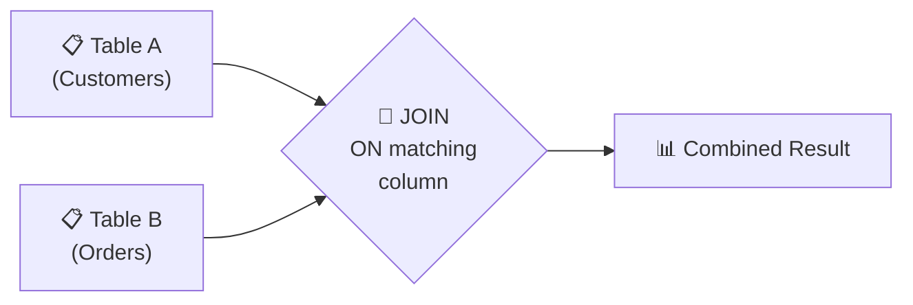
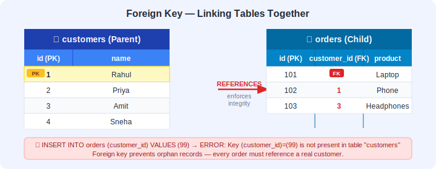
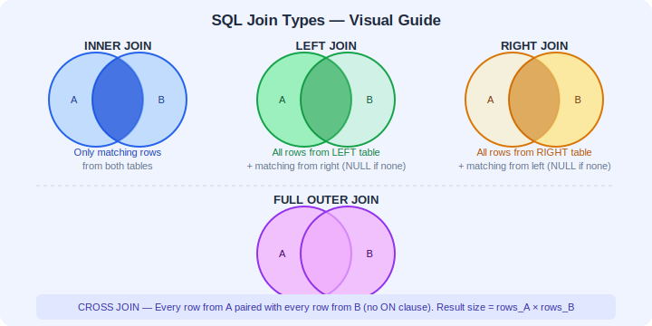
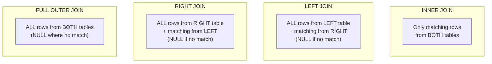
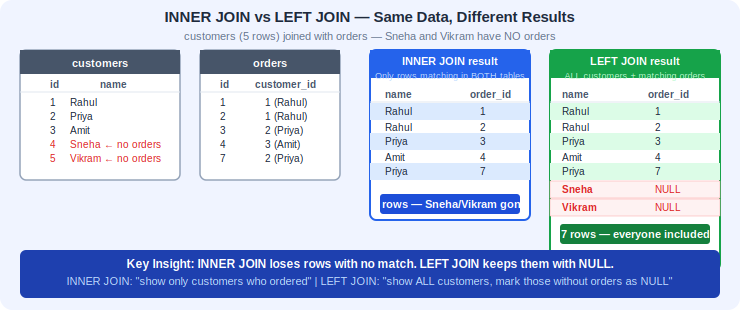
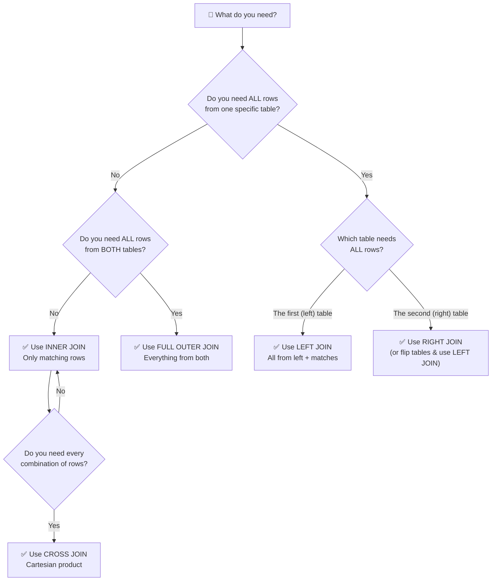
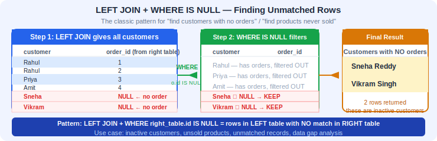
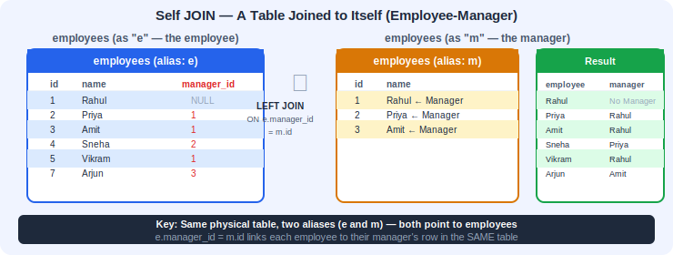

# 📅 Day 5: Joins — Combining Data from Multiple Tables


---

## 📖 1. Introduction

### What will we learn today?
- Why data is split across tables
- What are joins?
- What are foreign keys and referential integrity?
- `INNER JOIN` — matching rows from both tables
- `LEFT JOIN` — all from left + matching from right
- `RIGHT JOIN` — all from right + matching from left
- `FULL OUTER JOIN` — everything from both tables
- `CROSS JOIN` — every combination of rows
- Self JOIN — joining a table to itself (preview)
- `NATURAL JOIN` — automatic column matching (with warnings)
- Real-world relationships between tables
- How database engines actually process joins under the hood

### Why is this important?
In a real e-commerce database:
- **Customers** are in one table
- **Orders** are in another table
- **Products** are in another table

To answer "What did Rahul order?", you need to **join** the customers table with the orders table. Every real application uses joins constantly.

> 💡 **Did You Know?** In production databases, a single page load on a website like Amazon might trigger **dozens of join operations** behind the scenes — joining users, orders, products, reviews, inventory, shipping, and more!

---

## 🧠 2. Concept Explanation

### Why Do We Split Data Into Multiple Tables?

**Bad approach (one giant table):**

| order_id | customer_name | customer_email | product_name | price | quantity |
|----------|--------------|----------------|--------------|-------|----------|
| 1 | Rahul | rahul@email.com | Laptop | 55000 | 1 |
| 2 | Rahul | rahul@email.com | Phone | 25000 | 2 |
| 3 | Priya | priya@email.com | Laptop | 55000 | 1 |

**Problems:**
- Rahul's name and email are **repeated** in every order (waste of space)
- If Rahul changes his email, you have to update it in **every row**
- Product price is duplicated too

**Good approach (separate tables):**

**Customers table:** id, name, email
**Orders table:** id, customer_id, product_id, quantity
**Products table:** id, name, price

This is called **normalization** — each piece of data lives in one place.

But now, to see "Rahul's orders with product names", you need to **JOIN** these tables!

### How Joins Work



A join **matches rows** from two tables based on a related column (usually a foreign key).

Think of it like a **zipper** — each tooth on one side needs to find its matching tooth on the other side. The `ON` clause tells the database which "teeth" should connect.

### How the Database Engine Processes Joins (Under the Hood)

When you write a JOIN query, the database doesn't just magically combine tables. It uses specific **algorithms** to find matching rows efficiently. Understanding these at a high level will help you write faster queries:

**1. Nested Loop Join:**
The simplest approach. The database takes each row from Table A and scans through **every row** in Table B looking for matches. Like checking every name on a guest list one by one for each person arriving at a party.
- Best for: Small tables or when one table is very small.
- Worst case: Very slow for two large tables (if Table A has 1,000 rows and Table B has 1,000 rows, that's 1,000,000 comparisons!).

**2. Hash Join:**
The database builds a **hash table** (a fast lookup structure) from the smaller table, then scans the larger table and looks up each row in the hash table. Like creating an index card system first, then quickly flipping to the right card.
- Best for: Large tables with equality conditions (`=`).
- This is why joins on indexed columns are fast!

**3. Merge Join (Sort-Merge Join):**
Both tables are **sorted** on the join column, then the database walks through both sorted lists simultaneously, matching as it goes. Like merging two sorted decks of cards.
- Best for: When both tables are already sorted or have indexes on the join column.

> 🧠 **Key Insight:** You don't choose the algorithm — the database's **query planner** picks the best one automatically based on table sizes, indexes, and statistics. But knowing this helps you understand why **indexes on join columns matter so much** for performance!

---

### 🔑 Foreign Keys Explained

Before we dive into join syntax, let's understand the glue that holds related tables together: **foreign keys**.

A **foreign key** is a column in one table that **references the primary key** of another table. It creates a formal relationship between the two tables.

```
Customers Table                Orders Table
+---------+---------+          +---------+-------------+
| id (PK) | name    |          | id (PK) | customer_id |  <-- Foreign Key!
+---------+---------+          +---------+-------------+
| 1       | Rahul   |  <-----  | 1       | 1           |
| 2       | Priya   |  <-----  | 2       | 1           |
| 3       | Amit    |          | 3       | 2           |
+---------+---------+          +---------+-------------+

PK = Primary Key                customer_id REFERENCES customers(id)
```

**Why Foreign Keys Matter:**
- **Data Integrity:** The database won't let you insert an order with `customer_id = 999` if no customer with `id = 999` exists. This is called **referential integrity**.
- **Preventing Orphan Records:** You can't accidentally delete a customer who has orders (the database will block it or cascade the delete).
- **Self-Documentation:** Foreign keys make the relationships between tables explicit and clear.
- **Query Optimization:** The database can use foreign key information to optimize join queries.



**CREATE TABLE Syntax with Foreign Keys:**

```sql
-- Creating a table WITH foreign key constraints
CREATE TABLE orders (
    id SERIAL PRIMARY KEY,
    customer_id INT NOT NULL,
    product_id INT NOT NULL,
    quantity INT,
    order_date DATE,
    status VARCHAR(20) DEFAULT 'completed',
    
    -- Foreign key constraints
    CONSTRAINT fk_customer
        FOREIGN KEY (customer_id) 
        REFERENCES customers(id)
        ON DELETE RESTRICT      -- Prevent deleting a customer who has orders
        ON UPDATE CASCADE,      -- If customer id changes, update here too
    
    CONSTRAINT fk_product
        FOREIGN KEY (product_id)
        REFERENCES products(id)
        ON DELETE RESTRICT
        ON UPDATE CASCADE
);
```

**Foreign Key Actions Explained:**
| Action | Meaning |
|--------|---------|
| `RESTRICT` | Block the delete/update if related rows exist (safest) |
| `CASCADE` | Automatically delete/update related rows too |
| `SET NULL` | Set the foreign key to NULL when parent is deleted |
| `SET DEFAULT` | Set the foreign key to its default value |

> 🎯 **Key Takeaway:** Foreign keys are the **formal contracts** between tables. While joins work without them (they just match on column values), foreign keys ensure your data stays consistent. Always define them in production databases!

---

## 💡 3. Visual Learning

### The Four Types of Joins





### Join Visual Comparison



```
Table A: Customers          Table B: Orders
+----+--------+            +----+-------------+
| id | name   |            | id | customer_id |
+----+--------+            +----+-------------+
| 1  | Rahul  |            | 1  |      1      |
| 2  | Priya  |            | 2  |      1      |
| 3  | Amit   |            | 3  |      3      |
| 4  | Sneha  |            | 4  |      5      |
+----+--------+            +----+-------------+

INNER JOIN:  Rahul(1), Amit(3)      — only matching IDs
LEFT JOIN:   Rahul(1), Priya(2-NULL), Amit(3), Sneha(4-NULL) — all customers
RIGHT JOIN:  Rahul(1), Amit(3), ???(5-NULL) — all orders
FULL JOIN:   Everyone from both, NULLs where no match
```

### 🔀 Join Decision Flowchart

Use this flowchart to decide which join type to use:



> 💡 **Tip:** When in doubt, start with a LEFT JOIN. It's the most commonly used join in real applications because you usually want all records from your "main" table regardless of whether related data exists.

---

## 🖥️ 4. Setup
```sql
CREATE DATABASE joins_db;
\c joins_db

-- Customers table
CREATE TABLE customers (
    id SERIAL PRIMARY KEY,
    name VARCHAR(100),
    email VARCHAR(150),
    city VARCHAR(50)
);

-- Products table
CREATE TABLE products (
    id SERIAL PRIMARY KEY,
    product_name VARCHAR(100),
    price DECIMAL(10,2),
    category VARCHAR(50)
);

-- Orders table
CREATE TABLE orders (
    id SERIAL PRIMARY KEY,
    customer_id INT NOT NULL,
    product_id INT NOT NULL,
    quantity INT,
    order_date DATE,
    status VARCHAR(20) DEFAULT 'completed',

    CONSTRAINT fk_orders_customer
        FOREIGN KEY (customer_id)
        REFERENCES customers(id)
        ON DELETE RESTRICT
        ON UPDATE CASCADE,

    CONSTRAINT fk_orders_product
        FOREIGN KEY (product_id)
        REFERENCES products(id)
        ON DELETE RESTRICT
        ON UPDATE CASCADE
);

-- Departments table
CREATE TABLE departments (
    id SERIAL PRIMARY KEY,
    dept_name VARCHAR(50)
);

-- Employees table
CREATE TABLE employees (
    id SERIAL PRIMARY KEY,
    name VARCHAR(100),
    department_id INT,
    salary DECIMAL(10,2),
    manager_id INT,

    CONSTRAINT fk_employee_department
        FOREIGN KEY (department_id)
        REFERENCES departments(id)
        ON DELETE SET NULL
        ON UPDATE CASCADE,

    CONSTRAINT fk_employee_manager
        FOREIGN KEY (manager_id)
        REFERENCES employees(id)
        ON DELETE SET NULL
        ON UPDATE CASCADE
);

-- Shipping table
CREATE TABLE shipping (
    id SERIAL PRIMARY KEY,
    order_id INT UNIQUE,
    shipping_address VARCHAR(200),
    shipped_date DATE,
    delivery_status VARCHAR(20),

    CONSTRAINT fk_shipping_order
        FOREIGN KEY (order_id)
        REFERENCES orders(id)
        ON DELETE CASCADE
        ON UPDATE CASCADE
);
```
```sql
CREATE DATABASE joins_db;
\c joins_db

-- Customers table
CREATE TABLE customers (
    id SERIAL PRIMARY KEY,
    name VARCHAR(100),
    email VARCHAR(150),
    city VARCHAR(50)
);

INSERT INTO customers (name, email, city) VALUES
('Rahul Sharma', 'rahul@email.com', 'Mumbai'),
('Priya Patel', 'priya@email.com', 'Delhi'),
('Amit Kumar', 'amit@email.com', 'Pune'),
('Sneha Reddy', 'sneha@email.com', 'Hyderabad'),
('Vikram Singh', 'vikram@email.com', 'Chennai');

-- Products table
CREATE TABLE products (
    id SERIAL PRIMARY KEY,
    product_name VARCHAR(100),
    price DECIMAL(10, 2),
    category VARCHAR(50)
);

INSERT INTO products (product_name, price, category) VALUES
('Laptop', 55000.00, 'Electronics'),
('Phone', 25000.00, 'Electronics'),
('Headphones', 2500.00, 'Electronics'),
('Backpack', 1500.00, 'Bags'),
('Watch', 5000.00, 'Accessories'),
('Shoes', 3500.00, 'Footwear');

-- Orders table (links customers and products)
CREATE TABLE orders (
    id SERIAL PRIMARY KEY,
    customer_id INT,
    product_id INT,
    quantity INT,
    order_date DATE,
    status VARCHAR(20) DEFAULT 'completed'
);

INSERT INTO orders (customer_id, product_id, quantity, order_date, status) VALUES
(1, 1, 1, '2024-01-15', 'completed'),    -- Rahul bought Laptop
(1, 3, 2, '2024-01-20', 'completed'),    -- Rahul bought Headphones
(2, 2, 1, '2024-02-01', 'completed'),    -- Priya bought Phone
(3, 1, 1, '2024-02-10', 'shipped'),      -- Amit bought Laptop
(3, 4, 3, '2024-02-15', 'completed'),    -- Amit bought Backpack
(1, 5, 1, '2024-03-01', 'pending'),      -- Rahul bought Watch
(2, 6, 2, '2024-03-05', 'completed');    -- Priya bought Shoes

-- Departments table (for more examples)
CREATE TABLE departments (
    id SERIAL PRIMARY KEY,
    dept_name VARCHAR(50)
);

INSERT INTO departments (dept_name) VALUES
('Engineering'), ('Marketing'), ('Sales'), ('HR'), ('Finance');

-- Employees table (with manager_id for self-join examples)
CREATE TABLE employees (
    id SERIAL PRIMARY KEY,
    name VARCHAR(100),
    department_id INT,
    salary DECIMAL(10, 2),
    manager_id INT
);

INSERT INTO employees (name, department_id, salary, manager_id) VALUES
('Rahul', 1, 75000, NULL),       -- Engineering (no manager — he's the top)
('Priya', 2, 60000, 1),          -- Marketing (reports to Rahul)
('Amit', 1, 82000, 1),           -- Engineering (reports to Rahul)
('Sneha', 3, 48000, 2),          -- Sales (reports to Priya)
('Vikram', NULL, 55000, 1),      -- No department assigned! (reports to Rahul)
('Neha', 2, 58000, 2),           -- Marketing (reports to Priya)
('Arjun', 4, 52000, 3);          -- HR (reports to Amit)

-- Shipping table (for multi-table join examples)
CREATE TABLE shipping (
    id SERIAL PRIMARY KEY,
    order_id INT,
    shipping_address VARCHAR(200),
    shipped_date DATE,
    delivery_status VARCHAR(20)
);

INSERT INTO shipping (order_id, shipping_address, shipped_date, delivery_status) VALUES
(1, '123 MG Road, Mumbai', '2024-01-17', 'delivered'),
(2, '123 MG Road, Mumbai', '2024-01-22', 'delivered'),
(3, '456 CP Lane, Delhi', '2024-02-03', 'delivered'),
(4, '789 FC Road, Pune', '2024-02-12', 'in_transit'),
(5, '789 FC Road, Pune', '2024-02-17', 'delivered'),
(6, '123 MG Road, Mumbai', NULL, 'processing');
```

> Note: Customer 4 (Sneha) and 5 (Vikram) have **no orders**. Product 6 (Shoes) has only orders from Priya. Department 5 (Finance) has **no employees**. These are intentional — they'll help us see the difference between join types!

---

## 📝 5. Syntax + Examples

---

### 🔗 INNER JOIN — Only Matching Rows

An `INNER JOIN` returns rows that have **matching values in both tables**. If a row doesn't have a match, it's **excluded**.

**How it works under the hood:** The database engine takes the join condition (e.g., `customers.id = orders.customer_id`) and for each row in one table, searches for rows in the other table where the condition is true. If indexes exist on the join columns, the engine can use a fast **index lookup** instead of scanning every row. Without indexes, it might build a temporary hash table or do a full nested loop scan.

**Syntax:**
```sql
SELECT columns
FROM table1
INNER JOIN table2 ON table1.column = table2.column;
```

**Analogy:** You're checking a guest list at a party. Only people whose name appears on **both** the invitation list AND the arrival list get in.

#### Example 1: Customers and Their Orders

```sql
SELECT 
    customers.name, 
    orders.id AS order_id, 
    orders.order_date 
FROM customers
INNER JOIN orders ON customers.id = orders.customer_id;
```

**Result:**

| name | order_id | order_date |
|------|----------|------------|
| Rahul Sharma | 1 | 2024-01-15 |
| Rahul Sharma | 2 | 2024-01-20 |
| Priya Patel | 3 | 2024-02-01 |
| Amit Kumar | 4 | 2024-02-10 |
| Amit Kumar | 5 | 2024-02-15 |
| Rahul Sharma | 6 | 2024-03-01 |
| Priya Patel | 7 | 2024-03-05 |

> Notice: **Sneha** and **Vikram** don't appear — they have no orders!

#### Example 2: Using Table Aliases (Shorthand)

```sql
-- Using aliases: c for customers, o for orders
SELECT c.name, o.id AS order_id, o.order_date
FROM customers c
INNER JOIN orders o ON c.id = o.customer_id;
```

This is the same query but shorter. Aliases save typing!

#### Example 3: Three-Table Join (Customer + Order + Product)

```sql
SELECT 
    c.name AS customer,
    p.product_name,
    p.price,
    o.quantity,
    (p.price * o.quantity) AS total_cost,
    o.order_date
FROM customers c
INNER JOIN orders o ON c.id = o.customer_id
INNER JOIN products p ON o.product_id = p.id;
```

**Result:**

| customer | product_name | price | quantity | total_cost | order_date |
|----------|-------------|-------|----------|------------|------------|
| Rahul Sharma | Laptop | 55000 | 1 | 55000 | 2024-01-15 |
| Rahul Sharma | Headphones | 2500 | 2 | 5000 | 2024-01-20 |
| Priya Patel | Phone | 25000 | 1 | 25000 | 2024-02-01 |
| ... | ... | ... | ... | ... | ... |

#### Example 4: Employees and Their Departments

```sql
SELECT e.name, d.dept_name, e.salary
FROM employees e
INNER JOIN departments d ON e.department_id = d.id;
```

> Note: **Vikram** won't appear because his `department_id` is NULL (no match). **Finance** department won't appear because it has no employees.

> 🎯 **Key Takeaway:** Use INNER JOIN when you **only want rows that have matching data in both tables**. If a row in either table has no match, it disappears from the result. This is the most common join type and is perfect when you know related data exists.

---

### ⬅️ LEFT JOIN — All From Left, Matching From Right

A `LEFT JOIN` returns **all rows from the left table**, plus matching rows from the right table. If there's no match, the right side gets **NULL**.

**How it works under the hood:** The engine first processes the join like an INNER JOIN to find all matches. Then, it goes back and checks: "Are there any rows in the left table that didn't get matched?" Those rows are added to the result with NULL values for all columns from the right table. This is why LEFT JOIN results always have **at least as many rows** as the left table.

**Analogy:** You have a list of all students. You want to know their exam scores. Students who didn't take the exam still show up — with NULL for their score.

#### Example 5: All Customers (Even Without Orders)

```sql
SELECT c.name, o.id AS order_id, o.order_date
FROM customers c
LEFT JOIN orders o ON c.id = o.customer_id;
```

**Result:**

| name | order_id | order_date |
|------|----------|------------|
| Rahul Sharma | 1 | 2024-01-15 |
| Rahul Sharma | 2 | 2024-01-20 |
| Rahul Sharma | 6 | 2024-03-01 |
| Priya Patel | 3 | 2024-02-01 |
| Priya Patel | 7 | 2024-03-05 |
| Amit Kumar | 4 | 2024-02-10 |
| Amit Kumar | 5 | 2024-02-15 |
| **Sneha Reddy** | **NULL** | **NULL** |
| **Vikram Singh** | **NULL** | **NULL** |

> Now Sneha and Vikram appear with NULLs! LEFT JOIN keeps **everyone** from the left table.

#### Example 6: Find Customers Who Never Ordered

```sql
SELECT c.name, c.email
FROM customers c
LEFT JOIN orders o ON c.id = o.customer_id
WHERE o.id IS NULL;
```

This is a very common pattern! The LEFT JOIN + `WHERE ... IS NULL` finds rows with **no match**.



**Result:**

| name | email |
|------|-------|
| Sneha Reddy | sneha@email.com |
| Vikram Singh | vikram@email.com |

#### Example 7: All Employees with Department Names

```sql
SELECT e.name, COALESCE(d.dept_name, 'Unassigned') AS department
FROM employees e
LEFT JOIN departments d ON e.department_id = d.id;
```

`COALESCE` replaces NULL with a default value. Vikram will show "Unassigned" instead of NULL.

> 🎯 **Key Takeaway:** Use LEFT JOIN when **the left table is your "main" table** and you want ALL of its rows regardless of whether matching data exists in the other table. This is the second most common join type and is essential for finding "missing" relationships (e.g., customers without orders, products never sold).

---

### ➡️ RIGHT JOIN — All From Right, Matching From Left

A `RIGHT JOIN` returns **all rows from the right table**, plus matching rows from the left table.

**How it works under the hood:** It's the mirror image of LEFT JOIN. The engine ensures every row from the right table appears in the result, filling in NULLs for unmatched rows from the left table. Internally, most database engines actually convert RIGHT JOINs into LEFT JOINs (by swapping the table order) before executing.

#### Example 8: All Departments (Even Without Employees)

```sql
SELECT d.dept_name, e.name
FROM employees e
RIGHT JOIN departments d ON e.department_id = d.id;
```

**Result:**

| dept_name | name |
|-----------|------|
| Engineering | Rahul |
| Engineering | Amit |
| Marketing | Priya |
| Marketing | Neha |
| Sales | Sneha |
| HR | Arjun |
| **Finance** | **NULL** |

> Finance department appears even though it has no employees!

> 💡 **Pro Tip:** `RIGHT JOIN` is rarely used in practice. You can always rewrite it as a `LEFT JOIN` by swapping the table order. Most developers prefer `LEFT JOIN` for consistency.

> 🎯 **Key Takeaway:** RIGHT JOIN is the mirror of LEFT JOIN. In practice, you'll almost never use it. Just swap the table order and use LEFT JOIN instead. Knowing it exists is important for reading others' code, but you'll rarely write one yourself.

---

### 🔄 FULL OUTER JOIN — Everything From Both

A `FULL OUTER JOIN` returns **all rows from both tables**. Where there's no match, you get NULL.

**How it works under the hood:** Think of it as running a LEFT JOIN and a RIGHT JOIN simultaneously, then merging the results (removing duplicates from the matched rows). The engine ensures every row from both tables appears at least once. This is the most "inclusive" join type.

**Analogy:** Imagine two clubs merging their member lists. Every member from **both** clubs is on the new combined list, even if they were only in one club. People in both clubs appear once with all their information; people in only one club have blanks for the other club's info.

#### Example 9: All Employees and All Departments

```sql
SELECT e.name, d.dept_name
FROM employees e
FULL OUTER JOIN departments d ON e.department_id = d.id;
```

**Result:**

| name | dept_name |
|------|-----------|
| Rahul | Engineering |
| Amit | Engineering |
| Priya | Marketing |
| Neha | Marketing |
| Sneha | Sales |
| Arjun | HR |
| **Vikram** | **NULL** |
| **NULL** | **Finance** |

Both Vikram (no department) and Finance (no employees) appear!

#### Example 10: Full Comparison

```sql
-- INNER JOIN: only matches
SELECT c.name, o.id FROM customers c INNER JOIN orders o ON c.id = o.customer_id;

-- LEFT JOIN: all customers
SELECT c.name, o.id FROM customers c LEFT JOIN orders o ON c.id = o.customer_id;

-- RIGHT JOIN: all orders
SELECT c.name, o.id FROM customers c RIGHT JOIN orders o ON c.id = o.customer_id;

-- FULL OUTER JOIN: everything
SELECT c.name, o.id FROM customers c FULL OUTER JOIN orders o ON c.id = o.customer_id;
```

> 🎯 **Key Takeaway:** FULL OUTER JOIN is for when you need a **complete picture of both tables** — showing all data even where relationships are missing. It's useful for data auditing and reconciliation tasks, but less common in everyday application queries.

---

### ✖️ CROSS JOIN — Every Combination (Cartesian Product)

A `CROSS JOIN` returns **every possible combination** of rows from both tables. If Table A has 5 rows and Table B has 6 rows, the result has 5 x 6 = **30 rows**.

**There is no `ON` clause** — because we're not matching anything; we want all combinations.

**Analogy:** You have 3 shirts and 4 pants. A CROSS JOIN gives you all 12 possible outfits!

#### Example: All Possible Customer-Product Combinations

```sql
SELECT c.name AS customer, p.product_name
FROM customers c
CROSS JOIN products p
ORDER BY c.name, p.product_name;
```

**Result (showing first few rows of 30 total):**

| customer | product_name |
|----------|-------------|
| Amit Kumar | Backpack |
| Amit Kumar | Headphones |
| Amit Kumar | Laptop |
| Amit Kumar | Phone |
| Amit Kumar | Shoes |
| Amit Kumar | Watch |
| Priya Patel | Backpack |
| ... | ... |

> ⚠️ **Warning:** CROSS JOINs can produce **enormous** result sets. A table with 1,000 rows crossed with another 1,000-row table produces 1,000,000 rows! Use them deliberately, not accidentally.

**When CROSS JOIN is useful:**
- Generating all possible combinations (like a menu with all size/topping combos)
- Creating date-based reports where you need every customer for every date
- Testing and data generation scenarios

> 🎯 **Key Takeaway:** CROSS JOIN gives you the Cartesian product — every row paired with every other row. No ON clause needed. Use it intentionally for combination generation, but be very careful with large tables!

---

### 🔄 Self JOIN — A Table Joined to Itself (Preview)

A **Self JOIN** is when you join a table to **itself**. This is useful when rows in a table have relationships with **other rows in the same table** — like employees and their managers.

**Analogy:** Imagine a family tree stored in one table. Each person has a `parent_id` that points to another person's `id` in the **same** table. To show "Person X is the child of Person Y," you join the table to itself.

#### Example: Employee-Manager Relationship



```sql
SELECT 
    e.name AS employee,
    COALESCE(m.name, 'No Manager (Top Level)') AS manager
FROM employees e
LEFT JOIN employees m ON e.manager_id = m.id;
```

**Result:**

| employee | manager |
|----------|---------|
| Rahul | No Manager (Top Level) |
| Priya | Rahul |
| Amit | Rahul |
| Sneha | Priya |
| Vikram | Rahul |
| Neha | Priya |
| Arjun | Amit |

> Notice we used the `employees` table **twice** — once as `e` (the employee) and once as `m` (the manager). Aliases are **required** for self joins so the database can tell the two "copies" apart.

> 🎯 **Key Takeaway:** Self JOINs let you express hierarchical or recursive relationships within a single table. They're essential for org charts, category trees, and any data where rows reference other rows in the same table. We'll cover this in more depth on Day 6!

---

### 🌿 NATURAL JOIN — Automatic Column Matching (Use With Caution!)

A `NATURAL JOIN` automatically joins tables on **all columns that share the same name**. You don't write an `ON` clause — the database figures it out.

```sql
-- NATURAL JOIN automatically matches on shared column names
SELECT *
FROM employees
NATURAL JOIN departments;
```

> ⚠️ **Warning: NATURAL JOIN is dangerous in production code!** Here's why:
> - If someone adds a column to either table that happens to share a name, the join condition **silently changes**.
> - You can't see the join condition just by reading the query — you have to know both table schemas.
> - It makes code brittle and hard to maintain.
> - Most SQL style guides and senior developers **strongly discourage** its use.

**Always prefer explicit join conditions:**
```sql
-- This is MUCH better — clear, explicit, and won't break if columns are added
SELECT e.name, d.dept_name
FROM employees e
INNER JOIN departments d ON e.department_id = d.id;
```

> 🎯 **Key Takeaway:** NATURAL JOIN exists and you should know about it, but **don't use it in real projects**. Always write explicit ON conditions so your queries are clear and maintainable.

---

### 🎯 Real-World Queries

#### Example 11: Order Summary with Customer and Product Details

```sql
SELECT 
    c.name AS customer,
    c.city,
    p.product_name,
    p.category,
    o.quantity,
    (p.price * o.quantity) AS total_amount,
    o.status
FROM orders o
INNER JOIN customers c ON o.customer_id = c.id
INNER JOIN products p ON o.product_id = p.id
ORDER BY o.order_date DESC;
```

#### Example 12: Total Spending Per Customer

```sql
SELECT 
    c.name, 
    COUNT(o.id) AS total_orders,
    SUM(p.price * o.quantity) AS total_spent
FROM customers c
LEFT JOIN orders o ON c.id = o.customer_id
LEFT JOIN products p ON o.product_id = p.id
GROUP BY c.name
ORDER BY total_spent DESC NULLS LAST;
```

#### Example 13: Products Never Ordered

```sql
SELECT p.product_name, p.price
FROM products p
LEFT JOIN orders o ON p.id = o.product_id
WHERE o.id IS NULL;
```

#### Example 14: Department-wise Salary Summary

```sql
SELECT 
    d.dept_name,
    COUNT(e.id) AS employee_count,
    COALESCE(SUM(e.salary), 0) AS total_salary,
    COALESCE(ROUND(AVG(e.salary), 2), 0) AS avg_salary
FROM departments d
LEFT JOIN employees e ON d.id = e.department_id
GROUP BY d.dept_name
ORDER BY total_salary DESC;
```

#### Example 15: JOIN with Aggregate Functions — Total Orders Per Customer

```sql
SELECT 
    c.name,
    c.city,
    COUNT(o.id) AS number_of_orders,
    COALESCE(SUM(o.quantity), 0) AS total_items_bought,
    COALESCE(SUM(p.price * o.quantity), 0) AS total_money_spent,
    COALESCE(ROUND(AVG(p.price * o.quantity), 2), 0) AS avg_order_value
FROM customers c
LEFT JOIN orders o ON c.id = o.customer_id
LEFT JOIN products p ON o.product_id = p.id
GROUP BY c.name, c.city
ORDER BY total_money_spent DESC;
```

**Result:**

| name | city | number_of_orders | total_items_bought | total_money_spent | avg_order_value |
|------|------|------------------|--------------------|-------------------|-----------------|
| Rahul Sharma | Mumbai | 3 | 4 | 65000.00 | 21666.67 |
| Priya Patel | Delhi | 2 | 3 | 32000.00 | 16000.00 |
| Amit Kumar | Pune | 2 | 4 | 59500.00 | 29750.00 |
| Sneha Reddy | Hyderabad | 0 | 0 | 0 | 0 |
| Vikram Singh | Chennai | 0 | 0 | 0 | 0 |

> This combines LEFT JOIN with multiple aggregate functions to give a complete customer activity summary!

#### Example 16: JOIN with WHERE and ORDER BY Combined

```sql
-- Find all completed orders over 10,000 in total value, sorted by amount
SELECT 
    c.name AS customer,
    p.product_name,
    p.price,
    o.quantity,
    (p.price * o.quantity) AS total_amount,
    o.order_date
FROM customers c
INNER JOIN orders o ON c.id = o.customer_id
INNER JOIN products p ON o.product_id = p.id
WHERE o.status = 'completed'
  AND (p.price * o.quantity) > 10000
ORDER BY total_amount DESC, o.order_date ASC;
```

**Result:**

| customer | product_name | price | quantity | total_amount | order_date |
|----------|-------------|-------|----------|-------------|------------|
| Rahul Sharma | Laptop | 55000.00 | 1 | 55000.00 | 2024-01-15 |
| Priya Patel | Phone | 25000.00 | 1 | 25000.00 | 2024-02-01 |

> This shows how you can combine JOINs with WHERE filtering and ORDER BY sorting in a single query. The WHERE clause filters **after** the join is performed.

#### Example 17: Multi-Table JOIN with 4 Tables (Customer + Order + Product + Shipping)

```sql
SELECT 
    c.name AS customer,
    c.city,
    p.product_name,
    p.category,
    o.quantity,
    (p.price * o.quantity) AS total_cost,
    o.order_date,
    s.shipping_address,
    s.shipped_date,
    s.delivery_status
FROM customers c
INNER JOIN orders o ON c.id = o.customer_id
INNER JOIN products p ON o.product_id = p.id
LEFT JOIN shipping s ON o.id = s.order_id
ORDER BY o.order_date DESC;
```

> Notice that we used INNER JOIN for customers and products (we need that data to exist) but LEFT JOIN for shipping (some orders might not have shipping info yet). **Mixing join types in a single query is very common in real applications!**

#### Example 18: Using DISTINCT with JOINs

When you join tables, you can get duplicate rows. `DISTINCT` removes them.

```sql
-- Find all unique cities where customers have placed orders
SELECT DISTINCT c.city
FROM customers c
INNER JOIN orders o ON c.id = o.customer_id
ORDER BY c.city;
```

**Result:**

| city |
|------|
| Delhi |
| Mumbai |
| Pune |

> Without DISTINCT, Mumbai would appear 3 times (once for each of Rahul's orders). Hyderabad and Chennai don't appear because Sneha and Vikram haven't placed orders.

```sql
-- Find all unique product categories that have been ordered
SELECT DISTINCT p.category, COUNT(*) AS times_ordered
FROM products p
INNER JOIN orders o ON p.id = o.product_id
GROUP BY p.category
ORDER BY times_ordered DESC;
```

---

## 🌍 Real-World Scenario: E-Commerce Order Tracking System

Let's see how an actual e-commerce company (like Flipkart or Amazon) would use different join types in their day-to-day operations. Imagine you're a database engineer at "ShopIndia" and your manager asks you for several reports.

### Scenario 1: Customer Order Details Page 🛒

**Request:** "When a customer clicks 'My Orders', show them all their order details including product names, prices, shipping status."

```sql
-- This query powers the "My Orders" page
SELECT 
    o.id AS order_number,
    p.product_name,
    p.category,
    o.quantity,
    p.price AS unit_price,
    (p.price * o.quantity) AS total_price,
    o.order_date,
    o.status AS order_status,
    COALESCE(s.delivery_status, 'Not shipped yet') AS shipping_status,
    s.shipped_date
FROM orders o
INNER JOIN products p ON o.product_id = p.id
LEFT JOIN shipping s ON o.id = s.order_id
WHERE o.customer_id = 1   -- Rahul's orders
ORDER BY o.order_date DESC;
```

> We use INNER JOIN for products (every order **must** have a product) and LEFT JOIN for shipping (an order might not have been shipped yet, like Rahul's pending watch order).

### Scenario 2: Finding Inactive Customers 😴

**Request:** "Marketing wants to send re-engagement emails to customers who signed up but never ordered anything."

```sql
-- Find customers who never placed a single order
SELECT 
    c.name,
    c.email,
    c.city,
    'No orders placed' AS status
FROM customers c
LEFT JOIN orders o ON c.id = o.customer_id
WHERE o.id IS NULL
ORDER BY c.name;
```

**Result:**

| name | email | city | status |
|------|-------|------|--------|
| Sneha Reddy | sneha@email.com | Hyderabad | No orders placed |
| Vikram Singh | vikram@email.com | Chennai | No orders placed |

> This is the classic LEFT JOIN + IS NULL pattern. Marketing can now target these customers with special offers!

### Scenario 3: Monthly Sales Report 📊

**Request:** "Generate a sales report showing total revenue per product category, with customer count."

```sql
SELECT 
    p.category,
    COUNT(DISTINCT c.id) AS unique_customers,
    COUNT(o.id) AS total_orders,
    SUM(o.quantity) AS total_units_sold,
    SUM(p.price * o.quantity) AS total_revenue,
    ROUND(AVG(p.price * o.quantity), 2) AS avg_order_value
FROM products p
INNER JOIN orders o ON p.id = o.product_id
INNER JOIN customers c ON o.customer_id = c.id
GROUP BY p.category
ORDER BY total_revenue DESC;
```

> We use INNER JOINs here because the report only cares about products that **were actually sold**. Unsold products or inactive customers would just add noise.

### Scenario 4: Products Needing Restocking 📦

**Request:** "Show all products with their total quantity sold. Include products with zero sales — those might be overstocked and need promotion."

```sql
SELECT 
    p.product_name,
    p.category,
    p.price,
    COALESCE(SUM(o.quantity), 0) AS total_quantity_sold,
    CASE 
        WHEN COALESCE(SUM(o.quantity), 0) = 0 THEN '🔴 Never sold - needs promotion'
        WHEN SUM(o.quantity) < 3 THEN '🟡 Low sales - monitor'
        ELSE '🟢 Good sales'
    END AS sales_status
FROM products p
LEFT JOIN orders o ON p.id = o.product_id
GROUP BY p.product_name, p.category, p.price
ORDER BY total_quantity_sold ASC;
```

> LEFT JOIN is critical here — we need to see products with **zero** sales too. INNER JOIN would hide them!

### Scenario 5: Complete Business Dashboard Query 📈

**Request:** "Full dashboard showing customers, their order count, total spending, and their most recent order date."

```sql
SELECT 
    c.name,
    c.city,
    COUNT(o.id) AS total_orders,
    COALESCE(SUM(p.price * o.quantity), 0) AS lifetime_value,
    MAX(o.order_date) AS last_order_date,
    CASE 
        WHEN MAX(o.order_date) IS NULL THEN 'Never ordered'
        WHEN MAX(o.order_date) < '2024-02-01' THEN 'Inactive'
        ELSE 'Active'
    END AS customer_status
FROM customers c
LEFT JOIN orders o ON c.id = o.customer_id
LEFT JOIN products p ON o.product_id = p.id
GROUP BY c.name, c.city
ORDER BY lifetime_value DESC;
```

> This is the kind of query that powers real business dashboards. Notice how LEFT JOINs ensure we see **every** customer, even the inactive ones.

---

## ✅ Checkpoint!

> When should you use each join?
> 
> - **INNER JOIN** → "Show me only rows that have data in **both** tables"
> - **LEFT JOIN** → "Show me **all** rows from the first table, even if there's no match"
> - **RIGHT JOIN** → "Show me **all** rows from the second table" (rarely used; flip to LEFT JOIN)
> - **FULL OUTER JOIN** → "Show me **everything** from both tables"
> - **CROSS JOIN** → "Show me **every possible combination** of rows" (no ON clause)
> - **Self JOIN** → "I need to relate rows **within the same table**"

---

## 🧠 Did You Know? How Database Engines Optimize Joins

> 🤓 **Did You Know?** When you write a JOIN query, the database doesn't execute it exactly as you wrote it. Instead, it goes through a sophisticated **query planning** process:
>
> 1. **Parsing:** The SQL is broken down into a logical structure.
> 2. **Optimization:** The **query planner** considers multiple execution strategies. For a query joining 4 tables, there might be dozens of possible join orders — the planner evaluates the cost of each and picks the cheapest one.
> 3. **Join Algorithm Selection:** Based on table sizes, available indexes, and memory, the planner chooses between Nested Loop, Hash Join, or Merge Join for each pair of tables.
> 4. **Index Usage:** If an index exists on a join column, the database can skip scanning the entire table. This is why **you should always create indexes on foreign key columns** in production databases!
> 5. **Statistics:** The database keeps statistics about data distribution (how many unique values, how many rows, etc.) to make better decisions.
>
> You can see the plan for any query by adding `EXPLAIN` or `EXPLAIN ANALYZE` before your SQL:
> ```sql
> EXPLAIN ANALYZE
> SELECT c.name, o.order_date
> FROM customers c
> INNER JOIN orders o ON c.id = o.customer_id;
> ```
> This shows you exactly which algorithms and indexes the database chose!

---

## 🧪 6. Hands-on Practice

**Problem 1:** Show all customer names and their order dates using INNER JOIN.

<details>
<summary>💡 Solution</summary>

```sql
SELECT c.name, o.order_date
FROM customers c
INNER JOIN orders o ON c.id = o.customer_id;
```

</details>

**Problem 2:** Show all customers and their orders. Include customers with no orders.

<details>
<summary>💡 Solution</summary>

```sql
SELECT c.name, o.id AS order_id, o.order_date
FROM customers c
LEFT JOIN orders o ON c.id = o.customer_id;
```

</details>

**Problem 3:** Show each customer's name, the product they bought, and the total cost (price * quantity).

<details>
<summary>💡 Solution</summary>

```sql
SELECT c.name, p.product_name, (p.price * o.quantity) AS total_cost
FROM customers c
INNER JOIN orders o ON c.id = o.customer_id
INNER JOIN products p ON o.product_id = p.id;
```

</details>

**Problem 4:** Find all products that have never been ordered.

<details>
<summary>💡 Solution</summary>

```sql
SELECT p.product_name
FROM products p
LEFT JOIN orders o ON p.id = o.product_id
WHERE o.id IS NULL;
```

</details>

**Problem 5:** Show all departments and the number of employees in each, including departments with 0 employees.

<details>
<summary>💡 Solution</summary>

```sql
SELECT d.dept_name, COUNT(e.id) AS employee_count
FROM departments d
LEFT JOIN employees e ON d.id = e.department_id
GROUP BY d.dept_name
ORDER BY employee_count DESC;
```

</details>

**Problem 6:** Find the total amount spent by each customer. Include customers who spent nothing (show 0).

<details>
<summary>💡 Solution</summary>

```sql
SELECT 
    c.name,
    COALESCE(SUM(p.price * o.quantity), 0) AS total_spent
FROM customers c
LEFT JOIN orders o ON c.id = o.customer_id
LEFT JOIN products p ON o.product_id = p.id
GROUP BY c.name
ORDER BY total_spent DESC;
```

</details>

**Problem 7:** Which customer ordered the most expensive single item?

<details>
<summary>💡 Solution</summary>

```sql
SELECT c.name, p.product_name, p.price
FROM customers c
INNER JOIN orders o ON c.id = o.customer_id
INNER JOIN products p ON o.product_id = p.id
ORDER BY p.price DESC
LIMIT 1;
```

</details>

**Problem 8:** Show each employee's name alongside their manager's name. Include employees with no manager.

<details>
<summary>💡 Solution</summary>

```sql
SELECT 
    e.name AS employee,
    COALESCE(m.name, 'No Manager') AS manager
FROM employees e
LEFT JOIN employees m ON e.manager_id = m.id
ORDER BY manager, employee;
```

</details>

**Problem 9:** Generate a report showing each customer, their orders, the products, AND the shipping status. Include orders that haven't been shipped yet (show 'Awaiting shipment').

<details>
<summary>💡 Solution</summary>

```sql
SELECT 
    c.name AS customer,
    p.product_name,
    o.order_date,
    o.status AS order_status,
    COALESCE(s.delivery_status, 'Awaiting shipment') AS shipping_status
FROM customers c
INNER JOIN orders o ON c.id = o.customer_id
INNER JOIN products p ON o.product_id = p.id
LEFT JOIN shipping s ON o.id = s.order_id
ORDER BY o.order_date DESC;
```

</details>

**Problem 10:** Find the product category that generates the most revenue. Show the category name, number of orders, and total revenue.

<details>
<summary>💡 Solution</summary>

```sql
SELECT 
    p.category,
    COUNT(o.id) AS number_of_orders,
    SUM(p.price * o.quantity) AS total_revenue
FROM products p
INNER JOIN orders o ON p.id = o.product_id
GROUP BY p.category
ORDER BY total_revenue DESC
LIMIT 1;
```

</details>

**Problem 11:** Show ALL customers and ALL products in a cross join, then add a column that says 'Purchased' if the customer actually bought that product, or 'Not Purchased' otherwise. *(Hint: Use CROSS JOIN combined with a LEFT JOIN on orders.)*

<details>
<summary>💡 Solution</summary>

```sql
SELECT 
    c.name AS customer,
    p.product_name,
    CASE 
        WHEN o.id IS NOT NULL THEN 'Purchased'
        ELSE 'Not Purchased'
    END AS purchase_status
FROM customers c
CROSS JOIN products p
LEFT JOIN orders o ON c.id = o.customer_id AND p.id = o.product_id
ORDER BY c.name, p.product_name;
```

</details>

---

## ⚠️ 7. Common Mistakes

| # | Mistake | What Goes Wrong | Correct Way |
|---|---------|----------------|-------------|
| 1 | Forgetting the ON clause | `SELECT * FROM customers INNER JOIN orders` ❌ — creates a cross join! | Always specify `ON table1.col = table2.col` |
| 2 | Ambiguous column names | `SELECT id, name FROM customers JOIN orders ON ...` — which `id`? | Use table aliases: `SELECT c.id, c.name ...` |
| 3 | Using INNER JOIN when you need LEFT | Missing customers who have no orders | Think: "Do I want ALL from one table or only matches?" |
| 4 | Joining on wrong columns | `ON c.id = o.id` instead of `ON c.id = o.customer_id` | Match the **primary key** with the **foreign key** |
| 5 | Not using aliases | `customers.name, orders.customer_id` — verbose and hard to read | Use `c.name, o.customer_id` |
| 6 | Forgetting NULL handling in LEFT JOIN | Aggregating NULLs gives NULL | Use `COALESCE(value, 0)` to replace NULLs |
| 7 | Accidental Cartesian product (missing ON) | `FROM customers, orders` without a WHERE join condition creates millions of rows! | Always use explicit `JOIN ... ON` syntax, never comma-separated tables without conditions |
| 8 | LEFT JOIN + WHERE on right table | Using `LEFT JOIN orders o ... WHERE o.status = 'completed'` **converts** it to an INNER JOIN because NULL status doesn't equal 'completed' | Move the filter into the ON clause: `LEFT JOIN orders o ON c.id = o.customer_id AND o.status = 'completed'` |
| 9 | Joining large tables without indexes | Queries take minutes or hours instead of milliseconds | Always create indexes on foreign key columns and columns used in JOIN ON conditions |

### ⚠️ Detailed Explanation of Mistake #7: Accidental Cartesian Product

```sql
-- ❌ BAD: Forgetting the ON clause or using old-style comma syntax
SELECT c.name, o.order_date
FROM customers c, orders o;
-- This returns 5 customers × 7 orders = 35 rows! Every customer matched with every order.

-- ✅ GOOD: Always use explicit JOIN with ON
SELECT c.name, o.order_date
FROM customers c
INNER JOIN orders o ON c.id = o.customer_id;
-- This returns only 7 rows — the actual matches.
```

### ⚠️ Detailed Explanation of Mistake #8: LEFT JOIN Turned Into INNER JOIN

This is one of the **trickiest** and most common bugs:

```sql
-- ❌ BAD: This silently converts LEFT JOIN to INNER JOIN!
SELECT c.name, o.order_date, o.status
FROM customers c
LEFT JOIN orders o ON c.id = o.customer_id
WHERE o.status = 'completed';
-- Sneha and Vikram disappear! Their o.status is NULL, and NULL ≠ 'completed'.

-- ✅ GOOD: Move the filter into the ON clause
SELECT c.name, o.order_date, o.status
FROM customers c
LEFT JOIN orders o ON c.id = o.customer_id AND o.status = 'completed';
-- Now Sneha and Vikram appear with NULLs, and only completed orders show for others.
```

### ⚠️ Detailed Explanation of Mistake #9: Missing Indexes on Join Columns

```sql
-- Without an index, the database scans the ENTIRE orders table for each customer.
-- With 1 million customers and 10 million orders, this could take minutes.

-- ✅ Always create indexes on foreign key columns:
CREATE INDEX idx_orders_customer_id ON orders(customer_id);
CREATE INDEX idx_orders_product_id ON orders(product_id);

-- Now the same JOIN query runs in milliseconds because the database
-- can jump directly to matching rows using the index.
```

---

## 📋 Quick Reference Card

Here's a compact cheat-sheet of all join types you can refer to anytime:

| Join Type | Syntax | Returns | Use When |
|-----------|--------|---------|----------|
| **INNER JOIN** | `FROM a INNER JOIN b ON a.id = b.a_id` | Only rows with matches in **both** tables | You need matching data from both tables |
| **LEFT JOIN** | `FROM a LEFT JOIN b ON a.id = b.a_id` | **All** rows from left + matches from right (NULL if no match) | You want all rows from the "main" table |
| **RIGHT JOIN** | `FROM a RIGHT JOIN b ON a.id = b.a_id` | **All** rows from right + matches from left (NULL if no match) | Rarely used — swap tables and use LEFT JOIN |
| **FULL OUTER JOIN** | `FROM a FULL OUTER JOIN b ON a.id = b.a_id` | **All** rows from **both** tables (NULL where no match) | Data auditing, reconciliation |
| **CROSS JOIN** | `FROM a CROSS JOIN b` | Every combination (rows_a × rows_b) | Generating all combinations; no ON clause |
| **Self JOIN** | `FROM a AS x JOIN a AS y ON x.col = y.col` | Rows related to other rows in the **same** table | Hierarchies (employee-manager, categories) |
| **NATURAL JOIN** | `FROM a NATURAL JOIN b` | Auto-matches on same-named columns | **Avoid in production** — fragile and unclear |

**Common Patterns:**

```sql
-- Find rows with NO match (LEFT JOIN + IS NULL)
SELECT a.* FROM table_a a LEFT JOIN table_b b ON a.id = b.a_id WHERE b.id IS NULL;

-- Replace NULLs with default values
SELECT a.name, COALESCE(b.value, 0) FROM table_a a LEFT JOIN table_b b ON a.id = b.a_id;

-- Join 3+ tables (chain JOIN clauses)
SELECT * FROM a JOIN b ON a.id = b.a_id JOIN c ON b.id = c.b_id;

-- Aggregate with JOIN
SELECT a.name, COUNT(b.id), SUM(b.amount) FROM a LEFT JOIN b ON a.id = b.a_id GROUP BY a.name;
```

---

## 📝 8. Mini Assignment

### 🎯 Task: School Database with Joins

1. Create these tables:
   - `teachers` (id, name, subject, experience_years)
   - `classes` (id, class_name, teacher_id)
   - `students` (id, name, class_id, marks)

2. Insert at least 5 teachers, 4 classes, and 12 students

3. Write these queries:
   - Show each student's name with their class name (INNER JOIN)
   - Show each class with its teacher's name (INNER JOIN)
   - Show ALL teachers, even those not assigned to any class (LEFT JOIN)
   - Find teachers who don't have any class assigned
   - Show the average marks per class with the teacher's name
   - Find the class with the highest average marks

<details>
<summary>💡 Solution</summary>

```sql
CREATE TABLE teachers (
    id SERIAL PRIMARY KEY,
    name VARCHAR(100),
    subject VARCHAR(50),
    experience_years INT
);

CREATE TABLE classes (
    id SERIAL PRIMARY KEY,
    class_name VARCHAR(20),
    teacher_id INT
);

CREATE TABLE students (
    id SERIAL PRIMARY KEY,
    name VARCHAR(100),
    class_id INT,
    marks INT
);

INSERT INTO teachers (name, subject, experience_years) VALUES
('Mr. Sharma', 'Math', 15),
('Ms. Patel', 'Science', 10),
('Mr. Kumar', 'English', 8),
('Ms. Reddy', 'History', 12),
('Mr. Singh', 'Computer Science', 5);

INSERT INTO classes (class_name, teacher_id) VALUES
('10A', 1), ('10B', 2), ('10C', 3), ('10D', 4);

INSERT INTO students (name, class_id, marks) VALUES
('Aarav', 1, 85), ('Ishita', 1, 92), ('Rohan', 1, 78),
('Diya', 2, 90), ('Aryan', 2, 75), ('Ananya', 2, 88),
('Kabir', 3, 82), ('Mira', 3, 95), ('Vihaan', 3, 70),
('Saanvi', 4, 88), ('Reyansh', 4, 76), ('Anika', 4, 91);

-- Students with class names
SELECT s.name, cl.class_name
FROM students s INNER JOIN classes cl ON s.class_id = cl.id;

-- Classes with teacher names
SELECT cl.class_name, t.name AS teacher
FROM classes cl INNER JOIN teachers t ON cl.teacher_id = t.id;

-- All teachers (even unassigned)
SELECT t.name, COALESCE(cl.class_name, 'No class') AS class
FROM teachers t LEFT JOIN classes cl ON t.id = cl.teacher_id;

-- Teachers without classes
SELECT t.name FROM teachers t
LEFT JOIN classes cl ON t.id = cl.teacher_id WHERE cl.id IS NULL;

-- Average marks per class with teacher name
SELECT cl.class_name, t.name AS teacher, ROUND(AVG(s.marks), 2) AS avg_marks
FROM classes cl
INNER JOIN teachers t ON cl.teacher_id = t.id
INNER JOIN students s ON cl.id = s.class_id
GROUP BY cl.class_name, t.name ORDER BY avg_marks DESC;

-- Class with highest average
SELECT cl.class_name, ROUND(AVG(s.marks), 2) AS avg_marks
FROM classes cl INNER JOIN students s ON cl.id = s.class_id
GROUP BY cl.class_name ORDER BY avg_marks DESC LIMIT 1;
```

</details>

---

## 🔁 9. Recap

- ✅ Data is split across multiple tables to avoid repetition (**normalization**)
- ✅ **Foreign keys** create formal relationships between tables and ensure **referential integrity**
- ✅ **Joins** combine data from two or more tables using a related column
- ✅ **INNER JOIN** — only rows with matches in both tables
- ✅ **LEFT JOIN** — all rows from the left table + matches from right (NULL if no match)
- ✅ **RIGHT JOIN** — all rows from the right table + matches from left
- ✅ **FULL OUTER JOIN** — all rows from both tables
- ✅ **CROSS JOIN** — every possible combination of rows (Cartesian product)
- ✅ **Self JOIN** — join a table to itself for hierarchical relationships
- ✅ Use `LEFT JOIN` + `WHERE ... IS NULL` to find rows **without** a match
- ✅ Use **table aliases** (e.g., `customers c`) for cleaner queries
- ✅ You can join **3+ tables** by chaining JOIN clauses
- ✅ `COALESCE(value, default)` replaces NULL with a default value
- ✅ Database engines use **query planners** to optimize join execution automatically
- ✅ **Always index foreign key columns** for better join performance

### Quick Reference

```
INNER JOIN    → Only matches
LEFT JOIN     → All left + matching right
RIGHT JOIN    → All right + matching left (rarely used)
FULL JOIN     → Everything from both sides
CROSS JOIN    → Every row × every row (Cartesian product)
Self JOIN     → Table joined to itself
NATURAL JOIN  → Auto-match on shared column names (avoid!)
```

---
