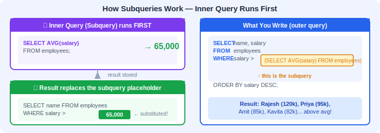
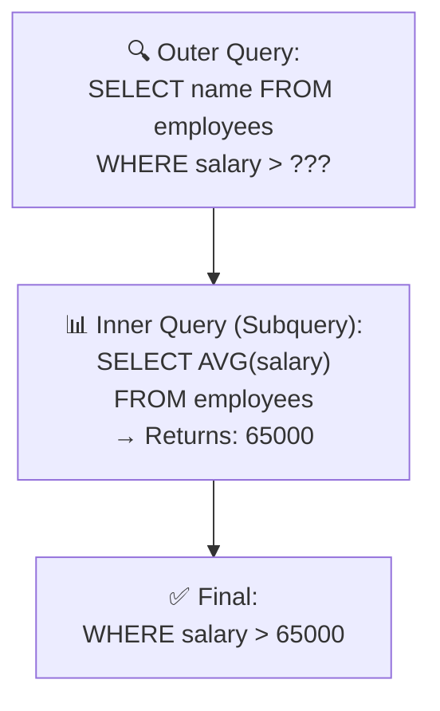
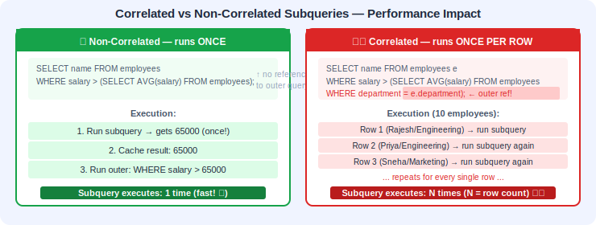
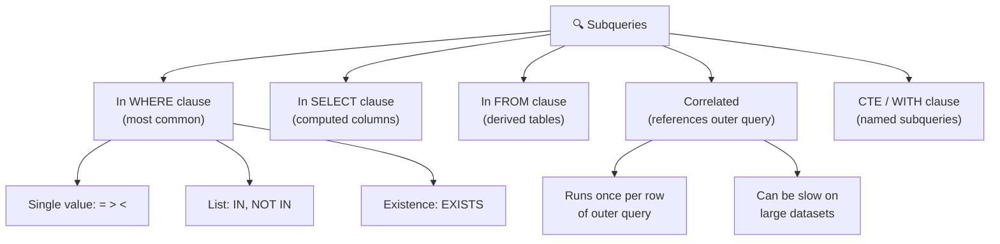
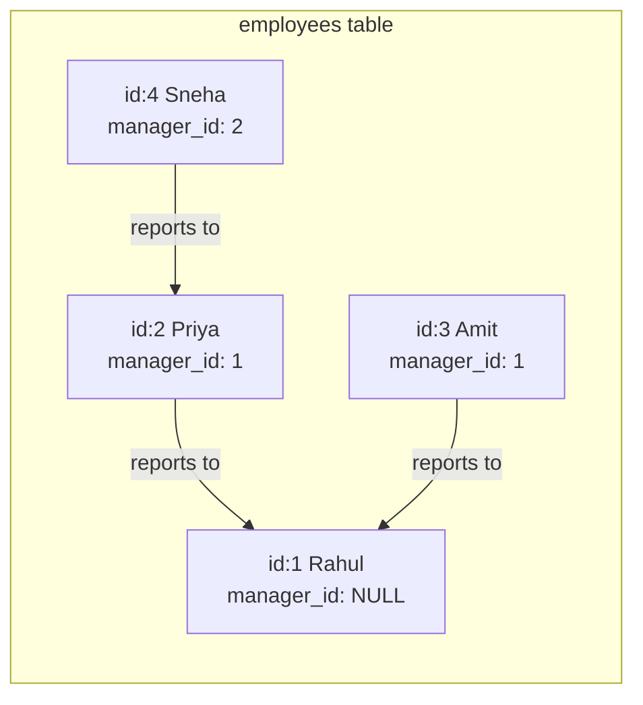
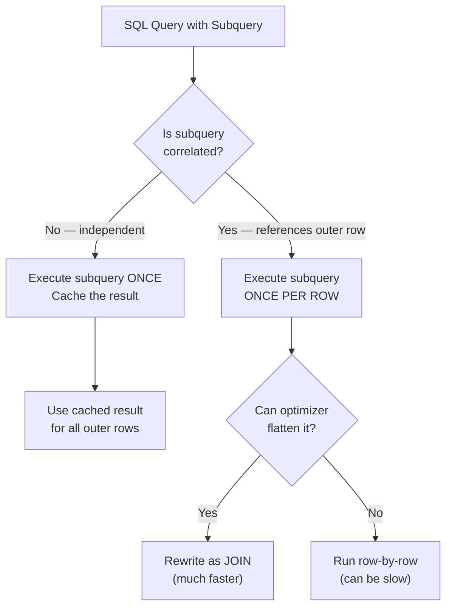
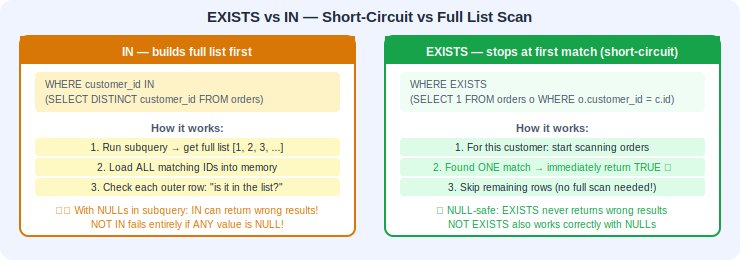

# 📅 Day 6: Advanced Joins & Subqueries

---

## 📖 1. Introduction

### What will we learn today?
- CROSS JOIN — every combination
- Self Join — joining a table with itself
- Subqueries in WHERE, SELECT, and FROM clauses
- Correlated subqueries
- EXISTS and NOT EXISTS
- ANY and ALL operators
- LATERAL joins (introduction)
- CTEs / WITH clause (preview)

### Why is this important?
Real-world questions are rarely simple:
- "Find employees who earn more than the **average salary**" → subquery
- "Who is each employee's **manager**?" → self join
- "Find customers who have **at least one order**" → EXISTS
- "Show all possible product-color combinations" → CROSS JOIN
- "For each department, show the top earner alongside their peers" → LATERAL join
- "Build a readable, multi-step report query" → CTE (WITH clause)

These techniques let you answer complex business questions with a single query!

> 🎯 **Key Takeaway:** Subqueries and advanced joins are the bridge between "I know SQL basics" and "I can answer real business questions." Master these and you'll handle 90% of day-to-day reporting needs.

---

## 🧠 2. Concept Explanation

### What is a Subquery?

A **subquery** is a query **inside** another query. Think of it as asking a question to get an answer, then using that answer in a bigger question.

**Real-world analogy:**
- "What is the average salary?" → ₹65,000
- "Who earns more than the average salary?" → Use the answer from above!

In SQL, instead of two separate queries, you nest one inside the other:

```sql
SELECT name FROM employees 
WHERE salary > (SELECT AVG(salary) FROM employees);
```

The inner query runs first, gets the average, then the outer query uses it.





### 🔄 Correlated vs Non-Correlated Subqueries — How They Really Work

Understanding the difference between these two types is **critical** for writing efficient SQL.

**Non-correlated subquery** — The inner query is completely independent. It does NOT reference anything from the outer query. The database executes it **once**, gets the result, and then uses that result for every row in the outer query.

Think of it like asking a friend: "What's the average temperature this week?" They tell you **once** — 28°C. Then you check each day: "Was this day hotter than 28°C?" You don't need to ask your friend again for each day.

```sql
-- Non-correlated: the subquery runs ONCE
SELECT name, salary
FROM employees
WHERE salary > (SELECT AVG(salary) FROM employees);
--               ^^^^^^^^^^^^^^^^^^^^^^^^^^^^^^^^
--               This runs ONE time, returns one number (e.g., 78500)
--               Then the outer query becomes: WHERE salary > 78500
```

**Correlated subquery** — The inner query references a column from the outer query. Because of this dependency, the database must re-execute the inner query **for every single row** of the outer query.

Think of it like asking your friend: "Is THIS employee's salary above THEIR department's average?" Your friend has to recalculate a different average for Engineering, then Marketing, then Sales — once per employee.

```sql
-- Correlated: the subquery runs ONCE PER ROW
SELECT name, department, salary
FROM employees e
WHERE salary > (SELECT AVG(salary) FROM employees WHERE department = e.department);
--                                                                    ^^^^^^^^^^^
--                                   This references the outer query's row!
--                                   So it must re-run for each employee.
```

**Performance implication:** If your outer query has 10,000 rows, a correlated subquery runs 10,000 times. A non-correlated subquery runs just once. This is why correlated subqueries can be slow on large datasets — and why optimizers try hard to rewrite them.

> 💡 **Did You Know?** Modern query optimizers (PostgreSQL, SQL Server, Oracle) are smart enough to detect many correlated subqueries and automatically **flatten** them into equivalent JOINs behind the scenes. This process is called **subquery unnesting** or **decorrelation**. So even if you write a correlated subquery, the database might execute it as a JOIN internally! However, not all subqueries can be flattened — complex ones with multiple levels of correlation or certain aggregations may still run row-by-row. When in doubt, use `EXPLAIN ANALYZE` to see what the optimizer actually does.



> 🎯 **Key Takeaway:** Non-correlated subqueries run **once** and are fast. Correlated subqueries run **once per row** and can be slow. Learn to recognize which type you're writing!

---

## 💡 3. Visual Learning

### Types of Subqueries



### Self Join Concept



### Subquery Execution Flow



---

## 🖥️ 4. Setup

```sql
CREATE DATABASE advanced_db;
\c advanced_db

-- Employees with manager relationships
CREATE TABLE employees (
    id SERIAL PRIMARY KEY,
    name VARCHAR(100),
    department VARCHAR(50),
    salary DECIMAL(10, 2),
    manager_id INT
);

INSERT INTO employees (name, department, salary, manager_id) VALUES
('Rajesh', 'Engineering', 120000, NULL),        -- CEO, no manager
('Priya', 'Engineering', 95000, 1),              -- Reports to Rajesh
('Amit', 'Engineering', 85000, 1),               -- Reports to Rajesh
('Sneha', 'Marketing', 75000, 1),                -- Reports to Rajesh
('Vikram', 'Engineering', 78000, 2),             -- Reports to Priya
('Neha', 'Marketing', 65000, 4),                 -- Reports to Sneha
('Arjun', 'Sales', 55000, 4),                    -- Reports to Sneha
('Kavita', 'Engineering', 82000, 2),             -- Reports to Priya
('Ravi', 'Sales', 60000, 4),                     -- Reports to Sneha
('Meera', 'HR', 70000, 1);                       -- Reports to Rajesh

-- Customers
CREATE TABLE customers (
    id SERIAL PRIMARY KEY,
    name VARCHAR(100),
    city VARCHAR(50)
);

INSERT INTO customers (name, city) VALUES
('Customer A', 'Mumbai'),
('Customer B', 'Delhi'),
('Customer C', 'Pune'),
('Customer D', 'Mumbai'),
('Customer E', 'Chennai');

-- Products
CREATE TABLE products (
    id SERIAL PRIMARY KEY,
    product_name VARCHAR(100),
    price DECIMAL(10, 2),
    category VARCHAR(50)
);

INSERT INTO products (product_name, price, category) VALUES
('Laptop', 55000, 'Electronics'),
('Phone', 25000, 'Electronics'),
('Headphones', 2500, 'Electronics'),
('T-Shirt', 800, 'Clothing'),
('Jeans', 1500, 'Clothing'),
('Watch', 5000, 'Accessories');

-- Orders
CREATE TABLE orders (
    id SERIAL PRIMARY KEY,
    customer_id INT,
    product_id INT,
    quantity INT,
    order_date DATE
);

INSERT INTO orders (customer_id, product_id, quantity, order_date) VALUES
(1, 1, 1, '2024-01-15'),
(1, 3, 2, '2024-01-20'),
(2, 2, 1, '2024-02-01'),
(3, 1, 1, '2024-02-10'),
(1, 5, 3, '2024-03-01'),
(2, 4, 2, '2024-03-05'),
(3, 6, 1, '2024-03-15');

-- Colors (for CROSS JOIN demo)
CREATE TABLE colors (
    id SERIAL PRIMARY KEY,
    color_name VARCHAR(30)
);

INSERT INTO colors (color_name) VALUES ('Red'), ('Blue'), ('Black');

-- Sizes (for CROSS JOIN demo)
CREATE TABLE sizes (
    id SERIAL PRIMARY KEY,
    size_name VARCHAR(10)
);

INSERT INTO sizes (size_name) VALUES ('S'), ('M'), ('L'), ('XL');

-- Bonus table for new examples
CREATE TABLE salary_adjustments (
    id SERIAL PRIMARY KEY,
    department VARCHAR(50),
    adjustment_percent DECIMAL(5, 2)
);

INSERT INTO salary_adjustments (department, adjustment_percent) VALUES
('Engineering', 10.00),
('Marketing', 8.50),
('Sales', 12.00),
('HR', 7.00);

-- Audit log for conditional insert demo
CREATE TABLE high_earners_log (
    id SERIAL PRIMARY KEY,
    employee_id INT,
    employee_name VARCHAR(100),
    salary DECIMAL(10, 2),
    logged_at TIMESTAMP DEFAULT CURRENT_TIMESTAMP
);
```

---

## 📝 5. Syntax + Examples

---

### ✖️ CROSS JOIN — Every Possible Combination

A `CROSS JOIN` produces the **cartesian product** — every row from table A paired with every row from table B.

**Analogy:** If you have 3 shirts and 4 pants, you can make 3 × 4 = 12 outfits. That's a CROSS JOIN!

**How it works under the hood:** The database takes the first row from table A and pairs it with every row from table B. Then it moves to the second row of table A and does the same. There is no `ON` condition — every possible pair is generated. This is why the result size is always `rows_A × rows_B`.

#### Example 1: All Product-Color Combinations

```sql
SELECT p.product_name, c.color_name
FROM products p
CROSS JOIN colors c
WHERE p.category = 'Clothing';
```

**Result:**

| product_name | color_name |
|-------------|-----------|
| T-Shirt | Red |
| T-Shirt | Blue |
| T-Shirt | Black |
| Jeans | Red |
| Jeans | Blue |
| Jeans | Black |

#### Example 2: All Size-Color Combinations

```sql
SELECT s.size_name, c.color_name
FROM sizes s
CROSS JOIN colors c
ORDER BY s.size_name, c.color_name;
```

Result: 4 sizes × 3 colors = 12 rows

> ⚠️ Be careful with CROSS JOIN on large tables! 1000 rows × 1000 rows = 1,000,000 results!

> 🎯 **Key Takeaway:** CROSS JOIN is perfect for generating all combinations from small lookup tables (sizes, colors, time slots). Avoid it on large transaction tables.

---

### 🔄 Self Join — Joining a Table with Itself

A **self join** is when you join a table **with itself**. This is useful when rows in a table reference other rows in the **same** table.

**Most common use case:** Employee-Manager relationships.

**How it works under the hood:** You give the same table two different aliases (like `e` and `m`). The database treats them as if they were two separate tables. Then you specify a join condition that connects a column in one "copy" to a column in the other "copy." It's conceptually identical to joining two different tables — the database doesn't know or care that they're the same physical table.

#### Example 3: Find Each Employee's Manager

```sql
SELECT 
    e.name AS employee, 
    m.name AS manager
FROM employees e
LEFT JOIN employees m ON e.manager_id = m.id;
```

**Result:**

| employee | manager |
|----------|---------|
| Rajesh | NULL |
| Priya | Rajesh |
| Amit | Rajesh |
| Sneha | Rajesh |
| Vikram | Priya |
| Neha | Sneha |
| Arjun | Sneha |
| Kavita | Priya |
| Ravi | Sneha |
| Meera | Rajesh |

> We're treating the same `employees` table as two tables: `e` (employee) and `m` (manager).

#### Example 4: Find Employees Who Earn More Than Their Manager

```sql
SELECT 
    e.name AS employee, 
    e.salary AS emp_salary,
    m.name AS manager, 
    m.salary AS mgr_salary
FROM employees e
INNER JOIN employees m ON e.manager_id = m.id
WHERE e.salary > m.salary;
```

#### Example 5: Find Colleagues (Same Department)

```sql
SELECT 
    e1.name AS employee1, 
    e2.name AS employee2, 
    e1.department
FROM employees e1
INNER JOIN employees e2 ON e1.department = e2.department
WHERE e1.id < e2.id;  -- avoid duplicates and self-pairs
```

> 🎯 **Key Takeaway:** Self joins are essential for hierarchical data (org charts, category trees, social networks). The trick is always to alias the table twice and think of it as two separate tables.

---

### 🔍 Subqueries in WHERE Clause

The most common type of subquery. The inner query returns a value that the outer query uses for comparison.

#### Example 6: Employees Earning Above Average

```sql
SELECT name, salary
FROM employees
WHERE salary > (SELECT AVG(salary) FROM employees);
```

The subquery `(SELECT AVG(salary) FROM employees)` returns a single number, then we compare each employee's salary against it.

#### Example 7: Find the Highest-Paid Employee

```sql
SELECT name, salary
FROM employees
WHERE salary = (SELECT MAX(salary) FROM employees);
```

#### Example 8: Customers Who Have Placed Orders (using IN)

```sql
SELECT name
FROM customers
WHERE id IN (SELECT DISTINCT customer_id FROM orders);
```

The subquery returns a **list** of customer IDs who have orders, then we find those customers.

#### Example 9: Customers Who Have NOT Placed Orders

```sql
SELECT name
FROM customers
WHERE id NOT IN (SELECT DISTINCT customer_id FROM orders);
```

Result: Customer D and Customer E (they never ordered)

#### Example 10: Products More Expensive Than the Average in Their Category

```sql
SELECT product_name, price, category
FROM products p
WHERE price > (
    SELECT AVG(price) FROM products WHERE category = p.category
);
```

> This is a **correlated subquery** — the inner query references the outer query's row (`p.category`). It runs once for each row in the outer query.

#### Example 10b: 🆕 Multi-Level Nested Subquery

Sometimes you need subqueries inside subqueries. Here we find employees in the department that has the highest average salary:

```sql
SELECT name, department, salary
FROM employees
WHERE department = (
    SELECT department
    FROM employees
    GROUP BY department
    HAVING AVG(salary) = (
        SELECT MAX(dept_avg)
        FROM (
            SELECT AVG(salary) AS dept_avg
            FROM employees
            GROUP BY department
        ) AS dept_averages
    )
);
```

**How this works — inside out:**
1. **Innermost:** Calculate the average salary per department → gives a list of averages
2. **Middle:** Find the MAX of those averages → gives the highest department average
3. **Outer:** Find the department whose average equals that max → gives the department name
4. **Outermost:** Find all employees in that department

**Analogy:** It's like Russian nesting dolls 🪆 — you open each layer to find the answer inside, then use it in the next layer out.

> ⚠️ While multi-level nesting works, it gets hard to read fast. Beyond 2 levels, consider using **CTEs (WITH clause)** for clarity — we'll preview those later in this lesson!

> 🎯 **Key Takeaway:** Subqueries in WHERE are the most common type. Use `=` for single-value results, `IN` for lists, and `EXISTS` for existence checks. For nested subqueries beyond 2 levels, consider CTEs for readability.

---

### 📊 Subqueries in SELECT Clause

You can use a subquery as a computed column.

#### Example 11: Show Each Employee's Salary vs Department Average

```sql
SELECT 
    name, 
    department, 
    salary,
    (SELECT ROUND(AVG(salary), 2) FROM employees e2 
     WHERE e2.department = e1.department) AS dept_avg
FROM employees e1;
```

#### Example 12: Customer's Order Count as a Column

```sql
SELECT 
    c.name,
    c.city,
    (SELECT COUNT(*) FROM orders o WHERE o.customer_id = c.id) AS order_count
FROM customers c;
```

> 🎯 **Key Takeaway:** SELECT-clause subqueries are correlated (they reference the outer row) and must return **exactly one value** (one row, one column). They're great for adding computed columns but can be slow on large datasets — consider JOINs with GROUP BY as an alternative.

---

### 📋 Subqueries in FROM Clause (Derived Tables)

You can use a subquery result as a **temporary table** in the FROM clause.

#### Example 13: Top Departments by Average Salary

```sql
SELECT dept_summary.department, dept_summary.avg_salary
FROM (
    SELECT department, ROUND(AVG(salary), 2) AS avg_salary
    FROM employees
    GROUP BY department
) AS dept_summary
WHERE dept_summary.avg_salary > 70000
ORDER BY dept_summary.avg_salary DESC;
```

#### Example 14: Customer Spending Summary

```sql
SELECT spending.customer_name, spending.total_spent
FROM (
    SELECT c.name AS customer_name, SUM(p.price * o.quantity) AS total_spent
    FROM customers c
    INNER JOIN orders o ON c.id = o.customer_id
    INNER JOIN products p ON o.product_id = p.id
    GROUP BY c.name
) AS spending
WHERE spending.total_spent > 10000
ORDER BY spending.total_spent DESC;
```

> 🎯 **Key Takeaway:** Derived tables in FROM let you treat a subquery's result as a virtual table. Always give them an alias! They're powerful for pre-aggregating data before applying further filters.

---

### ✅ EXISTS and NOT EXISTS

`EXISTS` checks if a subquery **returns any rows**. It returns TRUE or FALSE.

**Analogy:** "Does this customer have any orders?" — you don't care HOW MANY, just whether they exist.

**How it works under the hood:** When the database evaluates `EXISTS`, it starts executing the subquery. The moment it finds **even one row**, it immediately returns TRUE and stops — it doesn't need to count them all. This short-circuit behavior is what makes `EXISTS` efficient. `NOT EXISTS` is the opposite — it returns TRUE only if the subquery returns **zero rows**.

#### Example 15: Customers Who Have Orders (EXISTS)

```sql
SELECT c.name
FROM customers c
WHERE EXISTS (
    SELECT 1 FROM orders o WHERE o.customer_id = c.id
);
```

> `SELECT 1` is a convention — we don't care about the actual data, just whether any row exists.

#### Example 16: Customers Who Have No Orders (NOT EXISTS)

```sql
SELECT c.name
FROM customers c
WHERE NOT EXISTS (
    SELECT 1 FROM orders o WHERE o.customer_id = c.id
);
```

> 💡 `EXISTS` vs `IN`: For large datasets, `EXISTS` is often **faster** than `IN` because it stops as soon as it finds a match.



#### Example 16b: 🆕 Using EXISTS with INSERT (Conditional Insert)

Sometimes you want to insert a row **only if** a certain condition is met. For example, log high earners only if they haven't been logged already:

```sql
INSERT INTO high_earners_log (employee_id, employee_name, salary)
SELECT id, name, salary
FROM employees e
WHERE salary > 90000
  AND NOT EXISTS (
      SELECT 1 FROM high_earners_log h WHERE h.employee_id = e.id
  );
```

**What's happening:** For each employee earning over ₹90,000, we check if they're already in the log. If NOT EXISTS (they haven't been logged yet), we insert them. This prevents duplicate entries — run it 100 times and you'll still only get one row per high earner!

> 🎯 **Key Takeaway:** EXISTS is a boolean check — it's about existence, not values. Use it when you need to ask "is there at least one...?" It short-circuits (stops early) and pairs naturally with INSERT, UPDATE, and DELETE for conditional data modifications.

---

### 🆕 Subquery in UPDATE — Updating Based on Another Table's Aggregation

You can use subqueries in UPDATE statements to set values based on calculations from other tables:

#### Example 16c: Apply Department-Specific Salary Adjustments

```sql
UPDATE employees e
SET salary = salary * (1 + (
    SELECT sa.adjustment_percent / 100
    FROM salary_adjustments sa
    WHERE sa.department = e.department
))
WHERE EXISTS (
    SELECT 1 FROM salary_adjustments sa WHERE sa.department = e.department
);
```

**What's happening:** For each employee, the correlated subquery looks up their department's adjustment percentage from the `salary_adjustments` table. The WHERE EXISTS clause ensures we only update employees whose department has an adjustment entry — others are left unchanged.

**Analogy:** Imagine giving every employee a raise, but the raise percentage depends on their department's budget. Instead of writing separate UPDATE statements for each department, one query handles everything!

> 🎯 **Key Takeaway:** Subqueries in UPDATE let you set column values dynamically based on data from other tables. Always include a WHERE clause to avoid accidentally updating rows that shouldn't change.

---

### 🔢 ANY and ALL

`ANY` — condition is true if it matches **any** value in the subquery result.
`ALL` — condition is true if it matches **all** values in the subquery result.

#### Example 17: Employees Earning More Than ANY Sales Person

```sql
SELECT name, salary
FROM employees
WHERE salary > ANY (
    SELECT salary FROM employees WHERE department = 'Sales'
);
```

This means: salary > the **smallest** Sales salary.

#### Example 18: Employees Earning More Than ALL Sales People

```sql
SELECT name, salary
FROM employees
WHERE salary > ALL (
    SELECT salary FROM employees WHERE department = 'Sales'
);
```

This means: salary > the **largest** Sales salary (more than every single one).

> 🎯 **Key Takeaway:** `ANY` = "at least one matches" (like OR across values). `ALL` = "every single one matches" (like AND across values). You can usually rewrite `> ANY(...)` as `> MIN(...)` and `> ALL(...)` as `> MAX(...)`.

---

### 🆕 Rewriting a Subquery as a JOIN — Side-by-Side Comparison

One of the most important skills is knowing that many subqueries can be rewritten as JOINs (and vice versa). Let's see the same question answered both ways:

**Question:** "Find customer names who have placed orders."

#### Version A: Subquery with IN

```sql
SELECT name
FROM customers
WHERE id IN (SELECT DISTINCT customer_id FROM orders);
```

#### Version B: JOIN (equivalent)

```sql
SELECT DISTINCT c.name
FROM customers c
INNER JOIN orders o ON c.id = o.customer_id;
```

Both return the same result! The JOIN version can be faster on large datasets because the optimizer can use hash joins or merge joins.

**Another example — "Find employees earning above their department average":**

#### Version A: Correlated Subquery

```sql
SELECT name, department, salary
FROM employees e
WHERE salary > (SELECT AVG(salary) FROM employees WHERE department = e.department);
```

#### Version B: JOIN with Derived Table (equivalent)

```sql
SELECT e.name, e.department, e.salary
FROM employees e
INNER JOIN (
    SELECT department, AVG(salary) AS avg_salary
    FROM employees
    GROUP BY department
) dept_avg ON e.department = dept_avg.department
WHERE e.salary > dept_avg.avg_salary;
```

The JOIN version pre-computes the average **once per department** (not once per row), which can be more efficient.

> 🎯 **Key Takeaway:** JOINs and subqueries are often interchangeable. JOINs are usually faster for large datasets. Subqueries can be more readable for simple existence or comparison checks. Learn to translate between them!

---

### 🆕 LATERAL JOIN — When Regular Subqueries Aren't Enough

A **LATERAL join** lets a subquery in the FROM clause reference columns from preceding tables. Think of it as a "for each" loop — for each row in the left table, the LATERAL subquery runs and can use that row's values.

**Analogy:** Imagine you have a list of departments and you want the top 2 earners from each. A regular subquery in FROM can't reference the outer department. LATERAL can!

```sql
SELECT d.department, top_earner.name, top_earner.salary
FROM (SELECT DISTINCT department FROM employees) d
CROSS JOIN LATERAL (
    SELECT name, salary
    FROM employees e
    WHERE e.department = d.department
    ORDER BY salary DESC
    LIMIT 2
) AS top_earner;
```

**What's happening:**
1. The outer query gets a list of distinct departments
2. For **each** department, the LATERAL subquery finds the top 2 earners
3. The results are combined — you get 2 rows per department

**Without LATERAL, you'd need window functions or complex subqueries to achieve this!**

> ⚠️ LATERAL is supported in PostgreSQL 9.3+, MySQL 8.0.14+ (as `LATERAL`), and SQL Server (as `CROSS APPLY` / `OUTER APPLY`). Check your database version!

> 🎯 **Key Takeaway:** LATERAL is like a "for each row, run this subquery" operation. It's perfect for top-N-per-group queries and situations where a FROM-clause subquery needs to reference another table.

---

### 🆕 CTE (WITH Clause) — A Preview of Readable Subqueries

A **Common Table Expression (CTE)** is a named temporary result set defined with the `WITH` keyword. It makes complex subqueries **much more readable** by giving them a name and pulling them to the top of the query.

**Analogy:** Instead of writing a giant sentence with nested parentheses, you break it into named paragraphs, then reference them. It's like defining variables before using them.

#### Example: Department Stats (Subquery vs CTE)

**The subquery version (hard to read):**

```sql
SELECT e.name, e.salary, dept_avg.avg_salary
FROM employees e
INNER JOIN (
    SELECT department, ROUND(AVG(salary), 2) AS avg_salary
    FROM employees
    GROUP BY department
) AS dept_avg ON e.department = dept_avg.department
WHERE e.salary > dept_avg.avg_salary;
```

**The CTE version (much cleaner):**

```sql
WITH dept_averages AS (
    SELECT department, ROUND(AVG(salary), 2) AS avg_salary
    FROM employees
    GROUP BY department
)
SELECT e.name, e.salary, da.avg_salary
FROM employees e
INNER JOIN dept_averages da ON e.department = da.department
WHERE e.salary > da.avg_salary;
```

Same result, but the CTE version reads top-to-bottom like a story:
1. **First**, compute department averages (and call it `dept_averages`)
2. **Then**, join employees with those averages
3. **Finally**, filter for above-average earners

#### Multiple CTEs — Building Up Step by Step

```sql
WITH dept_stats AS (
    SELECT department, AVG(salary) AS avg_salary, COUNT(*) AS emp_count
    FROM employees
    GROUP BY department
),
large_departments AS (
    SELECT department, avg_salary
    FROM dept_stats
    WHERE emp_count >= 3
)
SELECT e.name, e.department, e.salary, ld.avg_salary
FROM employees e
INNER JOIN large_departments ld ON e.department = ld.department
WHERE e.salary > ld.avg_salary;
```

This first finds department stats, then filters to large departments, then finds above-average earners in those departments. Each CTE builds on the previous one!

> 💡 We'll cover CTEs in full depth on a future day. For now, just know they exist and can replace messy nested subqueries.

> 🎯 **Key Takeaway:** CTEs (`WITH` clause) make complex queries readable by naming intermediate results. They're functionally equivalent to derived tables but much easier to understand, debug, and maintain.

---

## ✅ Checkpoint!

> What's the difference between `IN` and `EXISTS`?
> 
> - `IN` compares against a **list of values** returned by the subquery
> - `EXISTS` checks if the subquery **returns any rows at all**
> - For large datasets, `EXISTS` is usually faster
> - Use `IN` when the subquery returns a small list
> - Use `EXISTS` when checking for the presence of related rows

---

## 📊 Subquery vs JOIN Decision Guide

Wondering whether to use a subquery or a JOIN? Here's a practical guide:

| Scenario | Use Subquery | Use JOIN | Why |
|----------|:---:|:---:|-----|
| Check existence of related rows | ✅ `EXISTS` | ❌ | EXISTS short-circuits; no duplicates to worry about |
| Get a single aggregate for comparison | ✅ `WHERE salary > (SELECT AVG...)` | ❌ | Clean, readable, and efficient |
| Retrieve columns from both tables | ❌ | ✅ | JOINs naturally combine columns from multiple tables |
| Filter by a list from another table | ⚠️ `IN` works but can be slow | ✅ | JOINs handle large lists better |
| Top-N per group | ✅ `LATERAL` or correlated | ✅ with window functions | Depends on readability preference |
| Complex multi-step logic | ✅ CTE (WITH clause) | ❌ | CTEs break the problem into named steps |
| Need the result in a column (computed column) | ✅ SELECT subquery | ⚠️ | Subquery is the only direct way |
| Large dataset performance | ⚠️ Correlated = slow | ✅ | JOINs are optimized with hash/merge strategies |

**Rules of thumb:**
1. 🟢 If you need columns from **both tables** → use a JOIN
2. 🟢 If you need a **yes/no existence check** → use EXISTS
3. 🟢 If you need a **single value** for comparison → use a scalar subquery
4. 🟡 If a correlated subquery is slow → try rewriting as a JOIN
5. 🟡 If nested subqueries get confusing → use CTEs

> 🎯 **Key Takeaway:** There's no universal "always use JOIN" or "always use subquery" rule. Each tool has its sweet spot. The best SQL developers know both and choose based on the situation.

---

## ⚡ Performance Considerations

Understanding performance helps you write SQL that scales from 100 rows to 100 million rows.

### 🐢 Correlated Subqueries — The Hidden Loop

A correlated subquery runs **once per row** of the outer query. On a table with 1 million rows, that's 1 million executions of the inner query.

```sql
-- SLOW on large tables — runs subquery once per employee
SELECT name, salary,
    (SELECT AVG(salary) FROM employees WHERE department = e.department) AS dept_avg
FROM employees e;

-- FASTER — computes averages once, then joins
SELECT e.name, e.salary, da.dept_avg
FROM employees e
INNER JOIN (
    SELECT department, AVG(salary) AS dept_avg
    FROM employees
    GROUP BY department
) da ON e.department = da.department;
```

### 🏎️ EXISTS vs IN — When Does It Matter?

| Scenario | Faster Option | Why |
|----------|--------------|-----|
| Subquery returns **few rows**, outer table is large | `IN` | Small list comparison is cheap |
| Subquery returns **many rows**, outer table is small | `EXISTS` | Short-circuits on first match |
| Subquery might return **NULLs** | `EXISTS` | `NOT IN` breaks with NULLs! |
| Both tables are large | `EXISTS` or rewrite as JOIN | Test with EXPLAIN |

### 💡 Tips for Subquery Performance

1. **Prefer non-correlated over correlated** — If you can restructure a correlated subquery as a non-correlated one (often using a JOIN or derived table), do it.

2. **Use EXISTS instead of COUNT for existence checks:**
   ```sql
   -- SLOW: counts all orders just to check if there are any
   WHERE (SELECT COUNT(*) FROM orders WHERE customer_id = c.id) > 0
   
   -- FAST: stops at the first match
   WHERE EXISTS (SELECT 1 FROM orders WHERE customer_id = c.id)
   ```

3. **Materialize expensive subqueries** — If the same subquery appears multiple times, compute it once using a CTE or temporary table:
   ```sql
   -- Instead of repeating the same subquery 3 times:
   WITH expensive_calc AS (
       SELECT department, AVG(salary) AS avg_sal, MAX(salary) AS max_sal
       FROM employees
       GROUP BY department
   )
   SELECT ... FROM expensive_calc ...;
   ```

4. **Check the execution plan** — Always use `EXPLAIN` or `EXPLAIN ANALYZE` to see what the optimizer actually does. You might be surprised!

5. **Index the join/filter columns** — Subqueries that filter on `customer_id`, `department`, etc. benefit enormously from indexes on those columns.

> 🎯 **Key Takeaway:** Write for clarity first, then optimize if needed. Use `EXPLAIN ANALYZE` to identify actual bottlenecks. The optimizer is smarter than you think — but it can't fix missing indexes.

---

## 🧪 6. Hands-on Practice

**Problem 1:** Find all employees and their manager's name using a self join.

<details>
<summary>💡 Solution</summary>

```sql
SELECT e.name AS employee, m.name AS manager
FROM employees e
LEFT JOIN employees m ON e.manager_id = m.id;
```

</details>

**Problem 2:** Find employees who earn more than the average salary in their department.

<details>
<summary>💡 Solution</summary>

```sql
SELECT name, department, salary
FROM employees e
WHERE salary > (
    SELECT AVG(salary) FROM employees WHERE department = e.department
);
```

</details>

**Problem 3:** Find customers who have never placed an order (use NOT EXISTS).

<details>
<summary>💡 Solution</summary>

```sql
SELECT c.name
FROM customers c
WHERE NOT EXISTS (
    SELECT 1 FROM orders o WHERE o.customer_id = c.id
);
```

</details>

**Problem 4:** List all product-size-color combinations for the Clothing category.

<details>
<summary>💡 Solution</summary>

```sql
SELECT p.product_name, s.size_name, c.color_name
FROM products p
CROSS JOIN sizes s
CROSS JOIN colors c
WHERE p.category = 'Clothing'
ORDER BY p.product_name, s.size_name, c.color_name;
```

</details>

**Problem 5:** Find the most expensive product in each category using a subquery.

<details>
<summary>💡 Solution</summary>

```sql
SELECT product_name, price, category
FROM products p
WHERE price = (
    SELECT MAX(price) FROM products WHERE category = p.category
);
```

</details>

**Problem 6 (Bonus):** Find departments where the average salary is higher than the company-wide average.

<details>
<summary>💡 Solution</summary>

```sql
SELECT department, ROUND(AVG(salary), 2) AS avg_salary
FROM employees
GROUP BY department
HAVING AVG(salary) > (SELECT AVG(salary) FROM employees);
```

</details>

**Problem 7:** 🆕 For each customer, show their name, the number of orders, and the total amount spent. Include customers with zero orders (showing 0).

<details>
<summary>💡 Solution</summary>

```sql
SELECT 
    c.name,
    (SELECT COUNT(*) FROM orders o WHERE o.customer_id = c.id) AS order_count,
    COALESCE(
        (SELECT SUM(p.price * o.quantity) 
         FROM orders o 
         INNER JOIN products p ON o.product_id = p.id 
         WHERE o.customer_id = c.id),
        0
    ) AS total_spent
FROM customers c
ORDER BY total_spent DESC;
```

**Alternative using LEFT JOIN:**

```sql
SELECT 
    c.name,
    COUNT(o.id) AS order_count,
    COALESCE(SUM(p.price * o.quantity), 0) AS total_spent
FROM customers c
LEFT JOIN orders o ON c.id = o.customer_id
LEFT JOIN products p ON o.product_id = p.id
GROUP BY c.name
ORDER BY total_spent DESC;
```

</details>

**Problem 8:** 🆕 Find employees whose salary is higher than the maximum salary in the Sales department, using ALL.

<details>
<summary>💡 Solution</summary>

```sql
SELECT name, department, salary
FROM employees
WHERE salary > ALL (
    SELECT salary FROM employees WHERE department = 'Sales'
);
```

</details>

**Problem 9:** 🆕 Using a CTE, find the department with the highest total salary bill (sum of all salaries), and list all employees in that department.

<details>
<summary>💡 Solution</summary>

```sql
WITH dept_totals AS (
    SELECT department, SUM(salary) AS total_salary
    FROM employees
    GROUP BY department
),
top_dept AS (
    SELECT department
    FROM dept_totals
    ORDER BY total_salary DESC
    LIMIT 1
)
SELECT e.name, e.salary, e.department
FROM employees e
WHERE e.department = (SELECT department FROM top_dept);
```

</details>

**Problem 10:** 🆕 Rewrite this correlated subquery as a JOIN. Then verify both return the same result.

The correlated subquery version:
```sql
SELECT c.name, c.city
FROM customers c
WHERE (SELECT COUNT(*) FROM orders o WHERE o.customer_id = c.id) >= 2;
```

<details>
<summary>💡 Solution</summary>

**JOIN version:**

```sql
SELECT c.name, c.city
FROM customers c
INNER JOIN (
    SELECT customer_id, COUNT(*) AS order_count
    FROM orders
    GROUP BY customer_id
    HAVING COUNT(*) >= 2
) active ON c.id = active.customer_id;
```

Both return customers who have placed 2 or more orders (Customer A and Customer B in our data).

</details>

---

## 🌍 Real-World Scenario: Executive Dashboard at TechCorp

Let's see how subqueries and advanced joins come together in a real-world business scenario.

**The situation:** You're a database developer at TechCorp. The CEO wants a monthly executive dashboard that answers these questions:

### 📊 Report 1: Top Performers Per Department

"Show me the highest earner in each department and how much above the department average they are."

```sql
WITH dept_stats AS (
    SELECT department, 
           ROUND(AVG(salary), 2) AS avg_salary,
           MAX(salary) AS max_salary
    FROM employees
    GROUP BY department
)
SELECT 
    e.name AS top_performer,
    e.department,
    e.salary,
    ds.avg_salary AS dept_average,
    ROUND(e.salary - ds.avg_salary, 2) AS above_average_by,
    ROUND((e.salary - ds.avg_salary) / ds.avg_salary * 100, 1) AS percent_above
FROM employees e
INNER JOIN dept_stats ds ON e.department = ds.department
WHERE e.salary = ds.max_salary
ORDER BY above_average_by DESC;
```

### 🔍 Report 2: Anomaly Detection — Unusual Spending Patterns

"Flag any customer whose most recent order total is more than 3x their average order."

```sql
WITH customer_order_values AS (
    SELECT 
        o.customer_id,
        o.order_date,
        p.price * o.quantity AS order_value
    FROM orders o
    INNER JOIN products p ON o.product_id = p.id
),
customer_avg AS (
    SELECT customer_id, AVG(order_value) AS avg_order_value
    FROM customer_order_values
    GROUP BY customer_id
)
SELECT 
    c.name,
    cov.order_date,
    cov.order_value AS latest_order_value,
    ROUND(ca.avg_order_value, 2) AS avg_order_value,
    ROUND(cov.order_value / ca.avg_order_value, 1) AS ratio
FROM customers c
INNER JOIN customer_order_values cov ON c.id = cov.customer_id
INNER JOIN customer_avg ca ON c.id = ca.customer_id
WHERE cov.order_date = (
    SELECT MAX(order_date) FROM orders WHERE customer_id = c.id
)
AND cov.order_value > ca.avg_order_value * 3;
```

### 📈 Report 3: Customer Engagement Summary

"For each city, show the number of customers, how many have placed orders, and the total revenue."

```sql
SELECT 
    c.city,
    COUNT(DISTINCT c.id) AS total_customers,
    COUNT(DISTINCT CASE 
        WHEN EXISTS (SELECT 1 FROM orders o WHERE o.customer_id = c.id) 
        THEN c.id 
    END) AS active_customers,
    COALESCE(SUM(p.price * o.quantity), 0) AS total_revenue
FROM customers c
LEFT JOIN orders o ON c.id = o.customer_id
LEFT JOIN products p ON o.product_id = p.id
GROUP BY c.city
ORDER BY total_revenue DESC;
```

> 🎯 **Key Takeaway:** Real-world SQL combines everything you've learned — CTEs for structure, subqueries for filtering, JOINs for combining data, and aggregations for summaries. The dashboard queries above are representative of what data analysts write every day.

---

## 📋 Quick Reference Card

### Subquery Types at a Glance

| Type | Syntax Pattern | Returns | Example Use |
|------|---------------|---------|-------------|
| **Scalar** | `WHERE col = (SELECT ...)` | One value | Compare to AVG, MAX, MIN |
| **Row** | `WHERE (col1, col2) = (SELECT ...)` | One row | Match multiple columns |
| **Table** | `FROM (SELECT ...) AS alias` | Multiple rows/cols | Derived tables |
| **Correlated** | `WHERE col > (SELECT ... WHERE x = outer.x)` | Varies | Per-row comparisons |
| **EXISTS** | `WHERE EXISTS (SELECT 1 ...)` | TRUE/FALSE | Existence checks |

### Join Types Cheat Sheet

| Join | Keyword | Result |
|------|---------|--------|
| Cross | `CROSS JOIN` | All combinations (A × B) |
| Self | `table t1 JOIN table t2` | Table joined to itself |
| Lateral | `CROSS JOIN LATERAL (...)` | Per-row subquery in FROM |

### Operators with Subqueries

| Operator | Meaning | Equivalent To |
|----------|---------|---------------|
| `> ANY (subquery)` | Greater than smallest | `> MIN(subquery)` |
| `> ALL (subquery)` | Greater than largest | `> MAX(subquery)` |
| `= ANY (subquery)` | Matches any value | `IN (subquery)` |
| `<> ALL (subquery)` | Matches none | `NOT IN (subquery)` |

### CTE Template

```sql
WITH cte_name AS (
    SELECT ... FROM ...
)
SELECT ... FROM cte_name WHERE ...;
```

---

## ⚠️ 7. Common Mistakes

| # | Mistake | What Goes Wrong | Correct Way |
|---|---------|----------------|-------------|
| 1 | Subquery returns multiple rows with `=` | `WHERE salary = (SELECT salary FROM ...)` — error if subquery returns multiple values | Use `IN` instead of `=` for multiple values |
| 2 | Forgetting alias for derived table | `SELECT * FROM (SELECT ... ) ` — error! | `SELECT * FROM (SELECT ...) AS alias` |
| 3 | Self join without alias | `SELECT * FROM employees JOIN employees ON ...` — ambiguous | Use different aliases: `employees e JOIN employees m` |
| 4 | Self join creating duplicates | Pairing A-B and B-A | Add `WHERE e1.id < e2.id` |
| 5 | Using NOT IN with NULLs | If subquery contains NULL, `NOT IN` returns no results! | Use `NOT EXISTS` instead, or filter NULLs |
| 6 | CROSS JOIN on large tables | 10000 × 10000 = 100 million rows! | Only CROSS JOIN small lookup tables |
| 7 | 🆕 Correlated subquery performance trap | Using a correlated subquery on a table with millions of rows — query runs for minutes/hours | Rewrite as a JOIN with a derived table, or use a CTE. Check with `EXPLAIN ANALYZE` |
| 8 | 🆕 Using subquery when JOIN is simpler | Writing `WHERE id IN (SELECT customer_id FROM orders)` when you also need order columns | Use `INNER JOIN orders ON ...` to get columns from both tables |
| 9 | 🆕 Scalar subquery returning multiple rows | `SELECT (SELECT name FROM employees WHERE department = 'Engineering')` — error! Engineering has multiple employees | Add `LIMIT 1` or use an aggregate function (`MAX`, `MIN`) to guarantee one row |

### ⚠️ Detailed Examples of New Mistakes

**Mistake 7 — Correlated Subquery Performance Trap:**

```sql
-- 😱 BAD: On a table with 1M rows, this runs the subquery 1M times
SELECT name, salary,
    (SELECT AVG(salary) FROM employees WHERE department = e.department)
FROM employees e;

-- ✅ GOOD: Pre-compute averages once, then join
SELECT e.name, e.salary, da.avg_sal
FROM employees e
INNER JOIN (
    SELECT department, AVG(salary) AS avg_sal
    FROM employees GROUP BY department
) da ON e.department = da.department;
```

**Mistake 8 — Subquery When JOIN Is Simpler:**

```sql
-- 😱 AWKWARD: Using subquery but then you realize you need order_date too
SELECT name FROM customers
WHERE id IN (SELECT customer_id FROM orders WHERE order_date > '2024-02-01');
-- Oops, now you need order_date in the output... rewrite as JOIN!

-- ✅ BETTER: JOIN gives you access to columns from both tables
SELECT DISTINCT c.name, o.order_date
FROM customers c
INNER JOIN orders o ON c.id = o.customer_id
WHERE o.order_date > '2024-02-01';
```

**Mistake 9 — Scalar Subquery Returning Multiple Rows:**

```sql
-- 😱 ERROR: This subquery returns multiple names
SELECT department,
    (SELECT name FROM employees WHERE department = d.department) AS example_employee
FROM (SELECT DISTINCT department FROM employees) d;

-- ✅ FIX: Use MIN/MAX or add LIMIT 1
SELECT department,
    (SELECT name FROM employees WHERE department = d.department ORDER BY name LIMIT 1) AS example_employee
FROM (SELECT DISTINCT department FROM employees) d;
```

---

## 📝 8. Mini Assignment

### 🎯 Task: Company Org Chart Queries

Using the employees table with manager relationships:

1. Show the full org chart: employee name, their manager, and their manager's manager (3-level hierarchy)
2. Find all direct reports of "Rajesh"
3. Find the department with the most employees
4. Find employees whose salary is above the average of their department (correlated subquery)
5. List all departments that have at least one employee earning more than ₹80,000

<details>
<summary>💡 Solution</summary>

```sql
-- 1. Three-level hierarchy
SELECT 
    e.name AS employee,
    m.name AS manager,
    mm.name AS managers_manager
FROM employees e
LEFT JOIN employees m ON e.manager_id = m.id
LEFT JOIN employees mm ON m.manager_id = mm.id;

-- 2. Direct reports of Rajesh
SELECT e.name
FROM employees e
INNER JOIN employees m ON e.manager_id = m.id
WHERE m.name = 'Rajesh';

-- 3. Department with most employees
SELECT department, COUNT(*) AS emp_count
FROM employees
GROUP BY department
ORDER BY emp_count DESC
LIMIT 1;

-- 4. Above department average
SELECT name, department, salary
FROM employees e
WHERE salary > (
    SELECT AVG(salary) FROM employees WHERE department = e.department
);

-- 5. Departments with someone earning > 80000
SELECT DISTINCT department
FROM employees
WHERE department IN (
    SELECT department FROM employees WHERE salary > 80000
);
```

</details>

---

## 🔁 9. Recap

- ✅ **CROSS JOIN** — produces all possible combinations (cartesian product)
- ✅ **Self Join** — joins a table with itself (useful for hierarchies like employee-manager)
- ✅ **Subquery** — a query nested inside another query
- ✅ Subqueries can go in **WHERE**, **SELECT**, or **FROM** clauses
- ✅ **Correlated subquery** — references the outer query (runs once per row)
- ✅ **Non-correlated subquery** — independent of outer query (runs once, cached)
- ✅ **EXISTS** — checks if a subquery returns any rows (TRUE/FALSE)
- ✅ **NOT EXISTS** — finds rows that don't have a match
- ✅ **ANY** — true if condition matches any value from the subquery
- ✅ **ALL** — true if condition matches all values from the subquery
- ✅ **LATERAL** — lets FROM-clause subqueries reference earlier tables (per-row execution)
- ✅ **CTE (WITH clause)** — named subqueries for readability and reuse
- ✅ Always alias derived tables in FROM clause
- ✅ Prefer `NOT EXISTS` over `NOT IN` when NULLs might be involved
- ✅ Consider rewriting slow correlated subqueries as JOINs
- ✅ Use `EXPLAIN ANALYZE` to check what the optimizer actually does

---
