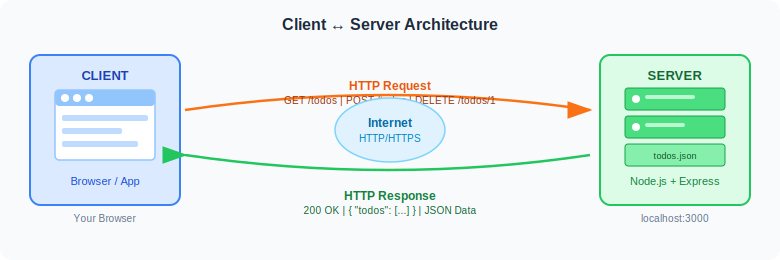
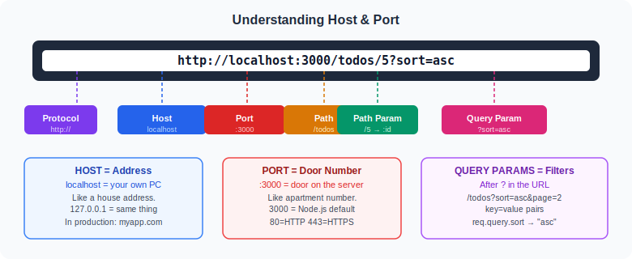
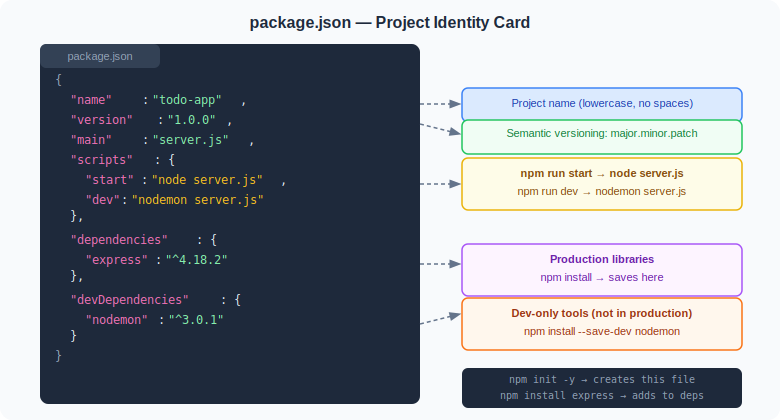
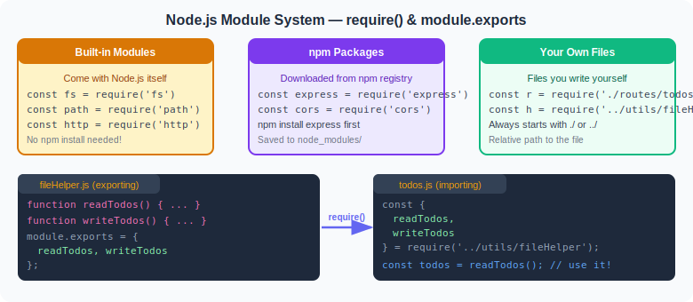
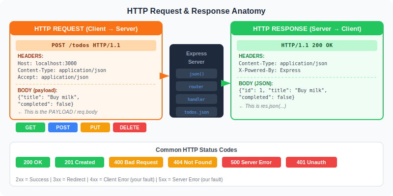
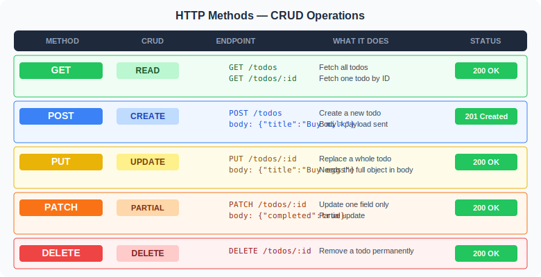
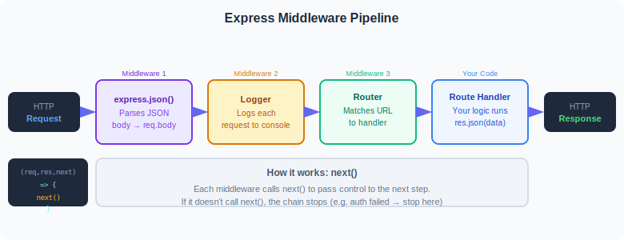
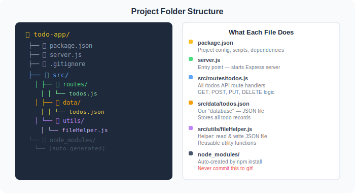

## 1. The Big Picture — Client and Server

Before we write a single line of code, let us understand **what we are building**, **why it exists**,
and **what problem it solves**.

### What problem are we solving?

Imagine you are building a Todo web app. You have a React/HTML frontend that shows
a list of tasks. Now ask yourself:

- Where does the data live?
- If I open the same app on my phone and my laptop, do both show the same todos?
- If I close the browser and reopen it, are the todos still there?

The answer to all three is: **you need a server**. A server is a program that:
1. Stores data permanently (in a database or file)
2. Accepts requests from any client (browser, phone, Postman)
3. Returns data in a standard format (JSON)

This is exactly what we are building today.

### The Two Sides — Client and Server

Every web application has exactly two sides talking to each other:

| Role | Who | Responsibility |
|------|-----|----------------|
| **Client** | Browser, Phone App, Postman | Sends requests, shows data to the user |
| **Server** | Node.js + Express (your code) | Stores data, processes logic, returns responses |



### Real-world examples you already use every day

**When you open Instagram:**
- Client (your phone) sends: `GET https://api.instagram.com/v1/feed`
- Server processes: finds your posts, sorts by date
- Server sends back: JSON with post data
- Your phone renders the JSON as photos and text

**When you add a todo in Todoist:**
- Client sends: `POST https://api.todoist.com/rest/v2/tasks` with `{"content": "Buy milk"}`
- Server saves it to their database
- Server sends back: the newly created task with its ID
- Your app shows the new task on screen

**This is EXACTLY what we are building**, just simpler.

### What is HTTP?

HTTP (**H**yper**T**ext **T**ransfer **P**rotocol) is the **language** clients and servers use.
It is a set of rules that says:

- How a request must be formatted
- What methods exist (GET, POST, PUT, DELETE)
- What status codes mean (200, 404, 500)
- How responses must be structured

Think of HTTP as **English being the agreed language** between two people from different countries.
Both sides agreed to speak English (HTTP) so they can understand each other.

**What an HTTP request actually looks like** (this is what your browser sends, word for word):

```
GET /todos HTTP/1.1
Host: localhost:3000
Accept: application/json
User-Agent: Mozilla/5.0
Connection: keep-alive

(empty body for GET)
```

**What the server sends back:**

```
HTTP/1.1 200 OK
Content-Type: application/json
X-Powered-By: Express
Date: Fri, 25 Apr 2025 10:00:00 GMT

[{"id":1,"title":"Buy milk","completed":false}]
```

You never see this raw text — your browser (or Express) handles the formatting.
But knowing this exists helps you understand every concept we learn.

### The Request-Response Cycle

The most important thing to understand:

```
1. Client sends a REQUEST
2. Server receives the request
3. Server processes it (read file, modify data, etc.)
4. Server sends a RESPONSE
5. Client receives the response and does something with it

This is ONE complete cycle. It happens in milliseconds.
After the response is sent, the connection is done.
The server does NOT remember you. Every request starts fresh.
```

> **This is called "stateless"** — each request is independent.
> The server does not remember the previous request.
> This is why we need cookies/sessions/tokens for login — to "remind" the server who you are.

---

## 2. Host and Port — The Address System

### The Full URL Anatomy

Every URL you ever see follows this exact structure:

```
http://localhost:3000/todos/5?sort=asc&page=2
```



Let's break it down piece by piece:

---

### Protocol: `http://`

The protocol tells the browser **which communication rules to use**.

- `http://` — plain HTTP, data sent as text (not encrypted)
- `https://` — HTTP Secure, data is encrypted with TLS/SSL

**Real-world analogy:** It is like choosing between a regular phone call (http) and an
encrypted call where no one can eavesdrop (https).

In development, we always use `http://` because encryption is not needed on your own machine.
In production (live on the internet), you always use `https://`.

---

### Host: `localhost`

The **host** is the **address of the computer** where the server is running.

`localhost` is a special name that always means **"this very computer I am typing on right now"**.
It is equivalent to the IP address `127.0.0.1`.

```
localhost  →  127.0.0.1  →  "my own machine"
```

**Real-world analogy:** A host is like a **house address**.
- `localhost` = your own house
- `google.com` = Google's house (their server building)
- `192.168.1.5` = another computer on your home WiFi network

**What `0.0.0.0` means:**

When you start a server, you can choose who can connect:

```
app.listen(3000, 'localhost')  → Only requests from THIS computer accepted
app.listen(3000, '0.0.0.0')   → Requests from ANY device on the network accepted
```

If you want to test your API from your phone (on the same WiFi), use `0.0.0.0`.
Then visit `http://192.168.1.X:3000` from your phone (replace X with your computer's IP).

---

### Port: `3000`

The **port** is like a **door number** on the computer.

Your computer has one IP address but can run many programs at once.
Each program uses a different port number so the OS knows which program gets which traffic.

```
Your computer (localhost):
  ├── Port 3000  →  Your Node.js server
  ├── Port 5432  →  PostgreSQL database
  ├── Port 27017 →  MongoDB
  └── Port 8080  →  Another web server

When a request arrives at port 3000, the OS delivers it to YOUR program.
```

**Real-world analogy:** Your apartment building has one street address (the IP / host),
but each apartment has a number (the port). Mail goes to the building, then the OS
delivers it to the right apartment (program).

**Common port numbers:**

| Port | Used for | Notes |
|------|----------|-------|
| `80` | HTTP websites | Default for browsers (you never type `:80`) |
| `443` | HTTPS websites | Default for HTTPS |
| `3000` | Node.js dev server | Community convention |
| `3001`, `4000`, `8080` | Alternative dev servers | When 3000 is taken |
| `5432` | PostgreSQL | Database |
| `27017` | MongoDB | Database |
| `6379` | Redis | Cache database |

> **Important rule:** Only ONE program can use a port at a time.
> If you start two servers on port 3000, the second one crashes with:
> `Error: listen EADDRINUSE: address already in use :::3000`
>
> **Fix:** Kill the first server, or change the second to port 3001.

---

### Path: `/todos`

The **path** tells the server **which resource you want**.
It is everything after the host:port and before the `?`.

```
/todos           → the collection of all todos
/todos/5         → a specific todo with id 5
/users/john      → a specific user named john
/products/42     → a specific product with id 42
/               → the root / homepage
```

---

### Path Parameter: `/5` (the `:id` part)

A **path parameter** is a **variable segment** inside the path that identifies a specific item.

```
Route:    /todos/:id
Request:  GET /todos/5
Result:   req.params.id = "5"
```

We will build this in Day 2.

---

### Query Parameters: `?sort=asc&page=2`

**Query parameters** are key-value pairs that come after `?` in the URL.
They add optional filtering, sorting, or configuration.

```
/todos?sort=asc           → sort todos A to Z
/todos?completed=true     → show only completed todos
/todos?page=2&limit=10    → page 2, 10 items per page
/search?q=milk&limit=5    → search for "milk", max 5 results
```

Multiple params are separated by `&`.
We will build this in Day 2.

---

## 3. What is Node.js? (And Why Not Just Use a Browser?)

You already know JavaScript from the browser. So why do we need Node.js?

**In a browser**, JavaScript can:
- Manipulate the DOM (HTML elements)
- Handle click events
- Make HTTP requests (fetch/axios)
- BUT: it **cannot** read files from disk, cannot create a server, cannot access databases

**In Node.js**, JavaScript can:
- Read and write files (`fs` module)
- Create an HTTP server
- Connect to databases
- Run on a computer without a browser
- Execute any system operation

**Node.js is V8 (Chrome's JavaScript engine) running outside the browser.**
It takes the same language you know and gives it superpowers.

```
JavaScript in Browser          JavaScript in Node.js
─────────────────────────      ─────────────────────────────
Runs inside Chrome/Firefox     Runs directly on your computer
Can access DOM                 Cannot access DOM
Cannot read files              Can read/write files (fs module)
Cannot create servers          Can create HTTP servers
Sandbox (protected)            Full OS access
```

**Proof that Node.js runs JS:**

```js
// hello.js
console.log("Hello from Node.js!");
console.log("Node version:", process.version);
console.log("Platform:", process.platform);
```

```bash
node hello.js
# Hello from Node.js!
# Node version: v20.11.0
# Platform: win32
```

---

## 4. Setting Up the Project — npm and package.json

### What is npm?

**npm** (Node Package Manager) is a tool that:
1. Manages your project dependencies (libraries)
2. Downloads packages from [npmjs.com](https://npmjs.com) (over 2 million packages)
3. Runs scripts (like starting your server)

It comes bundled with Node.js — when you install Node, npm comes along.

### Step 1: Install Node.js

Download from [nodejs.org](https://nodejs.org) — choose the **LTS** (Long Term Support) version.

After installing, verify it works:

```bash
node --version    # v20.11.0  (or similar)
npm  --version    # 10.2.4    (or similar)
```

If you see version numbers, you are ready.

### Step 2: Create the project folder

```bash
mkdir todo-app      # make a new folder called todo-app
cd todo-app         # go into that folder
```

### Step 3: Initialize the project (create package.json)

```bash
npm init -y
```

The `-y` flag answers "yes" to all questions automatically.
This creates a `package.json` file.

**What does "initialize" mean?** It means: "tell Node.js this folder is a project".
Before `npm init`, this folder is just a folder. After it, Node.js knows it is a project
with a name, version, and dependencies list.

### Step 4: Install Express

```bash
npm install express
```

Watch what happens in the terminal:
```
added 62 packages, and audited 63 packages in 2s
found 0 vulnerabilities
```

Express alone installs 62 packages! That is because Express itself depends on other
libraries, which depend on other libraries. npm handles all of this for you.

After this command:
- `node_modules/` folder appears (contains all downloaded code)
- `package-lock.json` appears (locks exact versions)
- `package.json` is updated with `"express"` in dependencies

### Understanding package.json — Every Single Line



This is our complete `package.json`. Let us read every line as if learning a new language:

```json
{
```
Standard JSON object. Everything goes inside these curly braces.

```json
  "name": "todo-app",
```
The official name of your project.
- Must be **all lowercase**
- No spaces (use hyphens: `todo-app`, not `todo app`)
- No special characters except `-` and `_`
- This is the name if you were to publish to npm registry

```json
  "version": "1.0.0",
```
Your app's version number using **Semantic Versioning** (SemVer).

The format is: `MAJOR.MINOR.PATCH`

| Number | When to change | Example |
|--------|---------------|---------|
| PATCH (last) | Bug fix that does not change behaviour | `1.0.0` → `1.0.1` |
| MINOR (middle) | New feature, nothing breaks | `1.0.1` → `1.1.0` |
| MAJOR (first) | Breaking change — old code stops working | `1.1.0` → `2.0.0` |

**Real example:** Express itself went from v4 to v5. That was a MAJOR change because
code written for v4 might break on v5.

```json
  "main": "server.js",
```
The **entry point** — the first file Node runs when someone starts your app.
When you type `node server.js`, Node reads this file first and executes it top to bottom.

```json
  "scripts": {
    "start": "node server.js",
    "dev":   "nodemon server.js"
  },
```

npm **scripts** are shortcuts you run in the terminal.

| You type | npm runs | What happens |
|---------|----------|--------------|
| `npm start` | `node server.js` | Start server once (production) |
| `npm run dev` | `nodemon server.js` | Start server and auto-restart on file changes (development) |

> **Why `npm start` vs `npm run dev`?**
> `start` is a special npm script — you can run it without `run`.
> All others need `npm run <name>`.

**What is nodemon?** It watches your project files. When you save a change,
it automatically stops and restarts the server. Without it, you would have to
manually stop (Ctrl+C) and restart every time you change code. Essential for development.

```json
  "dependencies": {
    "express": "^4.18.2"
  },
```

**Dependencies** = libraries your app needs to RUN in production.

- When you deploy your app to a server (AWS, Heroku, etc.), the server runs
  `npm install` to install these packages.
- The `^` (caret) before the version number is a **range operator**:
  - `^4.18.2` means: install `4.18.2` or newer, but NEVER install `5.x`
  - It accepts new minor versions (`4.19.0`) and patches (`4.18.3`)
  - But rejects major versions (`5.0.0`) which might break things
- Command to install: `npm install express`

```json
  "devDependencies": {
    "nodemon": "^3.0.1"
  }
```

**devDependencies** = tools only needed while you are developing, NOT in production.

- `nodemon` auto-restarts the server — useful during development
- In production, the server just stays running, no restarts needed
- When you deploy, servers often skip installing devDependencies: `npm install --production`
- Command to install: `npm install --save-dev nodemon`

```json
}
```
End of the JSON object.

### What is package-lock.json?

When you run `npm install`, two files are created/updated:

| File | Purpose |
|------|---------|
| `package.json` | Says "I need Express version 4.x" (approximate range) |
| `package-lock.json` | Records the EXACT version installed: "I installed 4.18.2" |

`package-lock.json` ensures that if your colleague runs `npm install` on their computer,
they get the **exact same version** as you. Without it, they might get a slightly different
version which could behave differently.

**Rule: Always commit `package-lock.json` to git. Never commit `node_modules/`.**

### What is node_modules/?

This folder contains the actual downloaded code of all your dependencies.

```
node_modules/
├── express/          ← Express source code (thousands of files)
├── body-parser/      ← Express depends on this
├── cookie/           ← Express depends on this
├── debug/            ← Express depends on this
└── ... (60+ more folders)
```

- **Never edit files here** — they will be overwritten next `npm install`
- **Never commit to git** — too large (can be 100MB+), others can recreate it with `npm install`
- **If deleted**, just run `npm install` to recreate it

---

## 5. Node.js Module System — require() and module.exports

### Why do modules exist?

Imagine writing a 10,000 line application in a single file. You want to fix a bug in the
"user authentication" section. You have to search through thousands of lines. It is a nightmare.

**Modules solve this** by splitting code into small, focused files:
- `auth.js` — everything about authentication
- `todos.js` — everything about todos
- `fileHelper.js` — utilities for reading/writing files

Each file is a **module**. Modules only share what they explicitly export.
This means each file is independent and easy to understand.



### Three Types of Modules

#### Type 1: Built-in Modules (free, from Node.js itself)

These come pre-installed with Node.js. No npm install needed. Ever.

```js
const fs   = require('fs');
//           ↑
//           'fs' is the exact name Node.js uses for file system
//           It is built in — just require it and use it

const path = require('path');
const http = require('http');
const os   = require('os');
const crypto = require('crypto');
```

**What each does:**

| Module | Real use |
|--------|---------|
| `fs` | Read/write files on disk |
| `path` | Build file paths that work on Windows AND Mac |
| `http` | Create a raw HTTP server (we use Express instead) |
| `os` | Get system info: CPU count, memory, username |
| `crypto` | Hash passwords, generate random tokens |

**Quick proof it works:**

```js
const os = require('os');
console.log('Your username:', os.userInfo().username);
console.log('Total RAM:', Math.round(os.totalmem() / 1024 / 1024 / 1024), 'GB');
```

---

#### Type 2: npm Packages (downloaded, from npmjs.com)

These must be installed first with `npm install`. There are over 2 million packages.

```js
// STEP 1 (in terminal):  npm install express
// STEP 2 (in your file):
const express = require('express');
//              ↑
//              npm install saved this into node_modules/express/
//              require('express') reads and runs that code

// Another example:
// npm install cors
const cors = require('cors');

// npm install uuid
const { v4: uuidv4 } = require('uuid');
```

**What happens when you `require('express')`?**

1. Node looks in `node_modules/express/`
2. Finds `package.json` inside it: `"main": "index.js"`
3. Runs `node_modules/express/index.js`
4. That file puts its exports into `module.exports`
5. You receive those exports as `express`

---

#### Type 3: Your Own Files (relative path — starts with ./ or ../)

These are files YOU wrote. You identify them by starting with `./` or `../`.

```js
// ./ means "in the SAME folder as this file"
const fileHelper = require('./utils/fileHelper');
//                          ↑
//                          Node adds .js automatically → utils/fileHelper.js

// ../ means "go UP one folder, then look there"
const router = require('../routes/todos');

// You can chain:
const db = require('../../config/database');
//         ↑ go up 2 folders, then into config/database.js
```

**The rule is simple:**
- No prefix (`'express'`) → look in `node_modules/`
- Starts with `./` or `../` → it is YOUR file, use a relative path

---

### Exporting from a File — module.exports

Every `.js` file starts with an empty `module.exports = {}`.
You put things IN it to share them with other files.

```js
// src/utils/mathHelper.js

// These functions exist inside this file only
function add(a, b)      { return a + b; }
function subtract(a, b) { return a - b; }
function multiply(a, b) { return a * b; }

// Only add and subtract are exported — multiply stays private
module.exports = {
  add,        // shorthand for   add: add
  subtract,   // shorthand for   subtract: subtract
  // multiply is NOT here — other files cannot use it
};
```

**Different ways to export:**

```js
// Option 1: Export an object with multiple things (most common)
module.exports = { readTodos, writeTodos };

// Option 2: Export a single thing (for a class or one function)
module.exports = express.Router();

// Option 3: Assign directly
module.exports.readTodos  = function() { ... };
module.exports.writeTodos = function() { ... };
```

---

### Importing in Another File — require()

```js
// server.js

// Option 1: Get everything that was exported
const mathHelper = require('./utils/mathHelper');
mathHelper.add(2, 3);       // 5
mathHelper.subtract(10, 4); // 6
mathHelper.multiply(3, 3);  // ERROR! multiply was not exported

// Option 2: Destructure — only grab what you need (cleaner)
const { add, subtract } = require('./utils/mathHelper');
add(2, 3);      // 5
subtract(10, 4); // 6
```

---

### Real example — our fileHelper module

```js
// src/utils/fileHelper.js

const fs   = require('fs');
const path = require('path');

function readTodos() {
  const raw = fs.readFileSync('src/data/todos.json', 'utf-8');
  return JSON.parse(raw);
}

function writeTodos(todos) {
  fs.writeFileSync('src/data/todos.json', JSON.stringify(todos, null, 2));
}

module.exports = { readTodos, writeTodos };
// ↑ Only these two functions leave this file
```

```js
// src/routes/todos.js

const { readTodos, writeTodos } = require('../utils/fileHelper');
// ↑ We import ONLY the two functions we need

const todos = readTodos();  // works perfectly
```

---

### Common Mistake: Forgetting to Export

```js
// utils/calculator.js
function add(a, b) { return a + b; }
// FORGOT module.exports !

// app.js
const { add } = require('./utils/calculator');
add(1, 2);   // TypeError: add is not a function
             // Because module.exports is {} (empty) — add was never put in it
```

**Fix:** Always add `module.exports` at the bottom of every file that should share functions.

---

## 6. Express — The Web Framework

### Without Express (raw Node.js http module)

To appreciate what Express does, look at what you would write WITHOUT it:

```js
// Without Express — raw Node.js (don't use this, just observe)
const http = require('http');

const server = http.createServer((req, res) => {
  if (req.method === 'GET' && req.url === '/todos') {
    res.writeHead(200, { 'Content-Type': 'application/json' });
    res.end(JSON.stringify([{ id: 1, title: 'Buy milk' }]));

  } else if (req.method === 'POST' && req.url === '/todos') {
    let body = '';
    req.on('data', chunk => { body += chunk.toString(); });  // collect chunks
    req.on('end', () => {
      const data = JSON.parse(body);  // parse manually
      res.writeHead(201, { 'Content-Type': 'application/json' });
      res.end(JSON.stringify({ id: 2, ...data }));
    });

  } else {
    res.writeHead(404, { 'Content-Type': 'application/json' });
    res.end(JSON.stringify({ error: 'Not found' }));
  }
});

server.listen(3000, () => console.log('running'));
```

This is messy, repetitive, and grows out of control fast.

### With Express (same thing, clean version)

```js
const express = require('express');
const app = express();
app.use(express.json());

app.get('/todos', (req, res) => {
  res.json([{ id: 1, title: 'Buy milk' }]);
});

app.post('/todos', (req, res) => {
  res.status(201).json({ id: 2, ...req.body });
});

app.listen(3000, () => console.log('running'));
```

Express handles all the messy parts: parsing request bodies, setting headers,
routing based on method and URL. You write only the logic that matters.

---

### Building Your First Express Server — Line by Line

Let's write the simplest possible working server and understand each line:

```js
// server.js — The Minimal Version
const express = require('express');
const app     = express();

app.use(express.json());

app.get('/hello', (req, res) => {
  res.json({ message: 'Hello, World!' });
});

app.listen(3000, () => {
  console.log('Server running on http://localhost:3000');
});
```

Now let us zoom into each line:

---

**Line 1:**
```js
const express = require('express');
```
- `require('express')` finds the `express` package in `node_modules/`
- Runs the Express code and returns what Express exports
- That exported thing is a **function** (a factory function)
- We store it in a variable named `express` (convention, could be any name)

---

**Line 2:**
```js
const app = express();
```
- We call `express()` as a function — this creates a brand new Express application
- `app` is now an object with many methods: `.get()`, `.post()`, `.use()`, `.listen()`
- You can create multiple apps in one file (rarely needed, but possible)
- Everything you configure goes onto `app`

---

**Line 3:**
```js
app.use(express.json());
```
This is **middleware registration**. Let us break it down:

- `express.json()` — creates a middleware function that reads the raw request body,
  parses it as JSON, and puts the result in `req.body`
- `app.use()` — registers that middleware to run on EVERY request
- Without this line: `req.body` is `undefined` even if the client sends JSON

**Real experiment — what happens without `app.use(express.json())`:**

```js
// Client sends:  POST /todos   with body { "title": "Buy milk" }

// Without express.json():
app.post('/todos', (req, res) => {
  console.log(req.body);  // undefined  ← nothing!
});

// With express.json():
app.use(express.json());
app.post('/todos', (req, res) => {
  console.log(req.body);  // { title: 'Buy milk' }  ← perfect
});
```

---

**Line 4:**
```js
app.get('/hello', (req, res) => {
  res.json({ message: 'Hello, World!' });
});
```
- `app.get('/hello', handler)` — "When someone sends a GET request to /hello, run this handler"
- The handler is a function with two parameters: `req` and `res`
- `req` (**Request**) — represents everything the client sent to us
- `res` (**Response**) — the object we use to send something back
- `res.json(data)` — converts `data` to JSON string and sends it with `Content-Type: application/json`

**What is a callback/handler function?**

```js
// This:
app.get('/hello', (req, res) => {
  res.json({ message: 'Hello!' });
});

// Is the same as this:
function handleHello(req, res) {
  res.json({ message: 'Hello!' });
}
app.get('/hello', handleHello);
```

Express calls your function when a matching request arrives.
You do not call it yourself — Express calls it for you.

---

**Line 5:**
```js
app.listen(3000, () => {
  console.log('Server running on http://localhost:3000');
});
```
- `app.listen(PORT, callback)` — starts the server
- Binds to port 3000 on all available interfaces
- The `callback` runs ONCE when the server is fully started and ready
- After this line, the program does NOT exit — it stays alive waiting for requests
- This is different from regular Node.js scripts that exit after running

**What does "stays alive" mean in code?**

Normally Node.js exits when it reaches the end of the file:
```js
console.log("Hello");
// Process exits here — done.
```

But `app.listen()` creates an ongoing "event loop" — Node.js keeps checking:
"did any new request arrive? Did a timer fire? Is any I/O ready?"
This keeps the process alive indefinitely until you press Ctrl+C.

---

## 7. The Request Object (req) — What the Client Sends

The `req` object is a goldmine of information. Let us explore everything in it:



```js
app.post('/todos/:id', (req, res) => {

  // ── Method and URL ──────────────────────────────
  console.log(req.method);    // "POST"
  console.log(req.url);       // "/todos/5?sort=asc"
  console.log(req.path);      // "/todos/5"   (no query string)
  console.log(req.hostname);  // "localhost"

  // ── Path Parameters ─────────────────────────────
  // From the :id in the route definition
  console.log(req.params);      // { id: "5" }
  console.log(req.params.id);   // "5"  ← always a string!

  // ── Query Parameters ────────────────────────────
  // From the ?sort=asc part of the URL
  console.log(req.query);          // { sort: "asc", page: "1" }
  console.log(req.query.sort);     // "asc"  ← always a string!
  console.log(req.query.page);     // "1"    ← always a string!

  // ── Request Body ────────────────────────────────
  // From the JSON sent in the body (needs express.json() middleware)
  console.log(req.body);           // { title: "Buy milk" }
  console.log(req.body.title);     // "Buy milk"

  // ── Headers ─────────────────────────────────────
  console.log(req.headers);
  // {
  //   'content-type': 'application/json',
  //   'user-agent': 'Mozilla/5.0...',
  //   'accept': 'application/json',
  //   'host': 'localhost:3000'
  // }
  console.log(req.headers['content-type']); // "application/json"
  console.log(req.get('Content-Type'));      // same thing, case-insensitive

  // ── Client IP ───────────────────────────────────
  console.log(req.ip);  // "127.0.0.1" (your own computer)
});
```

---

## 8. The Response Object (res) — What We Send Back

```js
app.get('/examples', (req, res) => {

  // ── Send JSON ───────────────────────────────────
  res.json({ id: 1, title: 'Buy milk' });
  // Sets Content-Type: application/json automatically
  // Converts the object to JSON string automatically

  // ── Set a status code THEN send ────────────────
  res.status(201).json({ id: 4, title: 'New todo' });
  // .status() sets the code, .json() sends the response
  // These chain together

  // ── Status code shortcuts ────────────────────────
  res.status(404).json({ error: 'Not found' });
  res.status(400).json({ error: 'Bad request' });
  res.status(500).json({ error: 'Internal server error' });

  // ── Set custom headers ───────────────────────────
  res.set('X-Custom-Header', 'my-value');
  res.set('Cache-Control', 'no-cache');
  res.json({ data: 'something' });

  // ── Send plain text ──────────────────────────────
  res.send('Hello plain text!');  // Content-Type: text/html

  // ── Send nothing (useful for DELETE) ────────────
  res.sendStatus(204);  // 204 No Content
});
```

### HTTP Status Codes — What Each Number Means

Every HTTP response has a status code. Clients (browsers, apps) use this to understand
what happened:

| Range | Category | Examples |
|-------|----------|---------|
| **2xx** | **Success** | 200 OK, 201 Created, 204 No Content |
| **3xx** | **Redirect** | 301 Moved Permanently, 302 Found |
| **4xx** | **Client Error** (YOUR mistake) | 400 Bad Request, 401 Unauthorized, 404 Not Found |
| **5xx** | **Server Error** (OUR mistake) | 500 Internal Server Error, 503 Service Unavailable |

**Common ones you will use:**

| Code | Name | When to use |
|------|------|-------------|
| `200` | OK | Successful GET, PUT, PATCH, DELETE |
| `201` | Created | Successful POST (new resource created) |
| `204` | No Content | Successful DELETE with no body |
| `400` | Bad Request | Client sent invalid data (missing field, wrong type) |
| `401` | Unauthorized | Not logged in |
| `403` | Forbidden | Logged in but not allowed |
| `404` | Not Found | Resource does not exist |
| `422` | Unprocessable Entity | Data format is valid but values are wrong |
| `500` | Internal Server Error | Unhandled error in your code (bug) |

---

> **Critical rule:** You can only send ONE response per request.
> Once you call `res.json()` or `res.send()`, the response is complete.
> Calling it again causes: `Error: Cannot set headers after they are sent to the client`

**This is the most common beginner mistake:**

```js
// WRONG — two responses!
app.get('/todos/:id', (req, res) => {
  const todo = findTodo(req.params.id);

  if (!todo) {
    res.status(404).json({ error: 'Not found' });
    // Missing return! Code continues below and sends ANOTHER response
  }

  res.json(todo);  // ← ERROR: already sent 404 above
});

// CORRECT — use return to stop execution
app.get('/todos/:id', (req, res) => {
  const todo = findTodo(req.params.id);

  if (!todo) {
    return res.status(404).json({ error: 'Not found' });
    // return exits the function immediately
  }

  res.json(todo);  // only runs if todo was found
});
```

---

## 9. HTTP Methods — CRUD Mapping



Every action in any application maps to one of four operations: **Create, Read, Update, Delete (CRUD)**.
HTTP methods map to these operations:

| HTTP Method | CRUD | What it means | Has Body? |
|------------|------|---------------|-----------|
| `GET` | Read | "Give me some data" | No |
| `POST` | Create | "Here is new data, save it" | Yes |
| `PUT` | Update (full) | "Here is the complete new version" | Yes |
| `PATCH` | Update (partial) | "Here is one changed field" | Yes |
| `DELETE` | Delete | "Remove this item" | No |

### Real-world examples from apps you know

**YouTube's API (simplified):**

```
GET    /videos              → list all videos
GET    /videos/dQw4w9WgXcQ  → get one specific video
POST   /videos              → upload a new video
PUT    /videos/dQw4w9WgXcQ  → replace all video info
PATCH  /videos/dQw4w9WgXcQ  → update just the title
DELETE /videos/dQw4w9WgXcQ  → delete the video
```

**Our Todo API:**

```
GET    /todos              → list all todos
GET    /todos/3            → get todo with id 3
POST   /todos              → create a new todo
PUT    /todos/3            → replace todo 3 completely
PATCH  /todos/3            → update only one field of todo 3
DELETE /todos/3            → delete todo 3
```

### What is Idempotency?

A fancy word, but an important concept:

**Idempotent** = calling it 10 times has the same effect as calling it once.

```
GET  /todos/1   →  gets the todo every time  ← idempotent (no side effects)
DELETE /todos/1 →  first call deletes it, subsequent calls get 404  ← idempotent
PUT /todos/1    →  sets the data to the same thing every time  ← idempotent
POST /todos     →  every call CREATES a new todo  ← NOT idempotent (10 calls = 10 todos)
```

This matters when: a network error causes a client to retry a request.
- It is safe to retry GET and DELETE
- It is NOT safe to retry POST (may create duplicates)

---

## 10. Middleware — The Processing Pipeline

Middleware is one of the most important concepts in Express.
Let us understand it deeply.

**What is middleware?**

It is a function that:
1. Receives the request (`req`) and response (`res`)
2. Does something useful (log, parse, validate, authenticate)
3. Either sends a response (ending the cycle) OR calls `next()` to pass control forward



### The Airport Security Analogy

Think of middleware as **airport security checkpoints**:

```
You (request) enter the airport
       ↓
Checkpoint 1: Ticket check  → valid? → proceed
       ↓
Checkpoint 2: ID verification → valid? → proceed
       ↓
Checkpoint 3: Luggage scan → safe? → proceed
       ↓
Gate (route handler): Board the plane (your actual code runs)
       ↓
You fly to destination (response sent to client)
```

Each checkpoint (middleware) can:
- Let you through (`next()`)
- Stop you and send you back (`res.json({ error: 'No ticket' })`)

---

### Middleware in Code

**Middleware function signature:**

```js
function myMiddleware(req, res, next) {
  //                             ↑
  //                             next is a function Express provides
  //                             calling it says "I am done, pass to next middleware"

  // Do something here
  console.log('A request arrived!');

  next(); // Pass control to the next middleware/route
}

app.use(myMiddleware);
// OR inline:
app.use((req, res, next) => {
  console.log('A request arrived!');
  next();
});
```

### Three Types of Middleware

#### 1. Application-level middleware (runs on every request)

```js
// Logger — runs on EVERY request to the server
app.use((req, res, next) => {
  const time = new Date().toISOString();
  console.log(`[${time}] ${req.method} ${req.url}`);
  next();
});
```

Output you will see in terminal:
```
[2025-04-25T10:00:00.000Z] GET /todos
[2025-04-25T10:00:01.234Z] POST /todos
[2025-04-25T10:00:05.789Z] DELETE /todos/3
```

#### 2. Route-level middleware (runs only on specific routes)

```js
// This middleware ONLY runs on POST /todos — not on GET /todos
app.post('/todos', validateBody, createTodo);
//                ↑
//                middleware runs before the handler

function validateBody(req, res, next) {
  if (!req.body.title) {
    return res.status(400).json({ error: 'title is required' });
    // No next() — we stop here if validation fails
  }
  next(); // validation passed — proceed to createTodo
}

function createTodo(req, res) {
  // By the time we get here, we KNOW req.body.title exists
  res.status(201).json({ id: 1, title: req.body.title });
}
```

#### 3. Built-in Express middleware

```js
app.use(express.json());       // Parse JSON request bodies
app.use(express.urlencoded({ extended: true })); // Parse HTML form data
app.use(express.static('public'));               // Serve static files (HTML, CSS, images)
```

---

### What Happens If You Forget `next()`?

```js
app.use((req, res, next) => {
  console.log('I am middleware!');
  // next() is missing — we never pass control to the next middleware
});

app.get('/todos', (req, res) => {
  res.json([]);  // This NEVER runs because middleware above never called next()
});
```

Result: The browser shows a loading spinner forever. The request never gets a response.
This is a common bug. Always call `next()` unless you are intentionally ending the cycle.

---

### Middleware Ordering Matters

Middleware runs in the **order you register it**. This is critical:

```js
// WRONG order — logger runs AFTER json parser, so it cannot log req.body
app.get('/todos', handler);     // route first
app.use(express.json());        // middleware after? NO!
app.use(logger);

// CORRECT order
app.use(express.json());        // 1. Parse body first
app.use(logger);                // 2. Then log (can now access req.body)
app.get('/todos', handler);     // 3. Then routes
app.use(notFoundHandler);       // 4. Catch-all 404 goes LAST
```

---

## 11. Project Structure — Why We Split Files

As apps grow, one large file becomes unmaintainable. We split by responsibility:



```
todo-app/
├── package.json           ← project config (never edit manually much)
├── server.js              ← entry point: app setup, middleware, start
└── src/
    ├── routes/
    │   └── todos.js       ← all /todos endpoints (GET, POST, PUT, DELETE)
    ├── data/
    │   └── todos.json     ← the "database" (flat file)
    └── utils/
        └── fileHelper.js  ← reusable functions: readTodos(), writeTodos()
```

**Principle: Single Responsibility**

Each file should do ONE thing:

| File | Its ONE job |
|------|------------|
| `server.js` | Create app, register middleware, start server |
| `routes/todos.js` | Handle HTTP requests for todo resources |
| `utils/fileHelper.js` | Read and write the JSON file |
| `data/todos.json` | Store the data (it is not code) |

**Why does this matter in real life?**

Imagine you have a bug in reading files. If all code is in `server.js`, you search 500 lines.
If your code is structured, you open `fileHelper.js` (30 lines) and the bug is right there.

---

## 12. Setting Up and Running the Project

### Step 1: Create the structure

```bash
mkdir todo-app
cd todo-app
npm init -y
npm install express
npm install --save-dev nodemon
mkdir -p src/routes src/data src/utils
```

### Step 2: Create the starter files

Create [src/data/todos.json](src/data/todos.json) with some sample data:

```json
[
  { "id": 1, "title": "Buy groceries", "completed": false },
  { "id": 2, "title": "Learn Express.js", "completed": true },
  { "id": 3, "title": "Build a REST API", "completed": false }
]
```

Create [server.js](server.js) — the entry point:

```js
const express     = require('express');
const todosRouter = require('./src/routes/todos');

const app  = express();
const PORT = process.env.PORT || 3000;

app.use(express.json());

app.use((req, res, next) => {
  console.log(`${req.method} ${req.url}`);
  next();
});

app.use('/todos', todosRouter);

app.get('/', (req, res) => {
  res.json({ message: 'Todo API is running!' });
});

// 404 handler — catch anything that did not match
app.use((req, res) => {
  res.status(404).json({ error: `Route ${req.method} ${req.url} not found` });
});

app.listen(PORT, 'localhost', () => {
  console.log(`Server running at http://localhost:${PORT}`);
});
```

### Step 3: Run the server

```bash
npm run dev
```

You should see:
```
Server running at http://localhost:3000
```

Open your browser and visit `http://localhost:3000` — you should see:
```json
{ "message": "Todo API is running!" }
```

### Step 4: Test with curl

`curl` is a terminal tool to make HTTP requests. It is like a browser but for APIs.

```bash
# Basic GET request
curl http://localhost:3000/todos
# Response: [{...}, {...}, {...}]

# GET with verbose output (shows headers too)
curl -v http://localhost:3000/todos
# Shows: request headers, response headers, status code, body

# POST — create a new todo
curl -X POST http://localhost:3000/todos \
     -H "Content-Type: application/json" \
     -d '{"title": "Walk the dog"}'
# Response: {"id": 4, "title": "Walk the dog", "completed": false}
```

**If curl is not available on Windows**, use [Postman](https://postman.com) (free GUI tool)
or the Thunder Client extension in VS Code.

---

## Day 1 Summary

| Concept | What you now deeply understand |
|---------|-------------------------------|
| **Client-Server** | Browser sends HTTP requests to server, server processes and responds |
| **HTTP** | The agreed language (format) for web communication |
| **Host** | Computer address — `localhost` is your own machine |
| **Port** | Door number on a computer — each program gets its own port |
| **URL anatomy** | Protocol + host + port + path + path param + query params |
| **Node.js** | JavaScript running outside the browser with file/server access |
| **npm** | Package manager — installs, manages, and runs project tooling |
| **package.json** | Project identity: name, version, scripts, dependencies |
| **Modules** | `require()` loads code; `module.exports` shares code between files |
| **Express** | Library that turns Node.js into a clean HTTP server platform |
| **`app.use()`** | Registers middleware that runs on every request |
| **`app.get()` etc.** | Registers route handlers for specific method + path combinations |
| **req** | The request object — contains method, url, headers, body, params, query |
| **res** | The response object — use it to send back JSON, status codes |
| **Middleware** | Functions that run between request arrival and the handler |
| **`next()`** | Passes control to the next middleware in the chain |
| **HTTP Methods** | GET=Read, POST=Create, PUT=Full Update, PATCH=Partial, DELETE=Remove |
| **Status codes** | 2xx=success, 4xx=client error, 5xx=server error |

---

