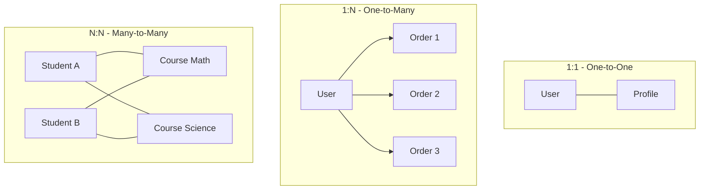
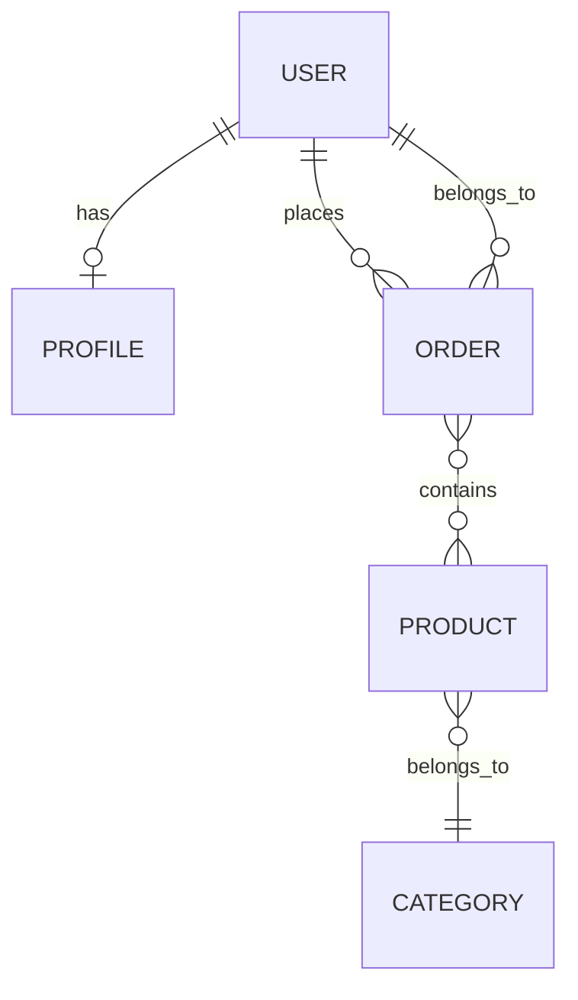

# 📅 Day 3: Relationships in TypeORM

---

## 1. 🎯 Introduction — What Will We Learn Today?

Today's agenda:

1. What are relationships?
2. Four types of relationships:
   - **One-to-One** (1:1)
   - **One-to-Many** (1:N)
   - **Many-to-One** (N:1)
   - **Many-to-Many** (N:N)
3. `@JoinColumn` vs `@JoinTable`
4. Loading related data (eager vs lazy)
5. Cascades
6. Real-world mini schema: **Users + Orders + Products + Categories**

Small question 🤔:
> Can a **User** have many **Orders**? Can an **Order** belong to many **Users**? Think about it.

---

## 2. 🧠 Concept Explanation

### 2.1 Why Do We Need Relationships?

Imagine an **e-commerce site** 🛒. If we store everything in one table, we'd have:

| id | userName | email | orderId | product | price |
|----|----------|-------|---------|---------|-------|
| 1  | Ali      | ali@x | 101     | Phone   | 500   |
| 2  | Ali      | ali@x | 102     | Laptop  | 1200  |
| 3  | Sara     | sar@x | 103     | Book    | 20    |

Problems 🔴:
- `Ali` repeated → wasted storage
- Change Ali's email → update many rows
- Can't delete users without losing orders

Solution ✅: Split into multiple tables and **link them via IDs**.

### 2.2 Relationship Types — Simple Explanation

| Relationship | Example | Meaning |
|--------------|---------|---------|
| **One-to-One** | `User` ↔ `Profile` | Each user has exactly one profile |
| **One-to-Many** | `User` → `Orders` | One user can place many orders |
| **Many-to-One** | `Order` → `User` | Each order belongs to one user |
| **Many-to-Many** | `Student` ↔ `Course` | Students take many courses; courses have many students |

💡 **One-to-Many** and **Many-to-One** are two sides of the **same** relationship.

---

## 3. 💡 Visual Learning

### Overview of All Relationship Types



### E-Commerce Mini Schema



Memorize this diagram — we'll code every line of it today.

---

## 4. 🛠️ One-to-One (1:1)

**Example:** Each `User` has one `Profile` (bio, avatar, phone).

### 4.1 The Entities

```ts id="profileentity"
// src/entity/Profile.ts
import { Entity, PrimaryGeneratedColumn, Column } from "typeorm";

@Entity()
export class Profile {
  @PrimaryGeneratedColumn()
  id: number;

  @Column()
  bio: string;

  @Column({ nullable: true })
  avatarUrl: string;
}
```

```ts id="userone2one"
// src/entity/User.ts
import {
  Entity,
  PrimaryGeneratedColumn,
  Column,
  OneToOne,
  JoinColumn,
} from "typeorm";
import { Profile } from "./Profile";

@Entity()
export class User {
  @PrimaryGeneratedColumn()
  id: number;

  @Column()
  name: string;

  @OneToOne(() => Profile, { cascade: true })
  @JoinColumn()
  profile: Profile;
}
```

> 📌 `@JoinColumn()` tells TypeORM **which side owns the foreign key**. In a 1:1, only one side should have it.

### 4.2 SQL Equivalent

```sql id="one2onesql"
CREATE TABLE profile (
  id SERIAL PRIMARY KEY,
  bio VARCHAR,
  "avatarUrl" VARCHAR
);

CREATE TABLE "user" (
  id SERIAL PRIMARY KEY,
  name VARCHAR,
  "profileId" INT UNIQUE REFERENCES profile(id)
);
```

### 4.3 Using It

```ts id="one2oneuse"
const profile = new Profile();
profile.bio = "Full-stack dev from Karachi";

const user = new User();
user.name = "Ali";
user.profile = profile;

await userRepo.save(user);  // cascade saves profile too
```

To load the profile along with the user:

```ts id="one2oneload"
const users = await userRepo.find({ relations: ["profile"] });
```

---

## 5. 🛠️ One-to-Many & Many-to-One (1:N / N:1)

**Example:** One `User` can have many `Orders`. Each `Order` belongs to one `User`.

### 5.1 The Entities

```ts id="orderentity"
// src/entity/Order.ts
import {
  Entity,
  PrimaryGeneratedColumn,
  Column,
  ManyToOne,
  CreateDateColumn,
} from "typeorm";
import { User } from "./User";

@Entity()
export class Order {
  @PrimaryGeneratedColumn()
  id: number;

  @Column("decimal", { precision: 10, scale: 2 })
  total: number;

  @CreateDateColumn()
  createdAt: Date;

  @ManyToOne(() => User, (user) => user.orders, { onDelete: "CASCADE" })
  user: User;
}
```

```ts id="useronetomany"
// src/entity/User.ts
import { OneToMany } from "typeorm";
import { Order } from "./Order";

@Entity()
export class User {
  // ... id, name, email

  @OneToMany(() => Order, (order) => order.user)
  orders: Order[];
}
```

### 5.2 Rules

- The **Many** side (`Order`) owns the foreign key → uses `@ManyToOne`.
- The **One** side (`User`) does not own the FK → uses `@OneToMany`.
- **NEVER** add `@JoinColumn` to the `@OneToMany` side.

### 5.3 SQL Equivalent

```sql id="onemanysql"
CREATE TABLE "order" (
  id SERIAL PRIMARY KEY,
  total DECIMAL(10,2),
  "userId" INT REFERENCES "user"(id) ON DELETE CASCADE
);
```

### 5.4 Using It

```ts id="onemanyuse"
// Create orders for a user
const user = await userRepo.findOneBy({ id: 1 });

const order = orderRepo.create({
  total: 499.99,
  user: user!,
});
await orderRepo.save(order);

// Get a user with their orders
const withOrders = await userRepo.findOne({
  where: { id: 1 },
  relations: ["orders"],
});
console.log(withOrders?.orders.length, "orders");
```

### 5.5 Raw SQL vs TypeORM

**Raw SQL:**
```sql id="rawjoinsql"
SELECT u.id, u.name, o.id AS order_id, o.total
FROM "user" u
LEFT JOIN "order" o ON o."userId" = u.id
WHERE u.id = 1;
```

**TypeORM:**
```ts id="ormjoin"
await userRepo.findOne({ where: { id: 1 }, relations: ["orders"] });
```

Clean. Short. Type-safe. ❤️

---

## 6. 🛠️ Many-to-Many (N:N)

**Example:** A `Product` can belong to multiple `Categories`, and each `Category` has many `Products`.

### 6.1 The Entities

```ts id="categoryentity"
// src/entity/Category.ts
import { Entity, PrimaryGeneratedColumn, Column, ManyToMany } from "typeorm";
import { Product } from "./Product";

@Entity()
export class Category {
  @PrimaryGeneratedColumn()
  id: number;

  @Column()
  name: string;

  @ManyToMany(() => Product, (product) => product.categories)
  products: Product[];
}
```

```ts id="productentity"
// src/entity/Product.ts
import {
  Entity,
  PrimaryGeneratedColumn,
  Column,
  ManyToMany,
  JoinTable,
} from "typeorm";
import { Category } from "./Category";

@Entity()
export class Product {
  @PrimaryGeneratedColumn()
  id: number;

  @Column()
  title: string;

  @Column("decimal", { precision: 10, scale: 2 })
  price: number;

  @ManyToMany(() => Category, (category) => category.products, {
    cascade: true,
  })
  @JoinTable()
  categories: Category[];
}
```

### 6.2 Rules

- Only **one** side has `@JoinTable()` — it creates the junction table.
- TypeORM auto-creates a table named `product_categories_category` with two foreign keys.

### 6.3 SQL Equivalent

```sql id="manymanysql"
CREATE TABLE product (
  id SERIAL PRIMARY KEY,
  title VARCHAR,
  price DECIMAL(10,2)
);

CREATE TABLE category (
  id SERIAL PRIMARY KEY,
  name VARCHAR
);

CREATE TABLE product_categories_category (
  "productId" INT REFERENCES product(id) ON DELETE CASCADE,
  "categoryId" INT REFERENCES category(id) ON DELETE CASCADE,
  PRIMARY KEY ("productId", "categoryId")
);
```

### 6.4 Using It

```ts id="manymanyuse"
const electronics = categoryRepo.create({ name: "Electronics" });
const sale = categoryRepo.create({ name: "On Sale" });

const phone = productRepo.create({
  title: "iPhone 15",
  price: 999,
  categories: [electronics, sale],
});

await productRepo.save(phone); // cascade saves categories too

// Fetch products with their categories
const products = await productRepo.find({ relations: ["categories"] });
```

---

## 7. ⚡ Eager vs Lazy Loading

By default, relations are **NOT** loaded unless you ask for them. This prevents slow queries.

### Three Ways to Load Relations

1. **Explicit** — using `relations` option (recommended):
   ```ts id="loadexplicit"
   await userRepo.find({ relations: ["orders", "profile"] });
   ```

2. **Eager** — always loaded (use sparingly):
   ```ts id="loadeager"
   @OneToMany(() => Order, (o) => o.user, { eager: true })
   orders: Order[];
   ```

3. **Lazy** — loaded on access (returns a Promise):
   ```ts id="loadlazy"
   @OneToMany(() => Order, (o) => o.user, { lazy: true })
   orders: Promise<Order[]>;

   // usage
   const orders = await user.orders;
   ```

> 💡 **Best practice:** Prefer **explicit** loading. You stay in control of performance.

---

## 8. 🔄 Cascades — Saving Together

**Cascade** means: when you save/delete the parent, children are saved/deleted automatically.

```ts id="cascadeexample"
@OneToMany(() => Order, (o) => o.user, { cascade: true })
orders: Order[];
```

Now this works:

```ts id="cascadeuse"
const user = userRepo.create({
  name: "Sana",
  orders: [
    { total: 100 },
    { total: 250 },
  ],
});

await userRepo.save(user); // orders saved too!
```

**Cascade options:** `true`, `["insert"]`, `["update"]`, `["remove"]`, `["soft-remove"]`, `["recover"]`.

> ⚠️ Cascade delete is **powerful and dangerous**. Use `onDelete: "CASCADE"` only when you're 100% sure children should die with the parent.

---

## 9. 🧪 Hands-on Practice

Build a mini e-commerce schema and try these 5 tasks:

1. **Exercise 1:** Create a `User` with a `Profile` in one call (1:1 cascade).
2. **Exercise 2:** Insert 5 orders for one user. Fetch user with all orders sorted by `createdAt DESC`.
3. **Exercise 3:** Create 3 products and assign them to 2 categories (Many-to-Many).
4. **Exercise 4:** Delete a user and verify that cascading deletes their orders.
5. **Exercise 5:** Count how many products are in the "Electronics" category.

---

## 10. ⚠️ Common Mistakes

1. **Adding `@JoinColumn` on both sides of a 1:1**
   - Causes duplicate foreign keys.
   - ✅ Fix: Only one side owns the FK.

2. **Forgetting `@JoinTable()` in Many-to-Many**
   - Without it, TypeORM throws: *"Using @ManyToMany is not possible..."*
   - ✅ Fix: Add it on exactly **one** side.

3. **N+1 query problem**
   - Looping users and fetching orders one by one = slow!
   - ✅ Fix: Use `relations` or `QueryBuilder` with `leftJoin`.

4. **Using `eager: true` everywhere**
   - Loads way too much data on simple queries.
   - ✅ Fix: Use explicit `relations: [...]`.

5. **Relation defined but missing inverse side**
   - If `User.orders` exists, `Order.user` must exist too.
   - ✅ Fix: Always define both sides for bidirectional navigation.

---

## 11. 📝 Mini Assignment

Design and implement a **Library Management System**.

Entities:

- `Author` — id, name, country
- `Book` — id, title, publishedYear, `author: Author` (Many-to-One)
- `Member` — id, name, email, `profile: MemberProfile` (One-to-One)
- `MemberProfile` — id, address, phone
- `Borrow` — junction-like entity linking `Member` and `Book` (Many-to-Many using a custom join with `borrowDate` as extra column)

Tasks:
1. Create 3 authors, each with at least 2 books.
2. Register 2 members with profiles.
3. Simulate 3 borrow events.
4. Fetch a member's borrowed books with author details.
5. Fetch all books by a specific author.

💡 **Hint for the Borrow table:** When your N:N has extra columns (like `borrowDate`), use a **real entity** instead of `@JoinTable()`.

---

